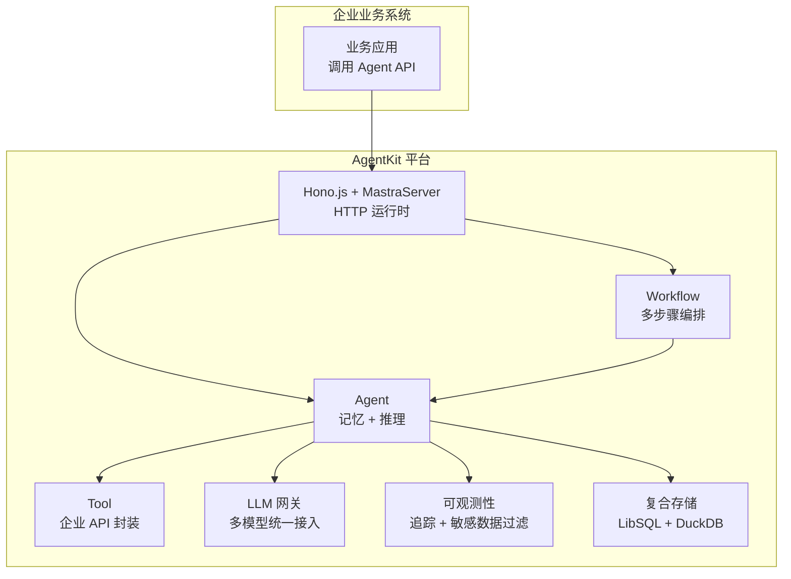

<div align="center">

# AgentKit

企业 AI Agent 转型平台 — Agent 运行时 · 工作流编排 · 多模型网关 · 可观测性

[](./apps/docs/wiki/项目概述.md)
[](./LICENSE)
[](./package.json)
[](./package.json)

**[Wiki 文档](./apps/docs/wiki/项目概述.md)**

</div>

## 简介

AgentKit 是面向**企业 AI Agent 转型**的一体化平台，帮助企业快速构建、部署、运维 AI Agent。项目提供从 Agent 运行时、工作流编排、工具集成，到 LLM 网关、可观测性、复合存储的企业级基础设施，显著降低企业落地 AI Agent 的复杂度与成本。

**平台核心价值**

- **Agent 运行时**：基于 Mastra 的 Agent 抽象，内置记忆、推理、工具调用
- **工作流编排**：多步骤任务编排与流式处理，串联 Agent 与外部系统
- **工具集成**：标准化封装企业内部 API，Zod schema 校验输入输出
- **多模型网关**：统一接入多家 LLM 提供商（OpenAI 兼容），无感切换
- **可观测性**：日志、链路追踪、敏感数据自动过滤，满足企业合规
- **复合存储**：LibSQL（结构化）+ DuckDB（可观测性分析）按域分流
- **配套前端**：Lit Web Components + React 适配器与流式 SDK，构建 Agent 交互界面

## 架构

### 平台架构



### 模块职责

| 模块              | 包名               | 角色                                                              |
| ----------------- | ------------------ | ----------------------------------------------------------------- |
| `apps/server`     | `@agentkit/server` | **Agent 平台核心** — Hono.js + Mastra，Agent/Workflow/Tool 运行时 |
| `apps/web`        | `@agentkit/web`    | 前端示例 — React 19 + Vite                                        |
| `apps/docs`       | `@agentkit/docs`   | VitePress 文档站                                                  |
| `packages/ui`     | `@agentkit/ui`     | 配套 — Lit Web Components 组件库（可发布）                        |
| `packages/sdk`    | `@agentkit/sdk`    | 配套 — AI 对话数据流 SDK（可发布）                                |
| `packages/shared` | `@agentkit/shared` | 共享类型与常量                                                    |
| `packages/utils`  | `@agentkit/utils`  | 通用工具函数                                                      |

### Agent 平台分层

| 层               | 职责                          | 关键 API                            |
| ---------------- | ----------------------------- | ----------------------------------- |
| Server 层        | HTTP 服务 + MastraServer 编排 | `MastraServer`                      |
| Agent 层         | 代理运行时，记忆与推理        | `new Agent()`                       |
| Workflow 层      | 多步骤任务编排                | `createWorkflow()` / `createStep()` |
| Tool 层          | 企业 API 标准化封装           | `createTool()`                      |
| Gateway 层       | 多 LLM 提供商统一接入         | `MastraModelGatewayInterface`       |
| Observability 层 | 追踪、敏感数据过滤            | `Observability`                     |
| Storage 层       | 按域分流的复合存储            | `MastraCompositeStore`              |

## 快速开始

### 环境要求

- Node.js `>=22`
- pnpm `>=10`

### 安装

```bash
git clone https://github.com/weishaodaren/agentkit.git
cd agentkit
pnpm install
```

### 配置环境变量

AI 服务器需要 LLM 网关配置，在 `apps/server/.env` 中设置：

```bash
# apps/server/.env
AGNES_BASE_URL=https://your-llm-gateway.example.com/v1
AGNES_API_KEY=your_api_key_here
LOG_LEVEL=info
# 可选：接入 Mastra Platform
MASTRA_PLATFORM_ACCESS_TOKEN=
```

完整配置项参考 [apps/server/.env.production](./apps/server/.env.production)。

### 启动开发

```bash
# 一键启动全部（Turbo TUI 交互式）
pnpm dev

# 或分别启动
pnpm dev:server   # Agent 平台 → http://localhost:4000
pnpm dev:web      # 前端示例  → http://localhost:3000
pnpm dev:docs     # 文档站    → http://localhost:5173
```

> Web 开发服务器已配置 `/api` 代理到 `http://localhost:4000`，前端可直接调用 Agent API。

### 构建与校验

```bash
pnpm build            # 全部构建
pnpm build:packages   # 仅构建 packages/*
pnpm typecheck        # 类型检查
pnpm lint             # 代码检查
pnpm format           # 代码格式化
```

## API 文档

### Agent 平台 API（核心）

#### 注册 Agent

```ts
import { Agent } from "@mastra/core/agent";
import { Memory } from "@mastra/memory";

const agent = new Agent({
  id: "my-agent",
  name: "My Agent",
  instructions: "You are a helpful assistant...",
  model: "agnes/agnes/agnes-2.0-flash",
  tools: { myTool },
  memory: new Memory(),
});
```

参考：[apps/server/src/mastra/agents/weather-agent.ts](./apps/server/src/mastra/agents/weather-agent.ts)

#### 封装 Tool

```ts
import { createTool } from "@mastra/core/tools";
import { z } from "zod";

const myTool = createTool({
  id: "my-tool",
  description: "Call enterprise internal API",
  inputSchema: z.object({ query: z.string() }),
  outputSchema: z.object({ result: z.string() }),
  execute: async (input) => {
    // 调用企业内部 API
    return { result: "..." };
  },
});
```

参考：[apps/server/src/mastra/tools/weather-tool.ts](./apps/server/src/mastra/tools/weather-tool.ts)

#### 编排 Workflow

```ts
import { createWorkflow, createStep } from "@mastra/core/workflows";
import { z } from "zod";

const step1 = createStep({
  id: "step-1",
  inputSchema: z.object({ input: z.string() }),
  outputSchema: z.object({ data: z.string() }),
  execute: async ({ inputData, mastra }) => {
    const agent = mastra?.getAgent("myAgent");
    // ...
    return { data: "..." };
  },
});

const workflow = createWorkflow({
  id: "my-workflow",
  inputSchema: z.object({ input: z.string() }),
  outputSchema: z.object({ data: z.string() }),
}).then(step1);

workflow.commit();
```

参考：[apps/server/src/mastra/workflows/weather-workflow.ts](./apps/server/src/mastra/workflows/weather-workflow.ts)

#### 接入 LLM 网关

```ts
import { type MastraModelGatewayInterface } from "@mastra/core/llm";
import { createOpenAICompatible } from "@ai-sdk/openai-compatible";

const gateway: MastraModelGatewayInterface = {
  id: "agnes",
  name: "Agnes Gateway",
  async fetchProviders() {
    return {
      agnes: {
        name: "Agnes",
        models: ["agnes/agnes-2.0-flash"],
        apiKeyEnvVar: "AGNES_API_KEY",
        gateway: "agnes",
        url: baseUrl,
      },
    };
  },
  async resolveLanguageModel({ modelId, providerId, apiKey }) {
    return createOpenAICompatible({
      name: providerId,
      apiKey,
      baseURL: baseUrl,
    }).chatModel(modelId);
  },
};
```

参考：[apps/server/src/mastra/gateway/agnes.ts](./apps/server/src/mastra/gateway/agnes.ts)

#### 配置可观测性与存储

```ts
import { Mastra } from "@mastra/core/mastra";
import { LibSQLStore } from "@mastra/libsql";
import { DuckDBStore } from "@mastra/duckdb";
import { MastraCompositeStore } from "@mastra/core/storage";
import {
  Observability,
  MastraStorageExporter,
  MastraPlatformExporter,
  SensitiveDataFilter,
} from "@mastra/observability";

const mastra = new Mastra({
  agents: { myAgent },
  workflows: { myWorkflow },
  gateways: { agnes: gateway },
  storage: new MastraCompositeStore({
    default: new LibSQLStore({ url: "file:./mastra.db" }),
    domains: {
      observability: await new DuckDBStore().getStore("observability"),
    },
  }),
  observability: new Observability({
    configs: {
      default: {
        serviceName: "mastra",
        exporters: [new MastraStorageExporter(), new MastraPlatformExporter()],
        spanOutputProcessors: [new SensitiveDataFilter()],
      },
    },
  }),
});
```

参考：[apps/server/src/mastra/index.ts](./apps/server/src/mastra/index.ts)

#### 启动 HTTP 服务

```ts
import { Hono } from "hono";
import { MastraServer } from "@mastra/hono";

const app = new Hono();
const server = new MastraServer({ app, mastra });
await server.init();
// 自动暴露 Agent / Workflow RESTful API
```

参考：[apps/server/src/index.ts](./apps/server/src/index.ts)

### 前端交互（配套）

#### @agentkit/ui — Agent 交互界面组件

Lit Web Components + Tailwind CSS，提供 React / Vue 适配器。

**组件**：`AkButton` · `AkBubble` · `AkSender` · `AkConversations` · `AkThoughtChain` · `AkPrompts` · `AkSuggestion` · `AkActions` · `AkSources` · `AkAttachments` · `AkWelcome` · `AkThink` · `AkFileCard` · `AkNotification` · `AkXCard` · `AkXProvider` · `AkMermaid` · `AkFolder` · `AkSenderSwitch` · `AkSenderHeader`

**子路径导出**

| 路径                                 | 内容          |
| ------------------------------------ | ------------- |
| `@agentkit/ui/adaptor/react`         | React 适配器  |
| `@agentkit/ui/adaptor/react-plugins` | React 插件    |
| `@agentkit/ui/adaptor/vue`           | Vue 适配器    |
| `@agentkit/ui/markdown`              | Markdown 渲染 |
| `@agentkit/ui/code-highlighter`      | 代码高亮      |

```tsx
import { AkBubble, AkSender } from "@agentkit/ui/adaptor/react";
```

#### @agentkit/sdk — 流式对话数据流

| 导出       | 说明                         |
| ---------- | ---------------------------- |
| `XRequest` | 流式请求管理器（SSE + JSON） |
| `useXChat` | 对话状态管理器（框架无关）   |

```ts
import { XRequest, useXChat } from "@agentkit/sdk";
```

#### @agentkit/utils / @agentkit/shared

`generateId` / `delay` / `hasKey` / `compact` 等通用工具，以及跨应用共享的类型与常量。

更多架构细节、配置与最佳实践见下方 [Wiki](#wiki)。

## 企业特性

| 特性         | 说明                                                                        |
| ------------ | --------------------------------------------------------------------------- |
| 多模型网关   | 统一 `MastraModelGatewayInterface`，接入 OpenAI 兼容提供商，业务侧无感切换  |
| 工作流编排   | `createWorkflow().then(step)` 链式编排，步骤间 schema 强约束                |
| 敏感数据过滤 | `SensitiveDataFilter` 自动脱敏密码、令牌、密钥，满足合规审计                |
| 链路追踪     | `MastraStorageExporter` 持久化追踪到存储，`MastraPlatformExporter` 上报平台 |
| 复合存储     | 按域分流：LibSQL 存结构化业务数据，DuckDB 存可观测性分析数据                |
| 长期记忆     | `Memory` 支持跨会话对话记忆，Agent 具备上下文连续性                         |

## Wiki

完整文档位于 [`apps/docs/wiki`](./apps/docs/wiki/)：

- [项目概述](./apps/docs/wiki/项目概述.md)
- [快速开始](./apps/docs/wiki/快速开始.md)
- [Monorepo 管理](./apps/docs/wiki/Monorepo-管理/)
- [配置详解](./apps/docs/wiki/配置详解/)
- [开发工具集成](./apps/docs/wiki/开发工具集成/)
- [最佳实践](./apps/docs/wiki/最佳实践/)

## 常用脚本

| 命令                                       | 说明                    |
| ------------------------------------------ | ----------------------- |
| `pnpm dev`                                 | 全部 watch（Turbo TUI） |
| `pnpm dev:web` / `dev:server` / `dev:docs` | 单独启动                |
| `pnpm build`                               | 全部构建                |
| `pnpm build:packages`                      | 构建 packages/\*        |
| `pnpm lint` / `pnpm lint:fix`              | 代码检查                |
| `pnpm format` / `pnpm format:check`        | 代码格式化              |
| `pnpm typecheck`                           | 类型检查                |
| `pnpm changeset`                           | 新增 changeset          |
| `pnpm version`                             | 基于 changeset 更新版本 |
| `pnpm release`                             | 构建并发布              |
| `pnpm clean` / `pnpm clean:all`            | 清理产物与依赖          |

## 技术栈

- **Agent 框架**：Mastra（Agent / Workflow / Tool / Memory / Observability / Storage）
- **LLM 接入**：@ai-sdk/openai-compatible · Agnes 网关
- **后端**：Hono.js · @hono/node-server
- **存储**：LibSQL · DuckDB · MastraCompositeStore
- **前端**：React 19 · Vite · Lit · Tailwind CSS v4
- **工具链**：Turbo · pnpm · TypeScript · Oxlint · Lefthook · Changesets

## License

[MIT](./LICENSE)
