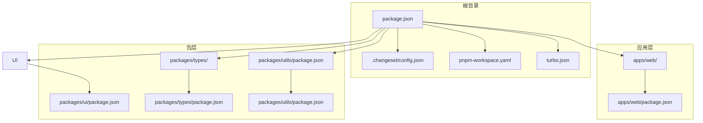
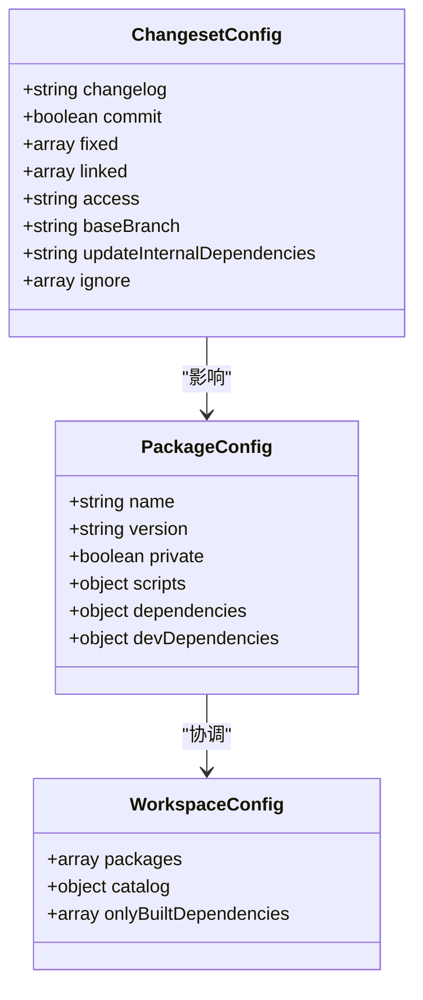
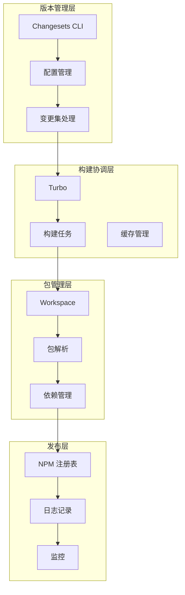
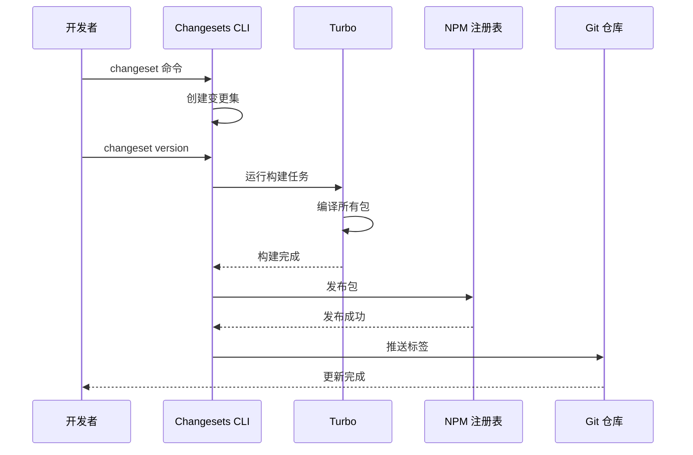
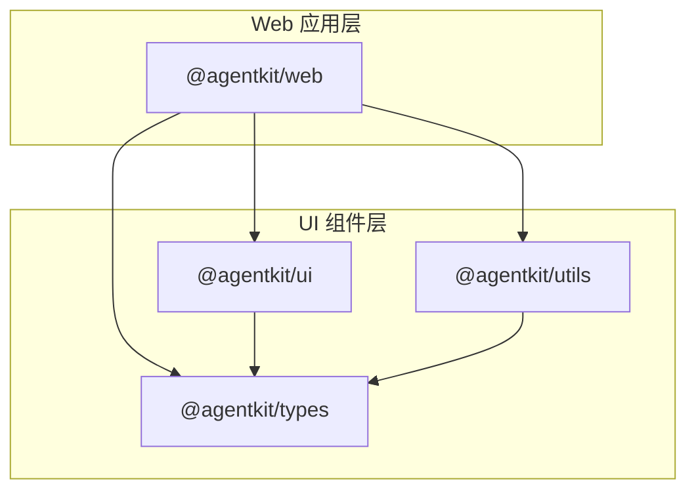
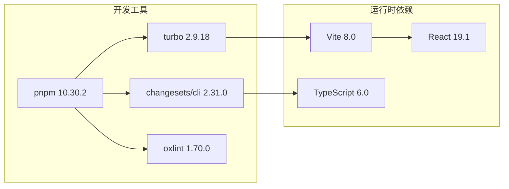
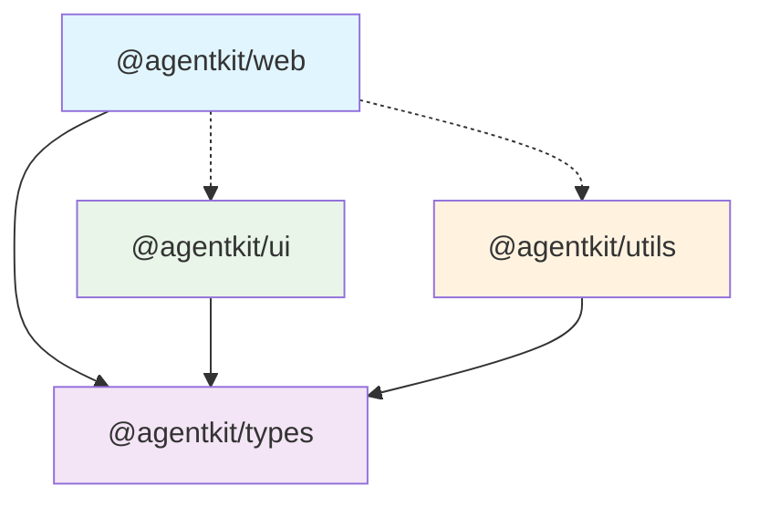

# Changesets 版本管理

## 目录

1. [简介](#简介)
2. [项目结构](#项目结构)
3. [核心组件](#核心组件)
4. [架构概览](#架构概览)
5. [详细组件分析](#详细组件分析)
6. [依赖关系分析](#依赖关系分析)
7. [性能考虑](#性能考虑)
8. [故障排除指南](#故障排除指南)
9. [结论](#结论)

## 简介

这是一个基于 Changesets 的多包版本管理系统，用于管理 AgentKit 生态系统中的多个包版本。Changesets 是一个专门为多包仓库设计的构建工具，帮助团队自动化版本管理和发布流程。

该项目采用 monorepo 架构，包含一个 Web 应用和三个核心包：types、ui 和 utils。通过 Changesets，团队可以轻松地在多个包之间协调版本更新，确保依赖关系的一致性。

## 项目结构

项目采用标准的 monorepo 结构，主要组成部分如下：



## 核心组件

### Changesets 配置系统

Changesets 配置文件定义了版本管理的核心策略：



### 包管理策略

项目采用统一的包管理策略，通过 pnpm workspace 实现：

- **工作空间配置**: `apps/*` 和 `packages/*` 目录下的所有包都纳入工作空间管理
- **依赖版本控制**: 使用 catalog 机制统一管理 React 生态系统的版本
- **私有包策略**: 所有包都设置为私有，防止意外发布到公共注册表

## 架构概览

整个版本管理系统采用分层架构设计，各层职责明确：



## 详细组件分析

### Changesets CLI 组件

Changesets CLI 是整个版本管理系统的核心组件，负责处理版本更新和发布流程。

#### 配置参数详解

| 参数                         | 类型    | 默认值                      | 描述                 |
| ---------------------------- | ------- | --------------------------- | -------------------- |
| `changelog`                  | string  | `@changesets/cli/changelog` | 变更日志生成器路径   |
| `commit`                     | boolean | `false`                     | 是否自动提交版本更新 |
| `access`                     | string  | `restricted`                | 包访问权限设置       |
| `baseBranch`                 | string  | `main`                      | 基准分支名称         |
| `updateInternalDependencies` | string  | `patch`                     | 内部依赖更新策略     |

#### 发布流程序列图



### 包依赖关系分析

项目中的包依赖关系体现了清晰的层次结构：



### 构建系统集成

Turbo 作为构建协调器，与 Changesets 深度集成：

| 任务类型    | 依赖关系 | 输出目录  | 缓存策略 |
| ----------- | -------- | --------- | -------- |
| `build`     | `^build` | `dist/**` | 启用缓存 |
| `dev`       | 无       | 无        | 禁用缓存 |
| `lint`      | 无       | 无        | 默认     |
| `format`    | 无       | 无        | 默认     |
| `typecheck` | `^build` | 无        | 启用缓存 |

## 依赖关系分析

### 外部依赖映射

项目使用 pnpm 作为包管理器，主要外部依赖包括：



### 内部包依赖分析

内部包之间的依赖关系遵循单向依赖原则：



## 性能考虑

### 构建性能优化

1. **增量构建**: Turbo 利用任务依赖关系实现智能增量构建
2. **缓存策略**: 构建输出自动缓存，避免重复编译
3. **并行执行**: 支持多任务并行执行，提高整体效率

### 版本管理性能

1. **变更集隔离**: 每个变更集独立处理，避免全局锁竞争
2. **依赖图优化**: Changesets 自动分析依赖关系，最小化更新范围
3. **批量发布**: 支持批量发布多个包，减少网络往返

## 故障排除指南

### 常见问题及解决方案

| 问题类型 | 症状                     | 解决方案                              |
| -------- | ------------------------ | ------------------------------------- |
| 版本冲突 | 发布失败，提示版本不匹配 | 运行 `changeset version` 重新生成版本 |
| 依赖循环 | 构建卡死，无限等待       | 检查包间依赖关系，移除循环依赖        |
| 缓存问题 | 构建结果异常             | 清理 `.turbo` 缓存目录                |
| 权限问题 | 发布失败                 | 检查 npm token 配置                   |

### 调试命令

```bash
# 查看当前状态
pnpm changeset status

# 创建新的变更集
pnpm changeset

# 预览版本更新
pnpm changeset version

# 发布包
pnpm release
```

## 结论

Changesets 版本管理系统为 AgentKit 生态系统提供了完整的多包版本管理解决方案。通过合理的架构设计和工具集成，实现了：

1. **自动化程度高**: 从版本更新到发布的全流程自动化
2. **依赖管理完善**: 智能处理包间依赖关系，确保版本一致性
3. **开发体验优秀**: 与现有开发工具链无缝集成
4. **可扩展性强**: 支持新增包和复杂依赖关系

该系统为大型前端项目的版本管理提供了最佳实践参考，特别适合需要管理多个相关包的 monorepo 项目。
