# Monorepo 管理

## 目录

1. [简介](#简介)
2. [项目结构](#项目结构)
3. [核心组件](#核心组件)
4. [架构概览](#架构概览)
5. [详细组件分析](#详细组件分析)
6. [依赖关系分析](#依赖关系分析)
7. [版本管理与发布](#版本管理与发布)
8. [性能考虑](#性能考虑)
9. [故障排除指南](#故障排除指南)
10. [结论](#结论)
11. [附录](#附录)

## 简介

本项目是一个现代化的 Monorepo 管理系统，采用 pnpm 工作空间、Turborepo 构建协调器和 Changesets 版本管理工具相结合的方式。该架构支持多包管理和高效的构建流程，通过统一的依赖管理、缓存机制和自动化版本发布实现跨包的快速开发和部署。

**更新** 项目中的UI包已完成重大架构升级，从传统的React组件库迁移至基于Lit的Web Components库。新架构采用现代Web标准，提供更好的浏览器兼容性和组件复用能力，同时保持与现有React应用的无缝集成。UI包现在提供基于Lit的原生Web组件，支持CSS变量和原子化样式系统。

Monorepo 的核心优势在于：

- 统一的依赖管理，避免重复安装
- 共享的构建工具链和配置
- 跨包的代码复用和类型安全
- 高效的增量构建和缓存机制
- 自动化的版本管理和发布流程
- **新增** Web Components标准化组件体系
- **新增** 基于Tailwind CSS的现代化样式管理

## 项目结构

该项目采用了标准的 Monorepo 结构，主要包含以下目录：

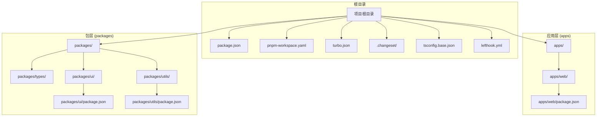

### 目录组织原则

**apps 目录**：用于存放可独立运行的应用程序，每个应用都是一个完整的项目实体，具有自己的构建配置和依赖管理。

**packages 目录**：用于存放可复用的包和模块，这些包可以被多个应用或其他包所依赖。

**.changeset 目录**：Changesets 版本管理工具的配置目录，包含版本管理策略和发布配置。

**包命名规范**：

- 使用作用域前缀：`@agentkit/`
- 应用包：`@agentkit/web`
- 组件库包：`@agentkit/ui`
- 工具包：`@agentkit/utils`
- 类型定义包：`@agentkit/types`

**配置文件**：

- `pnpm-workspace.yaml`：定义工作空间范围和包发现规则
- `turbo.json`：配置构建任务和缓存策略
- `.changeset/config.json`：配置 Changesets 版本管理策略
- `tsconfig.base.json`：提供共享的 TypeScript 编译配置
- `lefthook.yml`：设置 Git 钩子自动化任务

## 核心组件

### 包管理器配置

项目使用 pnpm 作为包管理器，通过工作空间实现高效的依赖管理：

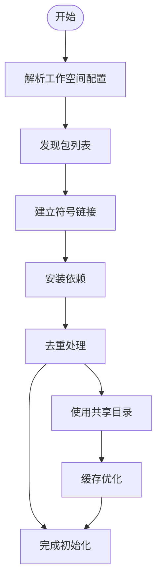

### 构建协调器

Turborepo 提供了强大的构建协调和缓存功能：

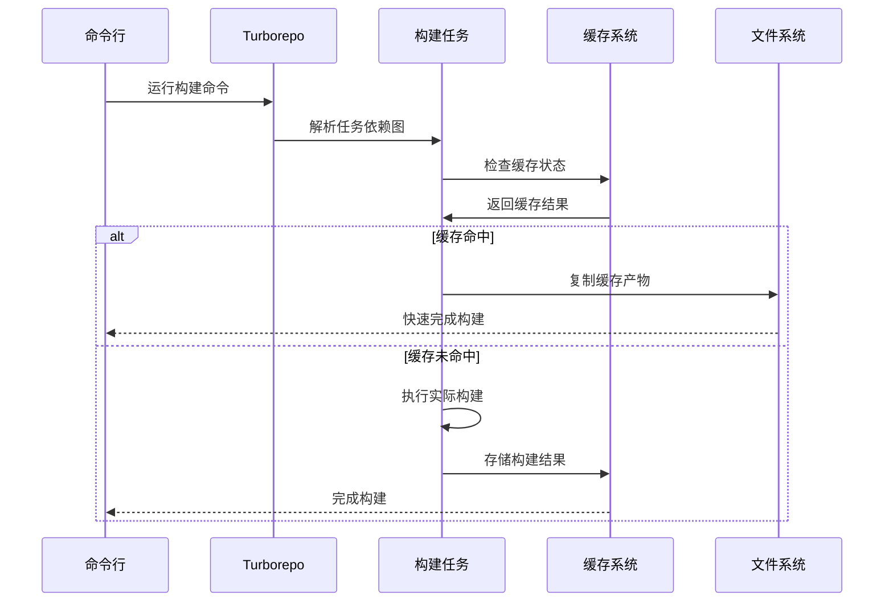

### Changesets 版本管理

Changesets 提供了完整的版本管理和自动化发布功能：

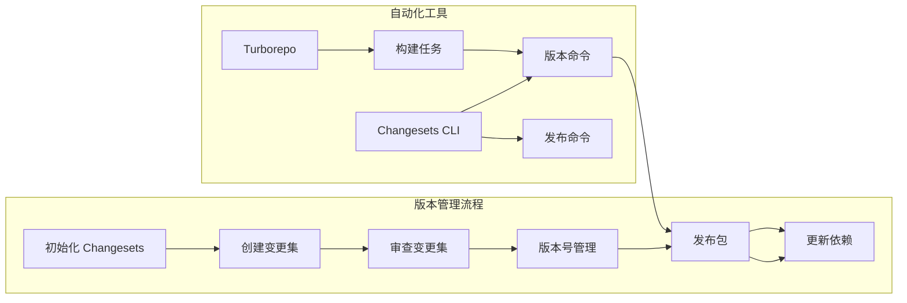

## 架构概览

### 整体架构设计

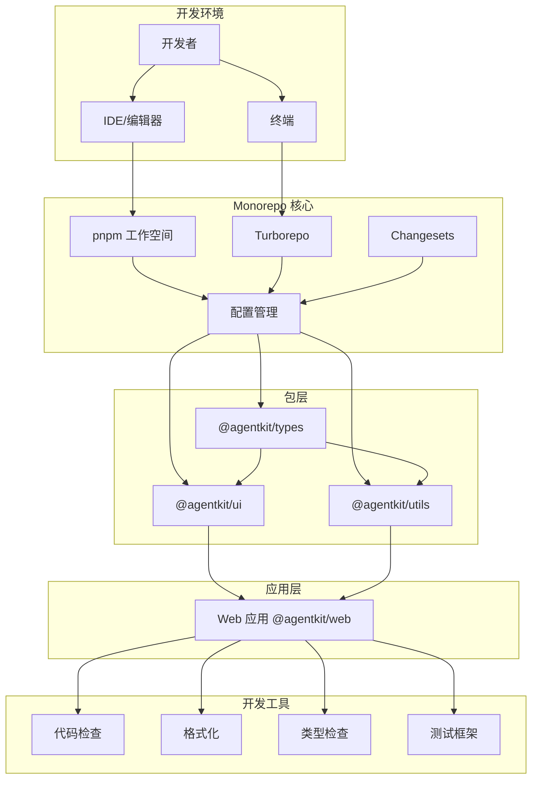

### 依赖管理策略

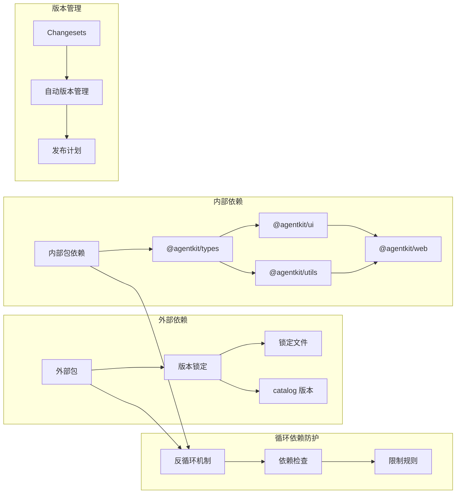

## 详细组件分析

### 应用层组件

#### Web 应用 (@agentkit/web)

这是一个基于 Vite 的 React 应用，作为 Monorepo 的主应用：

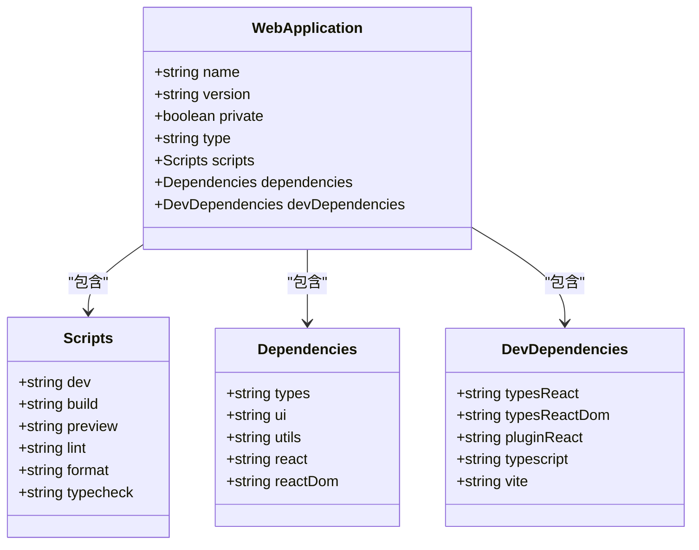

##### 包特性分析

- **应用标识**：`@agentkit/web` 作为主应用包
- **依赖管理**：依赖 @agentkit/types、@agentkit/ui、@agentkit/utils
- **构建工具**：使用 Vite 作为构建工具
- **开发体验**：提供完整的开发服务器和预览功能

### 包层组件

#### 类型定义包 (@agentkit/types)

这是一个私有的类型定义包，提供共享的 TypeScript 类型声明：

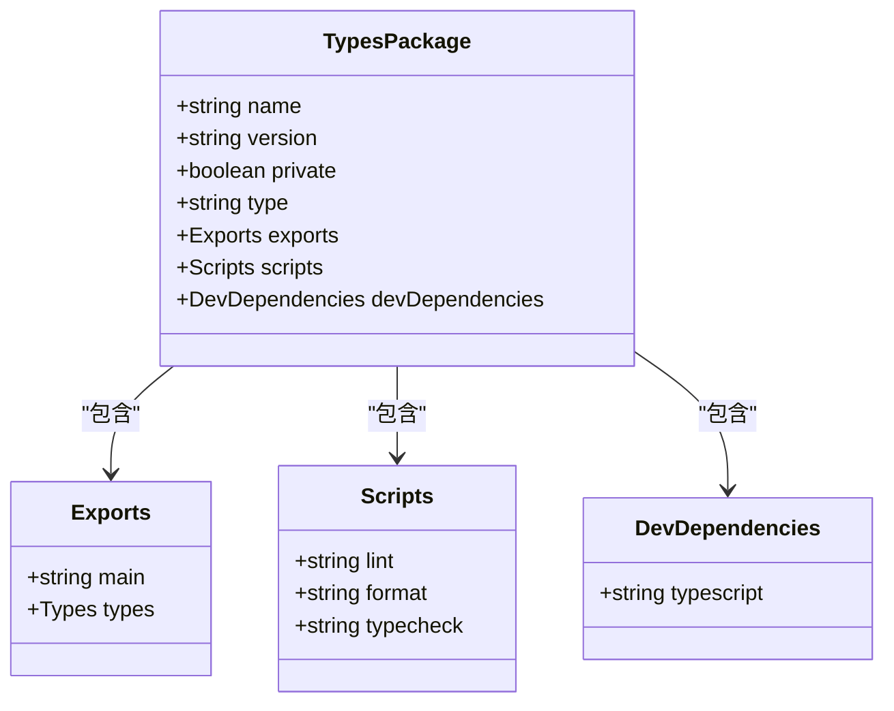

##### 包特性分析

- **私有性**：通过 `private: true` 防止意外发布到 npm
- **模块化**：使用 ES 模块语法 (`"type": "module"`)
- **类型导出**：提供清晰的类型定义入口点
- **脚本集成**：与 Turborepo 构建流程集成

#### UI 组件库 (@agentkit/ui)

**更新** UI包已完成从React到Web Components的重大架构迁移：

这是一个基于 Lit 的 Web Components 组件库，提供可复用的原生Web组件：

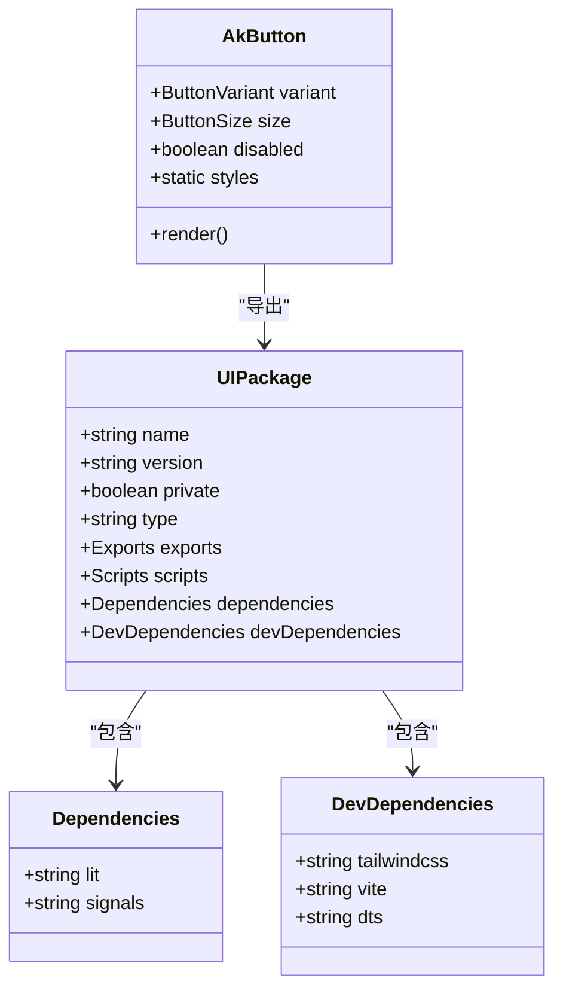

##### 包特性分析

- **Web Components 标准**：基于 Lit 框架实现原生Web组件
- **组件标识**：使用自定义元素标签 `ak-button`
- **样式系统**：集成 Tailwind CSS 实现原子化样式管理
- **类型安全**：提供完整的 TypeScript 类型定义
- **模块导出**：支持ES模块导入和CSS样式导出
- **共享工具**：提供cn工具函数和Tailwind Mixin

#### 工具包 (@agentkit/utils)

这是一个通用工具函数包，提供可复用的工具函数：

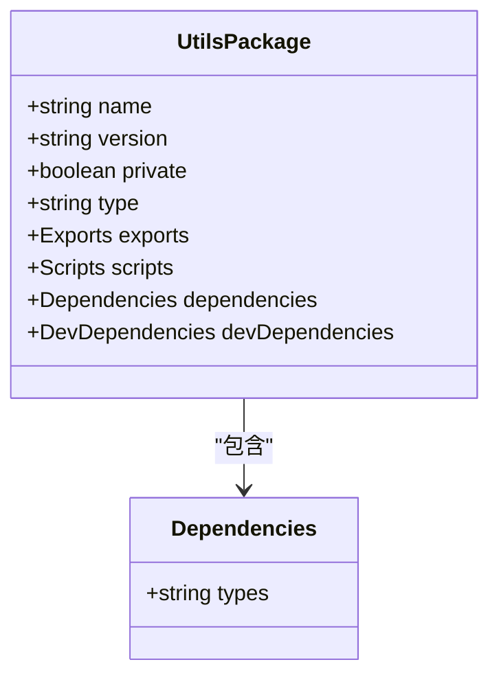

##### 包特性分析

- **工具函数定位**：提供通用的工具函数集合
- **轻量级设计**：仅依赖 @agentkit/types
- **纯函数导向**：避免副作用，提高可测试性
- **类型安全**：完全基于 TypeScript 类型系统

### Web Components 组件实现

**新增** UI包的核心组件实现，基于Lit框架构建：

#### AkButton 组件

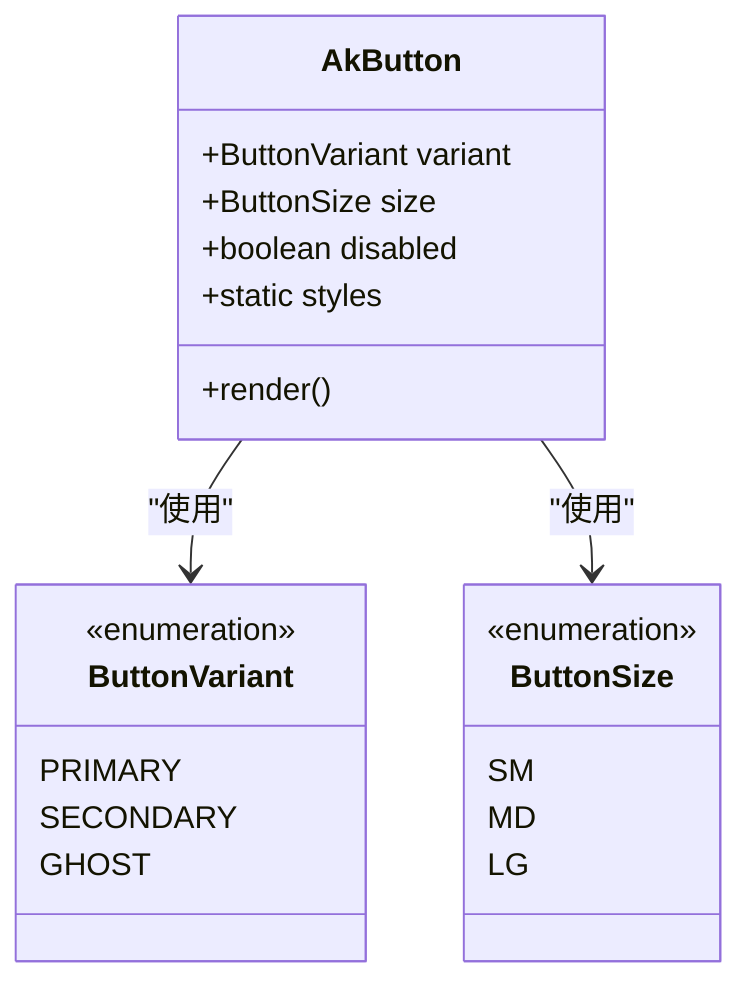

##### 组件特性

- **自定义元素**：注册为 `ak-button` HTML元素
- **属性系统**：支持 variant、size、disabled 属性
- **样式系统**：使用 Lit 的 CSS 样式定义
- **变体支持**：提供 primary、secondary、ghost 三种样式变体
- **尺寸支持**：支持 sm、md、lg 三种尺寸规格
- **交互状态**：包含 hover、disabled 等状态样式

### 共享工具模块

**新增** UI包提供的共享工具函数和Mixins：

#### cn 工具函数

cn 函数是 Tailwind CSS 类名合并工具，用于简化条件类名的拼接：

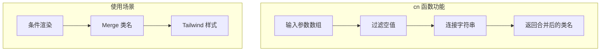

#### Tailwind Mixin

Tailwind Mixin 提供了与 cn 函数配合使用的样式混入功能：

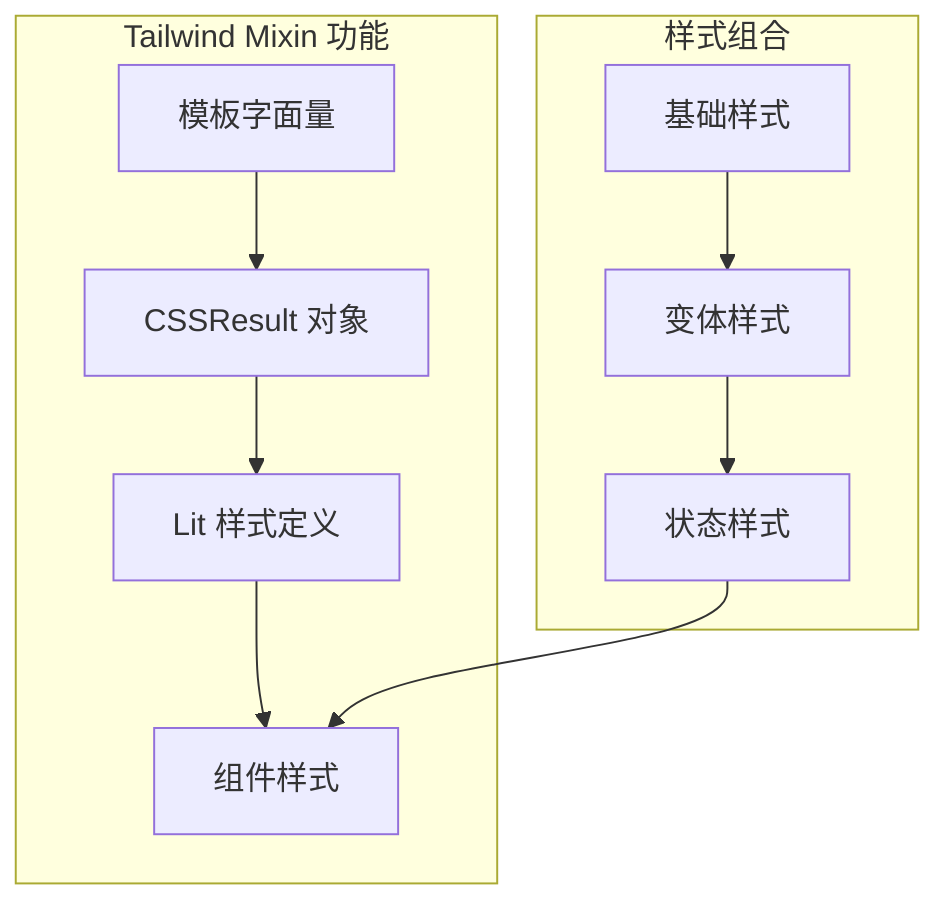

### 样式系统架构

**新增** 基于Tailwind CSS的样式管理架构：

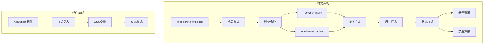

##### 样式特性

- **原子化设计**：基于 Tailwind CSS 的原子化样式系统
- **主题定制**：通过 CSS 变量实现设计令牌管理
- **响应式支持**：内置响应式断点和布局系统
- **变体组合**：支持多种样式变体的灵活组合
- **状态管理**：自动处理交互状态和视觉反馈

### 构建配置架构

**新增** 基于Vite的Web Components构建配置：

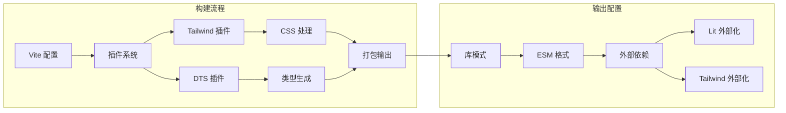

##### 构建特性

- **库模式**：专为库构建优化的 Rollup 配置
- **ESM 格式**：输出现代 ES 模块格式
- **外部化依赖**：将 Lit 等大型依赖外部化
- **类型生成**：自动生成 TypeScript 类型声明
- **CSS 处理**：集成 Tailwind CSS 预处理器

### TypeScript 配置基线

基础 TypeScript 配置提供了统一的编译选项：

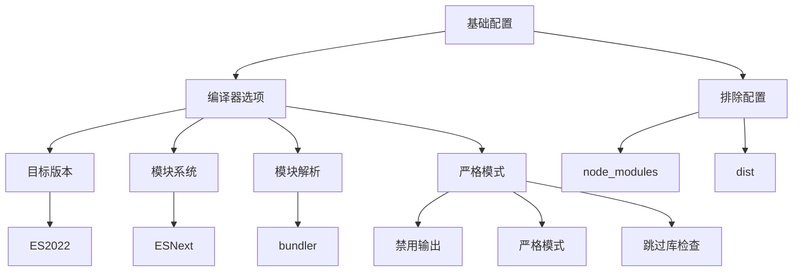

### Git 钩子集成

Lefthook 配置实现了开发时的自动化质量保证：

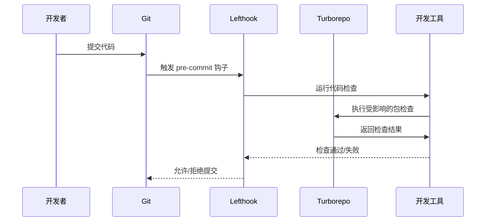

## 依赖关系分析

### 依赖层次结构

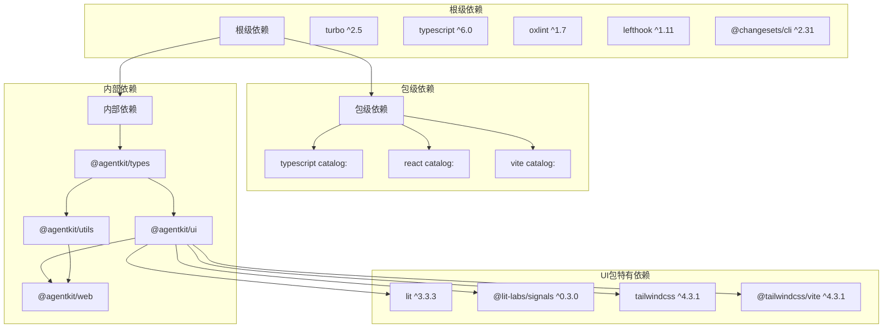

### 循环依赖检测机制

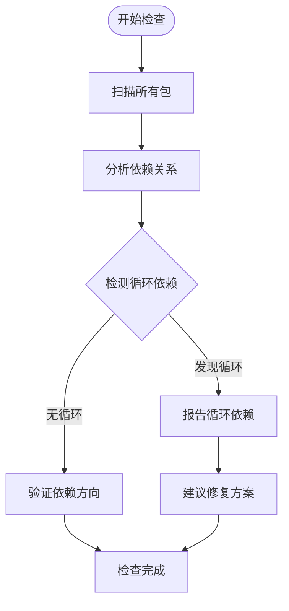

## 版本管理与发布

### Changesets 集成配置

Changesets 作为版本管理工具，为 Monorepo 提供了完整的自动化发布流程：

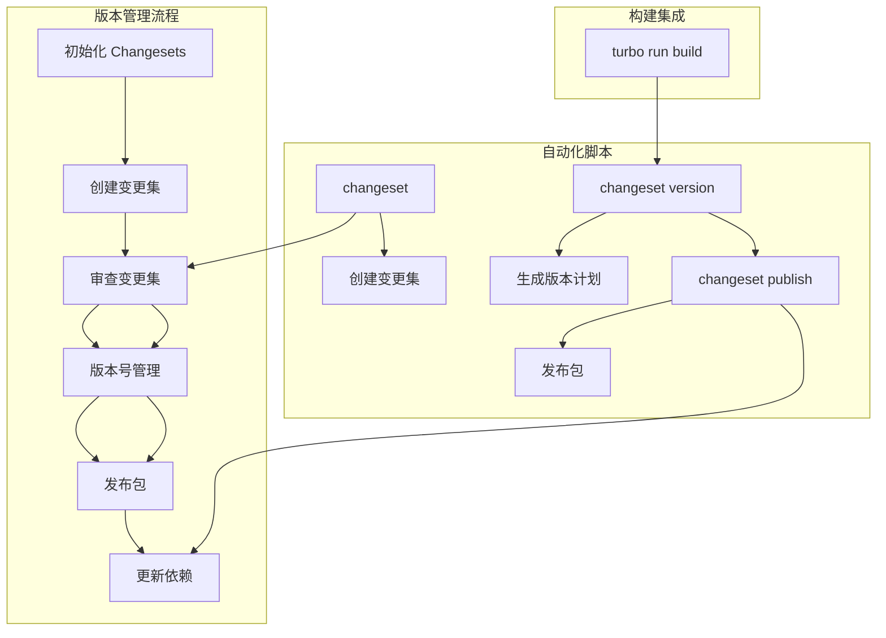

### 版本管理策略

Changesets 实现了智能的版本管理和发布策略：

```mermaid
flowchart LR
subgraph "版本类型"
Patch[补丁版本] --> Minor[次要版本]
Minor --> Major[主要版本]
end
subgraph "变更检测"
AutoDetect[自动检测变更] --> ManualOverride[手动覆盖]
ManualOverride --> SemanticVersioning[语义化版本控制]
end
subgraph "发布流程"
SemanticVersioning --> GenerateChangelog[生成变更日志]
GenerateChangelog --> UpdatePackageJson[更新 package.json]
UpdatePackageJson --> CommitChanges[提交变更]
CommitChanges --> PushToRegistry[推送到注册表]
end
```

### 发布命令详解

项目提供了三个关键的版本管理命令：

**changeset**：创建新的变更集，收集各包的变更信息
**changeset version**：根据变更集生成版本计划并更新版本号
**changeset publish**：执行构建后发布所有已更新的包

```mermaid
sequenceDiagram
participant Dev as 开发者
participant Changeset as Changesets CLI
participant Version as 版本管理
participant Publish as 发布流程
Dev->>Changeset : 运行 changeset
Changeset->>Changeset : 创建变更集
Changeset->>Version : 运行 changeset version
Version->>Version : 生成版本计划
Version->>Publish : 运行 changeset publish
Publish->>Publish : 构建所有包
Publish->>Publish : 推送到 npm
Publish-->>Dev : 发布完成
```

## 性能考虑

### 构建缓存策略

Turborepo 实现了智能的增量构建和缓存机制：

```mermaid
flowchart LR
subgraph "缓存层"
Cache[缓存存储]
Hash[哈希计算]
Output[输出路径]
end
subgraph "构建层"
Build[构建任务]
Depends[依赖检查]
Persist[持久化]
end
subgraph "输入层"
Input[源代码]
Config[配置文件]
Dependencies[依赖包]
end
Input --> Hash
Config --> Hash
Dependencies --> Hash
Hash --> Cache
Cache --> Output
Output --> Persist
Depends --> Build
Build --> Output
```

### 并行执行优化

```mermaid
flowchart TD
Start([开始构建]) --> Parse[解析任务图]
Parse --> TopoSort[拓扑排序]
TopoSort --> Parallel[并行执行]
Parallel --> CacheCheck[缓存检查]
CacheCheck --> |命中| Copy[复制缓存]
CacheCheck --> |未命中| Execute[执行任务]
Execute --> Store[存储缓存]
Copy --> Complete[完成]
Store --> Complete
```

### Changesets 性能优化

Changesets 通过智能的版本管理和缓存机制提升发布效率：

```mermaid
flowchart TD
subgraph "版本缓存"
VersionCache[版本缓存] --> ChangesetFiles[变更集文件]
ChangesetFiles --> ReleasePlan[发布计划]
ReleasePlan --> VersionNumbers[版本号生成]
end
subgraph "增量发布"
Incremental[增量发布] --> AffectedPackages[受影响包检测]
AffectedPackages --> MinimalBuilds[最小化构建]
MinimalBuilds --> OptimizedPublish[优化发布]
end
VersionCache --> Incremental
```

### Web Components 性能优化

**新增** 基于Lit的Web Components性能优化策略：

```mermaid
flowchart TD
subgraph "运行时优化"
LitReactive[Lit 响应式系统] --> ReactiveUpdates[增量更新]
ReactiveUpdates --> DOMDiffing[虚拟DOM差异]
DOMDiffing --> MinimalDOM[最小DOM操作]
end
subgraph "构建时优化"
ViteBuild[Vite 构建] --> TreeShaking[摇树优化]
TreeShaking --> CodeSplitting[代码分割]
CodeSplitting --> ExternalDeps[外部依赖]
ExternalDeps --> LitExternal[Lit 外部化]
end
subgraph "样式优化"
TailwindOptimization[Tailwind 优化] --> PurgeUnused[Purge 未使用样式]
PurgeUnused --> AtomicClasses[原子类]
AtomicClasses --> CSSVariables[CSS变量]
end
```

## 故障排除指南

### 常见问题诊断

#### 依赖安装问题

**症状**：包安装失败或版本冲突
**解决方案**：

1. 清理缓存：`pnpm store prune`
2. 重新安装：`pnpm install`
3. 检查工作空间配置：确认包路径正确

#### 构建缓存问题

**症状**：构建结果不更新或缓存异常
**解决方案**：

1. 清理缓存：`pnpm turbo clean`
2. 重建缓存：`pnpm turbo run build`
3. 检查输出配置：确认输出路径正确

#### Changesets 相关问题

**症状**：版本管理命令执行失败或发布异常
**解决方案**：

1. 初始化 Changesets：`pnpm changeset`
2. 检查变更集配置：确认 `.changeset/config.json` 正确
3. 验证发布权限：确保有 npm 发布权限
4. 清理临时文件：删除 `.changeset` 目录下的临时文件

#### Web Components 相关问题

**症状**：自定义元素无法识别或样式不生效
**解决方案**：

1. 确认样式导入：检查 `import "./styles.css"` 是否存在
2. 验证元素注册：确认 `@customElement("ak-button")` 正确注册
3. 检查构建配置：确认 Vite 配置中包含 Tailwind 插件
4. 验证外部依赖：确认 Lit 依赖被正确外部化

#### 类型检查错误

**症状**：TypeScript 类型检查失败
**解决方案**：

1. 更新类型配置：检查 `tsconfig.base.json`
2. 验证包导出：确认 `package.json` 中的 exports 字段
3. 检查模块解析：确认 `moduleResolution` 设置
4. 验证装饰器支持：确认 `experimentalDecorators` 已启用

#### 包依赖问题

**症状**：包之间依赖关系错误或循环依赖
**解决方案**：

1. 检查 workspace:\* 依赖：确认版本匹配
2. 分析依赖图：使用 `pnpm graph` 查看依赖关系
3. 重构包结构：避免循环依赖，重新设计包间关系

#### 样式系统问题

**症状**：Tailwind CSS 样式不生效或构建错误
**解决方案**：

1. 检查全局样式导入：确认 `tailwind.global.css` 正确导入
2. 验证 Tailwind 配置：检查 `vite.config.ts` 中的插件配置
3. 确认 CSS 变量定义：检查 `--color-primary` 等变量是否正确定义
4. 验证 cn 函数使用：确认类名合并逻辑正确

## 结论

本 Monorepo 管理系统通过 pnpm 工作空间、Turborepo 构建协调器和 Changesets 版本管理工具的有机结合，实现了高效的多包管理和自动化发布流程。系统的主要优势包括：

1. **统一的依赖管理**：通过工作空间实现依赖去重和共享
2. **智能的构建缓存**：利用 Turborepo 的增量构建能力提升开发效率
3. **自动化的版本发布**：通过 Changesets 实现完整的版本管理和发布流程
4. **标准化的配置**：通过共享的 TypeScript 配置确保一致性
5. **自动化的工作流**：通过 Git 钩子实现开发质量保证
6. **模块化的包结构**：清晰的应用层和包层分离，便于维护和扩展
7. \***\*新增** Web Components 标准化组件体系\*\*：基于 Lit 的现代组件架构，提供更好的浏览器兼容性和复用能力
8. \***\*新增** 基于Tailwind CSS的现代化样式管理\*\*：实现原子化样式系统和主题定制能力

**更新** 新架构完成了从React到Web Components的重大迁移，引入了基于Lit的组件系统、Tailwind CSS样式管理、Vite构建工具等现代Web技术栈。这一升级不仅提升了组件的标准化程度和跨框架兼容性，还优化了构建性能和开发体验。

对于未来的扩展，建议重点关注：

- 集成 CI/CD 流水线，实现自动化测试和发布
- 添加更多的Web Components组件类型
- 优化 Changesets 配置，支持更细粒度的版本控制
- 建立包依赖监控和健康检查机制
- 实现更完善的发布回滚和应急响应机制
- 探索Web Components的性能优化和加载策略
- **新增** 扩展Tailwind CSS主题系统，支持更多设计变体
- **新增** 集成Shadow DOM样式隔离，提升组件封装性

## 附录

### 最佳实践清单

**包命名规范**：

- 使用作用域前缀：`@agentkit/`
- 应用包：`@agentkit/web`
- 组件库包：`@agentkit/ui`
- 工具包：`@agentkit/utils`
- 类型定义包：`@agentkit/types`
- 私有包标记：`private: true`

**依赖管理**：

- 内部包使用相对版本：`"package": "workspace:*"`
- 外部包使用 catalog 版本：`"package": "catalog:"`
- 对等依赖使用 catalog 版本：`"package": "catalog:"`
- 避免循环依赖，合理设计包间关系

**构建配置**：

- 统一的输出目录：`"outputs": ["dist/**"]`
- 合理的缓存策略：根据任务类型设置 `cache` 属性
- 明确的任务依赖：使用 `dependsOn` 定义构建顺序
- 开发任务禁用缓存：`"cache": false`

**版本管理**：

- 使用 Changesets 进行版本管理：`pnpm changeset`
- 自动生成版本计划：`pnpm changeset version`
- 执行自动化发布：`pnpm changeset publish`
- 配置发布策略：在 `.changeset/config.json` 中设置

**Web Components 开发**：

- 使用 Lit 框架：`import { LitElement } from "lit"`
- 定义自定义元素：`@customElement("ak-button")`
- 支持 CSS 变量：`var(--color-primary)`
- 导入样式文件：`import "./styles.css"`
- 外部化大型依赖：`external: [/^lit/, /^@lit/]`
- **新增** 使用 cn 工具函数：`import { cn } from "@/shared/cn"`

**样式系统开发**：

- **新增** 使用 Tailwind CSS：`import 'tailwindcss'`
- **新增** 定义CSS变量：`:root { --color-primary: #007bff; }`
- **新增** 全局样式导入：`@import 'tailwindcss';`
- **新增** 组件样式隔离：使用 `:host` 选择器

**开发体验**：

- Git 钩子自动化：通过 lefthook 实现提交前检查
- 类型安全：启用严格的 TypeScript 选项
- 代码质量：集成 linter 和 formatter
- 增量构建：利用 Turborepo 的缓存机制提升开发效率
- 自动化发布：通过 Changesets 实现一键发布
- **新增** 现代样式系统：使用 Tailwind CSS 实现原子化样式管理
- **新增** 组件工具函数：使用 cn 和 tailwindMixin 提升开发效率
