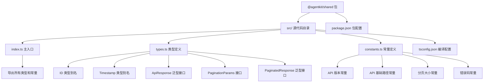
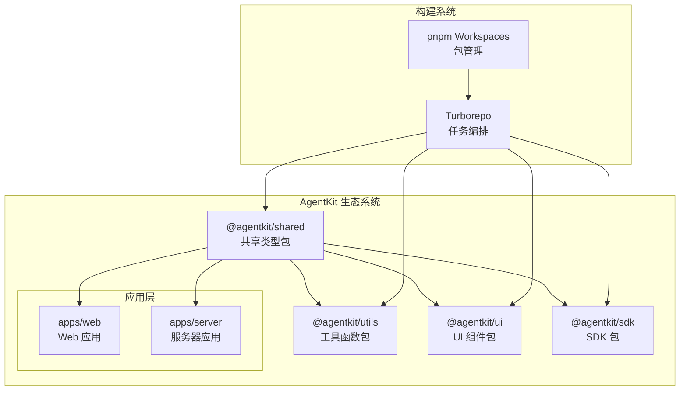
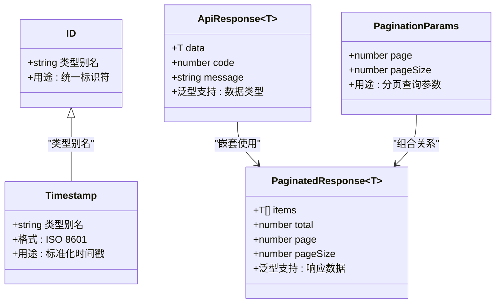
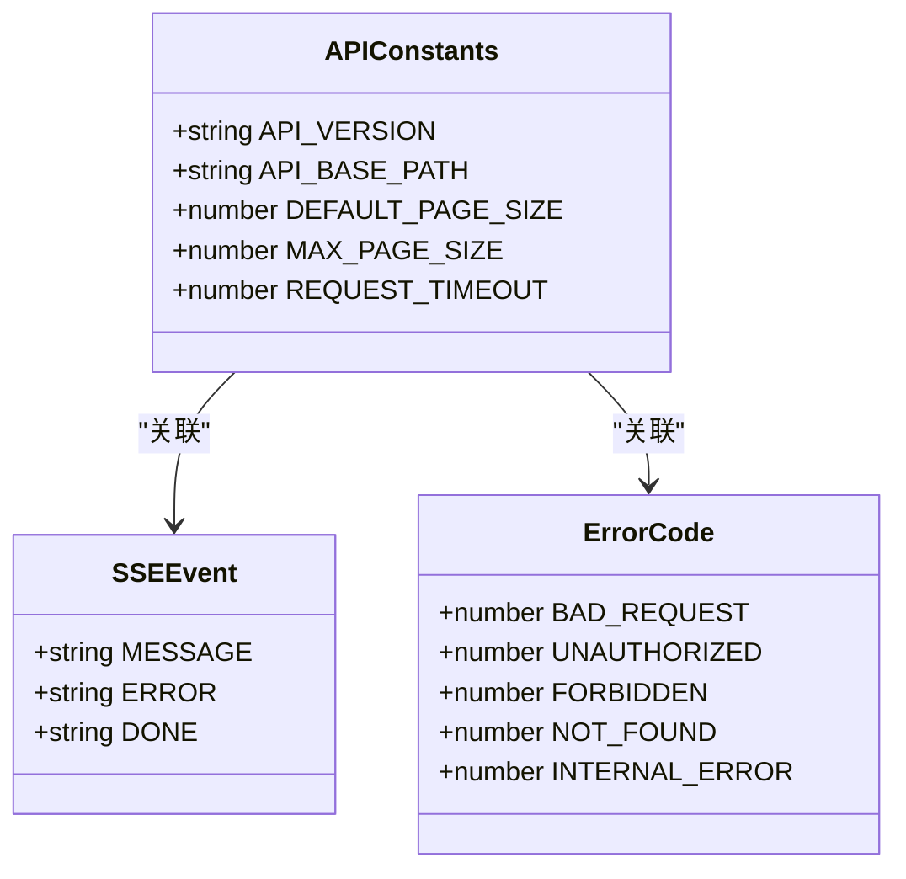
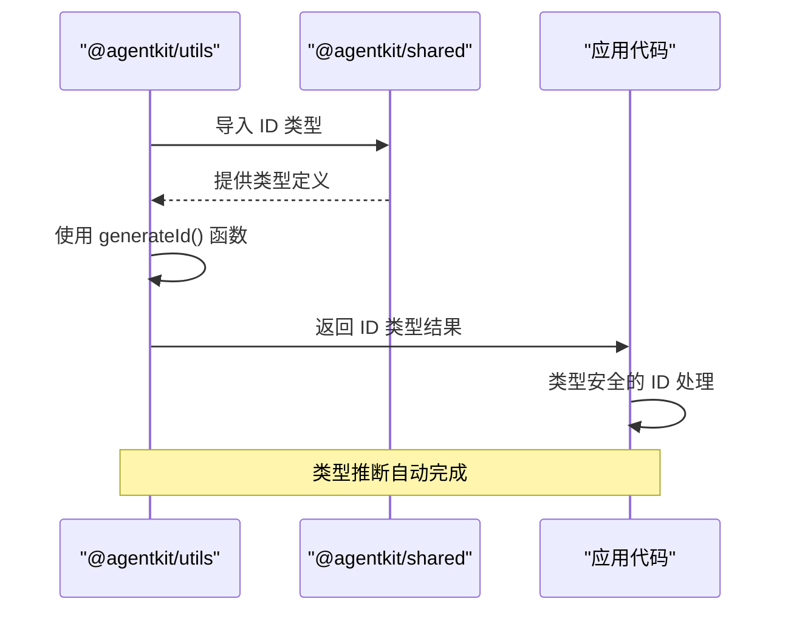
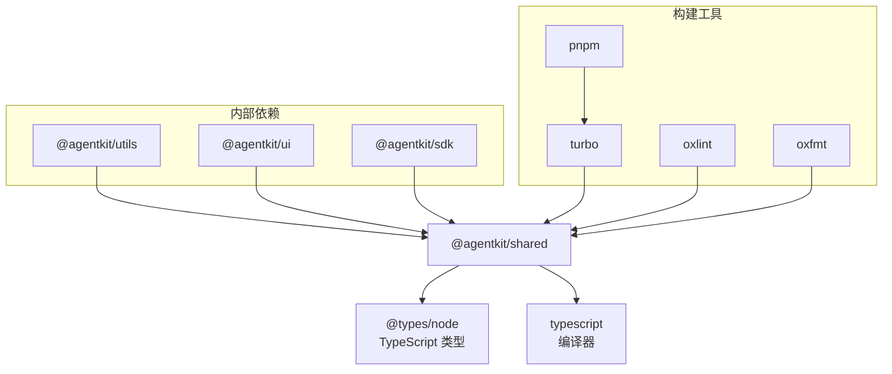

# 共享类型包

## 目录
1. [简介](#简介)
2. [项目结构](#项目结构)
3. [核心组件](#核心组件)
4. [架构概览](#架构概览)
5. [详细组件分析](#详细组件分析)
6. [依赖关系分析](#依赖关系分析)
7. [性能考虑](#性能考虑)
8. [故障排除指南](#故障排除指南)
9. [结论](#结论)

## 简介

共享类型包是 AgentKit 项目中的一个核心基础设施模块，负责提供跨应用和包之间共享的 TypeScript 类型定义和常量。该包采用工作区模式集成到 Turborepo 构建系统中，为 apps/web 和 apps/server 等应用以及各个工具包提供统一的类型安全基础。

该项目基于现代前端开发最佳实践，使用 TypeScript 6.0.3 和 pnpm 包管理器，通过严格的类型约束确保代码质量和开发体验。

## 项目结构

共享类型包位于 `packages/shared` 目录下，采用简洁而高效的目录结构：

## 核心组件

共享类型包包含两个主要组件：类型定义系统和常量管理系统。

### 类型定义系统

类型定义系统提供了基础的数据类型和接口，确保在整个应用生态系统中的一致性：

- **ID 类型**：统一的标识符类型，确保所有实体都有明确的类型约束
- **Timestamp 类型**：标准化的时间戳格式，强制使用 ISO 8601 字符串格式
- **ApiResponse 泛型接口**：标准化的 API 响应结构，支持泛型数据类型
- **分页相关接口**：提供一致的分页参数和响应格式

### 常量管理系统

常量管理系统集中管理应用中的关键配置值：

- **API 版本控制**：统一的 API 版本管理机制
- **分页配置**：默认和最大分页大小的标准化设置
- **错误码定义**：标准化的 HTTP 错误码常量
- **流式传输配置**：SSE 事件名称的统一定义

## 架构概览

共享类型包在整个 AgentKit 生态系统中扮演着基础设施的角色，通过工作区模式与其他包建立依赖关系：

## 详细组件分析

### 类型系统设计

共享类型包的类型系统设计体现了现代 TypeScript 开发的最佳实践：

### 常量系统设计

常量系统的组织结构确保了配置的一致性和可维护性：

### 使用示例分析

共享类型包在实际项目中的使用展示了其设计的有效性：

## 依赖关系分析

共享类型包的依赖关系设计体现了清晰的层次结构：

### 依赖特性分析

共享类型包具有以下依赖特性：

- **零运行时依赖**：仅包含类型定义，无运行时代码
- **工作区集成**：通过 `workspace:*` 依赖机制实现本地开发
- **类型安全**：完整的 TypeScript 类型声明文件
- **构建优化**：与 Turborepo 集成，支持增量构建

## 性能考虑

共享类型包的设计充分考虑了性能和开发体验：

### 类型检查性能
- **增量编译**：利用 Turborepo 的缓存机制，避免重复类型检查
- **模块化设计**：按需导入类型，减少不必要的类型解析
- **严格模式**：启用 TypeScript 严格模式，提高类型安全性

### 构建性能
- **快速打包**：纯类型包，构建时间极短
- **缓存友好**：稳定的 API 设计，有利于长期缓存
- **增量更新**：工作区模式支持增量构建

### 开发体验
- **智能提示**：完整的类型信息提供优秀的 IDE 支持
- **错误定位**：精确的类型错误报告
- **重构安全**：强类型系统确保重构安全性

## 故障排除指南

### 常见问题及解决方案

#### 类型导入问题
**问题**：无法正确导入共享类型
**解决方案**：
1. 确认工作区已正确安装
2. 检查 TypeScript 配置中的路径映射
3. 验证包的版本兼容性

#### 类型不匹配错误
**问题**：使用共享类型时出现类型不匹配
**解决方案**：
1. 检查导入的类型是否来自正确的包
2. 验证 TypeScript 版本兼容性
3. 确认类型定义的更新状态

#### 构建失败问题
**问题**：构建过程中出现共享类型相关的错误
**解决方案**：
1. 运行 `pnpm install` 更新依赖
2. 清理 node_modules 和缓存
3. 检查 tsconfig.json 配置

## 结论

共享类型包作为 AgentKit 项目的核心基础设施，成功实现了以下目标：

### 设计优势
- **统一性**：为整个生态系统提供一致的类型定义
- **可扩展性**：模块化的类型设计支持未来扩展
- **类型安全**：完整的类型系统确保代码质量
- **开发效率**：优秀的 IDE 支持提升开发体验

### 技术特色
- **工作区集成**：与 Turborepo 和 pnpm 完美结合
- **零运行时开销**：纯类型包设计
- **严格类型约束**：确保代码的可靠性
- **现代化工具链**：使用最新的开发工具和技术

共享类型包不仅满足了当前项目的需求，还为未来的功能扩展奠定了坚实的基础。其设计原则和实现方式可以作为其他大型 TypeScript 项目的参考模板。