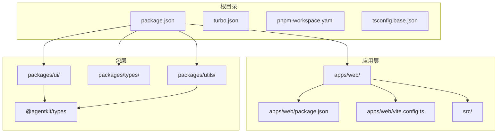
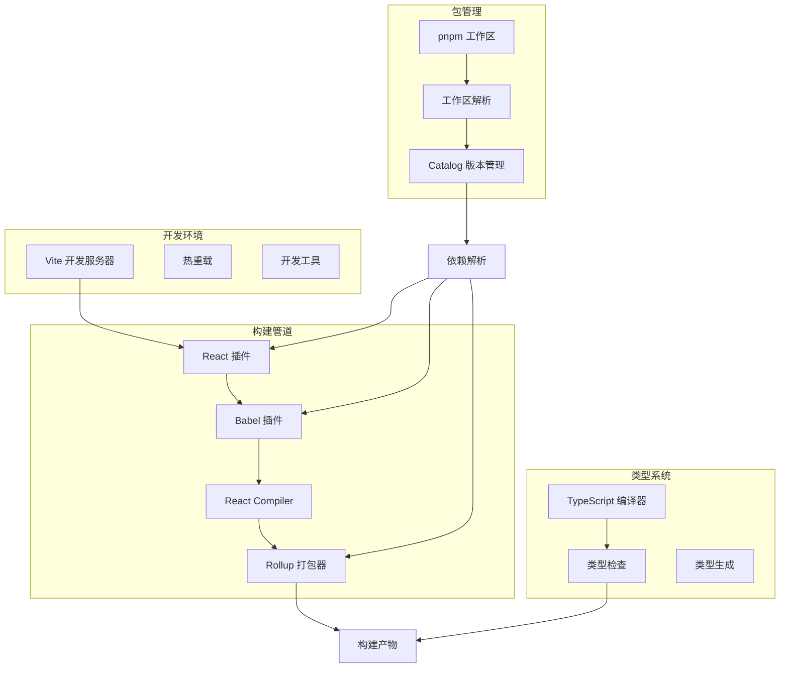
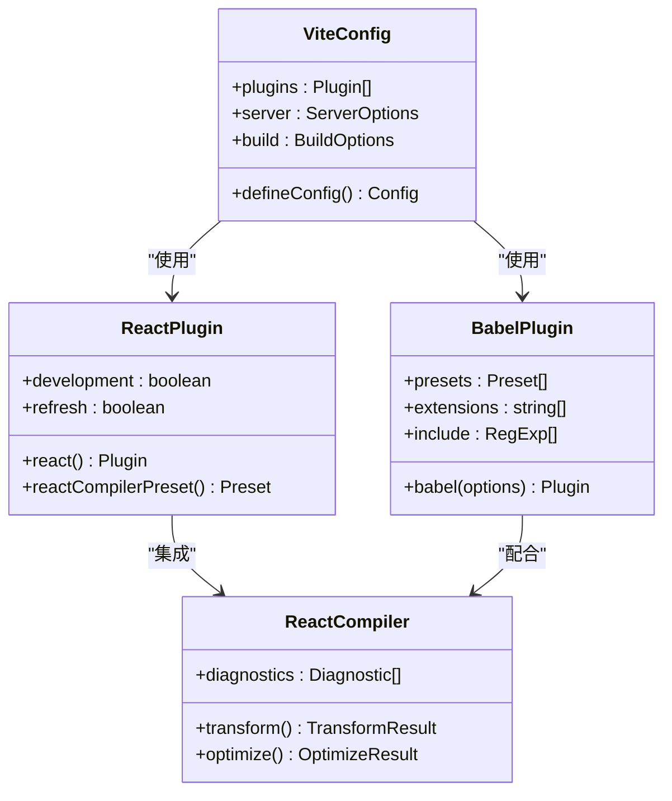
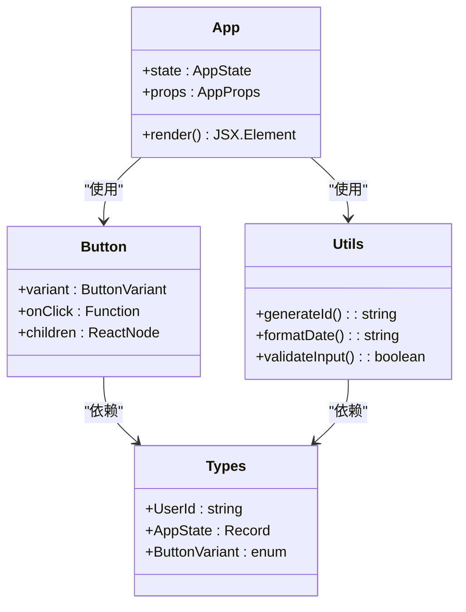
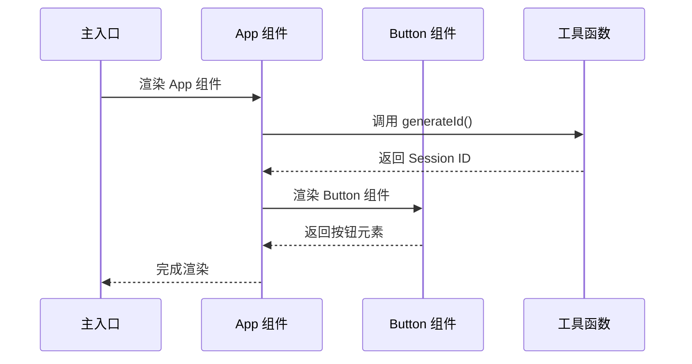
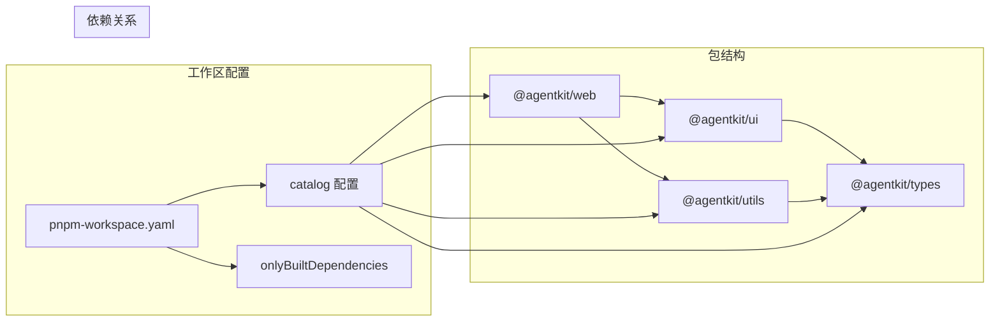
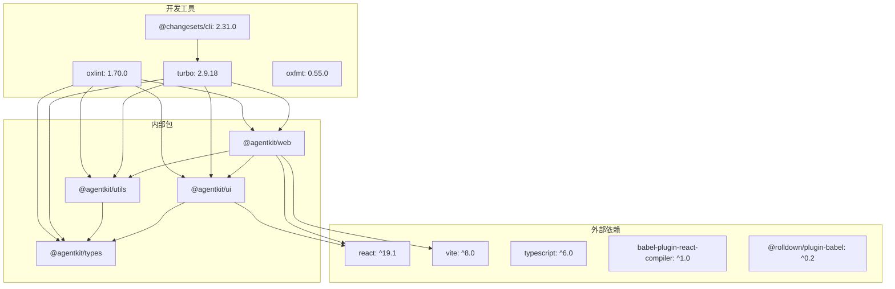

# Babel 构建工具链

## 目录

1. [简介](#简介)
2. [项目结构](#项目结构)
3. [核心组件](#核心组件)
4. [架构概览](#架构概览)
5. [详细组件分析](#详细组件分析)
6. [依赖关系分析](#依赖关系分析)
7. [性能考虑](#性能考虑)
8. [故障排除指南](#故障排除指南)
9. [结论](#结论)

## 简介

这是一个基于现代前端技术栈的多包管理项目，采用 Turborepo 作为构建系统，Vite 作为开发服务器和打包工具，结合 Babel 和 React Compiler 进行代码转换和优化。项目使用 pnpm 工作区进行包管理，支持 TypeScript 类型检查、代码格式化和静态分析。

该项目的核心特点是：

- 使用 Turborepo 实现智能缓存和并行构建
- 通过 Vite 提供快速的开发体验和高效的生产构建
- 集成 Babel 和 React Compiler 进行现代化代码转换
- 采用 pnpm 工作区实现多包管理和版本控制

## 项目结构

项目采用 monorepo 结构，主要包含以下目录：

## 核心组件

### 构建系统核心

项目采用 Turborepo 作为核心构建系统，提供以下功能：

- 智能缓存机制，避免重复构建
- 并行执行多个任务
- 依赖图分析和增量构建
- 统一的任务定义和配置

### 开发服务器配置

Vite 作为开发服务器，配置了以下插件：

- React 插件：提供 React 开发体验
- Babel 插件：集成 Babel 转换功能
- React Compiler 预设：优化 React 组件编译

### 包管理策略

使用 pnpm 工作区管理多个包，支持：

- 工作区内部依赖解析
- 版本统一管理
- 依赖去重和共享
- catalog 机制统一版本锁定

## 架构概览

## 详细组件分析

### Vite 配置组件

Vite 配置文件集成了多种插件以实现完整的开发和构建体验：

#### 配置特性分析

Vite 配置具有以下关键特性：

- **插件组合**：同时启用 React 和 Babel 插件
- **预设配置**：使用 React Compiler 预设优化 React 代码
- **开发服务器**：配置端口为 3000
- **模块解析**：支持 ES 模块语法

### 应用程序组件

应用程序采用模块化设计，主要组件包括：

#### 组件交互流程

应用程序的组件交互遵循以下流程：

### 包管理系统

项目采用 pnpm 工作区进行包管理，具有以下特点：

## 依赖关系分析

### 依赖图谱

### 版本管理策略

项目采用多种版本管理策略：

- **Catalog 机制**：统一管理常用依赖版本
- **Workspace 依赖**：内部包之间的版本同步
- **语义化版本**：外部依赖的兼容性约束
- **锁定文件**：确保构建一致性

## 性能考虑

### 构建性能优化

项目在多个层面实现了性能优化：

1. **Turborepo 缓存**
   - 智能缓存机制避免重复构建
   - 增量构建支持快速迭代
   - 并行执行提升整体效率

2. **Vite 开发体验**
   - 快速启动时间
   - 热模块替换(HMR)
   - 即时错误报告

3. **React Compiler 优化**
   - 编译时优化
   - 减少运行时开销
   - 生成更高效的代码

### 内存和资源管理

- **模块解析优化**：使用 bundler 解析策略
- **类型检查分离**：编译和类型检查并行执行
- **依赖去重**：pnpm 的硬链接机制减少磁盘占用

## 故障排除指南

### 常见问题诊断

1. **构建失败排查**
   - 检查 TypeScript 编译错误
   - 验证依赖版本兼容性
   - 确认缓存状态

2. **开发服务器问题**
   - 端口冲突检测
   - 热重载功能验证
   - 插件配置检查

3. **包管理问题**
   - 工作区依赖解析
   - 版本锁定一致性
   - 本地开发模式验证

### 调试工具使用

- **Turbo 调试**：使用 `--dry` 模式查看执行计划
- **Vite 调试**：启用详细日志输出
- **TypeScript 调试**：检查编译选项和路径映射

## 结论

这个 Babel 构建工具链项目展示了现代前端开发的最佳实践，通过合理的架构设计和技术选型，实现了高性能、可维护的开发体验。项目的主要优势包括：

1. **高效构建系统**：Turborepo 提供智能缓存和并行执行
2. **现代化开发体验**：Vite 配合 React Compiler 实现快速开发
3. **严格的类型安全**：完整的 TypeScript 集成
4. **灵活的包管理**：pnpm 工作区支持复杂的多包场景

该工具链适合中大型前端项目的开发需求，提供了从开发到生产的完整解决方案。通过持续的优化和改进，可以进一步提升开发效率和构建性能。
