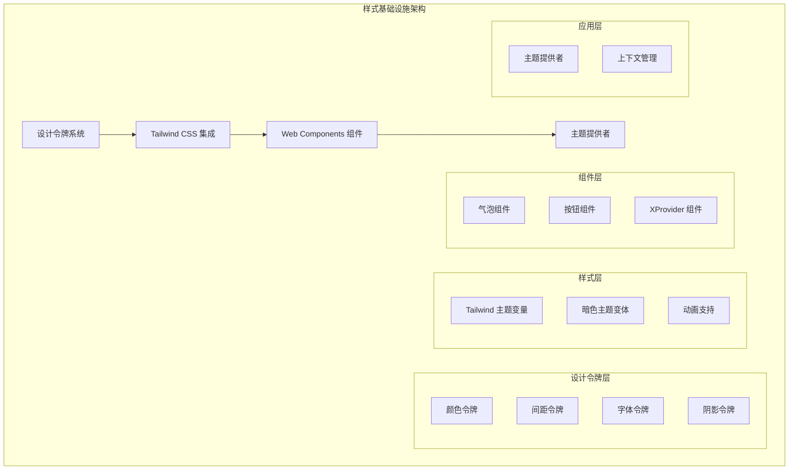
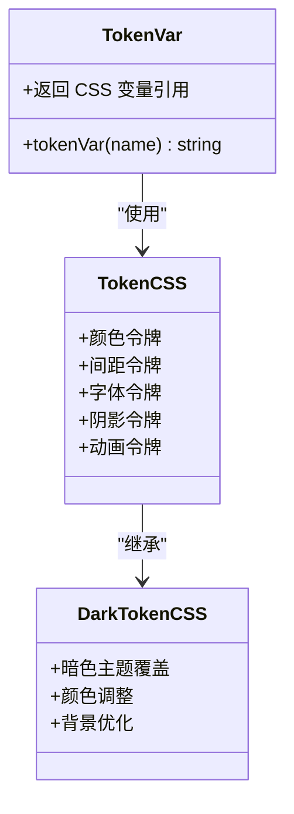
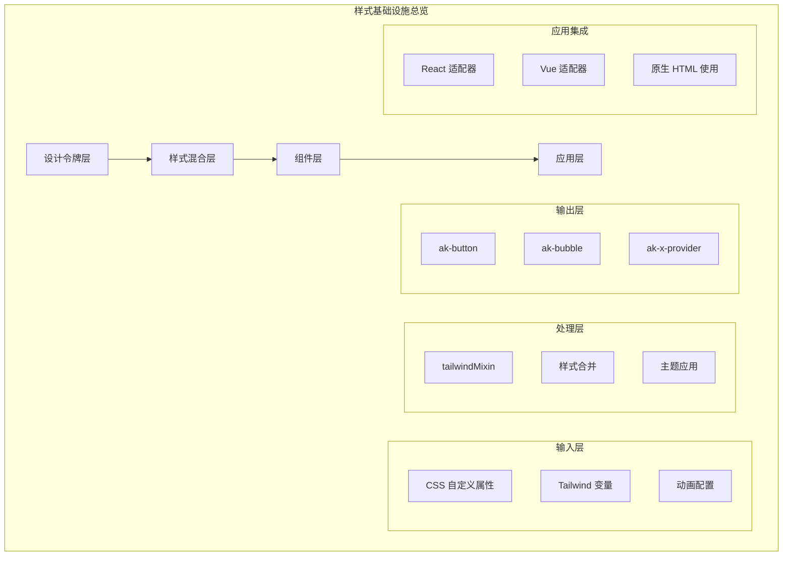
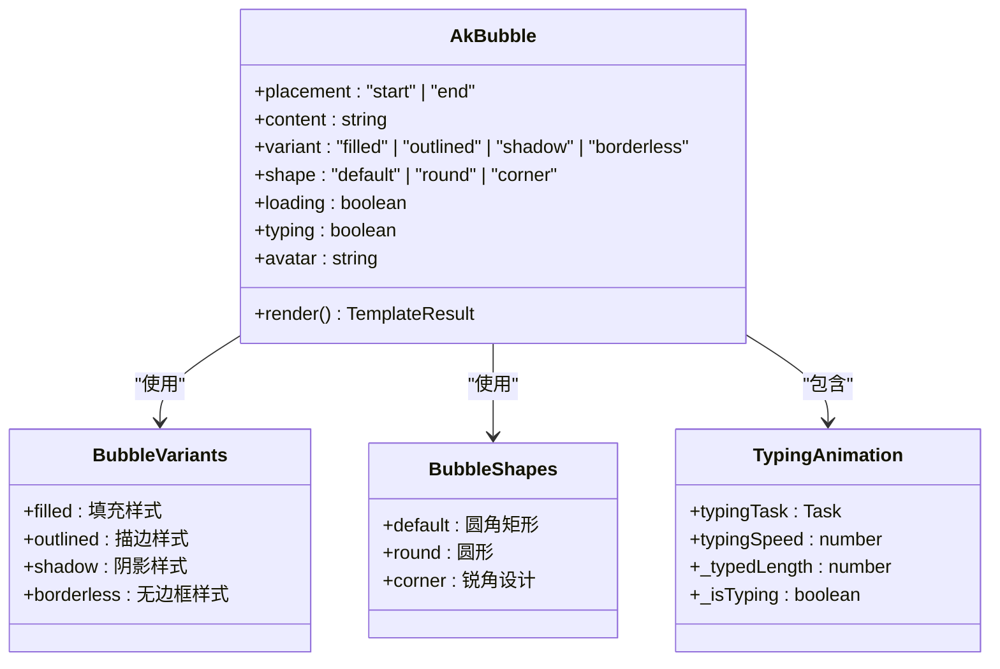
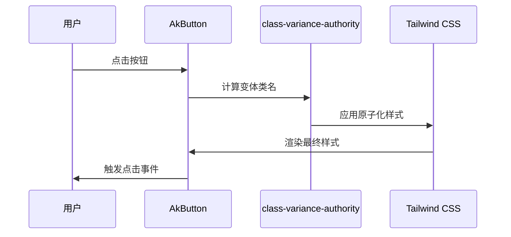
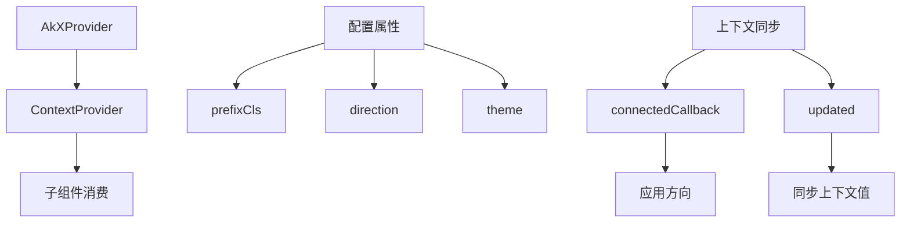
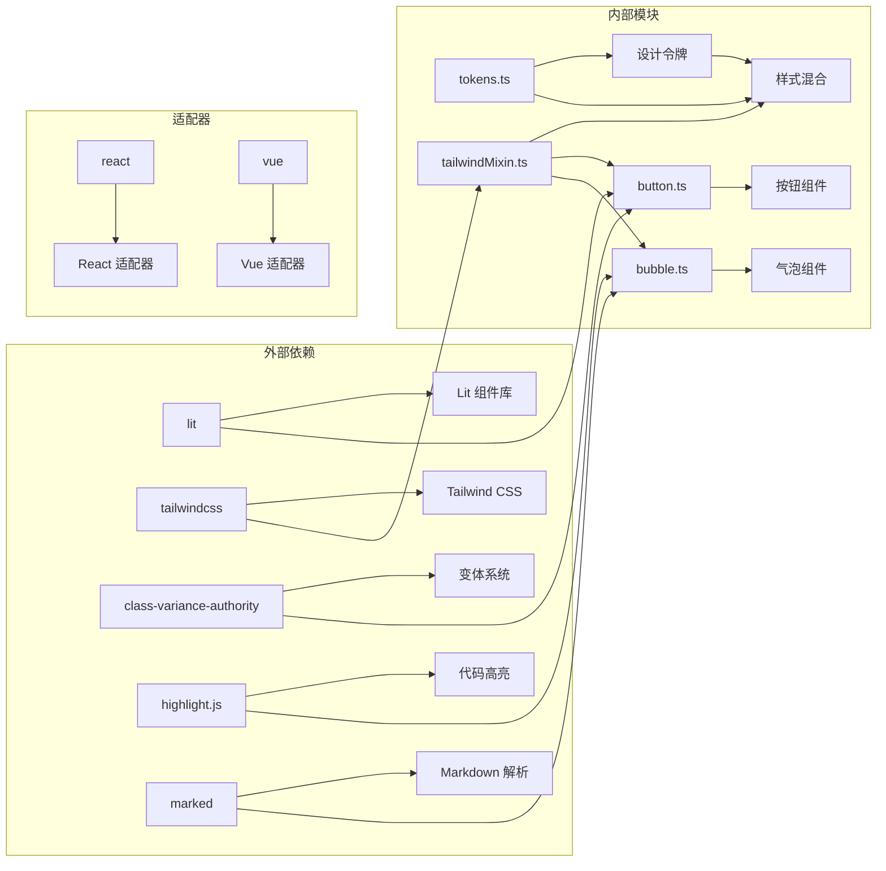

# CSS 样式基础设施

## 目录

1. [简介](#简介)
2. [项目结构](#项目结构)
3. [核心组件](#核心组件)
4. [架构概览](#架构概览)
5. [详细组件分析](#详细组件分析)
6. [依赖关系分析](#依赖关系分析)
7. [性能考虑](#性能考虑)
8. [故障排除指南](#故障排除指南)
9. [结论](#结论)

## 简介

AgentKit 的 CSS 样式基础设施是一个现代化的、基于 Web Components 的设计系统，采用 Lit 组件库和 Tailwind CSS 构建。该系统提供了完整的主题令牌管理、响应式设计和动画支持，适用于构建复杂的 AI 应用界面。

系统的核心特点包括：

- 基于 CSS 自定义属性的设计令牌系统
- 支持明暗主题切换的动态样式管理
- 响应式 Web Components 组件库
- 与 Tailwind CSS 的无缝集成
- 支持多种前端框架（React、Vue、原生 HTML）

## 项目结构



## 核心组件

### 设计令牌系统

设计令牌系统是整个样式基础设施的核心，它提供了统一的颜色、间距、字体等设计变量。系统采用 CSS 自定义属性的形式，确保在 Shadow DOM 中正确工作。



系统包含以下主要令牌类别：

**颜色令牌**：定义了主色调、辅助色、文本色和背景色的完整调色板
**间距令牌**：提供从超小到超大级别的完整间距体系
**字体令牌**：包含正文字体大小、标题层级和代码字体的定义
**阴影令牌**：定义了基础阴影、二级阴影和三级阴影的层次结构
**动画令牌**：提供统一的动画持续时间和缓动函数

### Tailwind CSS 集成

Tailwind CSS 通过自定义主题变量与设计令牌系统深度集成，实现了原子化样式与设计系统的统一。

```mermaid
flowchart TD
A[Tailwind 全局样式] --> B["@theme inline"]
B --> C[主题变量映射]
C --> D[明暗主题支持]
D --> E[圆角半径变量]
E --> F[颜色变量]
G[暗色主题变体] --> H[自定义变体]
H --> I[.dark 选择器]
I --> J[:host(.dark) 选择器]
```

### Web Components 组件库

系统提供了多个功能丰富的 Web Components，每个组件都遵循统一的设计系统和样式规范。

## 架构概览



## 详细组件分析

### 气泡组件 (AkBubble)

AkBubble 是系统中最复杂的组件之一，实现了完整的 AI 聊天气泡功能，支持多种变体和交互状态。



组件特性包括：

**多变体支持**：四种不同的外观变体，每种都有独特的视觉效果
**形状定制**：三种形状选项适应不同的设计需求
**加载状态**：内置的加载动画和进度指示
**打字动画**：智能的打字机效果，支持流式内容更新
**响应式布局**：支持左右对齐和不同位置的气泡显示

### 按钮组件 (AkButton)

AkButton 提供了完整的按钮组件实现，基于 class-variance-authority 库实现变体系统。



### XProvider 组件

XProvider 组件实现了类似 React Context 的上下文提供机制，为整个组件树提供全局配置。



## 依赖关系分析



## 性能考虑

### 样式优化策略

1. **CSS 自定义属性缓存**：设计令牌系统使用 CSS 自定义属性，避免重复计算和样式冲突
2. **Shadow DOM 隔离**：所有组件都在 Shadow DOM 中渲染，确保样式隔离和性能优化
3. **按需样式加载**：通过 tailwindMixin 动态加载样式，避免不必要的样式注入
4. **动画性能**：使用 transform 和 opacity 属性进行动画，确保硬件加速

### 构建优化

1. **Tree Shaking**：通过模块化设计，确保未使用的样式和组件不会被打包
2. **样式提取**：构建时自动提取和压缩 CSS，减少运行时开销
3. **缓存策略**：利用浏览器缓存机制，提高二次加载性能

## 故障排除指南

### 常见问题及解决方案

**样式不生效**

- 检查是否正确导入 tailwindMixin
- 确认组件是否在 Shadow DOM 中渲染
- 验证 CSS 变量是否正确设置

**主题切换异常**

- 确认 :host(.dark) 选择器是否正确应用
- 检查暗色主题 CSS 是否正确导入
- 验证主题提供者的配置

**动画性能问题**

- 检查是否有过多的重排重绘操作
- 确认使用了硬件加速的 CSS 属性
- 优化动画的复杂度和持续时间

## 结论

AgentKit 的 CSS 样式基础设施提供了一个完整、可扩展且高性能的设计系统解决方案。通过精心设计的令牌系统、灵活的组件架构和现代化的技术栈，该系统能够满足复杂 AI 应用的样式需求。

主要优势包括：

- 统一的设计语言和视觉体验
- 良好的可维护性和扩展性
- 优秀的性能表现和用户体验
- 完善的开发工具链支持

该基础设施为未来的功能扩展和技术演进奠定了坚实的基础，能够适应不断变化的设计需求和用户期望。
