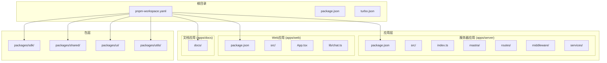
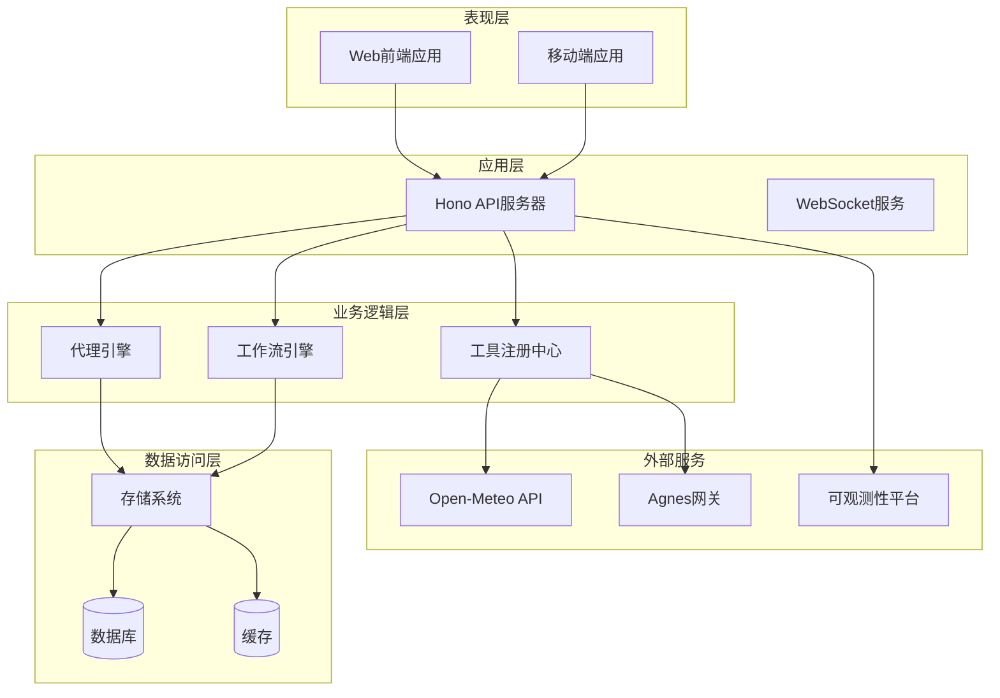
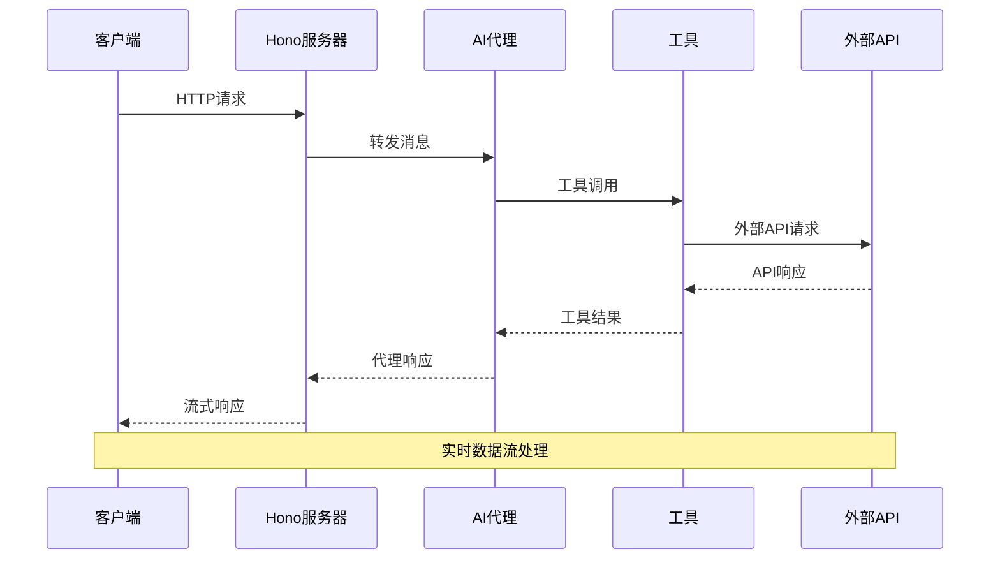
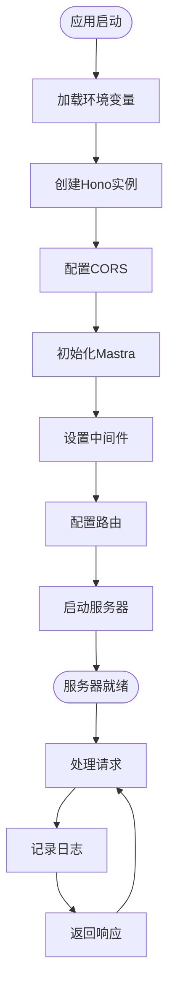
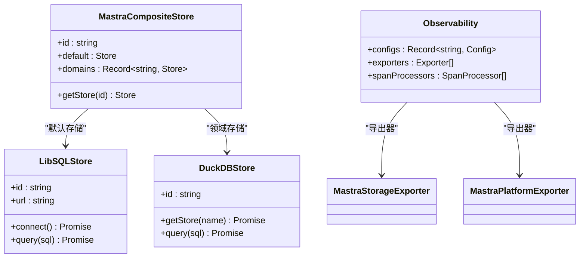
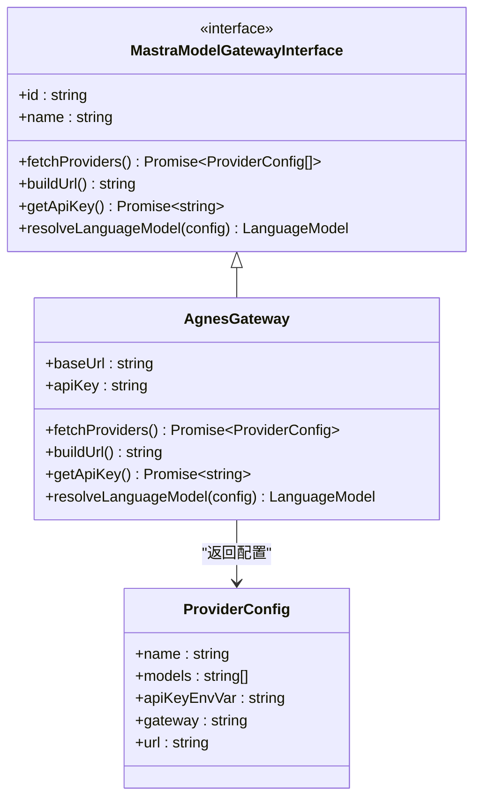
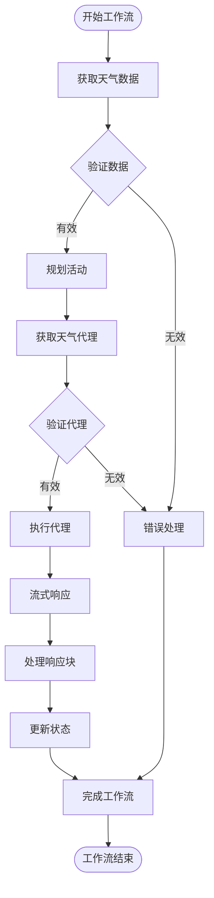
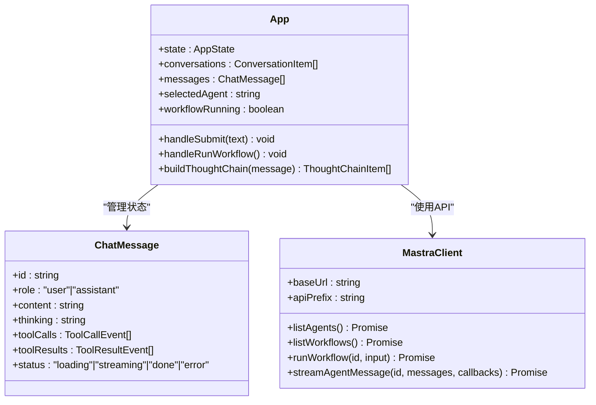
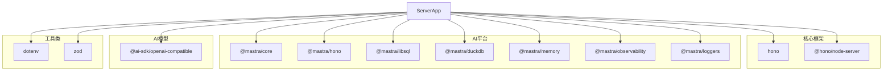
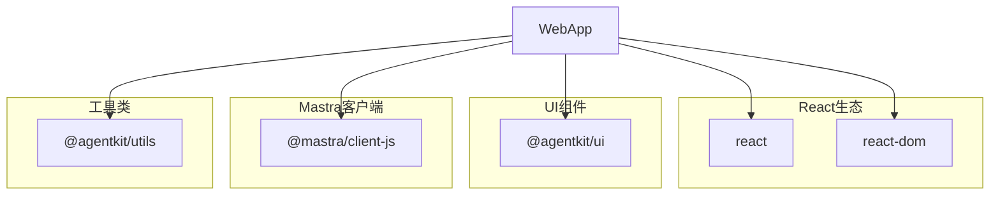

# Hono服务器应用

## 目录

1. [简介](#简介)
2. [项目结构](#项目结构)
3. [核心组件](#核心组件)
4. [架构概览](#架构概览)
5. [详细组件分析](#详细组件分析)
6. [依赖关系分析](#依赖关系分析)
7. [性能考虑](#性能考虑)
8. [故障排除指南](#故障排除指南)
9. [结论](#结论)

## 简介

这是一个基于Hono框架构建的AI代理服务器应用，采用现代化的全栈架构设计。该应用结合了Mastra AI平台的强大功能和Hono微服务框架的高性能特性，为用户提供了一个完整的AI代理解决方案。

项目的核心特点包括：

- 基于Hono的高性能HTTP服务器
- 集成Mastra AI平台的智能代理系统
- 支持工具调用和工作流编排
- 实时流式响应处理
- 完整的可观测性和日志记录

## 项目结构

该项目采用monorepo架构，包含前端Web应用和后端服务器应用两个主要部分：



## 核心组件

### 服务器应用核心组件

服务器应用是整个系统的核心，负责处理HTTP请求、管理AI代理、执行工作流以及提供API接口。

#### Hono服务器配置

服务器使用Hono框架构建，具备以下关键特性：

- CORS跨域支持，允许开发服务器访问
- 请求日志记录和性能监控
- 统一的错误处理机制
- 环境变量配置支持

#### Mastra AI平台集成

Mastra平台提供了完整的AI代理生态系统：

- 代理管理（Agent Management）
- 工作流编排（Workflow Orchestration）
- 工具调用（Tool Calling）
- 存储管理（Storage Management）
- 观测性（Observability）

### Web前端应用

Web应用提供了用户友好的界面，支持实时聊天、代理交互和工作流执行。

#### 主要功能模块

- **聊天界面**：支持实时消息流式传输
- **代理选择器**：动态切换不同的AI代理
- **工作流执行**：运行预定义的工作流程
- **工具调用展示**：可视化显示代理的工具使用情况
- **思考链追踪**：展示代理的推理过程

## 架构概览

该应用采用了分层架构设计，确保了良好的可维护性和扩展性：



### 数据流架构



## 详细组件分析

### 服务器入口点

服务器入口点负责初始化整个应用，包括Hono实例创建、中间件配置和路由设置。

#### 核心初始化流程



### Mastra平台配置

Mastra平台提供了完整的AI代理基础设施，包括存储、观测性和代理管理。

#### 存储系统架构



### Agnes网关配置

Agnes网关提供了对AI模型的统一访问接口，支持多种提供商和模型。

#### 网关接口设计



### 天气代理实现

天气代理展示了如何创建一个专门处理天气查询的AI代理。

#### 代理架构设计

```mermaid
classDiagram
class Agent {
+id : string
+name : string
+instructions : string
+model : string
+tools : Record~string, Tool~
+memory : Memory
+stream(messages) AsyncIterable
}
class WeatherAgent {
+id : "weather-agent"
+name : "Weather Agent"
+instructions : "天气助手说明"
+model : "agnes/agnes/agnes-2.0-flash"
+tools : {weatherTool}
+memory : Memory()
}
class WeatherTool {
+id : "get-weather"
+description : "获取天气信息"
+inputSchema : ZodSchema
+outputSchema : ZodSchema
+execute(input) Promise
}
Agent <|-- WeatherAgent
WeatherAgent --> WeatherTool : "使用工具"
```

### 天气工作流

天气工作流演示了如何编排多个步骤来完成复杂的任务。

#### 工作流执行流程



### Web前端架构

Web前端应用提供了完整的用户界面，支持实时聊天和代理交互。

#### 前端组件架构



## 依赖关系分析

### 服务器应用依赖

服务器应用依赖于多个关键库来实现其功能：



### 前端应用依赖

前端应用专注于用户界面和用户体验：



## 性能考虑

### 服务器性能优化

服务器应用在设计时充分考虑了性能因素：

- **CORS配置优化**：仅允许必要的源和方法
- **请求日志分级**：根据状态码自动选择日志级别
- **内存管理**：使用高效的内存存储系统
- **并发处理**：支持多请求并发处理

### 前端性能优化

前端应用采用了多项性能优化策略：

- **状态管理**：使用React状态钩子进行高效的状态更新
- **流式渲染**：支持实时消息流式传输
- **资源优化**：最小化不必要的重渲染
- **缓存策略**：合理使用浏览器缓存

## 故障排除指南

### 常见问题诊断

#### 服务器启动问题

**症状**：服务器无法启动或端口占用
**解决方案**：

1. 检查端口4000是否被其他进程占用
2. 验证环境变量配置
3. 查看日志输出获取详细错误信息

#### 代理通信问题

**症状**：代理无法正常响应或工具调用失败
**解决方案**：

1. 验证API密钥配置
2. 检查网络连接和防火墙设置
3. 确认代理ID正确无误

#### 工作流执行问题

**症状**：工作流执行失败或超时
**解决方案**：

1. 检查输入数据格式
2. 验证外部API可用性
3. 查看工作流日志获取详细信息

## 结论

这个Hono服务器应用展示了现代AI代理系统的最佳实践。通过精心设计的架构和组件分离，该应用实现了高性能、可扩展且易于维护的AI代理平台。

### 主要优势

1. **模块化设计**：清晰的组件分离使得系统易于理解和维护
2. **性能优化**：采用多种优化策略确保系统响应速度
3. **可扩展性**：支持添加新的代理、工具和工作流
4. **可观测性**：完整的日志记录和性能监控
5. **开发体验**：提供良好的开发工具和调试支持

### 未来发展方向

- **增强AI能力**：集成更多AI模型和功能
- **扩展功能**：添加更多工具和工作流示例
- **性能优化**：持续改进系统性能和资源利用率
- **安全加固**：加强身份验证和授权机制
- **监控完善**：增加更详细的性能指标和告警机制

该应用为构建企业级AI代理系统提供了坚实的基础，可以作为类似项目的参考模板。
