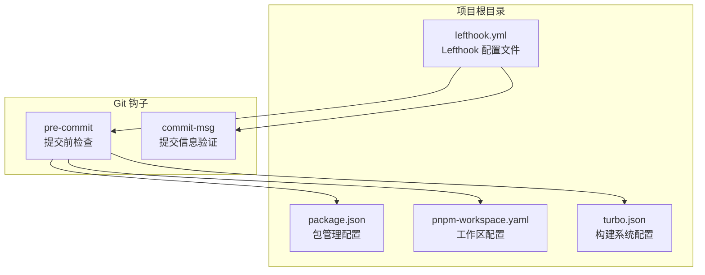
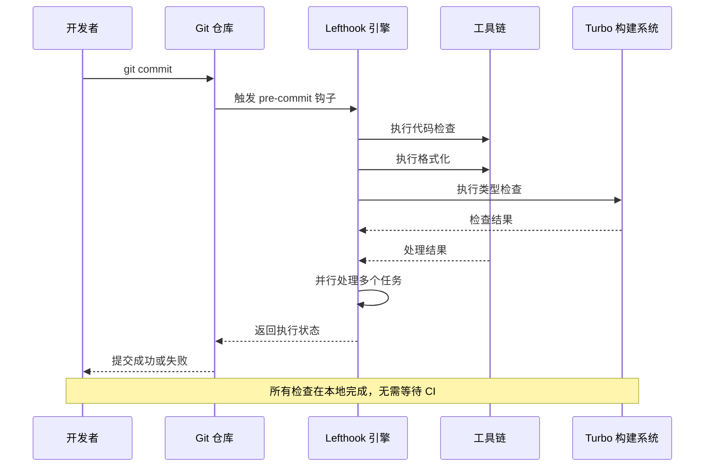
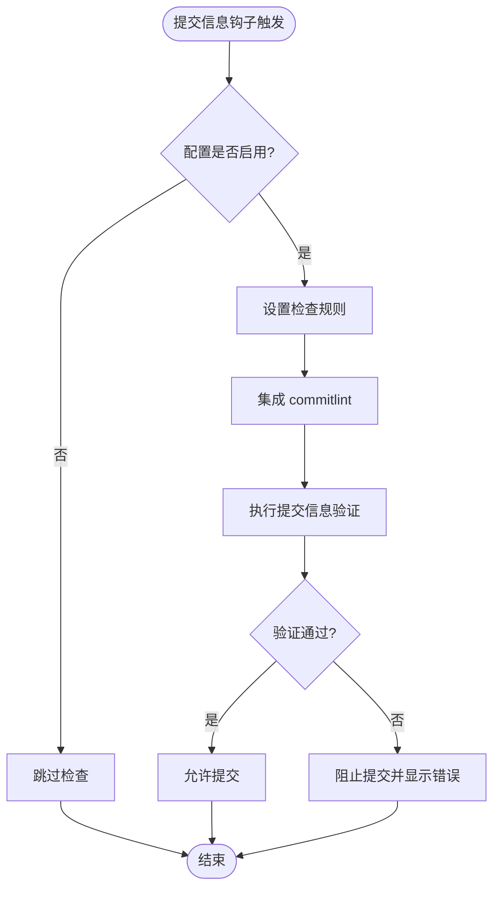
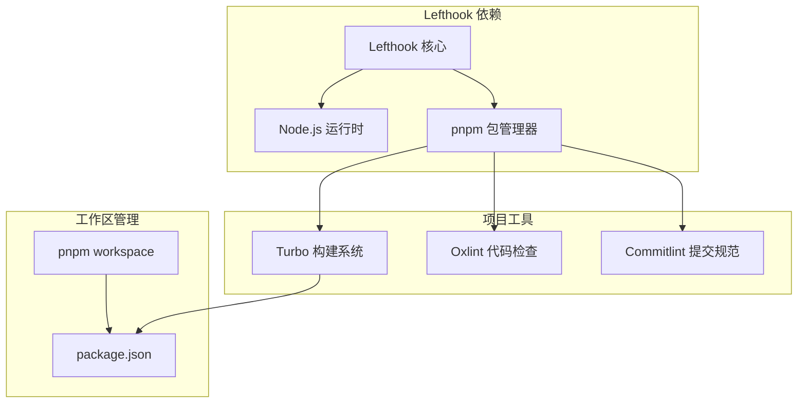
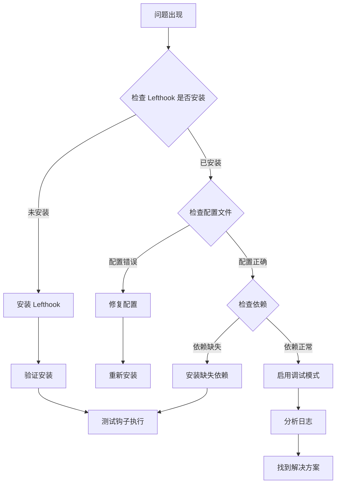

# Lefthook Git 钩子配置

## 目录
1. [简介](#简介)
2. [项目结构](#项目结构)
3. [核心组件](#核心组件)
4. [架构概览](#架构概览)
5. [详细组件分析](#详细组件分析)
6. [依赖关系分析](#依赖关系分析)
7. [性能考虑](#性能考虑)
8. [故障排除指南](#故障排除指南)
9. [结论](#结论)

## 简介

Lefthook 是一个现代化的 Git 钩子管理工具，专门用于在代码提交到版本控制系统之前执行自动化检查和操作。它通过在本地 Git 仓库中安装钩子，确保代码质量、格式化和一致性检查在开发过程中得到严格执行。

### 主要优势

- **本地执行**：所有检查在开发者本地机器上执行，无需等待 CI 服务器响应
- **并行处理**：支持多个钩子任务同时执行，提高效率
- **智能过滤**：只对已暂存的文件执行相关检查，减少不必要的处理
- **灵活配置**：支持复杂的条件判断和文件匹配规则
- **可扩展性**：易于添加新的检查类型和自定义脚本

## 项目结构

基于当前仓库的分析，该项目使用 Lefthook 进行 Git 钩子管理，主要配置文件位于根目录：



## 核心组件

### Lefthook 配置文件

项目中的 `lefthook.yml` 文件是整个 Git 钩子系统的配置中心，定义了两个主要的钩子类型：

#### 预提交钩子 (pre-commit)

预提交钩子是最常用的 Git 钩子，在代码正式提交到本地仓库之前执行。该配置实现了三个关键功能：

1. **代码检查 (lint)**：对 TypeScript/TypeScript React 文件进行语法和风格检查
2. **格式化 (format)**：自动格式化代码和 JSON 文件
3. **类型检查 (typecheck)**：执行 TypeScript 类型检查

#### 提交信息钩子 (commit-msg)

提交信息钩子负责验证提交消息的格式和内容，为团队协作提供一致的提交规范。

## 架构概览

Lefthook 在项目中的整体架构如下：



## 详细组件分析

### 预提交钩子配置详解

#### 并行执行设置

```mermaid
flowchart TD
Start([开始预提交检查]) --> Parallel[parallel: true<br/>启用并行执行]
Parallel --> LintTask[代码检查任务]
Parallel --> FormatTask[格式化任务]
Parallel --> TypecheckTask[类型检查任务]
LintTask --> FilterLint[文件过滤: *.{ts,tsx}]
FormatTask --> FilterFormat[文件过滤: *.{ts,tsx,json,css}]
TypecheckTask --> FilterTypecheck[文件过滤: *.{ts,tsx}]
FilterLint --> RunLint[执行 pnpm turbo run lint --affected]
FilterFormat --> RunFormat[执行 pnpm oxfmt write {staged_files}]
FilterTypecheck --> RunTypecheck[执行 pnpm turbo run typecheck --affected]
RunLint --> MergeResults[合并执行结果]
RunFormat --> MergeResults
RunTypecheck --> MergeResults
MergeResults --> End([结束])
```

#### 文件过滤机制

每个任务都配置了特定的文件过滤规则，确保只对相关的文件执行检查：

- **代码检查**：仅针对 TypeScript 和 TypeScript React 文件
- **格式化**：针对代码文件和 JSON 配置文件
- **类型检查**：针对 TypeScript 源文件

#### 命令执行策略

1. **并行执行**：所有任务同时启动，最大化利用系统资源
2. **智能过滤**：使用 `staged_files` 变量只处理已暂存的文件
3. **增量检查**：通过 `--affected` 参数只检查受影响的包

### 提交信息钩子配置

#### 当前配置状态



## 依赖关系分析

### 工具链依赖



### 版本控制和工作区配置

项目使用 pnpm workspace 进行多包管理，这影响了 Lefthook 的执行方式：

- **工作区感知**：Lefthook 能够识别工作区中的多个包
- **增量构建**：结合 Turbo 的缓存机制，只重建受影响的包
- **共享依赖**：所有包共享相同的开发依赖

## 性能考虑

### 并行执行优化

1. **CPU 利用率**：通过并行执行多个独立的任务，充分利用多核处理器
2. **I/O 优化**：避免串行等待，减少总执行时间
3. **内存管理**：合理分配各任务的内存使用，避免内存不足

### 增量检查策略

1. **文件级过滤**：只处理已暂存的文件，避免全项目扫描
2. **包级增量**：使用 Turbo 的变更检测，只重建受影响的包
3. **缓存利用**：充分利用 Turbo 的构建缓存，加速重复执行

### 资源管理建议

- **并发限制**：根据 CPU 核心数调整并行任务数量
- **超时设置**：为长时间运行的任务设置合理的超时时间
- **内存监控**：监控内存使用情况，避免 OOM 错误

## 故障排除指南

### 常见问题诊断

#### Lefthook 安装问题



#### 配置文件问题

1. **YAML 语法错误**：检查缩进和特殊字符
2. **命令路径问题**：确保所有命令在 PATH 中可用
3. **文件路径匹配**：验证 glob 模式是否正确

#### 执行环境问题

1. **Node.js 版本**：确保使用兼容的 Node.js 版本
2. **pnpm 版本**：检查 pnpm 的版本兼容性
3. **工作区配置**：验证 pnpm-workspace.yaml 的正确性

### 调试方法

#### 启用详细日志

```bash
# 启用 Lefthook 调试模式
DEBUG=lefthook lefthook run pre-commit

# 查看具体任务的详细输出
lefthook run pre-commit --verbose
```

#### 单独测试命令

```bash
# 测试单个命令
pnpm turbo run lint --affected --filter=./{staged_files}

# 测试格式化
pnpm oxfmt write {staged_files}

# 测试类型检查
pnpm turbo run typecheck --affected
```

#### 性能分析

```bash
# 分析执行时间
time lefthook run pre-commit

# 检查资源使用
htop
```

## 结论

Lefthook 为现代 JavaScript/TypeScript 项目提供了强大而灵活的 Git 钩子管理解决方案。通过合理的配置，可以在本地实现完整的代码质量保证流程，包括：

1. **即时反馈**：在提交前立即发现代码问题
2. **团队一致性**：确保所有开发者遵循相同的代码标准
3. **开发效率**：减少 CI 失败和反复修改的时间
4. **可扩展性**：轻松添加新的检查类型和自定义规则

### 最佳实践建议

1. **渐进式采用**：从简单的检查开始，逐步增加复杂度
2. **性能监控**：定期评估钩子执行时间，优化慢速任务
3. **团队培训**：确保所有开发者了解钩子的工作原理和配置
4. **文档维护**：保持配置文档的更新，记录重要的变更

通过合理利用 Lefthook，团队可以建立高质量的代码审查流程，提高开发效率和代码质量。