# Oxlint 代码检查配置

## 目录

1. [简介](#简介)
2. [项目结构](#项目结构)
3. [核心组件](#核心组件)
4. [架构概览](#架构概览)
5. [详细组件分析](#详细组件分析)
6. [依赖关系分析](#依赖关系分析)
7. [性能考虑](#性能考虑)
8. [故障排除指南](#故障排除指南)
9. [结论](#结论)

## 简介

Oxlint 是一个高性能的 JavaScript 和 TypeScript 代码检查工具，作为 ESLint 的现代替代方案而设计。它具有以下主要优势：

- **卓越性能**：基于 Rust 实现，提供比 ESLint 快 10-100 倍的检查速度
- **内存效率**：使用零分配解析器，减少内存占用
- **现代化语法支持**：内置对最新 ECMAScript 特性的支持
- **类型安全**：提供更好的类型推断和错误检测
- **可扩展性**：支持自定义规则和插件系统
- **一体化工具链**：与 Oxlint 配套的格式化工具 Oxfmt 集成

## 项目结构

该项目采用 monorepo 架构，使用 pnpm 工作区管理多个包和应用。以下是项目的整体结构：

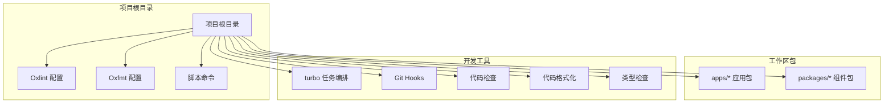

## 核心组件

### Oxlint 配置系统

项目使用 JSON 格式的配置文件来管理代码检查规则：

```mermaid
classDiagram
class OxlintrcConfig {
+string $schema
+object rules
+array ignorePatterns
+validateRules() boolean
+mergeWithDefaults() object
+applyIgnorePatterns() array
}
class OxfmtrcConfig {
+boolean useTabs
+number tabWidth
+boolean singleQuote
+string trailingComma
+number printWidth
+validateConfig() boolean
+applyFormatting() void
}
class RuleSet {
+string name
+string severity
+object options
+isEnabled() boolean
+getSeverity() string
}
class IgnorePatterns {
+array patterns
+match(file) boolean
+addPattern(pattern) void
+removePattern(pattern) void
}
OxlintrcConfig --> RuleSet : "包含"
OxlintrcConfig --> IgnorePatterns : "包含"
OxfmtrcConfig --> "格式化选项" : "配置"
RuleSet --> "warn/error" : "严重级别"
```

### 任务编排系统

项目使用 Turbo 来管理构建、开发、测试和检查任务：

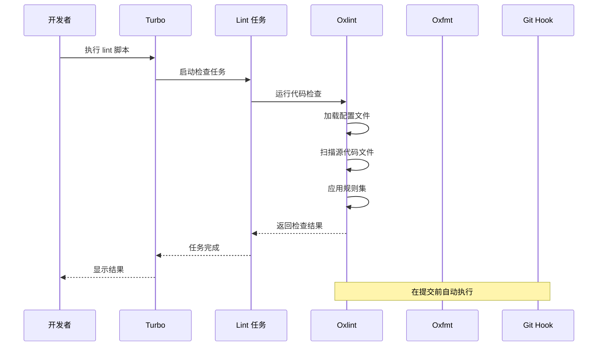

## 架构概览

### 整体架构流程

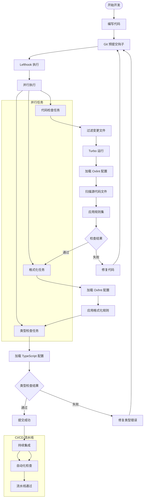

### 规则配置架构

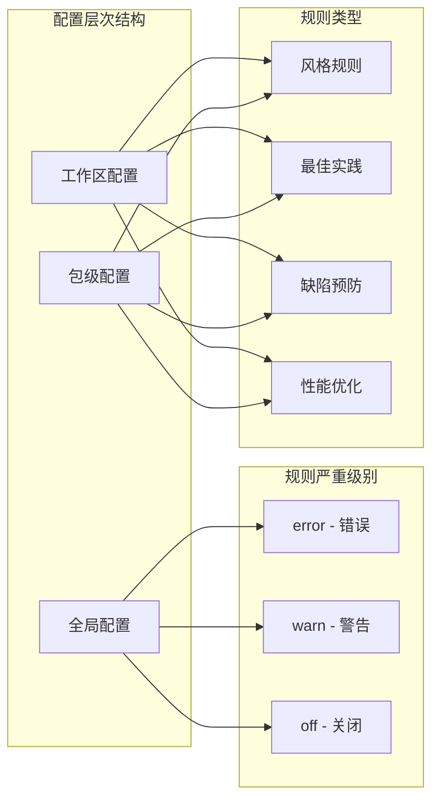

## 详细组件分析

### Oxlint 配置文件分析

#### 当前配置状态

项目当前使用基础的规则配置，重点关注常见的代码质量问题：

| 规则名称       | 严重级别 | 描述                 | 作用                       |
| -------------- | -------- | -------------------- | -------------------------- |
| no-unused-vars | warn     | 检测未使用的变量     | 提高代码质量，减少冗余     |
| no-console     | warn     | 检测 console 调用    | 防止调试代码进入生产环境   |
| eqeqeq         | error    | 强制使用严格相等比较 | 避免类型转换导致的逻辑错误 |

#### 配置文件结构

```mermaid
erDiagram
OXLINTRC {
string $schema
object rules
array ignorePatterns
}
OxFMTRC {
boolean useTabs
number tabWidth
boolean singleQuote
string trailingComma
number printWidth
}
RULES {
string ruleName
string severity
object options
}
IGNORE_PATTERNS {
string pattern
boolean isGlob
boolean isDirectory
}
OXLINTRC ||--|| RULES : "包含"
OXLINTRC ||--o{ IGNORE_PATTERNS : "包含"
```

### 任务编排系统

#### Turbo 配置分析

Turbo 任务配置提供了灵活的任务管理和缓存机制：

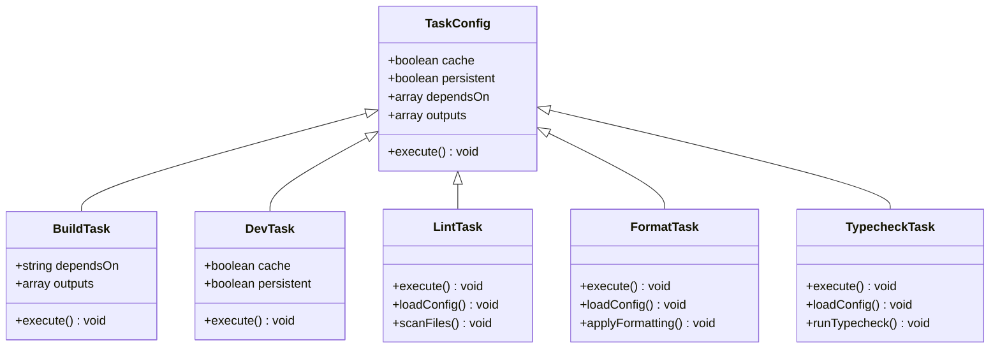

#### 任务执行流程

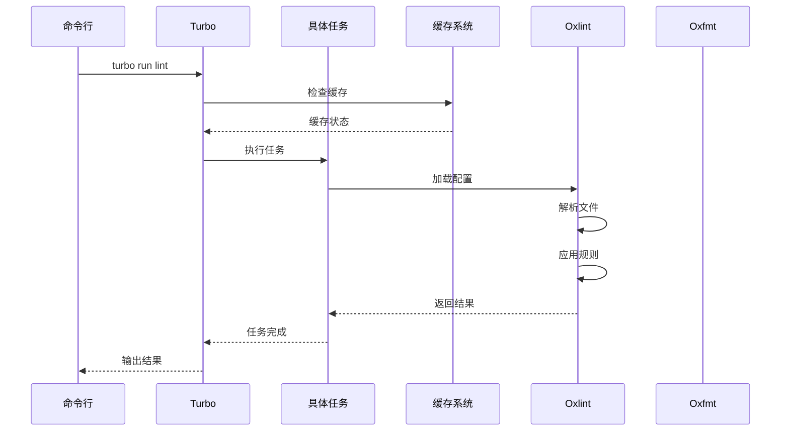

### Git Hooks 集成

#### Lefthook 配置分析

Lefthook 提供了强大的 Git Hooks 管理功能：

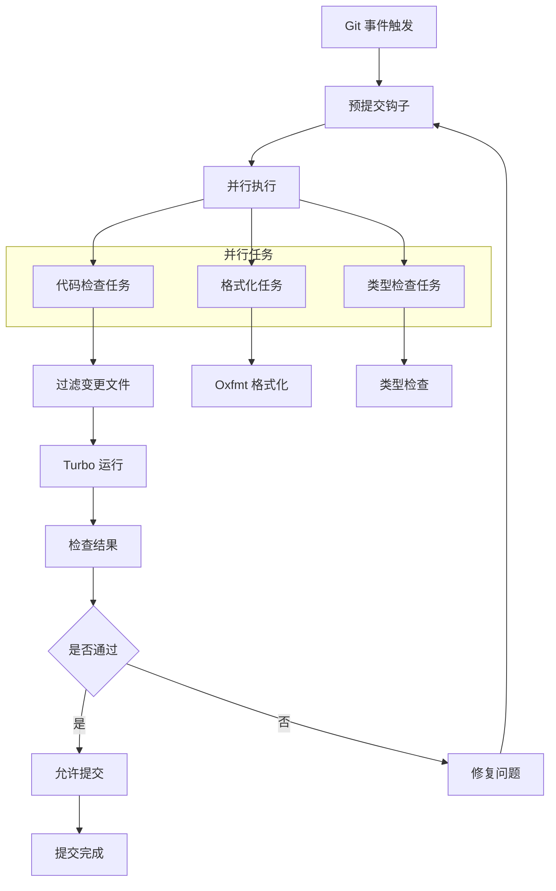

### TypeScript 配置分析

项目使用共享的 TypeScript 配置作为基础：

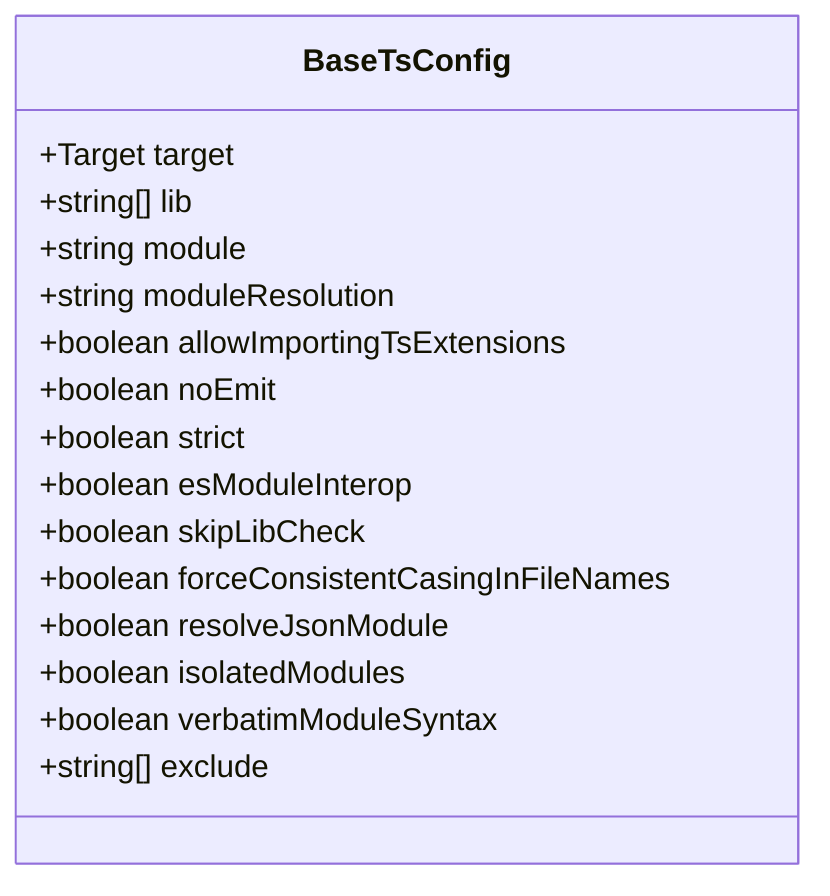

## 依赖关系分析

### 包管理器配置

项目使用 pnpm 工作区来管理依赖关系：

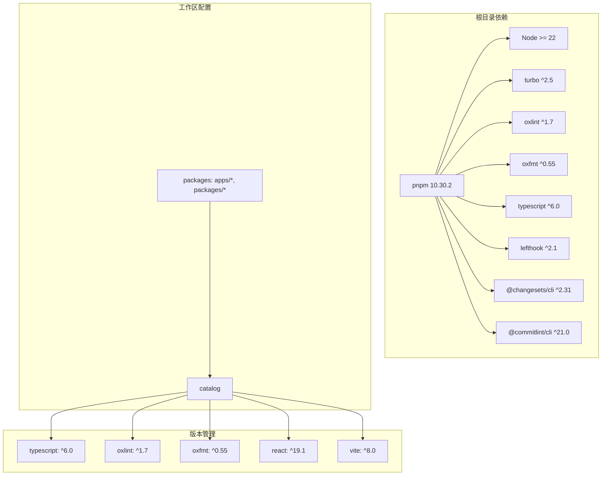

### 依赖关系可视化

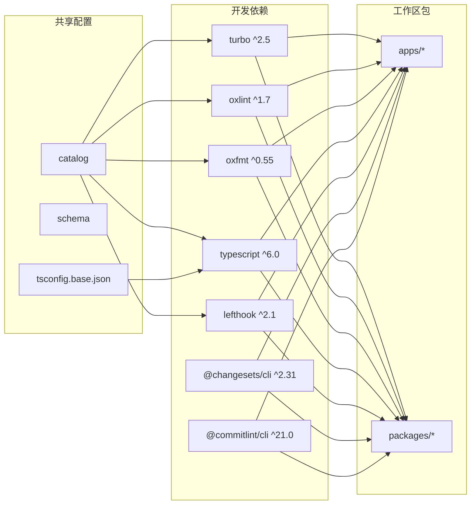

## 性能考虑

### 缓存策略

项目利用多种缓存机制来提升性能：

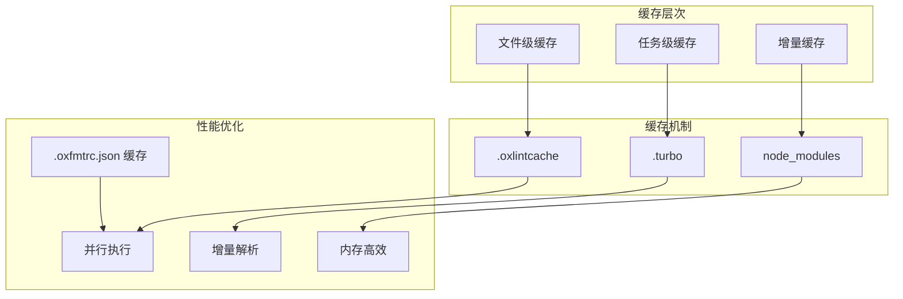

### 性能优化建议

1. **利用并行执行**：Lefthook 支持并行执行多个任务
2. **配置增量检查**：只检查变更的文件
3. **合理设置忽略模式**：避免不必要的文件检查
4. **使用缓存目录**：`.oxlintcache` 提升重复检查速度
5. **优化格式化配置**：合理设置打印宽度和缩进规则
6. **类型检查分离**：将类型检查独立于代码检查执行

## 故障排除指南

### 常见问题及解决方案

#### 配置文件问题

| 问题             | 症状            | 解决方案                           |
| ---------------- | --------------- | ---------------------------------- |
| 配置文件格式错误 | Oxlint 启动失败 | 检查 JSON 格式，确保语法正确       |
| 规则名称无效     | 规则不生效      | 验证规则名称拼写，参考官方文档     |
| 严重级别错误     | 检查结果异常    | 确认严重级别值为 warn/error/off    |
| 格式化配置错误   | Oxfmt 执行失败  | 检查配置文件语法，确保数值类型正确 |

#### 性能问题

| 问题         | 症状           | 解决方案                   |
| ------------ | -------------- | -------------------------- |
| 检查速度慢   | 检查耗时过长   | 添加忽略模式，减少检查范围 |
| 内存占用高   | 内存使用量大   | 优化规则配置，避免过度检查 |
| 缓存失效     | 重复检查时间长 | 清理缓存目录，重新生成缓存 |
| 格式化性能差 | 格式化耗时过长 | 优化打印宽度和缩进设置     |

#### 集成问题

| 问题             | 症状             | 解决方案                         |
| ---------------- | ---------------- | -------------------------------- |
| Git Hooks 不执行 | 提交无检查       | 检查 Lefthook 配置，确认权限设置 |
| Turbo 任务失败   | 任务执行中断     | 检查任务依赖关系，验证输出路径   |
| 类型检查冲突     | 类型错误影响检查 | 调整 TypeScript 配置，确保兼容性 |
| 并行任务阻塞     | 多个任务互相等待 | 检查任务依赖关系，优化执行顺序   |

#### 版本兼容性问题

| 问题              | 症状         | 解决方案                 |
| ----------------- | ------------ | ------------------------ |
| Oxlint 版本不兼容 | 规则不识别   | 更新到兼容的 Oxlint 版本 |
| Oxfmt 版本不匹配  | 格式化失败   | 升级到兼容的 Oxfmt 版本  |
| Turbo 版本过旧    | 任务执行异常 | 更新到推荐的 Turbo 版本  |

## 结论

Oxlint 作为现代代码检查工具，在这个项目中展现了显著的优势：

### 主要优势

1. **性能卓越**：相比传统工具快 10-100 倍
2. **集成简便**：与现有工具链无缝集成
3. **配置灵活**：支持多层配置和自定义规则
4. **开发体验好**：提供实时反馈和快速迭代
5. **一体化工具链**：Oxlint + Oxfmt 形成完整解决方案

### 最佳实践建议

1. **渐进式迁移**：从 ESLint 渐进迁移到 Oxlint
2. **规则定制**：根据项目需求调整规则配置
3. **性能监控**：定期检查检查性能和资源使用
4. **团队协作**：制定统一的代码检查标准
5. **配置维护**：定期更新配置文件以适应新版本

### 未来发展方向

1. **规则扩展**：增加更多项目特定的规则
2. **IDE 集成**：完善编辑器插件支持
3. **CI/CD 优化**：进一步提升流水线效率
4. **社区贡献**：积极参与开源生态建设
5. **工具链完善**：探索更多与 Oxlint 生态相关的工具

通过合理的配置和最佳实践，Oxlint 能够显著提升代码质量和开发效率，为项目的长期发展奠定坚实基础。
