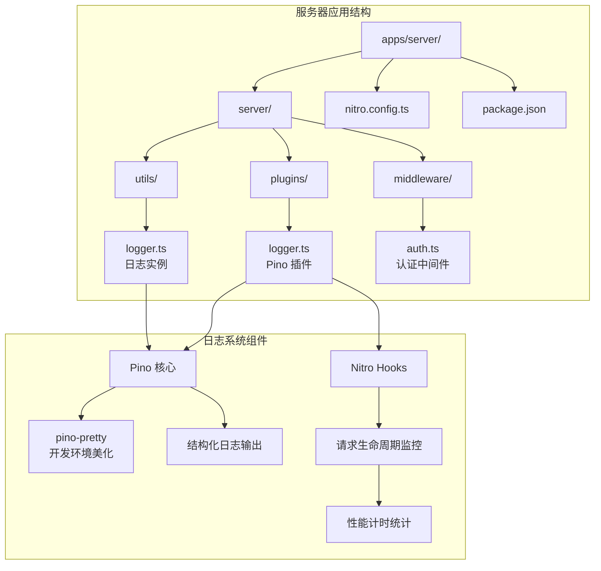
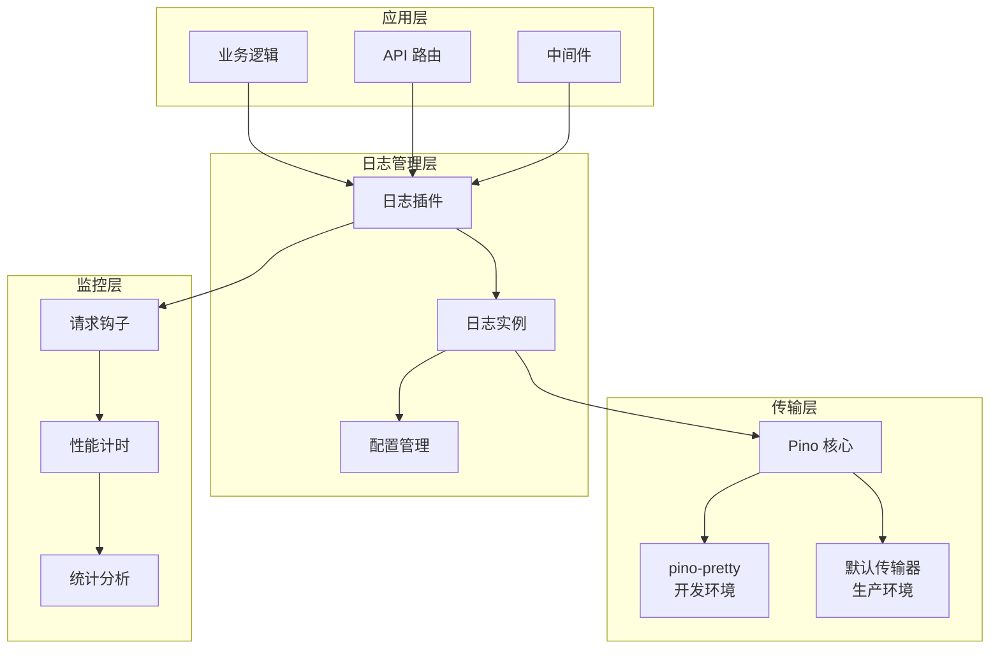
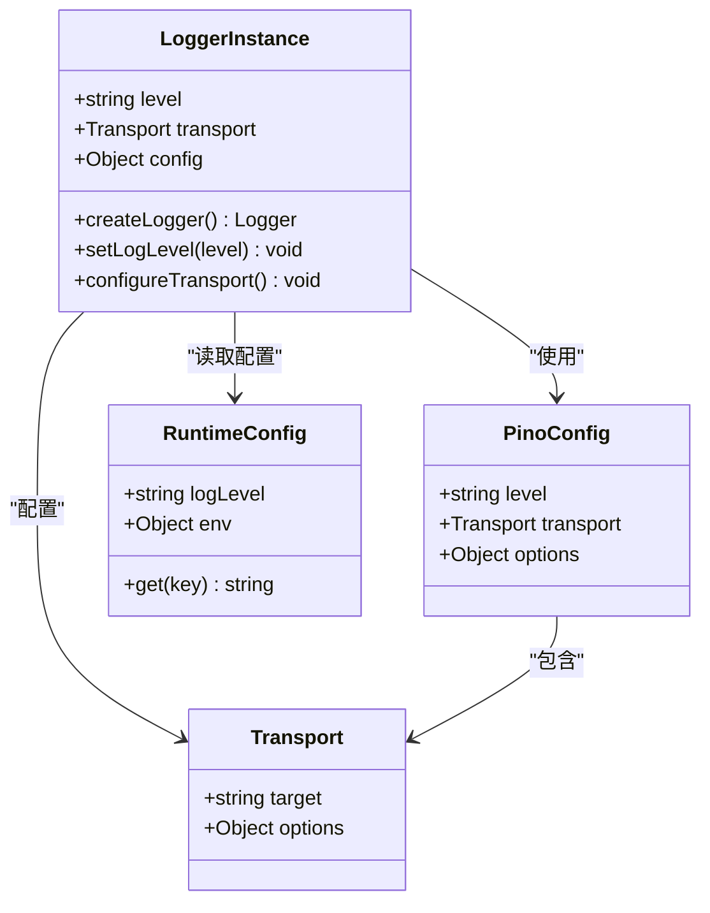
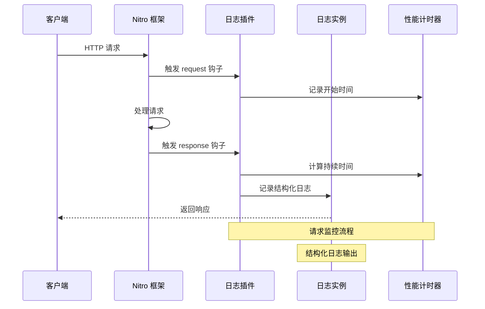
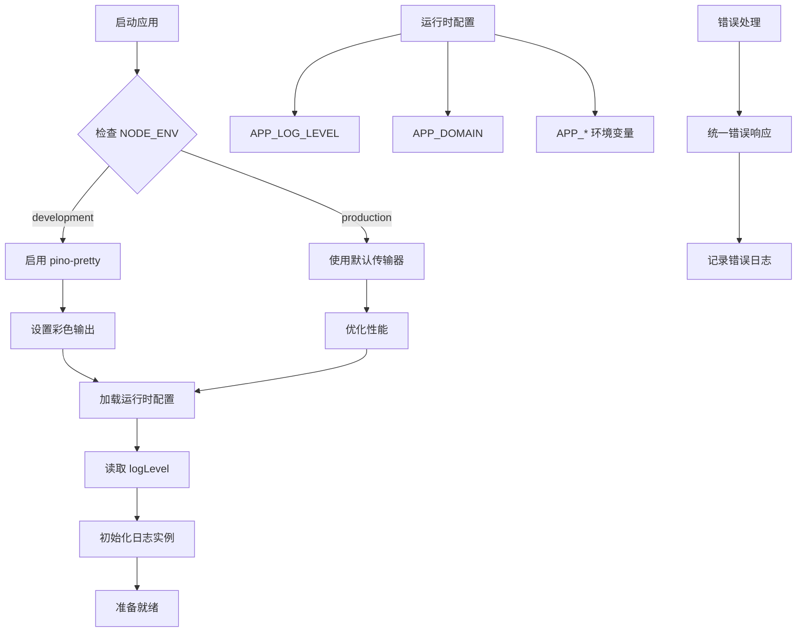
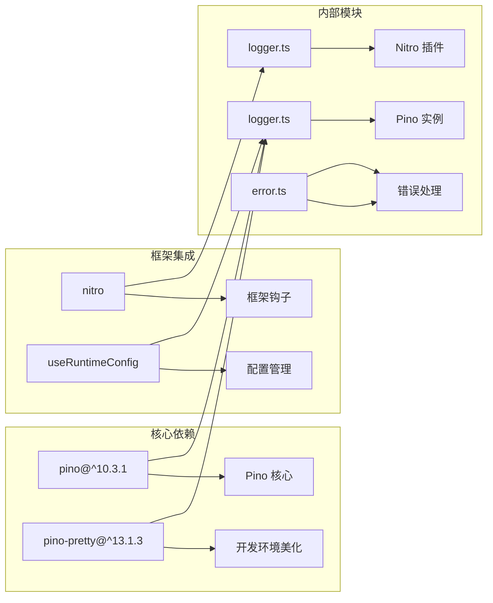
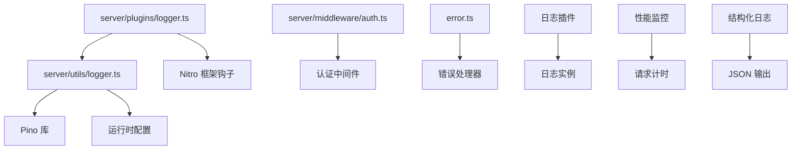
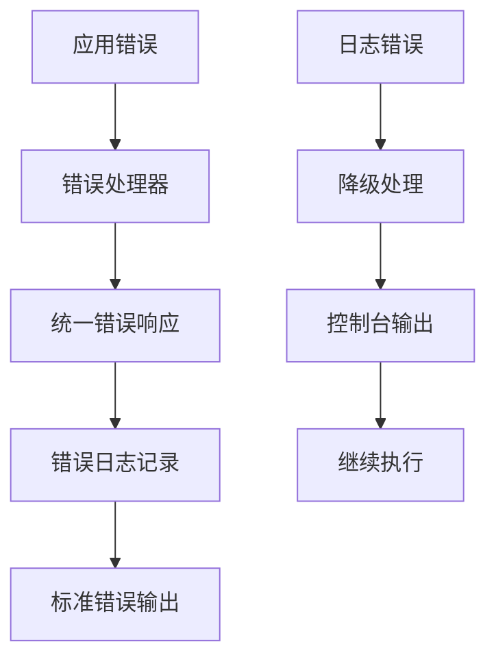

# Pino 日志系统

## 目录

1. [简介](#简介)
2. [项目结构](#项目结构)
3. [核心组件](#核心组件)
4. [架构概览](#架构概览)
5. [详细组件分析](#详细组件分析)
6. [依赖关系分析](#依赖关系分析)
7. [性能考虑](#性能考虑)
8. [故障排除指南](#故障排除指南)
9. [结论](#结论)

## 简介

本项目采用 Pino 作为主要的日志记录系统，结合 Nitro 框架实现了高性能、结构化的日志记录功能。Pino 是一个专为 Node.js 设计的快速日志记录器，以其极低的性能开销和优秀的 JSON 格式输出而闻名。

该日志系统的核心特点包括：

- 基于 Pino 的高性能日志记录
- 结构化日志格式，便于数据分析和监控
- 开发环境下的彩色美化输出
- 请求级别的性能监控和统计
- 可配置的日志级别和传输层

## 项目结构

该项目的日志系统主要分布在以下目录结构中：

## 核心组件

### Pino 日志实例

日志系统的核心是通过 `logger.ts` 文件创建的 Pino 实例。该实例具有以下关键特性：

- **动态日志级别**：从运行时配置中读取日志级别，支持从环境变量或配置文件中设置
- **条件传输层**：在非生产环境中自动启用 `pino-pretty` 传输器，提供彩色美化输出
- **结构化日志**：所有日志消息都采用结构化格式，包含时间戳、级别、消息和上下文信息

### Nitro 插件集成

`logger.ts` 插件文件实现了 Nitro 框架的钩子机制，用于监控 HTTP 请求的完整生命周期：

- **请求开始监控**：在 `request` 钩子中记录请求开始时间
- **响应处理**：在 `response` 钩子中计算请求持续时间和状态码
- **性能统计**：收集方法、路径、状态码和执行时间等关键指标

## 架构概览

该日志系统采用分层架构设计，确保了高内聚和低耦合：

## 详细组件分析

### 日志实例配置组件

日志实例配置组件负责创建和管理 Pino 日志记录器：

该组件的关键实现要点：

1. **配置加载**：从 `useRuntimeConfig()` 获取运行时配置
2. **环境检测**：通过 `process.env.NODE_ENV` 判断当前环境
3. **传输器选择**：开发环境使用 `pino-pretty`，生产环境使用默认传输器
4. **日志级别**：支持从配置中读取自定义日志级别

### Nitro 插件监控组件

插件监控组件实现了对 HTTP 请求的完整生命周期监控：

该组件的核心功能包括：

1. **请求跟踪**：使用 `WeakMap` 存储每个请求的开始时间
2. **性能测量**：利用 `performance.now()` 提供高精度时间测量
3. **数据提取**：从请求对象中提取方法、URL 和路径信息
4. **结构化输出**：将关键指标封装为 JSON 对象

### 配置管理系统

配置管理系统负责管理整个日志系统的运行参数：

## 依赖关系分析

### 外部依赖关系

该日志系统依赖于以下关键外部包：

### 内部模块依赖

内部模块之间的依赖关系相对简单，体现了良好的模块化设计：

## 性能考虑

### Pino 性能优势

Pino 在性能方面具有显著优势：

1. **低内存分配**：Pino 使用预分配策略，减少了垃圾回收压力
2. **异步写入**：采用异步 I/O 操作，避免阻塞事件循环
3. **零格式化开销**：在生产环境中禁用格式化，直接输出 JSON
4. **高效序列化**：使用高效的 JSON 序列化算法

### 监控性能影响

日志插件对应用性能的影响最小化：

- **弱映射存储**：使用 `WeakMap` 存储请求时间，避免内存泄漏
- **高精度计时**：`performance.now()` 提供微秒级精度，开销极小
- **条件传输器**：仅在开发环境启用美化传输器
- **结构化日志**：减少字符串拼接操作

### 生产环境优化

生产环境的性能优化策略：

1. **禁用美化输出**：避免彩色字符编码的 CPU 开销
2. **直接 JSON 输出**：减少格式化步骤
3. **异步传输**：确保日志写入不影响请求处理
4. **合理日志级别**：避免不必要的日志记录

## 故障排除指南

### 常见问题诊断

#### 日志级别不生效

**症状**：设置的日志级别没有生效

**排查步骤**：

1. 检查运行时配置是否正确加载
2. 验证环境变量设置
3. 确认配置优先级顺序

#### 开发环境美化输出异常

**症状**：彩色输出显示异常或不显示

**排查步骤**：

1. 确认 `NODE_ENV` 设置为 `development`
2. 检查 `pino-pretty` 依赖是否正确安装
3. 验证终端支持彩色输出

#### 性能监控数据缺失

**症状**：请求持续时间显示为问号

**排查步骤**：

1. 检查 `request` 钩子是否正常触发
2. 验证 `WeakMap` 是否正确存储时间戳
3. 确认 `response` 钩子的执行顺序

### 错误处理机制

系统提供了基础的错误处理能力：

## 结论

该 Pino 日志系统展现了现代 Node.js 应用的最佳实践：

### 设计优势

1. **高性能**：Pino 的设计确保了极低的性能开销
2. **可维护性**：清晰的模块分离和职责划分
3. **可扩展性**：基于 Nitro 框架的钩子机制，易于扩展新功能
4. **开发体验**：智能的环境检测和美化输出

### 技术亮点

- **结构化日志**：便于日志聚合和分析
- **性能监控**：内置的请求性能统计
- **环境适配**：开发和生产环境的差异化配置
- **错误处理**：基础但有效的错误处理机制

### 改进建议

1. **日志采样**：对于高频接口可以考虑采样策略
2. **日志轮转**：生产环境建议配置日志文件轮转
3. **指标导出**：可以考虑将性能指标导出到监控系统
4. **安全审计**：敏感信息的日志脱敏处理

该日志系统为整个应用提供了坚实的基础，既保证了开发时的良好体验，又确保了生产环境的稳定性和性能表现。
