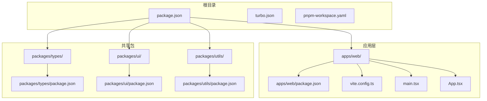
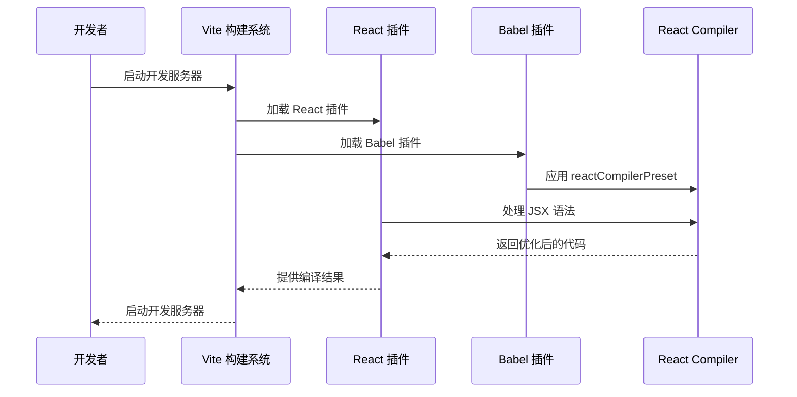
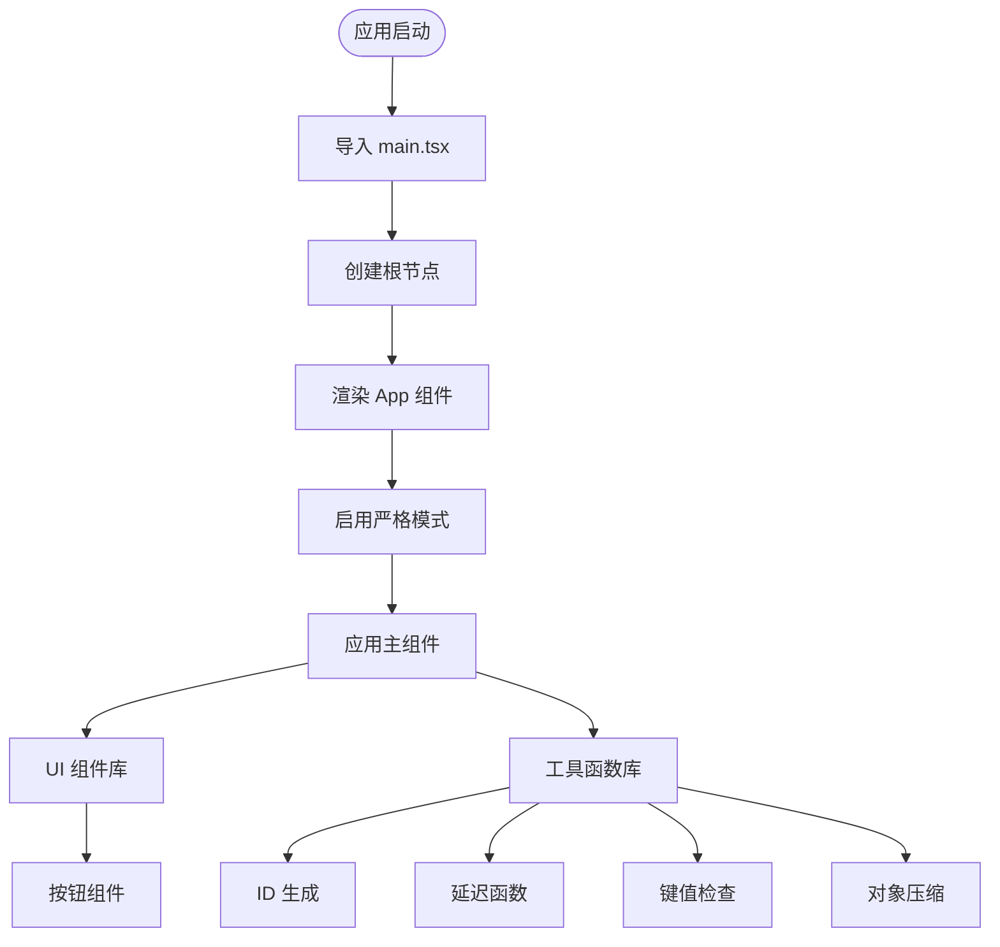
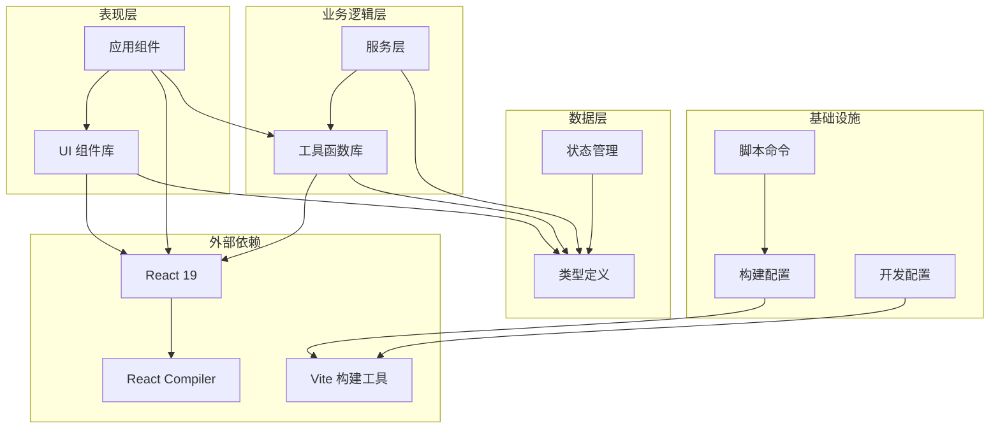
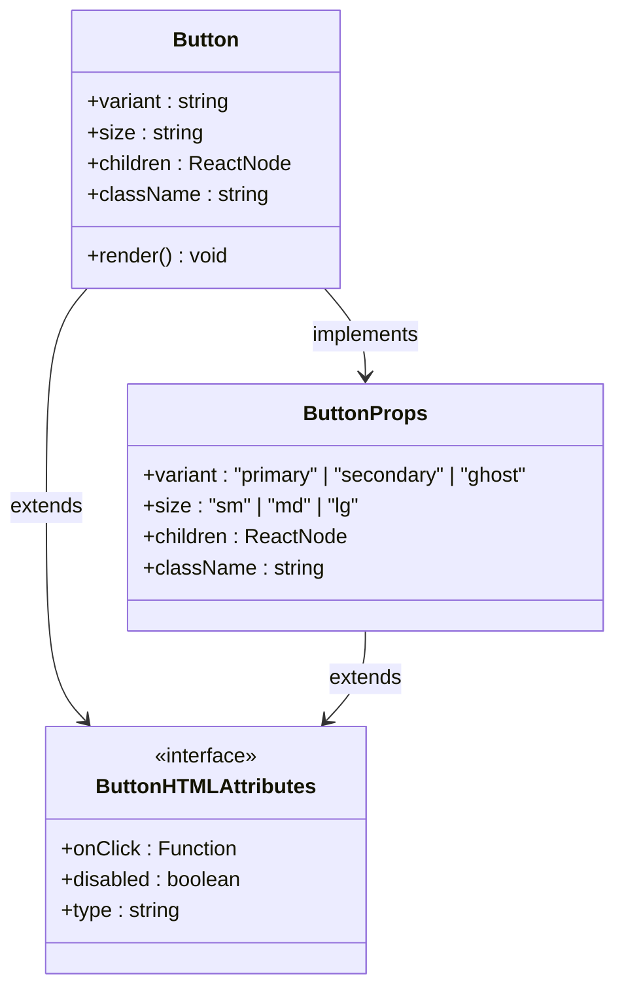
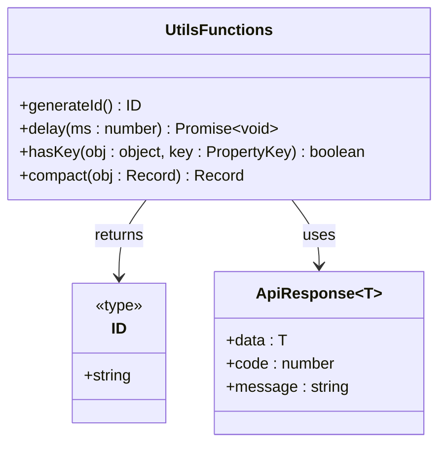
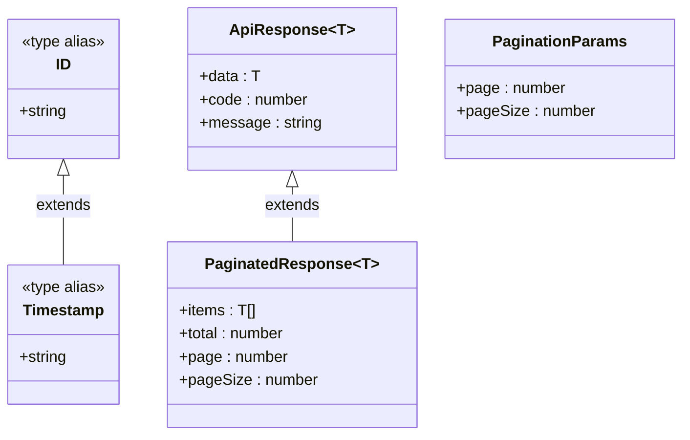
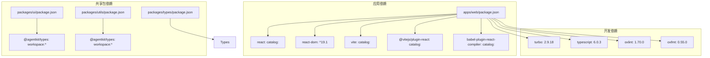
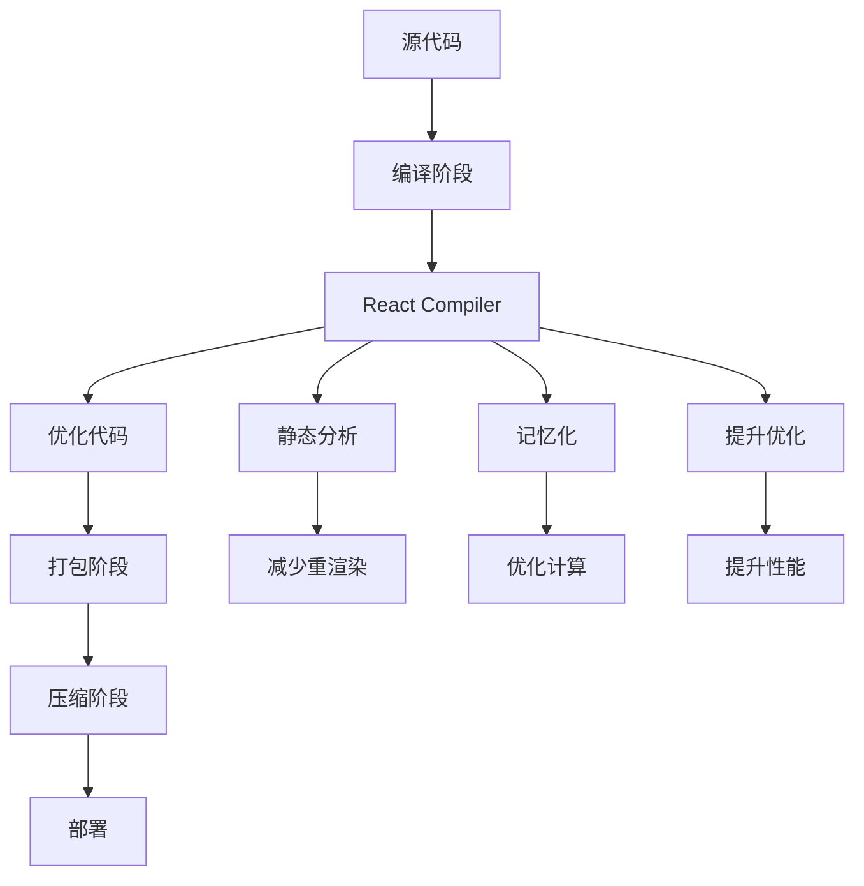

# React 编译器集成

## 目录

1. [简介](#简介)
2. [项目结构](#项目结构)
3. [核心组件](#核心组件)
4. [架构概览](#架构概览)
5. [详细组件分析](#详细组件分析)
6. [依赖关系分析](#依赖关系分析)
7. [性能考虑](#性能考虑)
8. [故障排除指南](#故障排除指南)
9. [结论](#结论)

## 简介

本项目是一个基于 React 19 的现代化前端应用，集成了 React Compiler 编译器以提升开发体验和运行时性能。该项目采用 Monorepo 架构，使用 Vite 作为构建工具，通过 Turborepo 实现高效的缓存和并行构建。

项目的核心目标是展示如何在实际开发中集成 React Compiler，包括配置、优化策略以及最佳实践。通过工作空间管理多个包，实现了代码复用和模块化开发。

## 项目结构

项目采用标准的 Monorepo 结构，包含一个 Web 应用和三个共享包：

## 核心组件

### React Compiler 集成

项目通过 Vite 插件系统集成了 React Compiler，实现了编译时优化：

### 应用入口点

应用的启动流程遵循标准的 React 18+ 模式：

## 架构概览

项目采用分层架构设计，清晰分离了关注点：

## 详细组件分析

### UI 组件库

UI 组件库提供了基础的交互组件，采用类型安全的设计：

组件特性：

- 支持三种变体：primary、secondary、ghost
- 支持三种尺寸：sm、md、lg
- 完整的 TypeScript 类型支持
- 扩展的 HTML button 属性

### 工具函数库

工具函数库提供了常用的功能函数：

主要功能：

- `generateId`: 使用加密安全的随机数生成唯一标识符
- `delay`: 延迟执行的 Promise 包装器
- `hasKey`: 类型安全的对象属性检查
- `compact`: 过滤掉 null 和 undefined 值的对象压缩

### 类型定义系统

类型定义系统提供了统一的类型规范：

## 依赖关系分析

项目使用 pnpm 工作空间管理依赖关系：

## 性能考虑

### React Compiler 优化

React Compiler 通过以下方式提升性能：

1. **编译时优化**：在构建阶段进行静态分析和优化
2. **JSX 优化**：自动优化 JSX 渲染逻辑
3. **状态提升**：智能识别和优化组件状态管理
4. **副作用检测**：静态分析副作用以减少不必要的重渲染

### 构建优化策略

### 开发体验优化

- **快速热重载**：结合 Vite 实现秒级热更新
- **类型检查**：集成 TypeScript 进行实时类型验证
- **代码格式化**：使用 oxfmt 自动格式化代码
- **代码质量**：oxlint 提供静态代码分析

## 故障排除指南

### 常见问题及解决方案

1. **React Compiler 配置问题**
   - 确保 `babel-plugin-react-compiler` 版本与 React 19 兼容
   - 检查 `reactCompilerPreset()` 是否正确应用

2. **类型错误**
   - 确保所有共享类型正确导出和导入
   - 检查 TypeScript 配置是否正确

3. **构建失败**
   - 清理 node_modules 和重新安装依赖
   - 检查 pnpm 工作空间配置

4. **开发服务器问题**
   - 确认端口 3000 未被占用
   - 检查 Vite 配置文件语法

## 结论

本项目成功展示了如何在现代 React 应用中集成 React Compiler，通过以下关键实践：

1. **架构设计**：采用 Monorepo 结构，合理分离关注点
2. **工具链集成**：Vite + React Compiler + Turborepo 的高效组合
3. **类型安全**：完整的 TypeScript 支持和类型定义
4. **开发体验**：快速迭代和良好的开发者工具链

项目为 React 19 生态系统的开发提供了参考模板，展示了如何在实际项目中应用最新的编译器技术和最佳实践。通过模块化的包管理和清晰的依赖关系，项目具备良好的可维护性和扩展性。
