# Renovate 自动依赖管理

## 目录
1. [项目简介](#项目简介)
2. [项目结构](#项目结构)
3. [核心组件](#核心组件)
4. [架构概览](#架构概览)
5. [详细组件分析](#详细组件分析)
6. [依赖关系分析](#依赖关系分析)
7. [性能考虑](#性能考虑)
8. [故障排除指南](#故障排除指南)
9. [结论](#结论)

## 项目简介

这是一个基于 Renovate 的自动化依赖管理系统，专为多包工作区（Monorepo）设计。项目采用 pnpm workspace + catalog 架构，结合 Turborepo 和 Changesets 实现高效的依赖管理和版本控制。

系统的核心目标是：
- 自动化依赖更新和安全漏洞修复
- 统一的依赖版本管理策略
- 智能的包分组和更新调度
- 完整的 CI/CD 集成

## 项目结构

项目采用典型的 Monorepo 结构，包含多个应用和包：

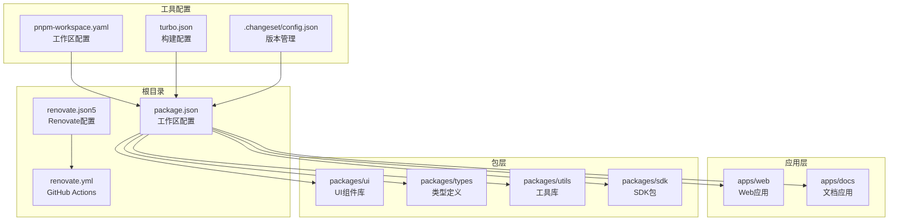

## 核心组件

### Renovate 配置引擎

Renovate 配置文件定义了完整的依赖管理策略：

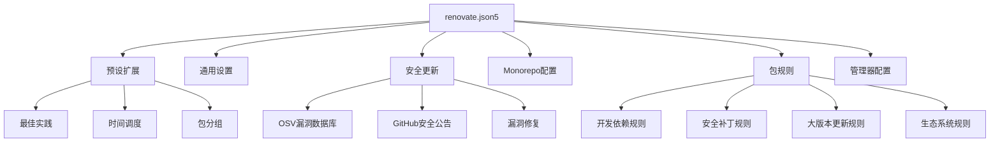

### GitHub Actions 工作流

自动化执行管道确保依赖更新的持续集成：

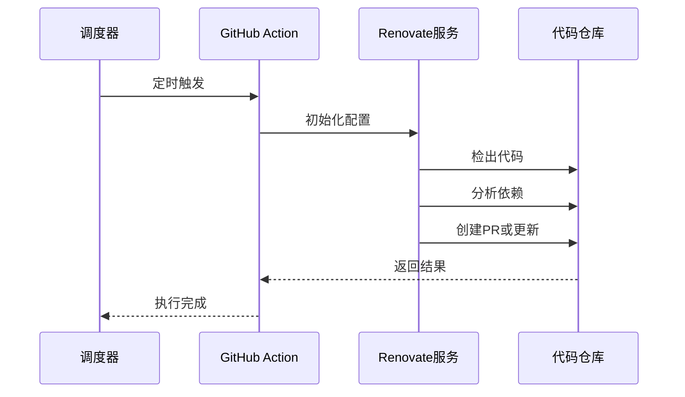

## 架构概览

系统采用分层架构设计，确保依赖管理的高效性和可维护性：

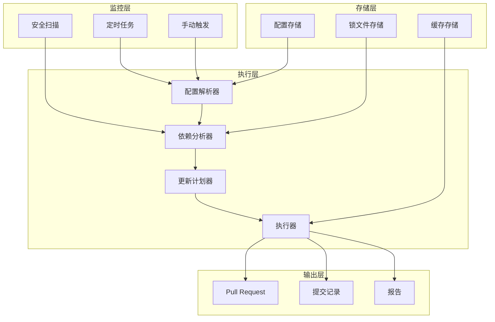

## 详细组件分析

### 包管理策略

系统实现了多层次的包管理策略，针对不同类型的依赖采用差异化的处理方式：

#### 开发依赖管理

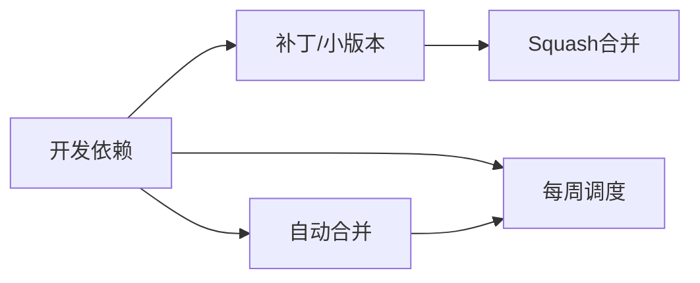

#### 安全补丁策略

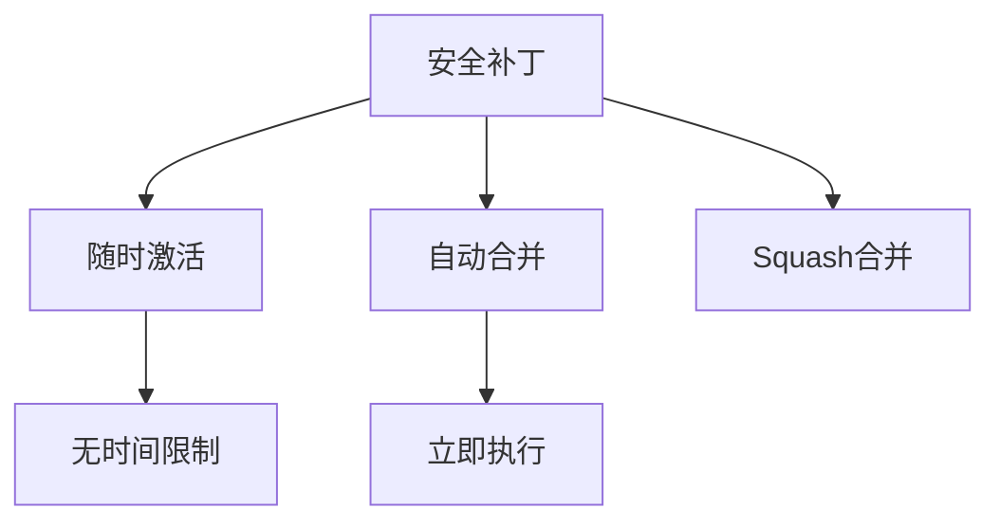

#### 大版本更新控制

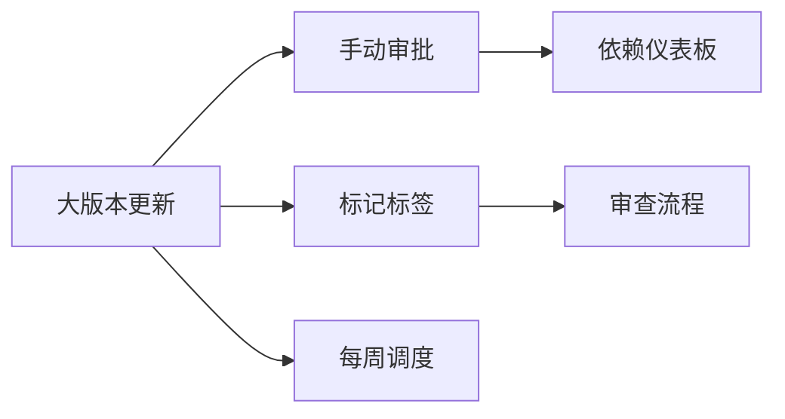

### 生态系统分组

系统对主要技术栈进行智能分组，提高依赖管理效率：

| 生态系统 | 包模式 | 分组名称 | 管理策略 |
|---------|--------|----------|----------|
| React 生态 | `^react$`, `^react-dom$`, `^@types/react` | React | 同步更新 |
| Vite 生态 | `^@vitejs/`, `^vite$`, `^@rolldown/` | Vite | 版本对齐 |
| Lit 生态 | `^lit`, `^@lit/`, `^@lit-labs/` | Lit | 兼容性保证 |
| Changesets | `^@changesets/` | Changesets | 版本管理 |
| Commitlint | `^@commitlint/` | Commitlint | 提交规范 |

### 工作区集成

多包工作区的依赖管理策略：

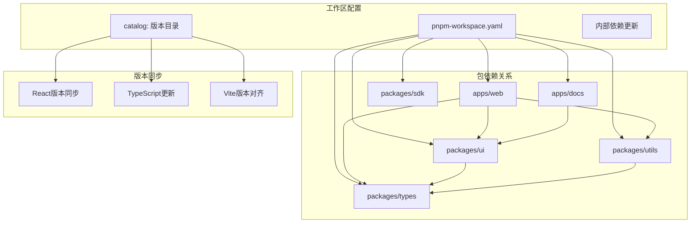

## 依赖关系分析

### 包间依赖图

系统中各包之间的依赖关系呈现清晰的层次结构：

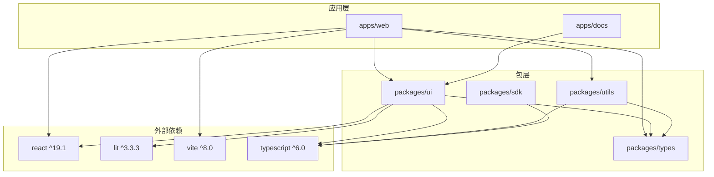

### 版本管理策略

系统采用统一的版本管理策略，确保依赖的一致性和可预测性：

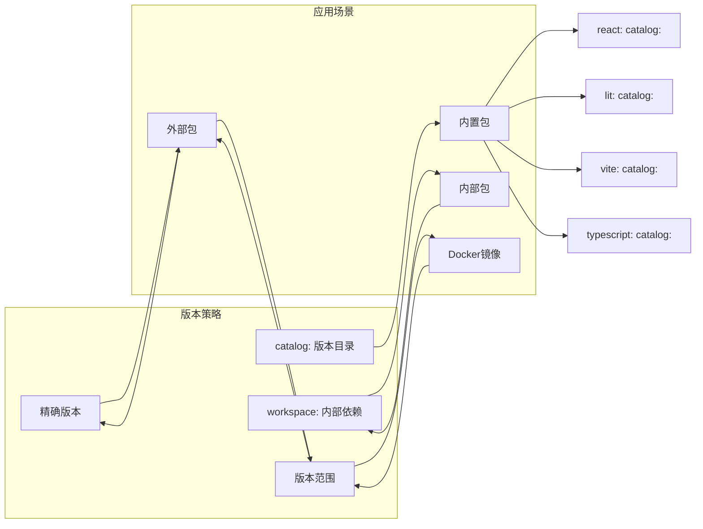

## 性能考虑

### 并发控制

系统通过多种并发限制确保资源的有效利用：

| 限制类型 | 数值 | 说明 |
|---------|------|------|
| PR并发限制 | 5 | 控制同时创建的PR数量 |
| 每小时PR限制 | 5 | 防止过度频繁的PR创建 |
| 分支并发限制 | 5 | 限制同时处理的分支数量 |
| 锁文件维护频率 | 每周一上午9点前 | 定期刷新锁定文件 |

### 缓存策略

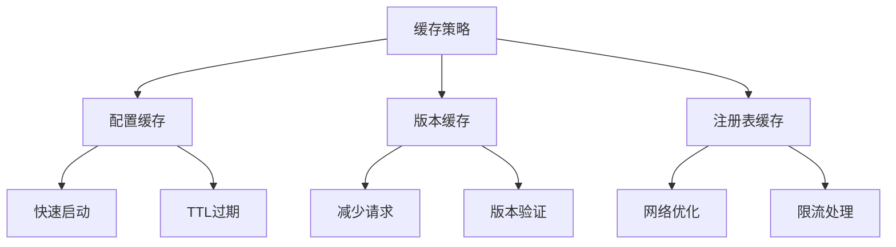

### 执行优化

- **增量更新**：只处理发生变化的依赖
- **并行处理**：充分利用多核CPU资源
- **智能调度**：避开高峰期，减少对CI的影响

## 故障排除指南

### 常见问题及解决方案

#### Renovate 无法访问私有包

**问题症状**：
- 认证失败
- 私有包版本无法解析

**解决步骤**：
1. 检查 `RENOVATE_TOKEN` 是否正确配置
2. 验证 token 权限范围（repo + workflow）
3. 确认网络连接正常

#### 依赖更新冲突

**问题症状**：
- PR 合并冲突
- CI 构建失败

**解决步骤**：
1. 检查 `dependencyDashboardApproval` 设置
2. 查看冲突的具体依赖版本
3. 手动解决冲突后重新触发

#### 锁文件问题

**问题症状**：
- 锁文件未更新
- 本地安装与CI环境不一致

**解决步骤**：
1. 检查 `lockFileMaintenance` 配置
2. 验证 pnpm 版本兼容性
3. 清理缓存后重新安装

### 调试技巧

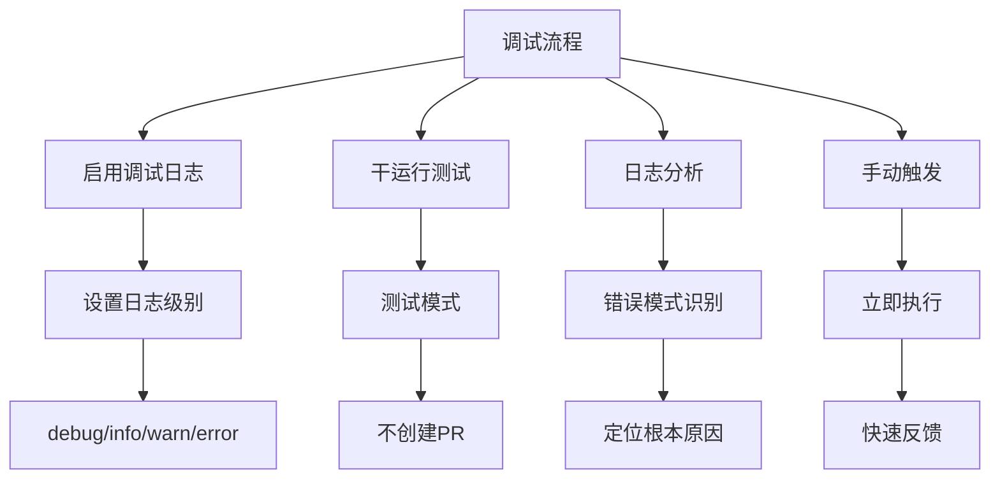

## 结论

该 Renovate 自动依赖管理系统通过以下关键特性实现了高效的依赖管理：

### 核心优势

1. **智能化的依赖管理**：通过预设配置和自定义规则，实现精准的依赖更新策略
2. **全面的安全保障**：集成 OSV 和 GitHub Advisory，确保及时发现和修复安全漏洞
3. **完善的 Monorepo 支持**：针对多包工作区的特殊需求，提供专门的配置和管理策略
4. **灵活的执行控制**：通过并发限制和调度机制，平衡效率和稳定性

### 最佳实践建议

1. **定期审查配置**：根据项目发展调整依赖管理策略
2. **监控执行效果**：关注PR创建频率和合并成功率
3. **维护团队沟通**：确保团队了解依赖更新流程和责任分工
4. **备份和回滚**：建立完善的版本回滚机制

该系统为大型前端项目的依赖管理提供了完整的解决方案，通过自动化和智能化的手段，显著提升了开发效率和代码质量。