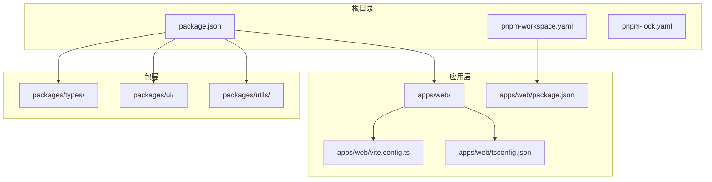
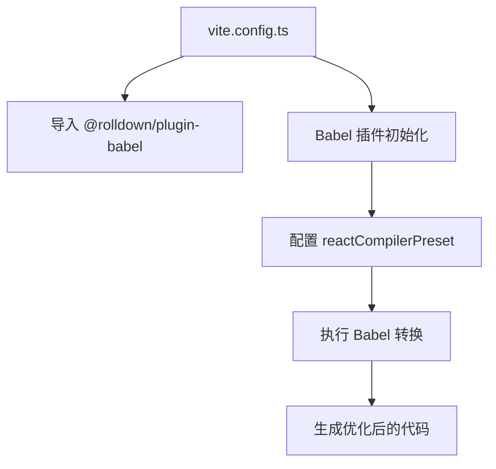
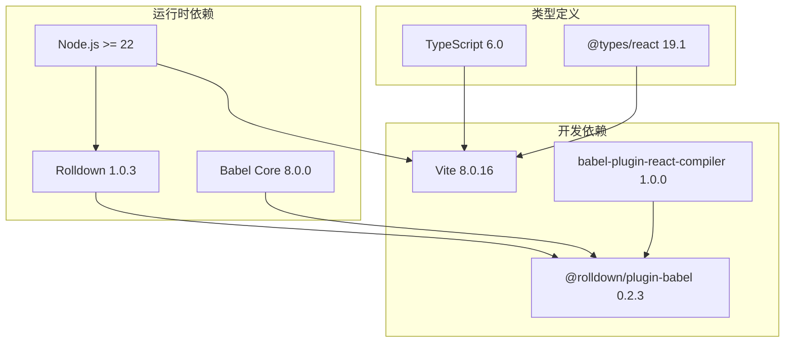
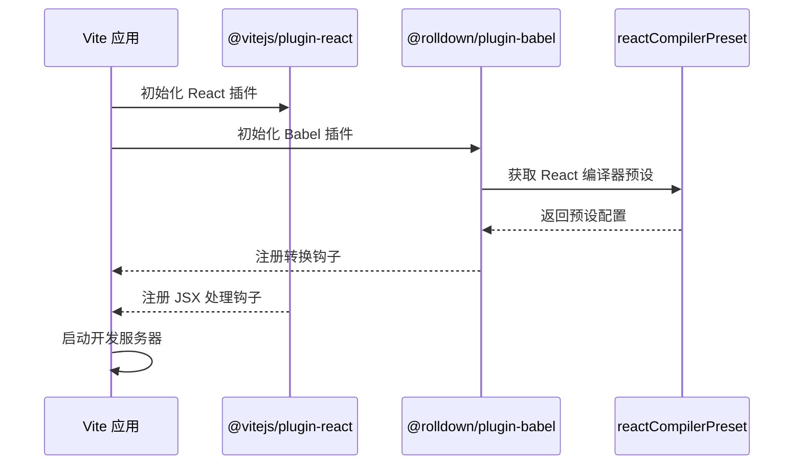
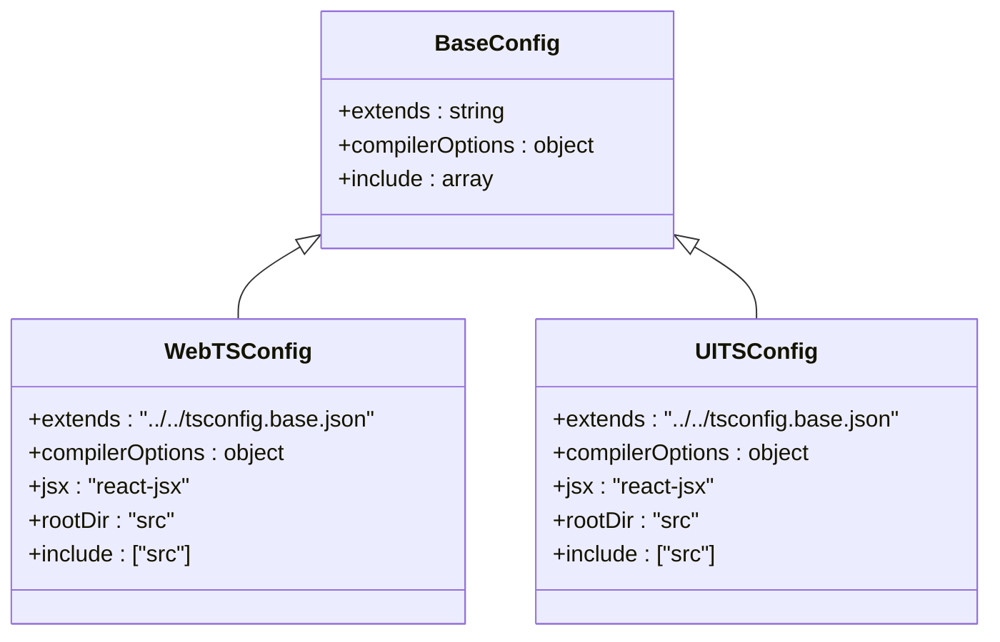
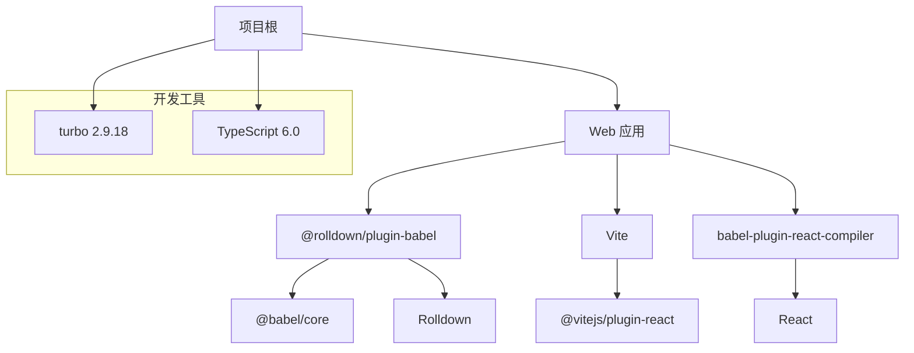

# Rolldown Babel 插件

## 目录

1. [简介](#简介)
2. [项目结构](#项目结构)
3. [核心组件](#核心组件)
4. [架构概览](#架构概览)
5. [详细组件分析](#详细组件分析)
6. [依赖关系分析](#依赖关系分析)
7. [性能考虑](#性能考虑)
8. [故障排除指南](#故障排除指南)
9. [结论](#结论)

## 简介

Rolldown Babel 插件是一个基于 Vite 的构建工具插件，专门用于在构建过程中集成 Babel 转换功能。该插件通过与 @rolldown/core 结合使用，为现代前端应用提供高效的 JavaScript/TypeScript 转换和优化能力。

在本项目中，Rolldown Babel 插件被配置为与 React Compiler 预设配合使用，以实现 React 组件的编译优化和代码转换。

## 项目结构

该项目采用 Monorepo 架构，主要包含以下结构：

## 核心组件

### 插件配置分析

项目中的 Rolldown Babel 插件配置具有以下特点：

### 版本管理策略

项目使用 pnpm catalog 机制进行版本管理：

| 包名                        | 版本范围 | 用途               |
| --------------------------- | -------- | ------------------ |
| @rolldown/plugin-babel      | ^0.2     | Babel 插件核心功能 |
| @vitejs/plugin-react        | ^6.0     | React 开发支持     |
| babel-plugin-react-compiler | ^1.0     | React 编译器插件   |
| vite                        | ^8.0     | 构建工具           |

## 架构概览

### 整体架构设计

### 依赖关系图

## 详细组件分析

### Vite 配置组件

#### 插件初始化流程

#### 预设配置分析

插件使用 `reactCompilerPreset()` 作为核心配置，这表明项目专注于 React 应用的编译优化。该预设提供了：

- React 组件的静态分析和优化
- JSX 语法转换
- React Hooks 的优化处理
- 组件级别的代码分割建议

### 类型系统配置

#### TypeScript 配置结构

## 依赖关系分析

### 版本兼容性矩阵

| 依赖项                      | 最小版本      | 推荐版本 | 兼容性状态  |
| --------------------------- | ------------- | -------- | ----------- |
| Node.js                     | >=22          | 22+      | ✅ 完全兼容 |
| @rolldown/plugin-babel      | ^0.2          | 0.2.3    | ✅ 正式版本 |
| @babel/core                 | ^7.29 或 ^8.0 | 8.0.0    | ✅ 兼容     |
| vite                        | ^8.0          | 8.0.16   | ✅ 兼容     |
| babel-plugin-react-compiler | ^1.0          | 1.0.0    | ✅ 兼容     |

### 依赖树分析

## 性能考虑

### 构建性能优化

1. **并行处理**: 利用 Vite 和 Rolldown 的并行特性，提高构建速度
2. **增量编译**: 通过插件钩子实现增量编译，减少重复工作
3. **缓存策略**: 利用 Babel 的缓存机制，避免重复转换相同代码
4. **Tree Shaking**: 通过 React Compiler 优化组件导出，实现更好的摇树优化

### 内存使用优化

- 合理配置 Babel 预设，避免不必要的转换步骤
- 使用适当的 Node.js 版本，确保最佳内存管理
- 避免加载不必要的插件依赖

## 故障排除指南

### 常见问题及解决方案

#### 版本冲突问题

**症状**: 插件加载失败或构建错误
**原因**: Babel 核心版本不兼容
**解决方案**:

- 确保 @babel/core 版本在 ^7.29 或 ^8.0 范围内
- 检查 @rolldown/plugin-babel 与 @babel/core 的兼容性

#### React Compiler 集成问题

**症状**: React 组件编译警告或错误
**原因**: 预设配置不正确
**解决方案**:

- 确认使用 `reactCompilerPreset()` 函数
- 检查 React 版本兼容性

#### 性能问题

**症状**: 构建时间过长
**原因**: 过多的转换步骤或缓存未生效
**解决方案**:

- 优化插件配置，移除不必要的转换
- 检查 Babel 缓存配置
- 考虑使用更精确的文件匹配模式

## 结论

Rolldown Babel 插件在本项目中扮演着关键角色，通过与 Vite 和 React Compiler 的深度集成，为现代 React 应用提供了高效的构建和优化能力。项目的模块化架构和严格的版本管理确保了插件的稳定性和可维护性。

关键优势包括：

- 与 Vite 生态系统的无缝集成
- 基于 React Compiler 的智能优化
- 清晰的版本管理和依赖控制
- 可扩展的插件架构设计

未来可以考虑的方向：

- 进一步优化构建性能
- 扩展对其他框架的支持
- 增强开发体验和调试功能
