# 开发工具集成

## 目录

1. [简介](#简介)
2. [项目结构](#项目结构)
3. [核心组件](#核心组件)
4. [架构概览](#架构概览)
5. [详细组件分析](#详细组件分析)
6. [Nitro 服务器应用配置](#nitro-服务器应用配置)
7. [Pino 日志系统集成](#pino-日志系统集成)
8. [工具缓存管理](#工具缓存管理)
9. [依赖关系分析](#依赖关系分析)
10. [性能考虑](#性能考虑)
11. [故障排除指南](#故障排除指南)
12. [结论](#结论)

## 简介

本指南专注于开发工具集成，重点介绍 Oxlint 代码检查工具、Commitlint 提交信息验证、Lefthook Git 钩子、Changesets 版本管理以及新增的 Nitro 服务器应用配置和 Pino 日志系统的集成。该仓库采用 pnpm 工作区和 Turborepo 构建系统，通过 Lefthook 实现 Git 钩子自动化，确保代码质量、格式化和类型检查的一致性执行。新增的 Nitro 服务器应用提供了现代化的 Node.js 服务器框架，配合 Pino 日志系统实现结构化日志记录，进一步完善了开发工具链的完整性和实用性。

## 项目结构

该项目采用现代化的前端开发工作区结构，包含以下关键组件：

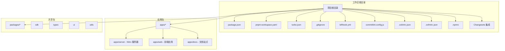

## 核心组件

### Oxlint 代码检查工具

Oxlint 是一个高性能的 JavaScript/TypeScript 代码检查工具，具有以下特性：

- **缓存机制**：通过 `.oxlintcache` 实现增量检查
- **多语言支持**：支持 TypeScript、TSX 等现代 JavaScript 语法
- **高性能**：相比 ESLint 具有显著的性能优势
- **可配置性**：支持自定义规则集和配置文件
- **格式化集成**：与 Oxlint 格式化工具协同工作

### Commitlint 提交信息验证

Commitlint 提供了标准化的提交信息验证功能：

- **约定式提交**：基于 Conventional Commits 规范
- **自动化验证**：在提交时自动检查提交信息格式
- **规则定制**：支持自定义提交信息验证规则
- **CI/CD 集成**：可在持续集成环境中强制执行

### Lefthook Git 钩子系统

Lefthook 提供了完整的 Git 钩子自动化解决方案：

- **预提交钩子**：在提交前自动执行代码检查
- **提交信息钩子**：验证提交信息格式
- **并行执行**：支持多个任务并行运行以提高效率
- **文件过滤**：基于 glob 模式精确选择需要处理的文件
- **影响范围检测**：仅对受影响的包执行相关任务

### Changesets 版本管理

Changesets 是一个强大的版本管理和发布自动化工具：

- **变更集管理**：通过变更集文件记录每次代码变更
- **版本协调**：自动管理多包项目的版本同步
- **发布自动化**：集成发布流程，支持一次性发布多个包
- **语义化版本**：基于变更集内容自动确定版本号
- **发布计划**：生成完整的发布计划和变更日志

### Nitro 服务器应用框架

Nitro 是一个现代化的 Node.js 服务器框架，专为现代 Web 应用设计：

- **零配置部署**：内置开发服务器和生产就绪的构建系统
- **API 路由**：基于文件系统的 API 路由自动发现
- **中间件系统**：灵活的请求/响应中间件管道
- **插件架构**：可扩展的插件系统支持功能增强
- **运行时配置**：动态环境变量和配置管理
- **错误处理**：统一的错误处理和响应格式化

### Pino 日志系统

Pino 是一个超快速的 Node.js 日志记录器，专为生产环境优化：

- **高性能**：比传统日志记录器快 10-100 倍
- **结构化日志**：JSON 格式的日志输出便于机器解析
- **可读性**：开发环境支持彩色美化输出
- **可扩展性**：支持多种传输方式和自定义格式
- **性能监控**：内置性能指标收集和请求跟踪

### Turborepo 构建系统

作为工作区的核心构建工具：

- **任务编排**：统一管理 build、lint、format、typecheck 任务
- **缓存优化**：智能缓存机制提升重复构建速度
- **依赖追踪**：自动追踪包间依赖关系
- **增量构建**：仅重新构建受影响的包

## 架构概览

整个开发工具链采用分层架构设计，确保各组件之间的松耦合和高内聚：

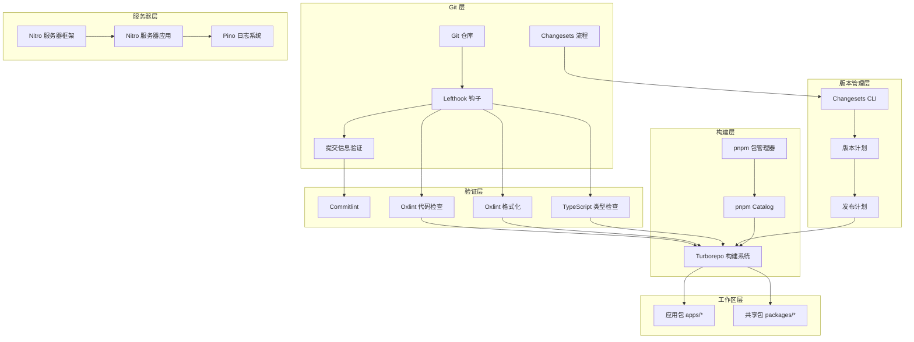

## 详细组件分析

### Commitlint 配置与使用

#### 约定式提交规范

Commitlint 基于 Conventional Commits 规范，提供了标准化的提交信息格式：

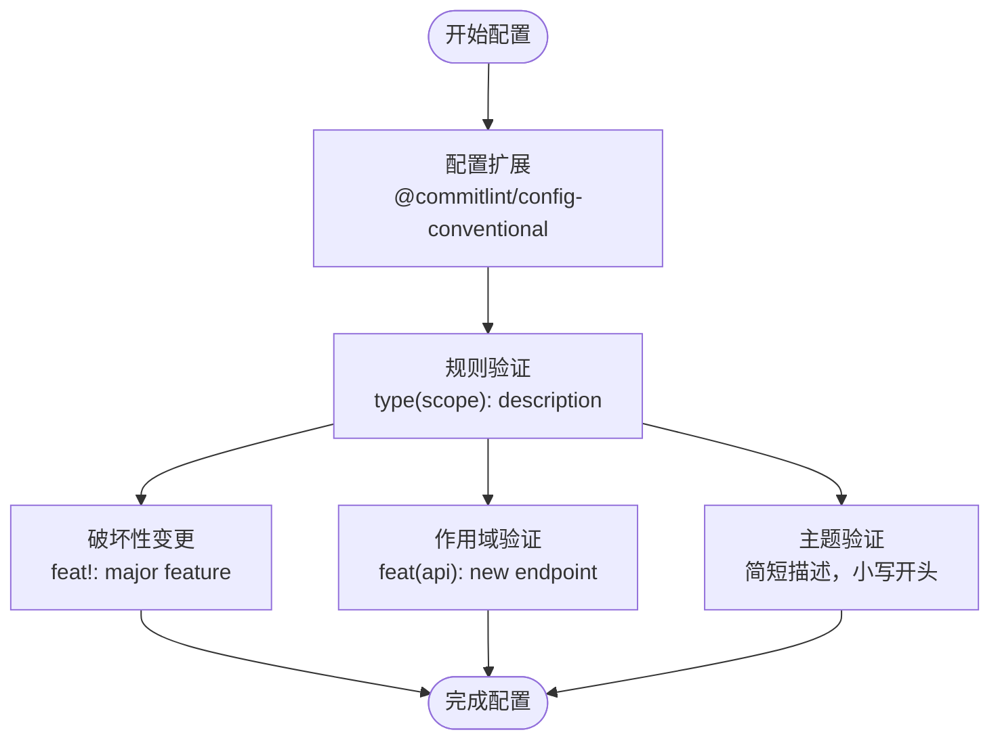

#### 提交信息验证流程

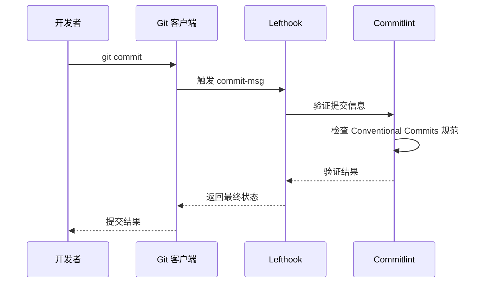

### Oxlint 配置与使用

#### 规则集选择策略

Oxlint 提供了多种预定义规则集，适用于不同的开发场景：

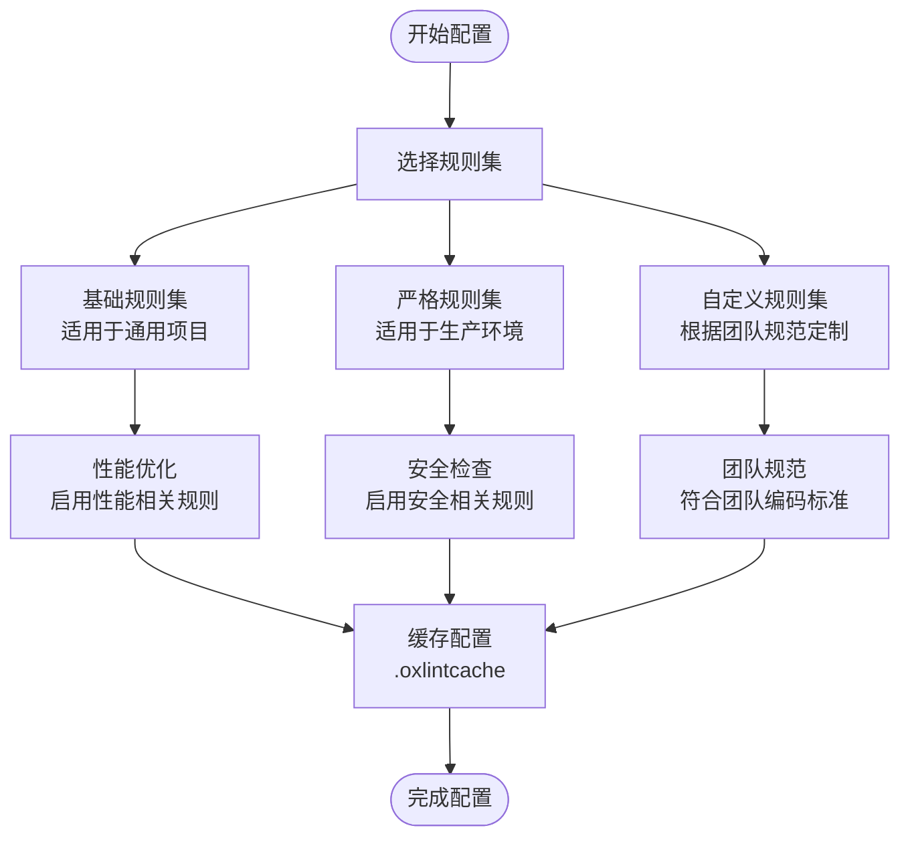

#### 自定义规则添加

Oxlint 支持灵活的配置方式：

1. **全局配置**：在项目根目录创建 `.oxlintrc.json` 配置文件
2. **规则定制**：支持 warn、error 等不同级别的规则
3. **文件过滤**：通过 ignorePatterns 排除不需要检查的文件

#### Oxlint 格式化配置

新增的格式化配置文件提供了统一的代码风格：

- **缩进设置**：使用空格而非制表符
- **引号策略**：双引号而非单引号
- **逗号风格**：尾随逗号
- **行长限制**：80 字符宽度

### Lefthook Git 钩子配置

#### 完整工作流程

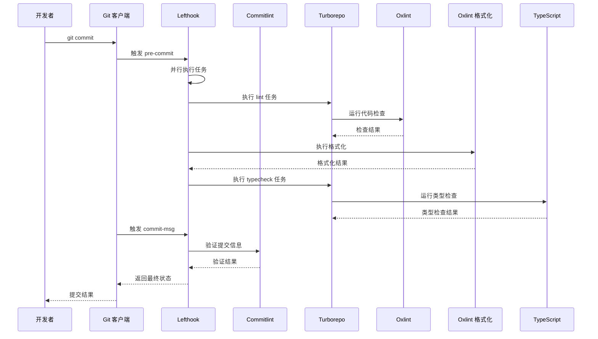

#### 钩子配置详解

| 钩子类型   | 并行执行 | 文件过滤            | 命令执行                     | 功能说明                  |
| ---------- | -------- | ------------------- | ---------------------------- | ------------------------- |
| pre-commit | ✅       | TypeScript/TSX 文件 | 执行 lint、format、typecheck | 多任务并行执行            |
| commit-msg | ❌       | 提交信息            | 验证提交格式                 | 单独执行提交信息验证      |
| commitlint | ❌       | 提交信息            | @commitlint/cli              | Conventional Commits 规范 |

### 版本控制忽略规则配置

#### 配置原则

版本控制忽略规则遵循以下原则：

1. **最小化原则**：只忽略必要的文件和目录
2. **一致性原则**：确保团队成员使用相同的忽略规则
3. **可维护性原则**：保持忽略规则的简洁和清晰

#### Changesets 相关忽略规则

新增的 Changesets 集成带来了特定的忽略规则：

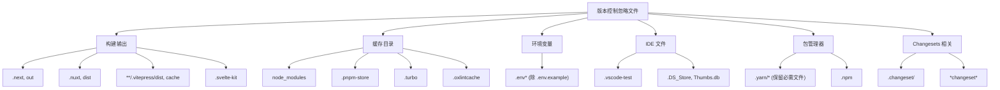

## Nitro 服务器应用配置

### Nitro 框架概述

Nitro 是一个现代化的 Node.js 服务器框架，专为现代 Web 应用设计。它提供了零配置的开发体验和生产就绪的构建系统，支持 API 路由、中间件系统、插件架构和运行时配置管理。

### 核心配置文件

#### Nitro 配置文件

Nitro 的核心配置文件 `nitro.config.ts` 定义了服务器的行为和路由规则：

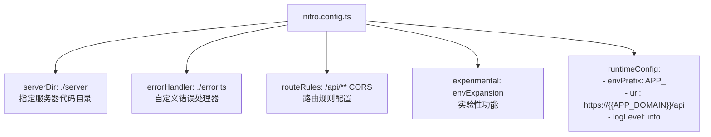

#### 服务器入口文件

服务器入口文件 `server.ts` 定义了主要的处理逻辑：

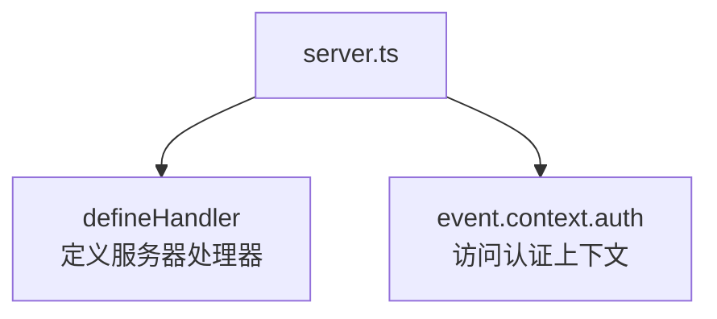

### API 路由系统

#### 健康检查 API

健康检查 API 提供了基本的服务状态验证：

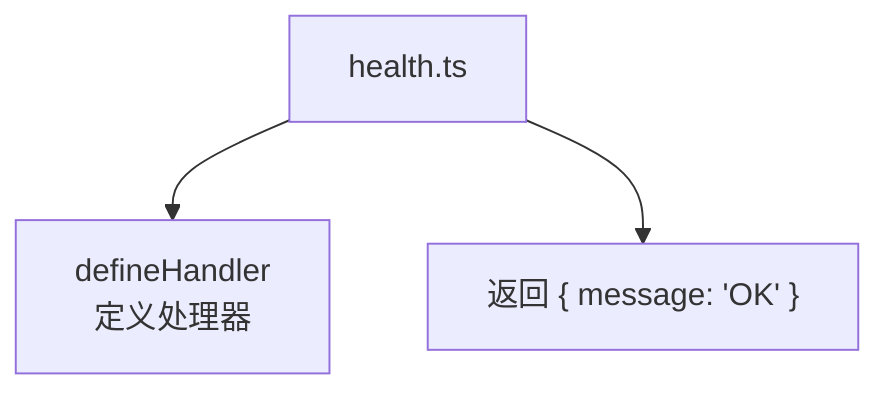

#### 错误示例 API

错误示例 API 展示了错误处理机制：

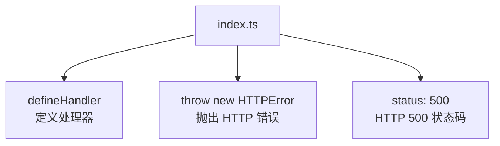

### 中间件系统

#### 认证中间件

认证中间件为每个请求添加认证上下文：

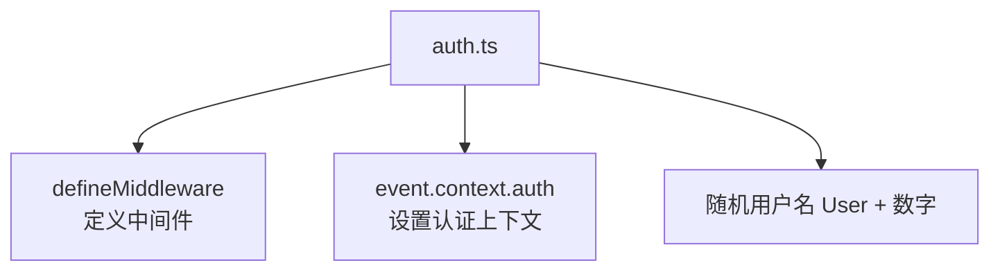

### 错误处理机制

#### 自定义错误处理器

自定义错误处理器提供了统一的错误响应格式：

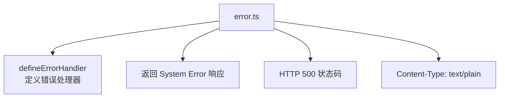

### 服务器配置详解

#### 路由规则配置

Nitro 的路由规则配置支持灵活的路由控制：

| 路由模式  | 配置项       | 值               | 说明                 |
| --------- | ------------ | ---------------- | -------------------- |
| `/api/**` | CORS         | 启用跨域资源共享 | API 路由支持跨域请求 |
| `**`      | X-Powered-By | Nitro            | 设置服务器标识头     |
| `**`      | 自定义头     | 可扩展的头部配置 | 支持额外的响应头设置 |

#### 运行时配置

运行时配置支持动态环境变量管理：

| 配置项      | 值                           | 说明         |
| ----------- | ---------------------------- | ------------ |
| `envPrefix` | `APP_`                       | 环境变量前缀 |
| `url`       | `https://{{APP_DOMAIN}}/api` | API 基础 URL |
| `logLevel`  | `info`                       | 默认日志级别 |

## Pino 日志系统集成

### Pino 日志框架概述

Pino 是一个超快速的 Node.js 日志记录器，专为生产环境优化。它提供了 JSON 格式的日志输出，支持结构化日志记录和高性能的日志处理。

### 日志配置实现

#### 基础日志配置

日志配置文件实现了灵活的日志记录机制：

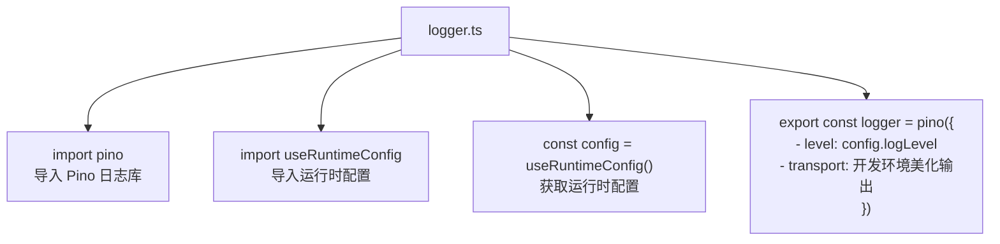

#### 开发环境美化输出

开发环境支持彩色美化输出，提升调试体验：

| 配置项             | 值              | 说明             |
| ------------------ | --------------- | ---------------- |
| `target`           | `pino-pretty`   | 使用美化传输器   |
| `options.colorize` | `true`          | 启用彩色输出     |
| `NODE_ENV`         | 非 `production` | 仅在开发环境启用 |

### 请求跟踪插件

#### 插件架构设计

请求跟踪插件实现了完整的请求生命周期监控：

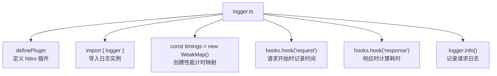

#### 性能监控实现

插件实现了精确的性能监控和日志记录：

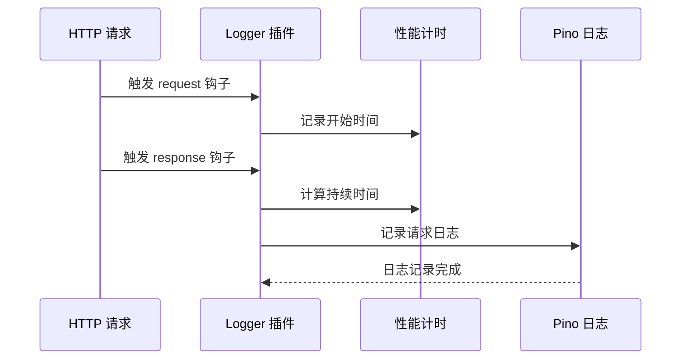

### 日志记录内容

#### 结构化日志字段

日志记录包含了丰富的结构化信息：

| 字段名     | 数据类型 | 示例值                          | 说明        |
| ---------- | -------- | ------------------------------- | ----------- |
| `method`   | String   | `"GET"`                         | HTTP 方法   |
| `path`     | String   | `"/api/health"`                 | 请求路径    |
| `status`   | Number   | `200`                           | HTTP 状态码 |
| `duration` | String   | `"15.23ms"`                     | 请求耗时    |
| `message`  | String   | `"GET /api/health 200 15.23ms"` | 日志消息    |

#### 日志级别配置

日志级别支持动态配置，基于运行时环境变量：

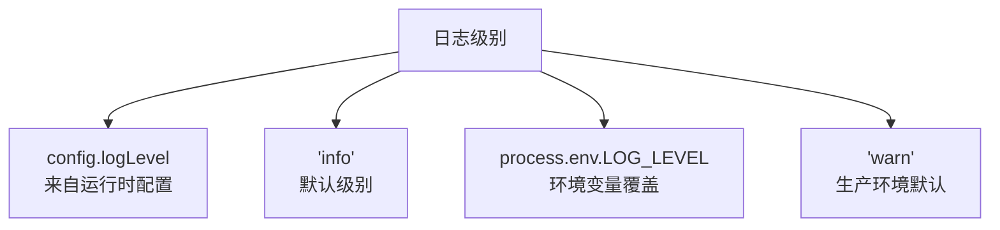

## 工具缓存管理

### 缓存策略概述

工具缓存管理是现代开发工作流的重要组成部分，通过合理的缓存策略可以显著提升开发效率和构建性能。

### Turborepo 缓存优化

#### 开发环境缓存配置

Turborepo 在开发环境中采用了特殊的缓存策略：

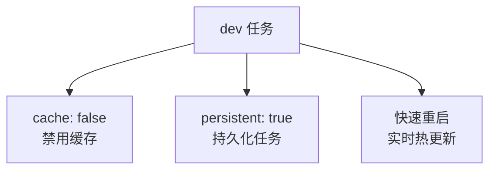

#### 构建缓存策略

构建任务采用了智能缓存机制：

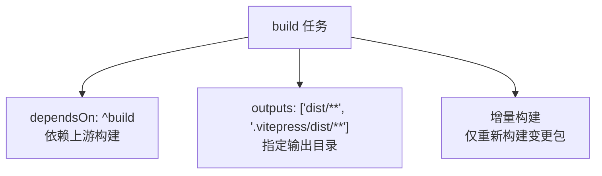

### Oxlint 缓存管理

#### 缓存文件结构

Oxlint 通过 `.oxlintcache` 实现增量检查：

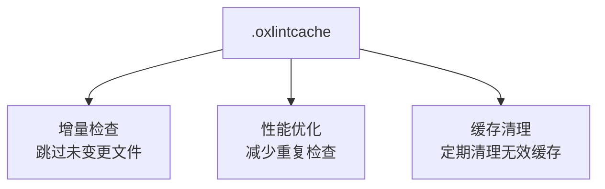

### 开发工具缓存配置

#### 服务器端开发缓存

Nitro 服务器应用的开发缓存配置：

| 配置项      | 值              | 说明                |
| ----------- | --------------- | ------------------- |
| `dev`       | `nitro dev`     | Nitro 开发服务器    |
| `build`     | `nitro build`   | Nitro 构建命令      |
| `preview`   | `nitro preview` | 预览构建结果        |
| `lint`      | `oxlint .`      | 代码检查            |
| `format`    | `oxfmt write .` | 代码格式化          |
| `typecheck` | `tsc --noEmit`  | TypeScript 类型检查 |

## 依赖关系分析

### 组件依赖图

```mermaid
graph LR
subgraph "开发依赖"
Oxlint[oxlint ^1.7]
OxFmt[oxfmt ^0.55]
CommitLint[commitlint ^21.0]
Lefthook[lefthook ^2.1]
Turbo[turbo ^2.5]
TypeScript[typescript ^6.0]
Changesets["@changesets/cli ^2.31"]
React["@types/react ^19.1"]
Vite[vite ^8.0]
Nitro[nitro ^latest]
Pino[pino ^10.3.1]
PinoPretty[pino-pretty ^13.1.3]
Zod[zod ^4.4.3]
end
subgraph "包管理器"
PNPM[pnpm 10.30.2]
Catalog[pnpm Catalog]
end
subgraph "引擎要求"
Node[Node >= 22]
end
PNPM --> Catalog
Catalog --> Oxlint
Catalog --> OxFmt
Catalog --> CommitLint
Catalog --> Lefthook
Catalog --> Turbo
Catalog --> TypeScript
Catalog --> Changesets
Catalog --> React
Catalog --> Vite
Catalog --> Nitro
Catalog --> Pino
Catalog --> PinoPretty
Catalog --> Zod
Node --> PNPM
```

### 任务依赖关系

```mermaid
graph TD
subgraph "Turborepo 任务"
Build[build]
Dev[dev]
Lint[lint]
Format[format]
TypeCheck[typecheck]
end
subgraph "任务依赖"
Build --> Dist["输出 dist/**"]
TypeCheck --> Build
Dev --> Cache["禁用缓存"]
end
Build --> Dev
```

### Changesets 依赖关系

Changesets 作为独立的版本管理工具，与现有工具链的集成关系如下：

```mermaid
graph LR
subgraph "Changesets 生态系统"
ApplyReleasePlan["@changesets/apply-release-plan"]
AssembleReleasePlan["@changesets/assemble-release-plan"]
ChangelogGit["@changesets/changelog-git"]
CLI["@changesets/cli"]
Config["@changesets/config"]
GetReleasePlan["@changesets/get-release-plan"]
Git["@changesets/git"]
Read["@changesets/read"]
Write["@changesets/write"]
end
subgraph "项目集成"
ProjectPkg["package.json 脚本"]
TurboRepo["Turborepo 构建系统"]
NPMRegistry["npm Registry"]
end
CLI --> ProjectPkg
ProjectPkg --> TurboRepo
TurboRepo --> NPMRegistry
ApplyReleasePlan --> NPMRegistry
AssembleReleasePlan --> ProjectPkg
ChangelogGit --> ProjectPkg
GetReleasePlan --> ProjectPkg
Git --> ProjectPkg
Read --> ProjectPkg
Write --> ProjectPkg
```

### Nitro 服务器依赖关系

Nitro 服务器应用的依赖关系体现了现代化的服务器架构：

```mermaid
graph TD
subgraph "Nitro 服务器应用"
NitroServer[apps/server]
NitroCore[Nitro 核心]
PinoLogger[Pino 日志]
AuthMiddleware[认证中间件]
APIRoutes[API 路由]
ErrorHandling[错误处理]
end
subgraph "外部依赖"
ModelContext[modelcontextprotocol]
Zod[Zod 类型验证]
end
NitroServer --> NitroCore
NitroServer --> PinoLogger
NitroServer --> AuthMiddleware
NitroServer --> APIRoutes
NitroServer --> ErrorHandling
NitroCore --> ModelContext
NitroCore --> Zod
```

## 性能考虑

### 缓存策略

1. **Oxlint 缓存**：利用 `.oxlintcache` 实现增量检查
2. **Turborepo 缓存**：智能缓存机制减少重复构建
3. **PNPM 存储**：高效的包存储和链接机制
4. **Lefthook 缓存**：避免重复执行相同任务
5. **Changesets 缓存**：变更集文件的增量处理
6. **Nitro 开发缓存**：禁用缓存支持快速重启
7. **Pino 日志缓存**：结构化日志的高效处理

### 并行执行优化

- **预提交钩子并行化**：同时执行多个检查任务
- **影响范围检测**：仅对变更的文件执行相关检查
- **增量构建**：避免不必要的全量重建
- **文件过滤优化**：精确匹配需要处理的文件类型
- **Changesets 并行处理**：多个包的版本检查和发布
- **Nitro 插件并行化**：多个插件的异步执行

### 开发体验优化

#### 快速启动机制

Nitro 服务器提供了快速的开发启动体验：

```mermaid
flowchart TD
FastStart[快速启动] --> HotReload["热重载<br/>实时代码更新"]
FastStart --> DevServer["开发服务器<br/>自动重启"]
FastStart --> ErrorOverlay["错误覆盖层<br/>友好的错误显示"]
FastStart --> Performance["性能监控<br/>实时性能指标"]
```

#### 日志性能优化

Pino 日志系统针对性能进行了专门优化：

```mermaid
flowchart TD
PinoPerformance[Pino 性能] --> JSONOutput["JSON 输出<br/>机器可读格式"]
PinoPerformance --> PrettyPrint["美化输出<br/>开发环境彩色"]
PinoPerformance --> AsyncLogging["异步日志<br/>非阻塞写入"]
PinoPerformance --> Transport["传输层<br/>可扩展输出方式"]
```

### pnpm Catalog 管理

- **版本统一**：通过 catalog 管理所有开发工具版本
- **依赖隔离**：保持严格的依赖隔离
- **自动安装**：peerDependencies 自动安装
- **性能优化**：减少重复下载和安装

### Changesets 性能优化

- **变更集缓存**：避免重复处理相同的变更集
- **增量版本计算**：仅重新计算受影响包的版本
- **并行发布**：多个包的发布操作并行执行
- **智能依赖追踪**：准确识别包间的依赖关系

## 故障排除指南

### 常见问题及解决方案

#### Lefthook 钩子不执行

1. **检查 Git 配置**：确认 Git 钩子已正确安装
2. **验证权限设置**：确保钩子脚本具有执行权限
3. **查看日志输出**：检查 Lefthook 的详细输出信息
4. **验证 pnpm 脚本**：确认 package.json 中的脚本定义正确

#### Commitlint 验证失败

1. **检查提交信息格式**：确认遵循 Conventional Commits 规范
2. **验证规则配置**：检查 commitlint.config.js 配置
3. **查看错误详情**：根据具体错误信息调整提交信息
4. **测试本地验证**：使用 `pnpm commitlint --edit {1}` 测试

#### Oxlint 缓存问题

1. **清理缓存**：删除 `.oxlintcache` 目录
2. **重新初始化**：重新运行 Oxlint 初始化命令
3. **检查配置**：验证 `.oxlintrc.json` 配置文件的有效性
4. **格式化缓存**：检查 `.oxfmtrc.json` 格式化配置

#### Turborepo 构建失败

1. **检查依赖关系**：确认包间依赖关系正确
2. **验证任务配置**：检查 turborepo 任务配置
3. **查看缓存状态**：清理 Turborepo 缓存后重试
4. **检查输出目录**：确认 build 任务的输出配置

#### pnpm Catalog 版本冲突

1. **锁定版本**：确保所有开发者使用相同版本
2. **清理节点模块**：删除 `node_modules` 后重新安装
3. **检查工作区配置**：验证 pnpm 工作区设置
4. **更新 Catalog**：同步 pnpm catalog 版本

#### Changesets 集成问题

1. **检查变更集文件**：确认 `.changeset/` 目录下的文件格式正确
2. **验证版本命令**：检查 `pnpm changeset version` 是否正常执行
3. **查看发布日志**：分析 `pnpm release` 命令的输出信息
4. **检查 npm 权限**：确认有权限发布到 npm registry
5. **清理临时文件**：删除可能影响发布的临时文件

#### Nitro 服务器启动失败

1. **检查配置文件**：确认 `nitro.config.ts` 配置正确
2. **验证依赖安装**：确保所有依赖正确安装
3. **检查端口占用**：确认开发端口未被占用
4. **查看错误日志**：分析服务器启动时的错误信息
5. **验证 TypeScript 配置**：检查 `tsconfig.json` 配置

#### Pino 日志记录异常

1. **检查日志级别**：确认 `logLevel` 配置正确
2. **验证运行时配置**：检查 `useRuntimeConfig()` 返回值
3. **查看传输器配置**：确认开发环境美化输出设置
4. **检查插件注册**：确认日志插件正确注册到 Nitro
5. **验证请求上下文**：确保 `event.context` 包含必要信息

#### 包管理器冲突

1. **检查 .npmrc 配置**：确认 pnpm 配置正确
2. **验证 peer dependencies**：检查对等依赖安装设置
3. **清理缓存**：删除 .pnpm-store 后重试
4. **检查引擎要求**：确认 Node.js 版本满足要求

## 结论

本指南展示了如何在多包工作区环境中有效集成 Oxlint、Commitlint、Lefthook、Changesets、Nitro 服务器应用和 Pino 日志系统。通过合理的配置和最佳实践，可以实现：

- **自动化代码质量保证**：在提交前自动执行代码检查和格式化
- **标准化提交流程**：通过 Commitlint 强制执行 Conventional Commits 规范
- **高效的开发体验**：并行执行多个任务提升开发效率
- **完整的版本管理**：Changesets 实现从代码变更到版本发布的自动化
- **现代化服务器架构**：Nitro 提供零配置的服务器开发体验
- **结构化日志记录**：Pino 实现高性能的结构化日志输出
- **智能缓存管理**：多层缓存策略优化开发和构建性能
- **一致的开发标准**：统一的规则集、格式化标准、提交规范、版本管理和日志记录

新增的 Nitro 服务器应用和 Pino 日志系统的集成，进一步完善了开发工具链的功能完整性。Nitro 提供了现代化的服务器开发框架，支持 API 路由、中间件系统和插件架构；Pino 则提供了高性能的结构化日志记录能力，支持开发环境的美化输出和生产环境的 JSON 格式输出。

Changesets 的引入与这些新组件的集成，形成了从代码变更到服务器部署的完整自动化流程。通过 `pnpm changeset`、`pnpm changeset version` 和 `pnpm release` 三个核心命令，配合 Nitro 的开发服务器和 Pino 的日志记录，团队可以实现真正端到端的开发和发布自动化。

建议团队根据具体需求调整配置，并定期审查和优化工具链以适应项目发展。同时，鼓励团队成员熟悉这些工具的使用方法，共同维护高质量的开发流程。新增的服务器组件特别适合需要快速搭建 API 服务和需要结构化日志记录的项目，能够显著提升开发效率和运维体验。
