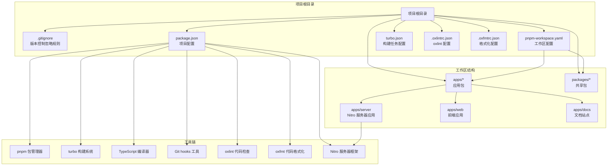
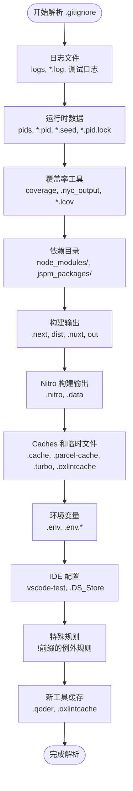
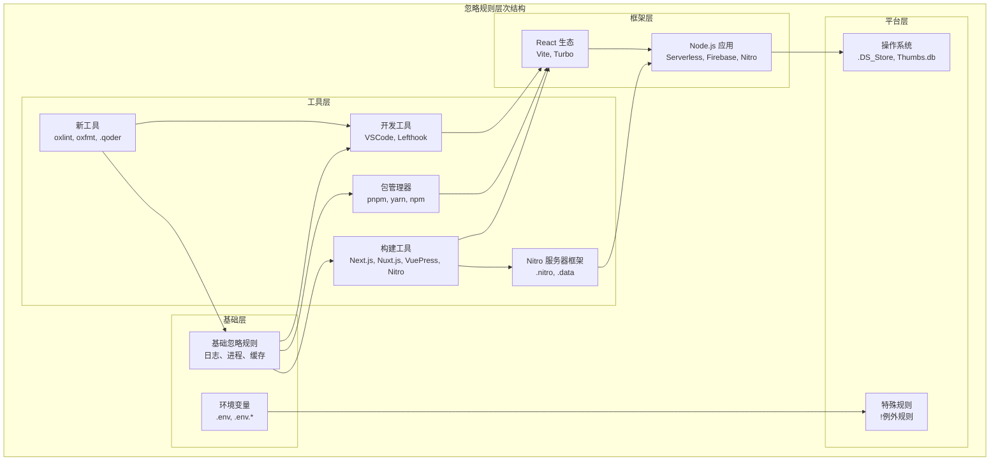
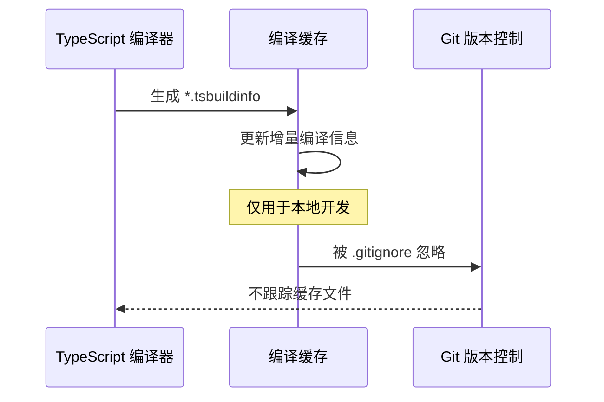
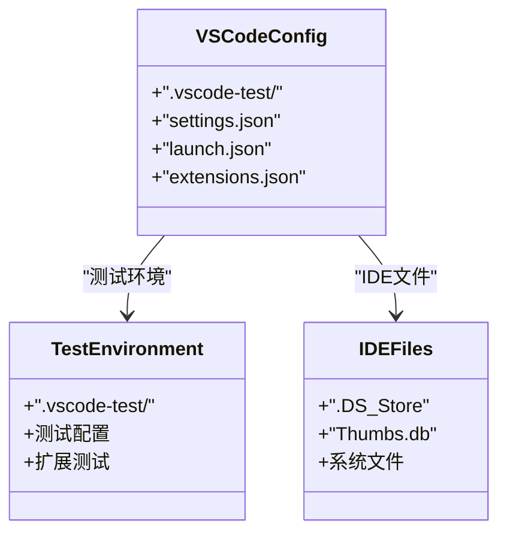
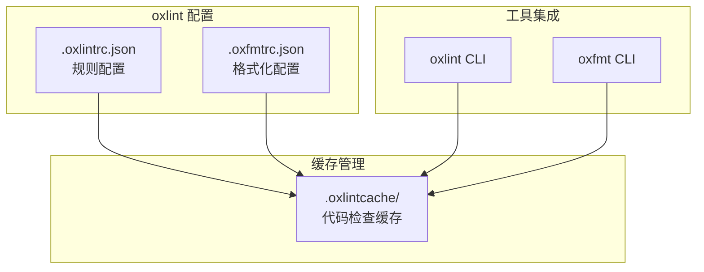
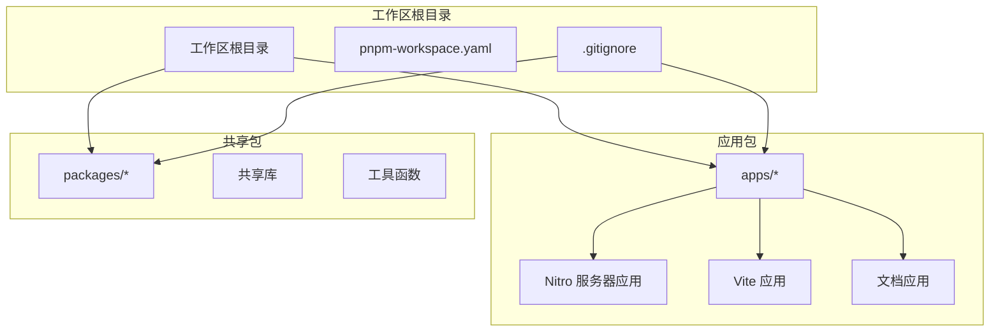
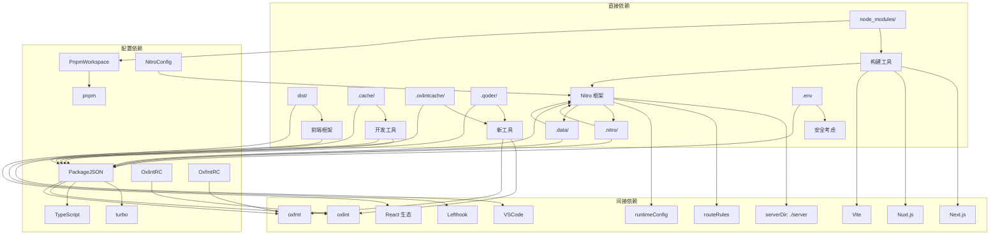
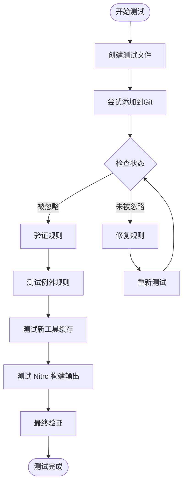

# 版本控制忽略规则

## 目录
1. [简介](#简介)
2. [项目结构](#项目结构)
3. [核心组件](#核心组件)
4. [架构概览](#架构概览)
5. [详细组件分析](#详细组件分析)
6. [依赖关系分析](#依赖关系分析)
7. [性能考虑](#性能考虑)
8. [故障排除指南](#故障排除指南)
9. [结论](#结论)

## 简介

版本控制忽略规则（.gitignore）是Git版本控制系统中的重要配置文件，用于指定哪些文件和目录应该被Git忽略，不纳入版本控制范围。合理的忽略规则能够帮助开发者：

- 保持仓库整洁，避免不必要的文件进入版本控制
- 提高Git操作的性能和效率
- 避免敏感信息泄露到公共仓库中
- 减少仓库大小，提升同步速度
- 防止临时文件和缓存文件污染版本历史

本指南将基于实际的代码库分析，详细介绍.gitignore文件的作用、配置原则、最佳实践以及特殊场景的处理方法。特别关注新增的Nitro服务器应用构建输出忽略规则和其他新工具产生的缓存文件的处理。

## 项目结构

基于对代码库的分析，这是一个使用现代前端技术栈的多包管理项目，具有以下特点：



## 核心组件

### .gitignore 文件结构分析

该.gitignore文件采用了分组管理的方式，将不同类型的文件按照功能进行分类：



### 关键忽略规则类别

#### 1. 日志和诊断文件
- 日志目录：`logs/`
- 日志文件模式：`*.log`
- 包管理器调试日志：`npm-debug.log*`, `yarn-debug.log*`, `yarn-error.log*`, `lerna-debug.log*`
- Node.js诊断报告：`report.[0-9]*.[0-9]*.[0-9]*.[0-9]*.json`

#### 2. 运行时数据
- 进程ID文件：`pids/`, `*.pid`
- 随机种子文件：`*.seed`
- PID锁文件：`*.pid.lock`

#### 3. 测试覆盖率
- 覆盖率目录：`coverage/`
- Istanbul覆盖率文件：`*.lcov`
- NYC覆盖率输出：`.nyc_output/`

#### 4. 构建工具缓存
- Grunt中间存储：`.grunt/`
- Bower依赖：`bower_components/`
- TypeScript编译缓存：`*.tsbuildinfo`
- Parcel缓存：`.cache/`, `.parcel-cache/`
- Vite缓存：`.vite/`
- Turbo缓存：`.turbo/`
- **新增**：oxlint缓存：`.oxlintcache/`

#### 5. 依赖管理
- Node.js依赖：`node_modules/`
- JSPM包：`jspm_packages/`
- Snowpack模块：`web_modules/`
- Yarn v3特定文件：`.pnp.*`, `.yarn/*`
- pnpm存储：`.pnpm-store`

#### 6. 框架构建输出
- Next.js：`.next/`, `out/`
- Nuxt.js：`.nuxt/`, `dist/`, `.output/`
- VuePress：`.vuepress/dist`, `.temp/`
- SvelteKit：`.svelte-kit/`
- VitePress：`**/.vitepress/dist`, `**/.vitepress/cache`
- Docusaurus：`.docusaurus/`

#### 7. **新增** 服务器端框架
- **Nitro**：`.nitro/`, `.data/`
- Serverless：`.serverless/`
- DynamoDB本地：`.dynamodb/`
- Firebase：`.firebase/`

#### 8. 开发工具
- FuseBox缓存：`.fusebox/`
- VSCode测试：`.vscode-test/`
- TernJS端口：`.tern-port`
- Lefthook钩子：`.lefthook/`
- **新增**：Qoder工具：`.qoder/`

#### 9. 环境变量
- 环境文件：`.env`, `.env.*`
- 例外规则：`!.env.example`（允许示例文件提交）

#### 10. 操作系统文件
- macOS：`.DS_Store`
- Windows：`Thumbs.db`

## 架构概览

### 忽略规则配置架构



### 规则匹配机制

Git在解析.gitignore文件时遵循以下规则：

1. **精确匹配优先**：具体路径比通配符更精确
2. **最后匹配获胜**：后定义的规则覆盖先前的规则
3. **目录分隔符处理**：`dir/`匹配目录，`dir`匹配文件或目录
4. **例外规则**：以`!`开头的规则可以覆盖之前的忽略规则

## 详细组件分析

### Node.js 项目忽略规则

#### 包管理器相关
```mermaid
flowchart LR
subgraph "包管理器缓存"
NPM[npm 缓存<br/>.npm/>
PNPM[pnpm 存储<br/>.pnpm-store/>
Yarn[yarn v3<br/>.pnp.*, .yarn/*]
end
subgraph "依赖目录"
NodeModules[node_modules/<br/>生产依赖]
JSPMPackages[jspm_packages/<br/>JSPM 依赖]
WebModules[web_modules/<br/>Snowpack 模块]
end
subgraph "包完整性"
YarnIntegrity[.yarn-integrity<br/>Yarn 完整性文件]
end
NPM --> NodeModules
PNPM --> NodeModules
Yarn --> NodeModules
YarnIntegrity --> Yarn
```

#### 构建产物处理
- **Next.js**: `.next/`（构建输出），`out/`（静态导出）
- **Nuxt.js**: `.nuxt/`（开发缓存），`dist/`（构建输出），`.output/`（静态生成）
- **Nitro**: `.nitro/`（服务器构建输出），`.data/`（数据缓存）
- **通用构建**: `dist/`（标准构建输出目录）

### TypeScript 项目配置

#### 编译缓存管理


#### 类型检查配置
- TypeScript编译信息：`*.tsbuildinfo`
- 类型定义文件：通常由包管理器管理，不在版本控制中

### 开发工具集成

#### VSCode 配置


#### Lefthook 集成
- Git hooks工具：`.lefthook/`
- 自动化代码质量检查

### 新工具集成

#### oxlint 代码检查工具
**新增** 项目集成了oxlint作为代码检查工具，需要忽略其缓存目录：



#### Qoder 工具支持
**新增** 项目使用Qoder作为代码质量工具，需要忽略其缓存目录：

- Qoder缓存：`.qoder/`（代码质量检查缓存目录）

### Nitro 服务器框架集成

**新增** 项目集成了Nitro作为服务器端框架，需要特别处理其构建输出：

```mermaid
flowchart TD
subgraph "Nitro 配置"
NitroConfig[nitro.config.ts<br/>服务器配置]
ServerDir[serverDir: ./server<br/>服务器源码目录]
RouteRules[routeRules<br/>路由规则]
RuntimeConfig[runtimeConfig<br/>运行时配置]
end
subgraph "构建输出"
NitroBuild[.nitro/<br/>服务器构建输出]
DataCache[.data/<br/>数据缓存目录]
end
subgraph "服务器应用"
API[API 路由<br/>/api/**
Middleware[中间件<br/>auth.ts]
Plugins[插件<br/>logger.ts]
Utils[工具函数<br/>logger.ts]
end
NitroConfig --> NitroBuild
NitroConfig --> DataCache
NitroConfig --> API
API --> Middleware
API --> Plugins
API --> Utils
```

#### Nitro 构建输出管理

Nitro框架的构建输出包括两个关键目录：

- **.nitro/**：服务器构建输出目录，包含编译后的服务器代码和资源
- **.data/**：数据缓存目录，包含运行时生成的数据文件

这些目录应该被完全忽略，因为它们：
- 包含编译产物，应由构建过程重新生成
- 可能包含平台特定的二进制文件
- 会随开发环境变化而改变
- 不应该被版本控制

### 多包管理策略

#### pnpm 工作区配置


#### Turbo 构建系统
- 任务依赖：`build`依赖上游包的`build`任务
- 输出缓存：`dist/**`目录作为构建输出
- 开发模式：`dev`任务持久化运行

## 依赖关系分析

### 忽略规则依赖图



### 规则冲突解决

当多个规则产生冲突时，Git遵循以下解决顺序：

1. **明确的排除规则优先于通配符规则**
2. **后定义的规则覆盖先前的规则**
3. **目录规则优先于文件规则**

## 性能考虑

### 忽略规则优化

合理的忽略规则配置对Git性能有显著影响：

#### 1. 规则匹配优化
- 使用具体的路径而非通配符
- 将常用的规则放在前面
- 避免过度复杂的正则表达式

#### 2. 目录结构优化
- 将大型目录放在单独的忽略规则中
- 使用相对路径而非绝对路径
- 合理组织规则分组

#### 3. 缓存策略
- 利用Git的内置缓存机制
- 避免频繁修改忽略规则
- 定期清理无效规则

#### 4. 新工具缓存管理
**新增** 随着新工具的引入，需要特别注意缓存目录的管理：
- oxlint缓存：`.oxlintcache/`（代码检查缓存）
- Qoder缓存：`.qoder/`（代码质量检查缓存）
- **新增** Nitro缓存：`.nitro/`, `.data/`（服务器构建输出）
- 定期清理这些缓存目录以保持仓库整洁

#### 5. 服务器应用构建输出优化
**新增** Nitro服务器应用的构建输出管理：
- `.nitro/`目录包含编译后的服务器代码，应完全忽略
- `.data/`目录包含运行时数据缓存，应完全忽略
- 这些目录通常很大，忽略它们可以显著减少仓库大小

## 故障排除指南

### 常见问题及解决方案

#### 1. 文件仍然被跟踪
**问题**：添加了忽略规则但文件仍显示为已跟踪
**解决方案**：
- 使用`git rm -r --cached <文件>`移除已跟踪的文件
- 确认规则语法正确
- 检查是否有更具体的规则覆盖了通配符规则

#### 2. 忽略规则不生效
**问题**：规则看起来正确但不起作用
**解决方案**：
- 检查规则是否位于正确的目录下
- 确认没有以`!`开头的例外规则
- 验证Git版本支持的规则语法

#### 3. 环境变量文件处理
**问题**：`.env`文件被忽略但需要示例文件
**解决方案**：
- 使用例外规则`!.env.example`
- 确保敏感信息不会被提交到仓库

#### 4. 多包项目的特殊处理
**问题**：工作区中的包需要特殊的忽略规则
**解决方案**：
- 在每个包的根目录创建独立的.gitignore
- 使用相对路径规则
- 考虑包之间的依赖关系

#### 5. 新工具缓存问题
**问题**：新增的缓存目录（如 .oxlintcache, .qoder, .nitro, .data）仍然被跟踪
**解决方案**：
- 确认.gitignore中已包含相应的忽略规则
- 使用`git rm -r --cached <缓存目录>`移除已跟踪的缓存文件
- 验证缓存目录的路径和权限设置

#### 6. Nitro 构建输出问题
**问题**：Nitro服务器应用的构建输出仍然被跟踪
**解决方案**：
- 确认.gitignore中已包含`.nitro/`和`.data/`规则
- 使用`git rm -r --cached .nitro .data`移除已跟踪的构建输出
- 验证Nitro配置文件中的serverDir设置
- 确保构建输出目录与配置一致

### 测试忽略规则的方法

#### 1. 手动验证
```bash
# 检查文件状态
git status --untracked-files=no

# 查看被忽略的文件
git ls-files --others --ignored --exclude-standard

# 验证 Nitro 构建输出忽略
git ls-files --others --ignored --exclude-standard | grep -E '\.(nitro|data)/'
```

#### 2. 规则测试流程


#### 3. 自动化测试
- 创建专门的测试脚本
- 定期运行规则验证
- 集成到CI/CD流程中

## 结论

通过深入分析这个现代化的前端项目，我们可以看到.gitignore文件在维护代码库整洁性和安全性方面发挥着至关重要的作用。该配置文件体现了以下最佳实践：

### 核心原则总结

1. **分层管理**：按照功能和用途对忽略规则进行分组管理
2. **工具兼容性**：充分考虑项目使用的各种开发工具和框架，包括新增的oxlint、oxfmt、Qoder和Nitro工具
3. **安全优先**：合理处理环境变量和敏感信息
4. **性能优化**：平衡忽略规则的复杂度和执行效率
5. **可维护性**：保持规则的清晰性和可读性

### 实践建议

- **定期审查**：随着项目发展定期审查和更新忽略规则，特别是新增工具产生的缓存目录
- **团队协作**：确保团队成员了解并遵循统一的忽略规则
- **文档记录**：为重要的例外规则提供文档说明
- **自动化**：将忽略规则验证集成到开发流程中
- **工具更新**：随着新工具的引入及时更新忽略规则配置

### 新工具集成总结

**新增特性**：
- **oxlint缓存管理**：通过`.oxlintcache`目录管理代码检查缓存
- **Qoder工具支持**：通过`.qoder`目录支持代码质量检查工具
- **格式化工具集成**：配合oxlint使用oxfmt进行代码格式化
- **Nitro服务器框架集成**：通过`.nitro`和`.data`目录管理服务器构建输出

**新增服务器应用构建输出管理**：
- **Nitro构建输出**：`.nitro/`目录包含编译后的服务器代码
- **Nitro数据缓存**：`.data/`目录包含运行时生成的数据文件
- **自动清理机制**：这些目录应完全忽略，由构建过程重新生成

这个.gitignore配置为类似的技术栈项目提供了很好的参考模板，可以根据具体需求进行调整和扩展。新增的工具缓存规则和Nitro服务器应用构建输出规则确保了项目的整洁性和性能优化，同时保持了与现有工具链的良好兼容性。