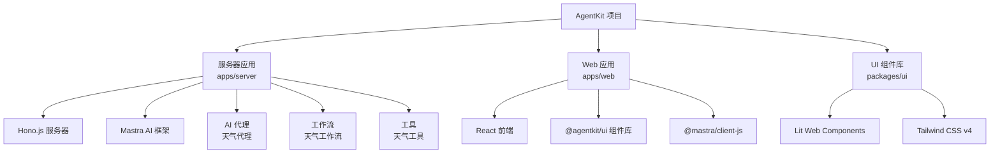
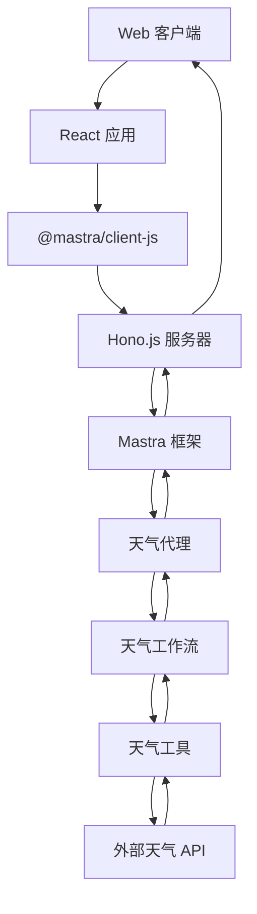
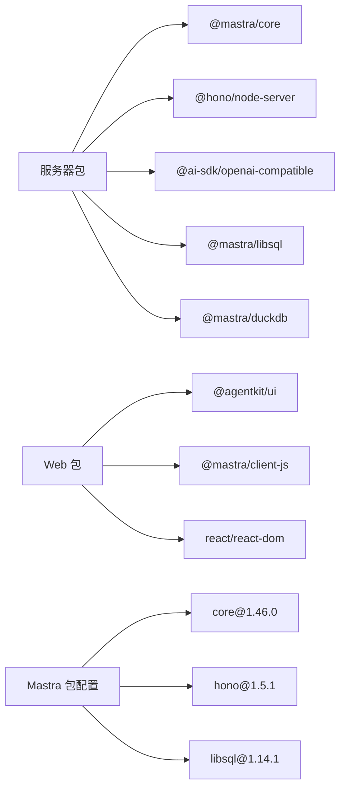

# 快速开始

## 目录
1. [简介](#简介)
2. [项目结构](#项目结构)
3. [核心组件](#核心组件)
4. [架构总览](#架构总览)
5. [详细组件分析](#详细组件分析)
6. [依赖分析](#依赖分析)
7. [性能考虑](#性能考虑)
8. [故障排除指南](#故障排除指南)
9. [结论](#结论)
10. [附录](#附录)

## 简介
本指南面向首次接触 AgentKit 的开发者，帮助你在本地快速搭建基于 AI 代理的完整开发环境，完成安装与初始配置，并掌握常用命令及预期结果。AgentKit 采用全新的 AI 代理架构，集成了 Mastra 框架、Hono.js 服务器和现代化的前端组件库，提供从天气查询到活动规划的智能代理服务。

## 项目结构
仓库采用 monorepo 结构，包含 AI 代理服务器、Web 前端应用和 UI 组件库三个主要部分。每个应用都有独立的包管理和构建配置：

- **服务器应用** (`apps/server`): 基于 Hono.js 的 AI 代理服务器，集成 Mastra 框架
- **Web 应用** (`apps/web`): React 前端应用，使用 AgentKit UI 组件库
- **UI 组件库** (`packages/ui`): 基于 Lit + Tailwind CSS 的 Web Components 组件库

## 核心组件
- **AI 代理服务器**
  - 使用 Hono.js 作为轻量级 Web 服务器框架
  - 集成 Mastra AI 框架，提供代理、工作流和工具管理
  - 支持 OpenAI 兼容的 Agnes 网关
- **AI 代理架构**
  - 天气代理：专门处理天气查询和活动规划
  - 工作流：从天气数据获取到活动建议的完整流程
  - 工具：封装外部天气 API 调用
- **前端集成**
  - React 应用使用 @mastra/client-js 进行 AI 交互
  - 集成 @agentkit/ui 组件库构建聊天界面
- **存储与可观测性**
  - LibSQL 作为主存储
  - DuckDB 用于可观测性数据
  - Pino 日志记录和 Mastra 平台集成

## 架构总览
下图展示了 AgentKit 的完整架构，从客户端到 AI 代理服务器的端到端数据流：

## 详细组件分析

### 环境要求与安装步骤
- **Node.js 版本要求**
  - 服务器应用：Node.js >= 18（由 engines 字段指定）
  - Web 应用：Node.js >= 18（由 engines 字段指定）
- **包管理器选择**
  - 推荐使用 pnpm，版本由 packageManager 字段指定
- **安装步骤**
  1) 克隆仓库后，确保 Node.js 版本满足要求
  2) 使用 pnpm 安装根目录依赖
  3) 进入 apps/server 和 apps/web 分别安装依赖
  4) 设置环境变量（AGNES_API_KEY、AGNES_BASE_URL 等）

### 初始配置过程
- **Mastra 框架配置**
  - 创建 Mastra 实例，配置网关、工作流、代理和存储
  - 设置复合存储：LibSQL 为主存储，DuckDB 为可观测性存储
  - 配置日志记录和可观测性导出器
- **Hono.js 服务器配置**
  - 初始化 Hono 应用实例
  - 配置 CORS 允许本地开发服务器访问
  - 设置 MastraServer 包装器
  - 添加请求日志中间件
- **AI 代理配置**
  - 天气代理：配置指令、模型和工具
  - 工作流：定义天气数据获取和活动规划流程
  - 工具：封装 Open-Meteo API 调用

### 常用命令与预期结果
- **服务器应用命令**
  - `dev`: 启动 Hono.js 开发服务器（端口 4000）
  - `build`: 编译 TypeScript 到 dist 目录
  - `start`: 启动生产服务器
  - `studio:dev`: 启动 Mastra Studio 开发环境
  - `studio:build`: 构建 Mastra Studio
- **Web 应用命令**
  - `dev`: 启动 Vite 开发服务器（端口 3000）
  - `build`: 构建生产版本
  - `preview`: 预览生产构建
- **Mastra 命令**
  - `mastra dev`: 启动 Mastra CLI 开发模式
  - `mastra build`: 构建 Mastra 项目

### 在现有项目中集成 AgentKit
- **集成 AI 代理功能**
  - 安装 @mastra/client-js 依赖
  - 配置 Mastra 客户端连接到 AgentKit 服务器
  - 使用 @agentkit/ui 组件构建聊天界面
- **复用工具链**
  - 复制 tsconfig.json 的编译选项
  - 使用相同的 ESLint 和格式化配置
  - 遵循 monorepo 工作区结构
- **环境变量配置**
  - AGNES_API_KEY: Agnes AI 模型网关密钥
  - AGNES_BASE_URL: Agnes 网关基础 URL
  - LOG_LEVEL: 日志级别（默认 info）

### 定制化配置建议
- **AI 代理定制**
  - 修改天气代理的指令和模型配置
  - 添加新的工具函数扩展代理能力
  - 自定义工作流逻辑处理复杂场景
- **服务器配置**
  - 调整 Hono.js 中间件配置
  - 修改存储后端（如切换到 PostgreSQL）
  - 配置不同的可观测性导出器
- **前端集成**
  - 自定义 @agentkit/ui 组件样式
  - 集成其他 Mastra 客户端功能
  - 添加自定义聊天界面组件

## 依赖分析
- **服务器应用依赖**
  - @mastra/core: AI 框架核心功能
  - @mastra/hono: Hono.js 集成
  - @hono/node-server: 服务器运行时
  - @ai-sdk/openai-compatible: OpenAI 兼容接口
  - @mastra/libsql/@mastra/duckdb: 存储后端
- **Web 应用依赖**
  - @agentkit/ui: UI 组件库
  - @mastra/client-js: AI 代理客户端
  - react/react-dom: React 运行时
  - @vitejs/plugin-react: Vite React 插件
- **开发依赖**
  - TypeScript: 类型系统
  - mastra: AI 框架 CLI 工具
  - tsx: TypeScript 运行时
  - oxlint/oxfmt: 代码质量工具

## 性能考虑
- **AI 代理性能优化**
  - 使用 Mastra 的缓存机制减少重复 API 调用
  - 配置合适的日志级别避免生产环境性能开销
  - 优化工作流步骤顺序减少不必要的计算
- **服务器性能**
  - Hono.js 的轻量级特性相比 Express 提供更好的性能
  - 使用 TypeScript 编译优化减少运行时开销
  - 合理配置存储后端提高数据访问效率
- **前端性能**
  - @agentkit/ui 组件库支持 Tree Shaking 减少包体积
  - React 19 新特性提升渲染性能
  - Vite 的快速冷启动开发体验

## 故障排除指南
- **AI 代理相关问题**
  - AGNES_API_KEY 未设置：检查环境变量配置
  - 网关连接失败：验证 AGNES_BASE_URL 可访问性
  - 模型调用错误：检查模型 ID 和权限配置
- **服务器启动问题**
  - 端口冲突（4000）：修改服务器端口配置
  - CORS 错误：确认允许的源地址配置
  - Mastra 初始化失败：检查数据库连接和存储配置
- **前端集成问题**
  - 组件样式异常：检查 Tailwind CSS 配置
  - API 调用失败：验证服务器地址和网络连接
  - Mastra 客户端连接错误：检查服务器状态和认证配置
- **开发环境问题**
  - 热重载失效：重启开发服务器
  - 类型检查错误：修复 TypeScript 类型问题
  - 包依赖冲突：清理 node_modules 并重新安装

## 结论
通过本快速开始指南，你可以在本地完成 AgentKit 的完整环境搭建，包括 AI 代理服务器、Web 前端应用和 UI 组件库的配置。新架构基于 Hono.js 和 Mastra 框架，提供了现代化的 AI 代理解决方案，相比传统的 Express/Nitro 配置更加轻量和高效。结合完整的监控、日志和存储配置，你可以快速构建企业级的 AI 应用。

## 附录
- **验证安装成功的方法**
  - 服务器应用：访问 http://localhost:4000 应显示 "Hello Hono!"
  - Web 应用：访问 http://localhost:3000 应显示 React 应用界面
  - AI 代理：通过 Mastra Studio 或 API 测试代理功能
  - 日志输出：检查服务器启动日志和请求日志
- **环境变量配置示例**
  - AGNES_API_KEY: 你的 Agnes AI 密钥
  - AGNES_BASE_URL: https://api.example.com
  - LOG_LEVEL: debug/info/warn/error
  - NODE_ENV: development/production
- **相关文件参考**
  - apps/server/package.json: 服务器应用配置
  - apps/web/package.json: Web 应用配置
  - apps/server/src/mastra/index.ts: Mastra 框架配置
  - apps/server/src/index.ts: Hono.js 服务器配置
  - apps/server/tsconfig.json: TypeScript 编译配置
  - apps/server/.mastra/mastra-packages.json: Mastra 包版本信息