# @agentkit/sdk 包

## 目录

1. [简介](#简介)
2. [项目结构](#项目结构)
3. [核心组件](#核心组件)
4. [架构概览](#架构概览)
5. [详细组件分析](#详细组件分析)
6. [Mastra AI 代理SDK集成](#mastra-ai-代理sdk集成)
7. [代理工具系统](#代理工具系统)
8. [工作流管理](#工作流管理)
9. [网关集成](#网关集成)
10. [UI组件库集成](#ui-组件库集成)
11. [现代化组件通信模式](#现代化组件通信模式)
12. [依赖关系分析](#依赖关系分析)
13. [性能考虑](#性能考虑)
14. [故障排除指南](#故障排除指南)
15. [结论](#结论)

## 简介

@agentkit/sdk 是一个专为 AI 对话应用设计的数据流管理 SDK。该包提供了两个核心功能模块：XRequest（流式请求管理器）和 useXChat（对话状态管理器），旨在简化 AI 应用中的数据流处理和状态管理。

**重大更新** 项目现已集成完整的 Mastra AI 代理SDK生态系统，支持代理工具、工作流管理、网关集成等高级AI代理功能，标志着从简单的数据流管理向完整的AI代理SDK的重大升级。

该项目现已发展为包含三个主要层面的完整AI代理生态系统：

- **基础SDK层**: XRequest和useXChat提供数据流管理
- **AI代理层**: Mastra集成提供代理工具、工作流管理
- **UI组件层**: 基于Lit的Web Components组件库

**对标 Mastra 框架**，专注于：

- **XRequest**: 基于 SSE 和 JSON 的流式请求管理
- **useXChat**: 框架无关的对话状态管理器
- **Mastra代理**: 自主决策的AI代理系统
- **代理工具**: 扩展代理能力的工具系统
- **工作流**: 结构化的多步骤处理流程
- **网关集成**: 支持多种AI模型提供商
- **流式代理调用**: 完整的代理交互事件流

## 项目结构

项目采用 monorepo 结构，现已扩展为包含完整AI代理生态系统的三层架构：

```mermaid
graph TB
subgraph "根目录"
RootPkg[package.json]
Turbo[turbo.json]
TSBase[tsconfig.base.json]
end
subgraph "包目录"
SDK[packages/sdk/]
UI[packages/ui/]
Server[apps/server/]
Web[apps/web/]
end
subgraph "SDK 包内部结构"
SDKIndex[src/index.ts]
XReq[x-request.ts]
XChat[use-x-chat.ts]
SDKPkg[package.json]
TSCFG[tsconfig.json]
VITECFG[vite.config.ts]
end
subgraph "UI 组件库结构"
UIIndex[src/index.ts]
XProvider[x-provider.ts]
ReactAdaptor[adaptor/react.ts]
BaseElement[shared/base-element.ts]
end
subgraph "Mastra AI 代理系统"
MastraIndex[src/mastra/index.ts]
WeatherAgent[src/mastra/agents/weather-agent.ts]
WeatherTool[src/mastra/tools/weather-tool.ts]
WeatherWorkflow[src/mastra/workflows/weather-workflow.ts]
AgnesGateway[src/mastra/gateway/agnes.ts]
end
subgraph "客户端集成"
WebChat[apps/web/src/lib/chat.ts]
MastraClient["@mastra/client-js"]
end
RootPkg --> SDK
RootPkg --> UI
RootPkg --> Server
RootPkg --> Web
SDK --> SDKIndex
SDK --> XReq
SDK --> XChat
SDK --> SDKPkg
SDK --> TSCFG
SDK --> VITECFG
UI --> UIIndex
UI --> XProvider
UI --> ReactAdaptor
UI --> BaseElement
Server --> MastraIndex
Server --> WeatherAgent
Server --> WeatherTool
Server --> WeatherWorkflow
Server --> AgnesGateway
Web --> WebChat
Web --> MastraClient
```

## 核心组件

@agentkit/sdk 包提供两个主要的导出模块，现已扩展为包含完整的AI代理生态系统：

### XRequest - 流式请求管理器

XRequest 是一个强大的流式请求处理器，支持以下特性：

- **SSE 流式支持**: 实时接收服务器推送的数据
- **JSON 请求支持**: 标准的 RESTful API 调用
- **超时控制**: 支持整体请求超时和流式超时
- **请求取消**: 基于 AbortController 的请求中断机制
- **自定义 fetch**: 支持替换默认的 fetch 实现
- **中间件支持**: 通过回调函数实现请求/响应处理

### useXChat - 对话状态管理器

useXChat 提供了一个框架无关的对话状态管理系统：

- **消息状态管理**: 支持 local、loading、updating、success、error、abort 状态
- **流式内容更新**: 实时追加和更新消息内容
- **占位符消息**: 在请求期间显示占位符内容
- **错误处理**: 自定义错误回退机制
- **灵活的消息类型**: 支持字符串和复杂对象的消息

## 架构概览

系统采用三层架构设计，将基础数据流管理、AI代理功能和UI组件分离，并集成了完整的Mastra AI代理生态系统：

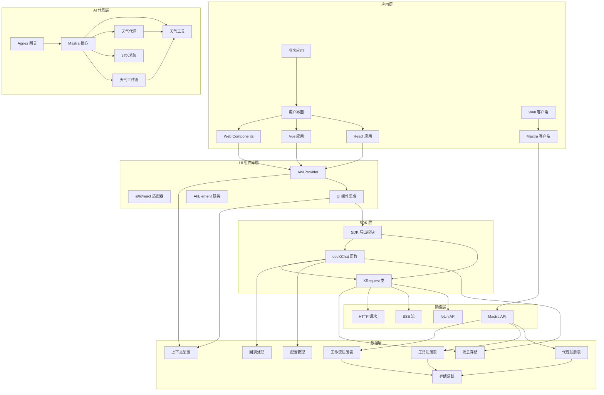

## 详细组件分析

### XRequest 组件深度分析

#### 类结构图

```mermaid
classDiagram
class XRequest {
-_config : XRequestConfig
-_abortController : AbortController
+constructor(config : XRequestConfig)
+run(params? : Partial<Input>, callbacks? : XRequestCallbacks) Promise~void~
+cancel() void
-_handleStream(response : Response, cb : XRequestCallbacks) Promise~void~
-_handleJSON(response : Response, cb : XRequestCallbacks) Promise~void~
}
class XRequestConfig {
+baseURL : string
+method : "GET"|"POST"|"PUT"|"DELETE"
+params : Partial<Input>
+headers : Record~string,string~
+timeout : number
+streamTimeout : number
+stream : boolean
+callbacks : XRequestCallbacks
+fetch : typeof globalThis.fetch
+transformStream : (chunk : string) => Output
}
class XRequestCallbacks {
+onSuccess : (chunks : Output[], headers : Headers) => void
+onError : (error : Error, headers? : Headers) => void
+onUpdate : (chunk : Output, headers : Headers) => void
}
XRequest --> XRequestConfig : "使用"
XRequest --> XRequestCallbacks : "调用"
```

#### 核心流程分析

##### 请求执行流程

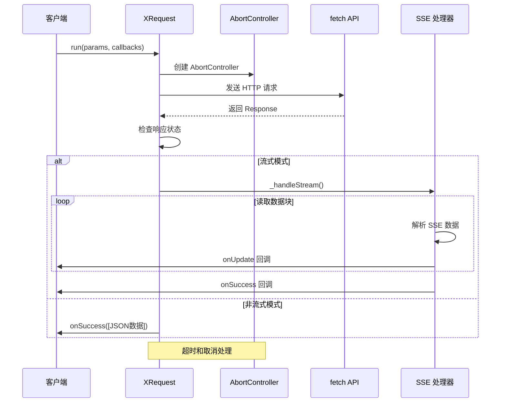

#### SSE 数据解析算法

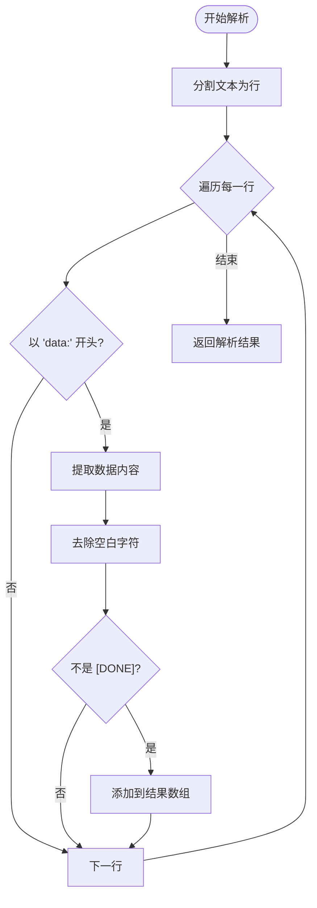

### useXChat 组件深度分析

#### 状态管理架构

```mermaid
stateDiagram-v2
[*] --> local : 用户添加消息
local --> loading : 发起请求
loading --> updating : 接收流式数据
loading --> success : 请求完成
loading --> error : 请求失败
loading --> abort : 请求取消
updating --> success : 流式完成
updating --> error : 流式错误
updating --> abort : 流式取消
success --> [*]
error --> [*]
abort --> [*]
note right of updating : 流式内容追加
note right of loading : 占位符消息
```

#### 核心状态操作流程

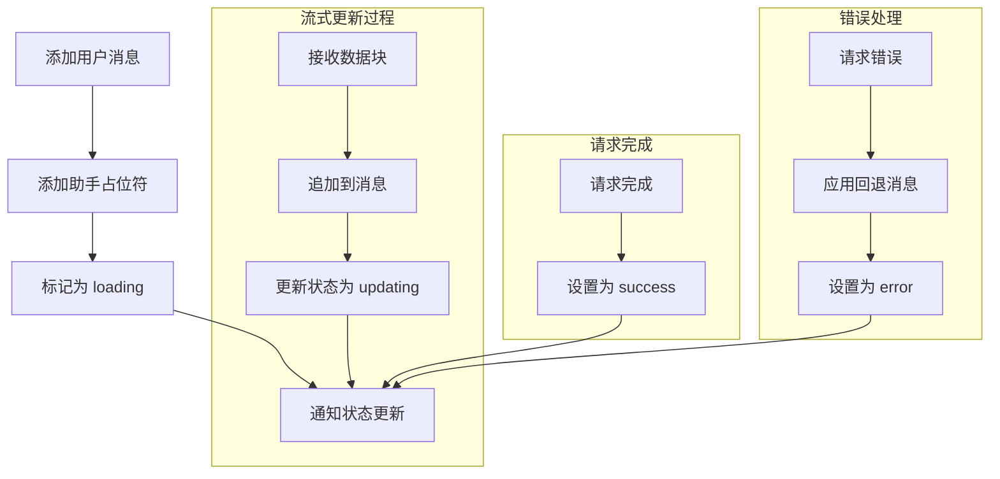

## Mastra AI 代理SDK集成

### Mastra 核心架构

@agentkit/server 现已集成完整的 Mastra AI 代理SDK，提供企业级的AI代理开发框架：

#### Mastra 核心组件结构

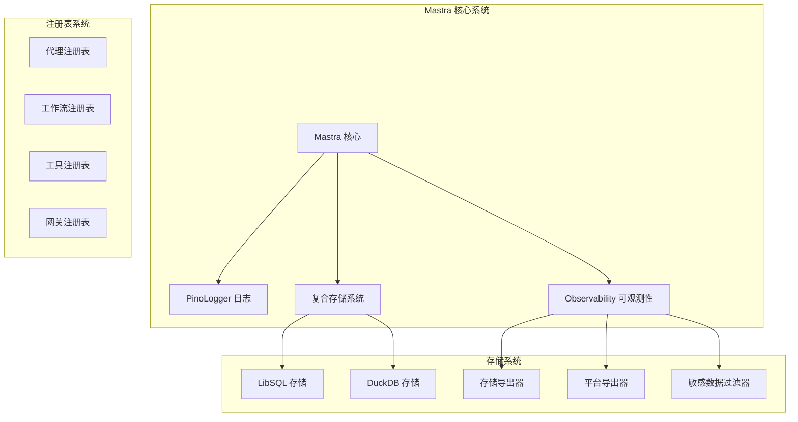

#### Mastra 客户端集成

Web 客户端通过 @mastra/client-js 集成Mastra代理系统：

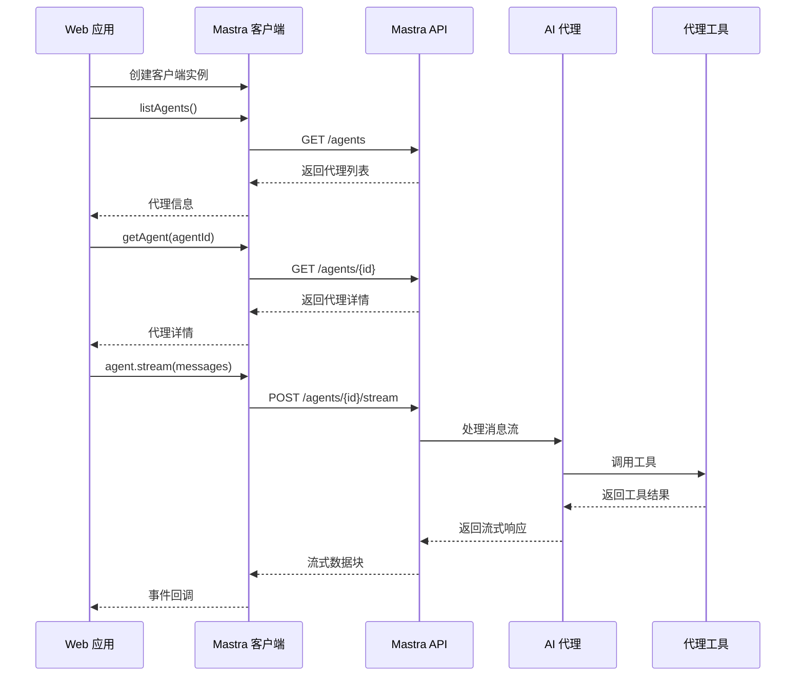

## 代理工具系统

### 代理工具架构

Mastra 代理工具系统提供了扩展AI代理能力的强大机制：

#### 工具系统结构图

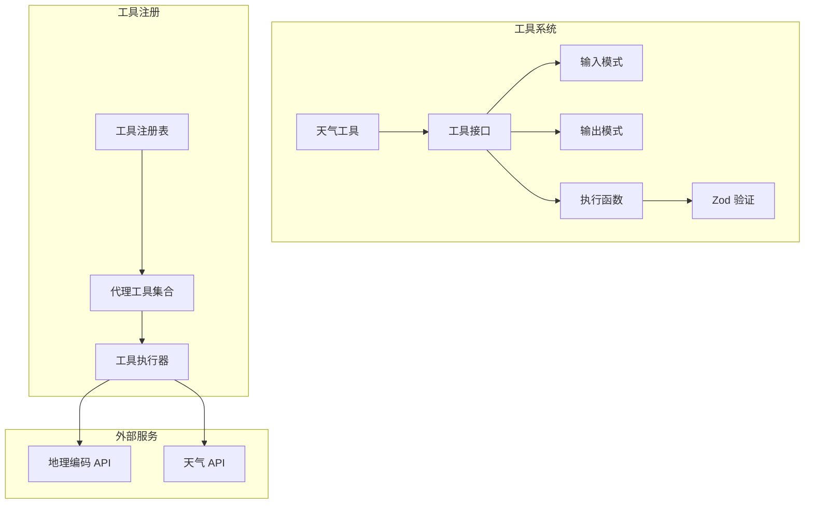

#### 工具执行流程

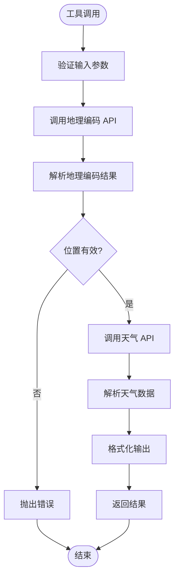

## 工作流管理

### 工作流系统架构

Mastra 工作流系统提供了结构化的多步骤处理流程：

#### 工作流执行流程

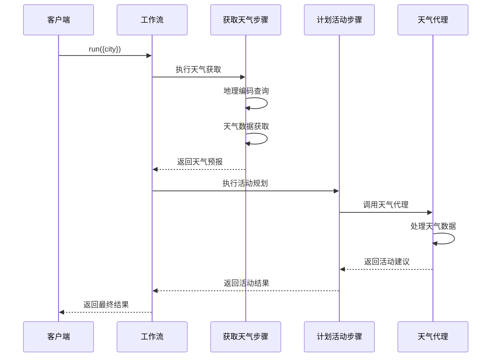

#### 工作流步骤定义

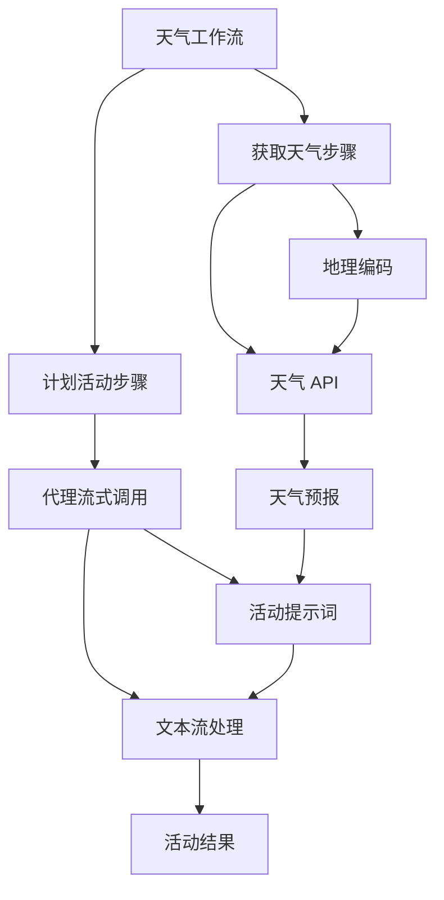

## 网关集成

### Agnes 网关系统

Mastra 网关系统提供了统一的AI模型提供商接入接口：

#### 网关架构图

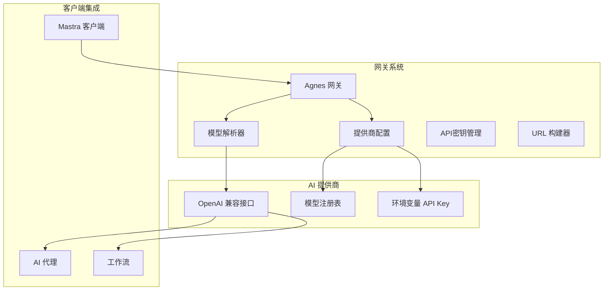

#### 网关配置流程

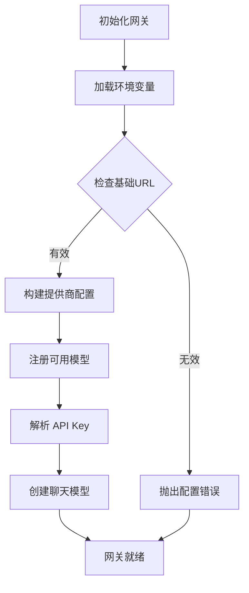

## UI 组件库集成

### UI 组件库架构

@agentkit/ui 是一个基于 Lit 的 Web Components 组件库，提供现代化的组件通信和状态管理模式：

#### 组件库结构图

```mermaid
graph TB
subgraph "UI 组件库"
UIIndex[src/index.ts]
XProvider[AkXProvider]
ReactAdaptor["@lit/react 适配器"]
VueAdaptor[Vue 适配器]
BaseElement[AkElement 基类]
Shared[shared/]
end
subgraph "共享模块"
CN[cn 工具函数]
TailwindMixin[tailwindMixin]
Icons[icons 图标]
Motion[motion 动画]
Context[context 上下文]
end
subgraph "组件集合"
Button[AkButton]
Bubble[AkBubble]
Sender[AkSender]
Conversations[AkConversations]
XCard[AkXCard]
Notification[AkNotification]
ThoughtChain[AkThoughtChain]
Prompts[AkPrompts]
Actions[AkActions]
Sources[AkSources]
FileCard[AkFileCard]
Welcome[AkWelcome]
Think[AkThink]
Suggestion[AkSuggestion]
Attachments[AkAttachments]
Mermaid[AkMermaid]
Folder[AkFolder]
SenderSwitch[AkSenderSwitch]
end
UIIndex --> XProvider
UIIndex --> ReactAdaptor
UIIndex --> VueAdaptor
UIIndex --> BaseElement
UIIndex --> Shared
Shared --> CN
Shared --> TailwindMixin
Shared --> Icons
Shared --> Motion
Shared --> Context
XProvider --> Button
XProvider --> Bubble
XProvider --> Sender
XProvider --> Conversations
XProvider --> XCard
XProvider --> Notification
XProvider --> ThoughtChain
XProvider --> Prompts
XProvider --> Actions
XProvider --> Sources
XProvider --> FileCard
XProvider --> Welcome
XProvider --> Think
XProvider --> Suggestion
XProvider --> Attachments
XProvider --> Mermaid
XProvider --> Folder
XProvider --> SenderSwitch
```

#### AkXProvider - 现代化上下文提供者

AkXProvider 是基于 @lit/context 的响应式上下文提供者，替代传统的 CustomEvent 方案：

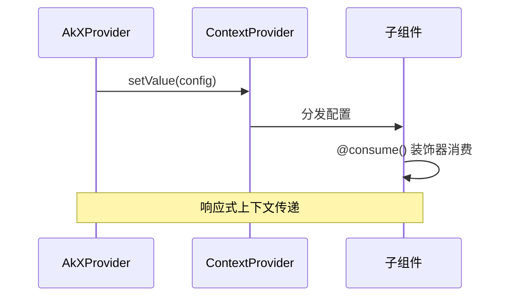

## 现代化组件通信模式

### 基于 @lit/context 的响应式通信

UI 组件库采用了现代化的组件通信模式，使用 @lit/context 替代传统的事件驱动方式：

#### 通信架构图

```mermaid
graph TB
subgraph "响应式通信架构"
XProvider[AkXProvider]
ContextAPI["@lit/context"]
Consumer["子组件 @consume装饰器"]
State[响应式状态管理]
Events[事件系统]
end
subgraph "传统事件驱动"
CustomEvent[CustomEvent]
addEventListener[addEventListener]
dispatchEvent[dispatchEvent]
DOMListener[DOM 监听器]
end
XProvider --> ContextAPI
ContextAPI --> Consumer
Consumer --> State
State --> Events
Events --> DOMListener
note over XProvider,Consumer : 响应式上下文传递
note over CustomEvent,DOMListener : 传统事件驱动
```

#### 组件适配器模式

UI 组件库提供了多种框架适配器，支持 React、Vue 等主流前端框架：

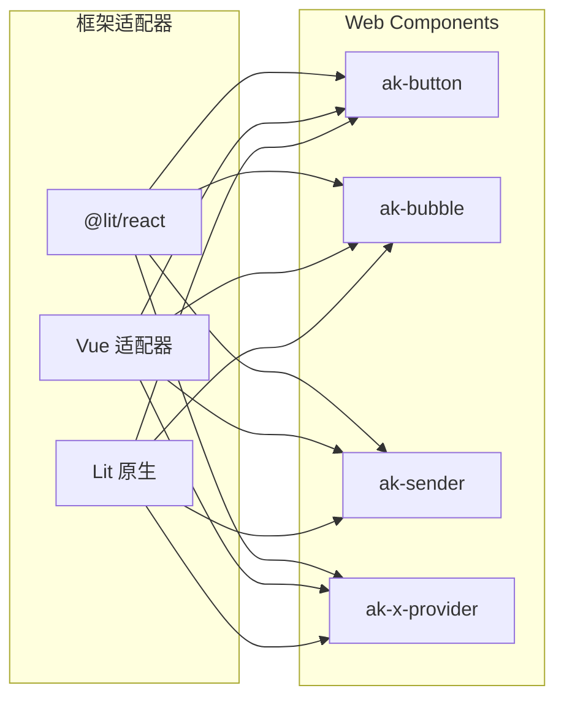

## 依赖关系分析

### 构建配置分析

项目使用现代构建工具链，包括 TypeScript 编译器、Vite 打包器和 unplugin-dts 插件：

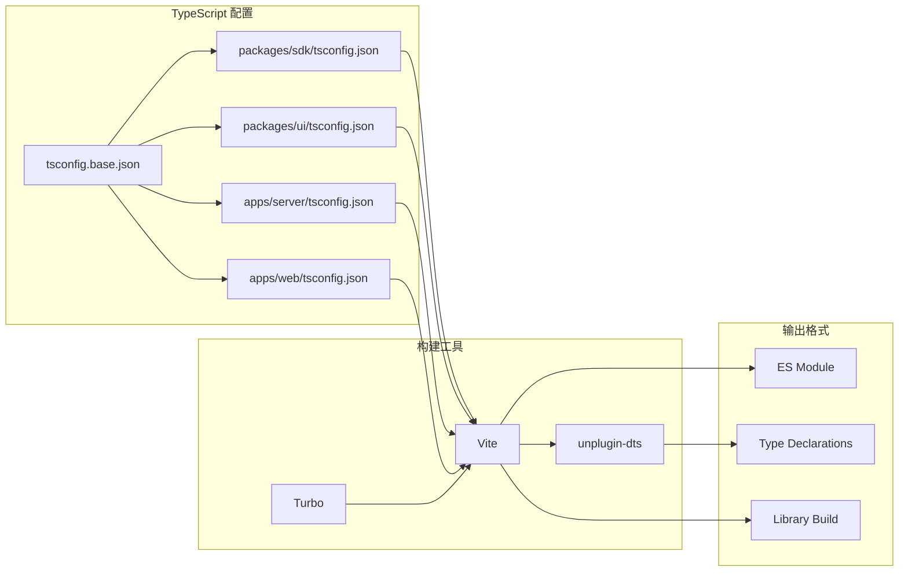

### 外部依赖分析

根据包配置，@agentkit/sdk 和 @agentkit/ui 是两个独立的包，具有不同的依赖策略，现已扩展为包含完整的Mastra生态系统：

#### @agentkit/sdk 依赖分析

- **运行时依赖**: 无
- **开发依赖**:
  - TypeScript (版本: catalog:)
  - Vite (版本: catalog:)
  - unplugin-dts (版本: ^1.0.2)

#### @agentkit/server 依赖分析

- **运行时依赖**:
  - @mastra/core (版本: ^1.46.0)
  - @mastra/hono (版本: ^1.5.1)
  - @mastra/libsql (版本: ^1.14.1)
  - @mastra/duckdb (版本: ^1.5.0)
  - @mastra/loggers (版本: ^1.2.0)
  - @mastra/observability (版本: ^1.15.1)
  - @mastra/memory (版本: ^1.21.1)
  - @ai-sdk/openai-compatible (版本: ^2.0.51)
  - hono (版本: ^4.12.27)
  - dotenv (版本: ^17.4.2)
  - zod (版本: ^4.4.3)

- **开发依赖**:
  - mastra (版本: ^1.15.1)
  - tsx (版本: ^4.22.4)
  - TypeScript (版本: catalog:)

#### @agentkit/web 依赖分析

- **运行时依赖**:
  - @mastra/client-js (版本: ^1.27.0)

## 性能考虑

### 内存管理优化

1. **流式数据处理**: 使用流式读取避免一次性加载大量数据
2. **消息状态跟踪**: 使用 Set 数据结构高效跟踪加载中的消息
3. **AbortController**: 及时清理未完成的请求资源
4. **组件生命周期**: Lit 组件的高效生命周期管理
5. **AI 代理缓存**: Mastra 代理和工具的智能缓存机制
6. **存储优化**: 复合存储系统支持多种数据源的高效访问

### 网络性能优化

1. **超时机制**: 同时支持整体请求超时和流式超时
2. **请求取消**: 避免浪费网络资源处理已完成的请求
3. **内容类型**: 默认使用 application/json，减少不必要的数据传输
4. **组件懒加载**: UI 组件支持按需加载，减少初始包体积
5. **代理流式传输**: Mastra 代理支持实时流式响应传输
6. **网关连接池**: Agnes 网关支持连接复用和优化

### 构建性能优化

1. **增量编译**: TypeScript 编译器配置支持快速增量编译
2. **按需打包**: Vite 支持 ES 模块格式，支持 Tree Shaking
3. **类型声明**: 自动生成类型声明文件，避免重复编译
4. **多包构建**: Turbo 支持并行构建多个包，提升开发效率
5. **AI 代理预编译**: Mastra 代理和工具的预编译优化

### 组件性能优化

1. **响应式更新**: @lit/context 提供高效的响应式状态更新
2. **虚拟化渲染**: @lit-labs/virtualizer 支持大数据量列表渲染
3. **动画优化**: @lit-labs/motion 提供高性能的动画效果
4. **样式隔离**: Shadow DOM 提供样式隔离，避免样式冲突
5. **代理并发处理**: Mastra 支持多代理并发执行优化

## 故障排除指南

### 常见问题及解决方案

#### 请求超时问题

**症状**: 请求在指定时间内没有响应
**原因**: 网络延迟或服务器处理时间过长
**解决方案**:

- 调整 `timeout` 和 `streamTimeout` 参数
- 检查服务器性能和网络连接
- 实现适当的重试机制

#### SSE 连接中断

**症状**: 流式数据传输过程中断
**原因**: 网络不稳定或服务器端连接超时
**解决方案**:

- 实现自动重连逻辑
- 检查服务器端 SSE 配置
- 添加流式超时处理

#### 内存泄漏问题

**症状**: 应用内存持续增长
**原因**: 未正确清理事件监听器或 AbortController
**解决方案**:

- 确保在组件卸载时调用 `cancel()` 方法
- 检查消息状态管理器的清理逻辑
- 监控加载中的消息集合

#### UI 组件通信问题

**症状**: 子组件无法获取父组件配置
**原因**: @lit/context 配置错误或组件未正确消费
**解决方案**:

- 确保 AkXProvider 正确包裹子组件
- 检查 @consume 装饰器的使用
- 验证上下文配置的同步

#### 框架适配器问题

**症状**: React/Vue 组件无法正常工作
**原因**: 事件映射或属性传递错误
**解决方案**:

- 检查 @lit/react 适配器的事件映射
- 验证组件属性的正确传递
- 确保框架版本兼容性

#### Mastra 代理集成问题

**症状**: 代理无法正常工作或工具调用失败
**原因**: 网关配置错误或API密钥问题
**解决方案**:

- 检查 AGNES_BASE_URL 和 API 密钥配置
- 验证代理ID和工具ID的正确性
- 确认 Mastra 服务的可用性和版本兼容性
- 检查工作流步骤的依赖关系

#### 流式代理调用问题

**症状**: 代理流式响应不完整或事件丢失
**原因**: 客户端事件处理或网络中断
**解决方案**:

- 确保正确处理所有流式事件类型
- 实现适当的错误恢复和重试机制
- 检查客户端的 AbortSignal 使用
- 验证代理工具的输入输出模式

## 结论

@agentkit/sdk 是一个设计精良的 AI 对话数据流管理 SDK，现已发展为包含完整 AI 代理生态系统的现代化解决方案，具有以下特点：

### 主要优势

1. **模块化设计**: 将请求管理和状态管理分离，提高代码可维护性
2. **流式支持**: 完善的 SSE 流式数据处理能力
3. **类型安全**: 完整的 TypeScript 类型定义
4. **框架无关**: 可在任何 JavaScript 框架中使用
5. **现代化通信**: 基于 @lit/context 的响应式上下文传递
6. **组件生态**: 完整的 UI 组件库，支持多框架适配
7. **AI 代理集成**: 完整的 Mastra AI 代理SDK生态系统
8. **工具系统**: 支持代理工具扩展和管理
9. **工作流管理**: 结构化的多步骤处理流程
10. **网关集成**: 支持多种AI模型提供商的统一接入

### 技术特色

- **双模式支持**: 同时支持 SSE 流式和传统 JSON 请求
- **灵活配置**: 丰富的配置选项满足不同场景需求
- **错误处理**: 完善的错误处理和回退机制
- **扩展性**: 易于扩展和定制的功能接口
- **响应式架构**: 基于 @lit/context 的现代化组件通信
- **多框架支持**: React、Vue 等主流框架的原生适配
- **AI 代理能力**: 自主决策、工具使用的智能代理系统
- **可观测性**: 完整的日志记录和性能监控
- **存储集成**: 支持多种存储后端的复合存储系统

### 适用场景

- AI 助手应用
- 实时聊天机器人
- 流式内容生成应用
- 多轮对话系统
- 现代化 Web 应用界面
- 多框架混合开发项目
- 企业级 AI 代理应用
- 工作流自动化系统
- 多模型AI应用集成

该 SDK 生态系统为开发者提供了一套完整而优雅的解决方案，能够有效简化 AI 应用中的数据流管理、状态处理、AI 代理开发和界面构建的复杂度，同时支持现代化的组件通信、状态管理模式和企业级的AI代理功能。
