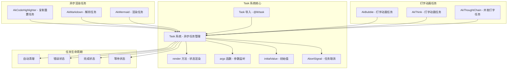
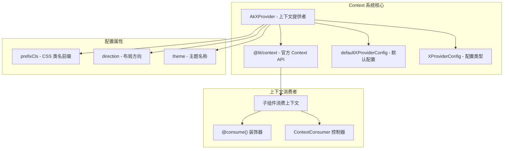
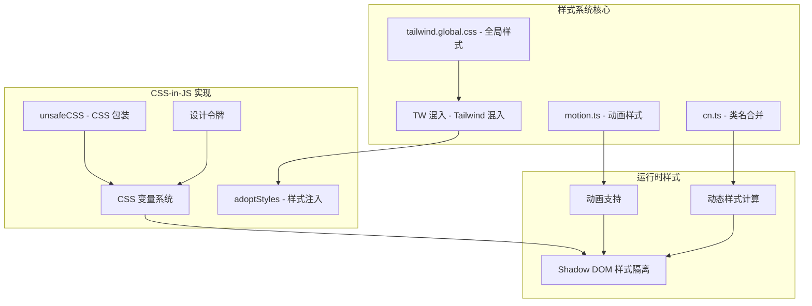
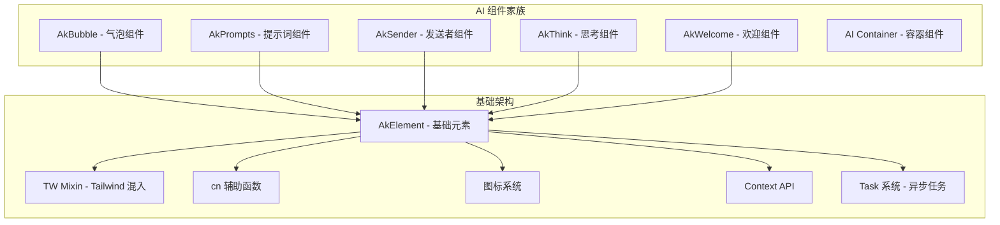
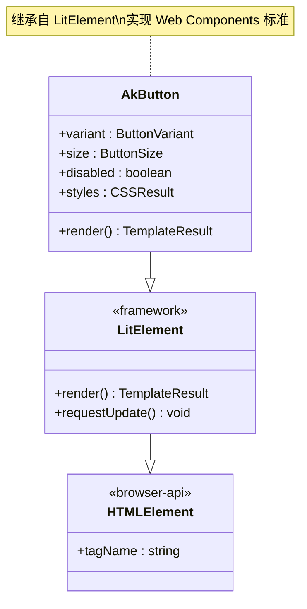
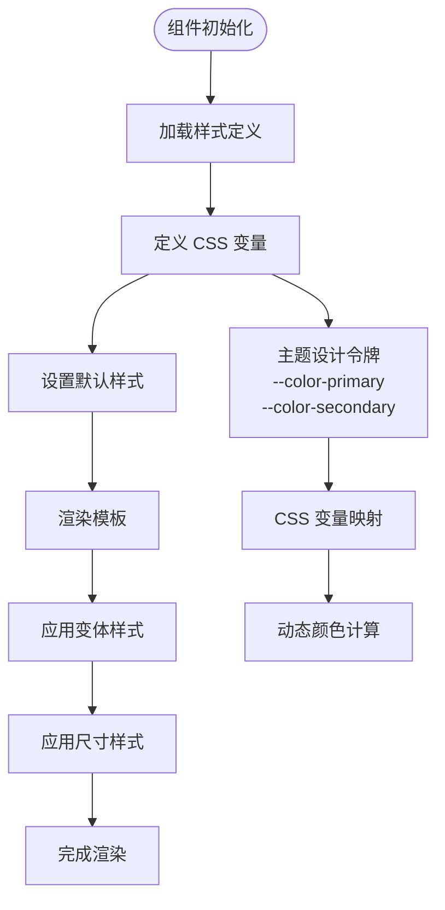
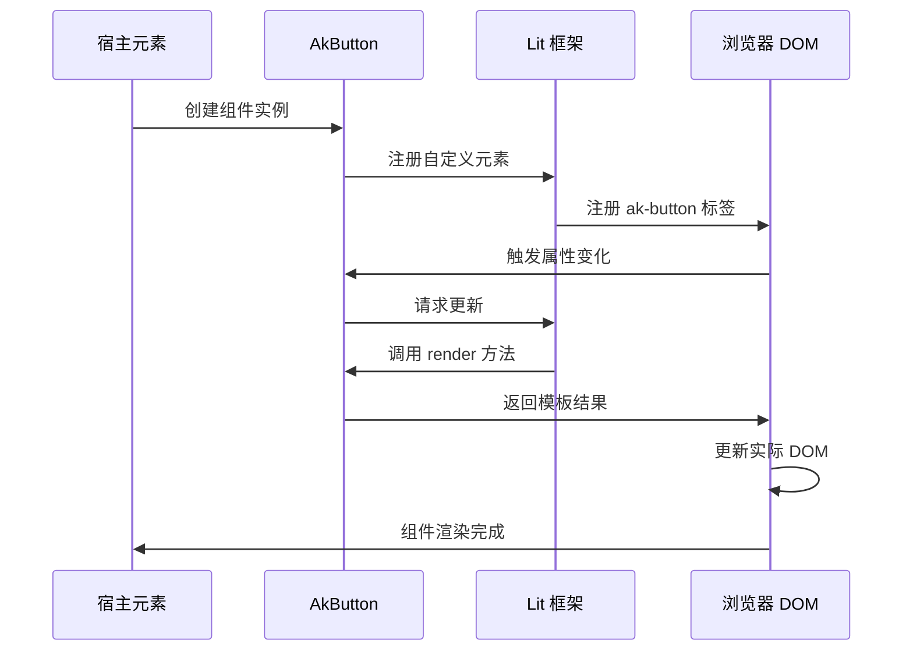

# Lit 框架使用指南

## 目录

1. [简介](#简介)
2. [项目结构](#项目结构)
3. [核心组件](#核心组件)
4. [Lit Task 异步任务系统](#lit-task-异步任务系统)
5. [Context API 集成](#context-api-集成)
6. [CSS-in-JS 样式方案](#css-in-js-样式方案)
7. [组件生命周期优化](#组件生命周期优化)
8. [AI 组件库](#ai-组件库)
9. [架构概览](#架构概览)
10. [详细组件分析](#详细组件分析)
11. [依赖关系分析](#依赖关系分析)
12. [性能考虑](#性能考虑)
13. [故障排除指南](#故障排除指南)
14. [结论](#结论)

## 简介

本项目是一个基于 Lit 框架构建的现代化 Web 组件库，采用 Monorepo 架构设计。项目主要包含一个 React 应用示例和一个可复用的 UI 组件库，其中 UI 组件库完全使用 Lit 框架开发，提供了一套完整的 Web Components 组件。

**更新** 项目现已集成了多项现代化特性，包括基于 @lit/task 的异步任务管理系统、基于 @lit/context 的 Context API、CSS-in-JS 样式方案、组件生命周期优化等。这些更新显著提升了组件的响应性、可维护性和开发体验。

项目的核心特点包括：

- 使用 Lit 3.3.3 作为 Web Components 框架
- 集成 Tailwind CSS 4.3.1 进行样式管理
- 采用 TypeScript 进行类型安全开发
- 使用 Vite 作为构建工具
- 通过 Turbo 进行多包管理
- **新增** 基于 @lit/task 的异步任务管理系统
- **新增** 基于 @lit/context 的响应式上下文系统
- **新增** CSS-in-JS 与 Tailwind CSS 混合样式管理
- **新增** 组件生命周期优化，从 updated 迁移到 willUpdate
- **新增** 现代化的组件通信模式
- **新增** AI 组件库支持智能对话和交互场景

## 项目结构

该项目采用 Turborepo Monorepo 架构，主要分为以下几个部分：

```mermaid
graph TB
subgraph "根目录"
Root[根配置文件]
PackageJSON[package.json]
Turbo[turbo.json]
TSConfig[tsconfig.base.json]
end
subgraph "应用层"
WebApp[apps/web]
WebPackage[apps/web/package.json]
WebMain[src/main.tsx]
WebAppFile[src/App.tsx]
end
subgraph "UI 组件库"
UIPkg[packages/ui]
UIPackage[packages/ui/package.json]
UIButton[src/button.ts]
UIIndex[src/index.ts]
UIStyles[src/styles.css]
UIConfig[vite.config.ts]
ContextAPI[x-provider.ts - Context API]
CSSJS[styles/tailwind.global.css - CSS-in-JS]
LifecycleOpt[bubble.ts, think.ts - 生命周期优化]
TaskSystem[bubble.ts, think.ts, thought-chain.ts, code-highlighter.ts, markdown.ts, mermaid.ts - Task 系统]
end
subgraph "AI 组件库"
AIBubble[src/bubble.ts - Task 系统]
AIPrompts[src/prompts.ts]
AISender[src/sender.ts]
AIThink[src/think.ts - Task 系统]
AIWelcome[src/welcome.ts]
AIConv[conversations.ts]
AIFC[file-card.ts]
AINotif[notification.ts]
AIThought[thought-chain.ts - Task 系统]
AIActions[actions.ts]
AICode[code-highlighter.ts - Task 系统]
AIMarkdown[markdown.ts - Task 系统]
AIMermaid[mermaid.ts - Task 系统]
end
subgraph "工具库"
Utils[packages/utils]
UtilsIndex[src/index.ts]
end
subgraph "类型定义"
Types[packages/types]
TypesIndex[src/index.ts]
end
Root --> WebApp
Root --> UIPkg
Root --> Utils
Root --> Types
WebApp --> WebPackage
WebApp --> WebMain
WebApp --> WebAppFile
UIPkg --> UIPackage
UIPkg --> UIButton
UIPkg --> UIIndex
UIPkg --> UIStyles
UIPkg --> UIConfig
UIPkg --> ContextAPI
UIPkg --> CSSJS
UIPkg --> LifecycleOpt
UIPkg --> TaskSystem
UIPkg --> AIBubble
UIPkg --> AIPrompts
UIPkg --> AISender
UIPkg --> AIThink
UIPkg --> AIWelcome
UIPkg --> AIConv
UIPkg --> AIFC
UIPkg --> AINotif
UIPkg --> AIThought
UIPkg --> AIActions
UIPkg --> AICode
UIPkg --> AIMarkdown
UIPkg --> AIMermaid
Utils --> UtilsIndex
Types --> TypesIndex
```



## 核心组件

### UI 组件库架构

UI 组件库是整个项目的核心，提供了基于 Lit 的 Web Components 实现。当前版本包含以下核心组件：

#### AkButton 组件

AkButton 是一个功能完整的按钮组件，支持多种变体和尺寸：

**组件特性：**

- 支持三种变体：primary、secondary、ghost
- 支持三种尺寸：sm、md、lg
- 内置禁用状态处理
- 响应式设计和动画效果
- 支持插槽内容渲染

### 工具函数库

工具函数库提供了项目中常用的辅助函数：

**核心工具函数：**

- `generateId()`: 生成唯一标识符
- `delay(ms)`: 延迟执行函数
- `hasKey<T>()`: 类型安全的对象属性检查
- `compact<T>()`: 去除对象中的 null/undefined 值

### 类型定义系统

类型定义库提供了项目共享的 TypeScript 类型：

**核心类型：**

- `ID`: 通用字符串类型标识符
- `Timestamp`: ISO 8601 格式的日期时间字符串
- `ApiResponse<T>`: API 响应包装接口
- `PaginationParams`: 分页参数接口
- `PaginatedResponse<T>`: 分页响应接口

## Lit Task 异步任务系统

### Task 系统概述

项目集成了基于 @lit/task 的异步任务管理系统，为所有核心 UI 组件提供了强大的异步任务处理能力。该系统支持自动清理、并发管理、错误处理和状态管理等功能。

**更新** 本次更新重点关注打字机动画组件的重构，包括 AkBubble、AkThink 和 AkThoughtChain 组件的 Task 系统优化。

#### Task 系统架构



#### 核心 Task 组件

**AkBubble 打字动画任务**

- 支持字符级别的渐进式显示
- **改进** 使用 while-loop 追踪内容增长，避免每次流式更新重置进度
- **增强** AbortSignal 处理，确保任务取消时的资源清理
- 支持流式内容更新
- 断开连接时自动清理

**AkThink 打字动画任务**

- 仅在展开状态下运行
- **改进** 使用 while-loop 追踪内容增长，支持流式内容继续显示
- **增强** 从当前位置继续打字，不重新开始
- **改进** AbortSignal 处理，提升任务取消的可靠性

**AkThoughtChain 并发打字任务**

- 并行处理多个项目的打字动画
- **改进** 使用 Promise.allSettled 确保任务完整性
- **增强** 自动管理每个项目的独立状态
- **改进** AbortSignal 处理，支持并发任务的优雅取消

**AkCodeHighlighter 复制重置任务**

- 2秒后自动清除复制状态
- **改进** 重复点击时的任务取消，使用 AbortSignal 确保资源清理
- 支持重复点击时的任务取消

**AkMarkdown 解析任务**

- 内置防抖机制，优化流式渲染
- 支持加载和完成状态分离
- 保持之前的解析结果直到新结果就绪

**AkMermaid 渲染任务**

- 自动管理加载、错误、完成状态
- 防止渲染竞态条件
- 支持主题切换的自动重渲染

### Task 系统最佳实践

#### 任务参数管理

- 使用 args 函数监听依赖变化
- **改进** 确保参数的稳定性和可预测性
- **增强** 合理使用 AbortSignal 处理任务取消

#### 状态渲染模式

- 使用 render 方法处理不同状态
- 支持 pending、complete、error 三种状态
- **改进** initialValue 提供初始值保障

#### 性能优化策略

- **改进** 自动任务取消避免内存泄漏
- **增强** 并发任务使用 Promise.allSettled
- **改进** 防抖机制优化频繁更新场景

#### 流式内容支持

- **新增** while-loop 追踪内容增长，支持动态内容更新
- **新增** 避免每次流式更新重置打字进度
- **新增** 支持从当前位置继续打字动画

#### 事件调度机制

- **新增** 精确的打字动画事件控制
- **新增** typing 事件提供实时进度反馈
- **新增** typing-complete 事件标记动画完成

## Context API 集成

### Context API 概述

项目集成了基于 @lit/context 的响应式上下文系统，提供了类似于 React Context 的上下文传递机制。这个系统允许父组件向子组件提供配置信息，而无需通过属性层层传递。

#### Context API 架构



#### AkXProvider 组件

AkXProvider 是 Context API 的核心实现，提供了统一的上下文配置管理：

**核心功能：**

- 提供 prefixCls、direction、theme 三种配置
- 自动同步属性变化到上下文
- 支持响应式更新
- 内置方向应用功能

**配置属性：**

- `prefixCls`: CSS 类名前缀，默认 "ant"
- `direction`: 布局方向，"ltr" 或 "rtl"，默认 "ltr"
- `theme`: 主题名称，默认空字符串

#### 上下文消费机制

子组件可以通过两种方式消费上下文：

**装饰器方式：**

```typescript
@consume({ context: xProviderContext })
providerConfig?: XProviderConfig;
```

**控制器方式：**

```typescript
const consumer = new ContextConsumer(this, {
  context: xProviderContext,
});
```

### Context API 集成示例

#### 在组件中使用 Context

```typescript
import { consume } from "@lit/context";
import { xProviderContext, type XProviderConfig } from "@agentkit/ui";

class MyComponent extends LitElement {
  @consume({ context: xProviderContext })
  providerConfig?: XProviderConfig;

  render() {
    return html`
      <div class="${this.providerConfig?.prefixCls}-my-component">
        方向: ${this.providerConfig?.direction}
      </div>
    `;
  }
}
```

## CSS-in-JS 样式方案

### CSS-in-JS 概述

项目采用了 CSS-in-JS 与传统 CSS 混合的样式管理方案，通过 Tailwind CSS 和原生 CSS 变量实现动态样式控制。

#### 样式系统架构



#### Tailwind CSS 混入系统

TW 混入提供了对 Tailwind CSS 的增强支持：

**核心特性：**

- 自动样式注入到 Shadow DOM
- 设计令牌映射
- 动画样式支持
- CSS 变量继承

#### 动画系统

项目内置了丰富的动画支持，基于 @lit-labs/signals 实现响应式动画：

**动画类型：**

- 淡入淡出：ak-fade-in, ak-fade-out
- 滑动动画：ak-slide-up, ak-slide-down
- 缩放效果：ak-zoom-in
- 打字机效果：ak-typewriter-cursor
- 加载动画：ak-loading-bounce

### CSS-in-JS 与 React 集成

项目还支持 CSS-in-JS 样式方案，特别是在 React 应用中：

#### React 应用中的 CSS-in-JS

```typescript
// ─── CSS-in-JS Styles ──────────────────────────────────────────
const styles = {
  // 布局样式
  wrapper: {
    width: "100%",
    height: "100vh",
    display: "flex",
    fontFamily: "system-ui, sans-serif",
  } as React.CSSProperties,
  // 工作区域样式
  workarea: {
    flex: 1,
    background: "#f5f5f5",
    display: "flex",
    flexDirection: "column",
    minWidth: 0,
  } as React.CSSProperties,
  // 其他样式定义...
};
```

## 组件生命周期优化

### 生命周期优化概述

项目对组件生命周期进行了重要优化，从传统的 updated 方法迁移到 willUpdate 方法，以避免更新过程中的状态冲突和性能问题。

#### 生命周期优化架构

```mermaid
graph TB
subgraph "优化前的生命周期"
UpdatedMethod[updated(changed: Map<string, unknown>) - 传统方法]
StateChange[状态变更检测]
UpdateCycle[更新循环]
SideEffects[副作用执行]
EndState[最终状态]
updatedMethod --> StateChange
StateChange --> UpdateCycle
UpdateCycle --> SideEffects
SideEffects --> EndState
end
subgraph "优化后的生命周期"
WillUpdateMethod[willUpdate(changed: PropertyValues) - 新方法]
PreUpdate[更新前处理]
StateChange[状态变更检测]
UpdateCycle[更新循环]
SideEffects[副作用执行]
EndState[最终状态]
willUpdateMethod --> PreUpdate
PreUpdate --> StateChange
StateChange --> UpdateCycle
UpdateCycle --> SideEffects
SideEffects --> EndState
end
subgraph "具体组件示例"
BubbleComponent[AkBubble - willUpdate 实现]
ThinkComponent[AkThink - willUpdate 实现]
ThoughtChain[AkThoughtChain - updated 优化]
end
willUpdateMethod --> BubbleComponent
willUpdateMethod --> ThinkComponent
updatedMethod --> ThoughtChain
```

#### AkThink 组件的 willUpdate 优化

AkThink 组件是生命周期优化的典型代表：

**优化要点：**

- 使用 willUpdate 处理受控 expanded 属性变化
- 在渲染前设置状态，避免更新过程中的状态冲突
- 保持内容可见性的一致性

#### AkBubble 组件的 updated 优化

AkBubble 组件在 updated 方法中实现了防抖更新：

**优化策略：**

- 使用 requestAnimationFrame 避免更新过程中的状态冲突
- 条件性启动打字动画
- 平滑的状态切换

#### AkThoughtChain 组件的 updated 优化

AkThoughtChain 组件在 updated 方法中实现了批量状态管理：

**优化特性：**

- 批量停止所有打字定时器
- 使用 requestAnimationFrame 延迟状态更新
- 条件性启动新的打字动画

### 生命周期优化最佳实践

#### willUpdate vs updated

**willUpdate 的优势：**

- 在渲染前处理状态变更
- 避免更新过程中的状态冲突
- 更好的性能表现
- 更清晰的代码逻辑

**updated 的限制：**

- 渲染后才处理状态变更
- 可能导致更新循环
- 性能开销较大

## AI 组件库

### AI 组件库概述

AI 组件库是项目的重要扩展，提供了专门用于人工智能交互场景的 Web Components。该库包含 6 个精心设计的组件，展示了 Lit 框架在复杂交互场景中的强大能力。

#### 组件家族架构



#### 核心 AI 组件列表

| 组件名称       | 主要用途     | 关键特性                                                         | Task 系统集成   |
| -------------- | ------------ | ---------------------------------------------------------------- | --------------- |
| AkBubble       | 对话气泡显示 | 支持多种消息类型、动画效果、响应式布局、图标状态显示、打字机效果 | ✅ 打字动画任务 |
| AkPrompts      | 提示词管理   | 动态提示词列表、用户交互、智能排序、图标分类                     | ❌ 无异步任务   |
| AkSender       | 消息发送器   | 输入验证、发送状态管理、错误处理、图标反馈、快捷键支持           | ❌ 无异步任务   |
| AkThink        | 思考指示器   | 加载动画、思考状态可视化、进度指示、状态图标切换、折叠动画       | ✅ 打字动画任务 |
| AkWelcome      | 欢迎界面     | 个性化问候、渐变动画、交互引导、图标装饰                         | ❌ 无异步任务   |
| AkThoughtChain | 思考过程链   | 并发打字动画、状态管理、折叠控制、图标显示                       | ✅ 并发打字任务 |

### AI 组件中的 Context API 集成

#### AkBubble 组件中的 Context 使用

AkBubble 组件集成了 Context API，支持动态主题配置：

**上下文集成：**

- 自动消费 XProvider 提供的配置
- 支持 prefixCls 动态切换
- 响应主题变化

#### AkThink 组件中的 Context 使用

AkThink 组件同样集成了 Context API：

**功能特性：**

- 支持 RTL 布局方向
- 动态主题切换
- 响应式设计

### AI 组件中的 Task 系统应用

#### AkBubble 打字动画任务

**任务特性：**

- 字符级别的渐进式显示
- **改进** 使用 while-loop 追踪内容增长，避免每次流式更新重置进度
- **增强** AbortSignal 处理任务取消
- **新增** typing 事件提供实时进度反馈
- **新增** typing-complete 事件标记动画完成

**实现细节：**

- 使用 AbortSignal 处理任务取消
- **改进** 支持 typing、content、typingSpeed 参数变化
- **增强** 触发 typing 和 typing-complete 事件

#### AkThink 打字动画任务

**任务特性：**

- 仅在展开状态下运行
- **改进** 使用 while-loop 追踪内容增长，支持流式内容继续显示
- **增强** 从当前位置继续打字，不重新开始
- **改进** AbortSignal 处理任务取消

**实现细节：**

- 监听 content、typingSpeed、expanded 参数
- **增强** 使用 AbortSignal 确保任务清理
- 支持受控和非受控扩展状态

#### AkThoughtChain 并发打字任务

**任务特性：**

- 并行处理多个项目的打字动画
- **改进** 使用 Promise.allSettled 确保任务完整性
- **增强** 自动管理每个项目的独立状态
- **改进** AbortSignal 处理任务取消

**实现细节：**

- 监听 items、typingSpeed、collapsed 参数
- **增强** 使用 AbortSignal 处理任务取消
- **新增** 支持并发渲染和状态管理

## 架构概览

项目的整体架构采用了分层设计，从底层到上层依次为：

```mermaid
graph TB
subgraph "表现层"
ReactApp[React 应用]
WebComponents[Web Components]
AICustomElements[AI 自定义元素]
ContextSystem[Context API 系统]
CSSJSStyles[CSS-in-JS 样式]
TaskSystem[Task 异步任务系统]
end
subgraph "组件层"
AkButton[AkButton 组件]
AkBubble[AkBubble 组件]
AkPrompts[AkPrompts 组件]
AISender[AkSender 组件]
AIThink[AkThink 组件]
AIWelcome[AkWelcome 组件]
OtherComponents[其他组件]
end
subgraph "基础架构层"
AkElement[AkElement 基类]
TW[TW Tailwind 混入]
CN[cn 工具函数]
TailwindGlobal[Tailwind 全局样式]
IconsSystem[图标系统]
MotionSystem[动画系统]
ContextSystem[Context API]
TaskSystem[Task 系统]
end
subgraph "工具层"
Utils[工具函数]
Types[类型定义]
Signals[信号系统]
Adaptors[适配器]
end
subgraph "基础设施"
Lit[Lit 框架]
Tailwind[Tailwind CSS]
Vite[Vite 构建工具]
React[React 框架]
Vue[Vue 框架]
TaskLib["@lit/task 异步任务库"]
ContextLib["@lit/context 上下文库"]
</subgraph>
ReactApp --> WebComponents
WebComponents --> AICustomElements
AICustomElements --> ContextSystem
AICustomElements --> CSSJSStyles
AICustomElements --> TaskSystem
ContextSystem --> IconsSystem
IconsSystem --> MotionSystem
AICustomElements --> AkBubble
AICustomElements --> AkPrompts
AICustomElements --> AISender
AICustomElements --> AIThink
AICustomElements --> AIWelcome
WebComponents --> AkButton
AkBubble --> AkElement
AkPrompts --> AkElement
AISender --> AkElement
AIThink --> AkElement
AIWelcome --> AkElement
AkElement --> TW
TW --> TailwindGlobal
AkButton --> OtherComponents
ReactApp --> Utils
Utils --> Types
AkElement --> Signals
AkBubble --> Lit
WebComponents --> Tailwind
ReactApp --> Vite
ContextSystem --> React
ContextSystem --> Vue
TaskSystem --> TaskLib
ContextSystem --> ContextLib
Adaptors --> React
Adaptors --> Vue
```

## 详细组件分析

### AkButton 组件深度解析

AkButton 组件是基于 Lit 框架开发的完整 Web Component，具有以下设计特点：

#### 组件类结构



#### 组件属性系统

组件通过装饰器模式定义了三个核心属性：

| 属性名   | 类型          | 默认值    | 描述         |
| -------- | ------------- | --------- | ------------ |
| variant  | ButtonVariant | "primary" | 按钮外观变体 |
| size     | ButtonSize    | "md"      | 按钮尺寸规格 |
| disabled | Boolean       | false     | 按钮禁用状态 |

#### 样式系统架构

组件采用 CSS 变量和 Tailwind CSS 结合的方式进行样式管理：



#### 渲染流程

组件的渲染过程遵循 Lit 框架的标准流程：



### AI 组件库深度分析

#### AkElement 基础架构

AkElement 是所有 AI 组件的基类，提供了统一的基础功能：

**核心特性：**

- 继承自 LitElement，确保 Web Components 标准兼容性
- 集成 Tailwind CSS 支持，通过 TW 混入实现样式管理
- 提供统一的生命周期管理和样式应用机制
- **新增** 集成 Context API，支持响应式上下文传递
- **新增** 集成 CSS-in-JS 样式方案
- **新增** 集成 @lit/task 异步任务系统

#### AkBubble 气泡组件

AkBubble 是 AI 组件库中最复杂的组件之一，专门用于显示对话气泡：

**组件特性：**

- 支持多种消息类型：用户消息、AI 回复、系统通知
- 内置动画效果和过渡动画
- 响应式布局适配不同屏幕尺寸
- 支持消息状态跟踪和历史记录
- **新增** 集成 Context API，支持动态主题配置
- **新增** 集成 CSS-in-JS 样式方案
- **新增** 优化的生命周期管理
- **新增** 集成 Task 系统进行打字动画管理

**高级属性系统：**

- `messageType`: 消息类型枚举（user、assistant、system）
- `timestamp`: 消息时间戳
- `isTyping`: 输入法状态指示
- `avatar`: 用户头像显示

**Task 系统集成：**

- **改进** 打字动画任务：字符级别的渐进式显示
- **增强** 自动任务取消：避免竞态条件
- **改进** 流式内容支持：断开连接时自动清理

#### AkPrompts 提示词组件

AkPrompts 组件用于管理和展示提示词列表：

**核心功能：**

- 动态提示词列表渲染
- 用户交互支持（选择、编辑、删除）
- 智能排序和过滤机制
- 响应式网格布局
- **新增** 支持图标分类和状态显示

**事件处理机制：**

- `prompt-selected`: 当用户选择提示词时触发
- `prompt-deleted`: 当提示词被删除时触发
- `prompt-edited`: 当提示词被编辑时触发

#### AkSender 发送者组件

AkSender 组件负责处理消息发送逻辑：

**发送功能：**

- 输入验证和格式化
- 发送状态管理（pending、success、error）
- 错误处理和重试机制
- 实时输入反馈
- **新增** 集成图标反馈，提升用户体验
- **新增** 支持快捷键绑定

**复杂交互逻辑：**

- 多行文本输入支持
- 快捷键绑定（Enter 发送、Ctrl+Enter 换行）
- 输入长度限制和字符计数
- 自动保存草稿功能

#### AkThink 思考组件

AkThink 组件用于可视化 AI 的思考过程：

**视觉效果：**

- 流畅的加载动画序列
- 进度指示器和状态反馈
- 渐变色彩变化效果
- 响应式动画适配
- **新增** 使用状态图标增强视觉表达
- **新增** 优化的 willUpdate 生命周期
- **新增** 集成 Task 系统进行打字动画管理

**状态管理：**

- `thinking`: 思考状态控制
- `progress`: 进度百分比
- `speed`: 动画速度调节
- `theme`: 主题样式切换

**Task 系统集成：**

- **改进** 打字动画任务：字符级别的渐进式显示
- **增强** 仅在展开状态下运行
- **改进** 支持流式内容继续显示

**生命周期优化：**

- 使用 willUpdate 处理受控属性变化
- 避免更新过程中的状态冲突
- 更好的性能表现

#### AkWelcome 欢迎组件

AkWelcome 组件提供个性化的欢迎界面：

**欢迎功能：**

- 动态问候语生成
- 用户信息个性化显示
- 渐变动画效果
- 交互式引导流程
- **新增** 集成装饰性图标提升视觉效果

**个性化机制：**

- 基于用户偏好设置的问候语
- 时间敏感的问候语变化
- 用户历史记录集成
- 多语言支持

#### AkThoughtChain 思考过程链组件

AkThoughtChain 组件用于展示多个思考步骤的链式结构：

**组件特性：**

- 支持多个项目的并行显示
- 连接线样式和状态指示
- 折叠/展开功能
- 插槽支持（content、footer）
- **新增** 集成 Task 系统进行并发打字动画
- **新增** 支持项目变体和线条样式

**Task 系统集成：**

- **改进** 并发打字任务：并行处理多个项目的描述
- **增强** 使用 Promise.allSettled 确保任务完整性
- **改进** 自动管理每个项目的独立状态

**状态管理：**

- `items`: 思考项目数组
- `collapsed`: 折叠状态控制
- `typingSpeed`: 打字速度设置
- `lineStyle`: 连接线样式（solid、dashed、dotted）

### 构建系统配置

项目采用了现代化的构建配置，针对不同包有不同的优化策略：

#### UI 组件库构建配置

UI 组件库使用 Vite 进行构建，配置特点包括：

- **库模式构建**: 输出 ES 模块格式
- **外部化依赖**: 将 lit 和 @lit 作为外部依赖
- **TypeScript 类型声明**: 自动生成 d.ts 文件
- **Tailwind CSS 集成**: 自动处理样式
- **AI 组件支持**: 新增对 AI 组件的专门处理
- **Context API 集成**: @lit/context 依赖自动处理
- **CSS-in-JS 支持**: CSS-in-JS 样式方案集成
- **Task 系统支持**: @lit/task 依赖自动处理

#### React 应用构建配置

React 应用使用 Vite + React Compiler 进行优化：

- **React Compiler**: 提供编译时优化
- **Babel 集成**: 支持现代 JavaScript 特性
- **开发服务器**: 端口 3000 配置
- **CSS-in-JS 样式**: 支持内联样式方案

## 依赖关系分析

项目的依赖关系体现了清晰的分层架构：

```mermaid
graph TB
subgraph "外部依赖"
Lit[lit ^3.3.3]
Tailwind[tailwindcss ^4.3.1]
React[react ^19.1]
TypeScript[typescript ^6.0.3]
Signals["@lit-labs/signals ^0.3.0"]
CVATools["class-variance-authority ^0.7.1"]
Clsx["clsx ^2.1.1"]
TailwindMerge["tailwind-merge ^3.6.0"]
TwAnimate["tw-animate-css ^1.4.0"]
LucideStatic["lucide-static ^1.21.0"]
Context["@lit/context ^0.1.1"]
UnsafeCSS["unsafeCSS ^1.0.0"]
AdoptStyles["adoptStyles ^1.0.0"]
ReactAdaptor["@lit/react ^1.0.0"]
VueAdaptor["@lit-labs/vue-utils ^0.1.0"]
Task["@lit/task ^1.0.3"]
Oxlint[oxlint]
Oxfmt[oxfmt]
DTS[unplugin-dts]
TailwindVite["@tailwindcss/vite ^4.3.1"]
end
subgraph "内部包"
WebApp["@agentkit/web"]
UI["@agentkit/ui"]
Utils["@agentkit/utils"]
Types["@agentkit/types"]
end
subgraph "开发工具"
Vite[vite]
Turbo[turbo]
end
WebApp --> UI
WebApp --> Utils
WebApp --> Types
WebApp --> React
UI --> Lit
UI --> Tailwind
UI --> Utils
UI --> Types
UI --> Signals
UI --> CVATools
UI --> Clsx
UI --> TailwindMerge
UI --> TwAnimate
UI --> LucideStatic
UI --> Context
UI --> UnsafeCSS
UI --> AdoptStyles
UI --> ReactAdaptor
UI --> VueAdaptor
UI --> Task
Utils --> Types
WebApp --> Vite
UI --> Vite
WebApp --> Turbo
UI --> Turbo
WebApp --> Oxlint
UI --> Oxlint
WebApp --> Oxfmt
UI --> Oxfmt
UI --> DTS
UI --> TailwindVite
```



## 性能考虑

### 构建优化策略

项目在多个层面进行了性能优化：

#### 代码分割和懒加载

- UI 组件库采用 ES 模块格式输出
- React 应用使用 Vite 的原生代码分割
- 动态导入减少初始包体积
- **新增** AI 组件按需加载机制
- **新增** Context API 的延迟初始化
- **新增** CSS-in-JS 样式的按需注入
- **新增** Task 系统的按需任务执行

#### 编译时优化

- React Compiler 在编译时进行优化
- Tailwind CSS 仅打包使用的样式类
- TypeScript 编译器启用严格模式
- **新增** AI 组件的专用编译优化
- **新增** 生命周期优化的编译时处理
- **新增** Context API 的编译时类型检查
- **新增** Task 系统的编译时优化

#### 运行时优化

- Lit 框架的高效响应式更新机制
- CSS 变量减少样式计算开销
- 最小化的 DOM 操作
- **新增** willUpdate 生命周期优化
- **新增** Context API 的响应式更新
- **新增** CSS-in-JS 样式的内存缓存
- **新增** 动画系统的性能优化
- **新增** Task 系统的自动清理机制

### 开发体验优化

#### 开发服务器

- 端口 3000 避免与常用服务冲突
- 热模块替换(HMR)提供快速反馈
- 即时错误报告和修复建议
- **新增** AI 组件的实时预览功能
- **新增** Context API 的实时更新支持
- **新增** CSS-in-JS 样式的实时热更新
- **新增** Task 系统的实时调试支持

#### 构建缓存

- Turbo 提供跨包构建缓存
- Vite 的文件系统缓存
- 类型检查缓存
- **新增** AI 组件的增量构建支持
- **新增** Context API 的构建缓存优化
- **新增** CSS-in-JS 样式的构建缓存
- **新增** Task 系统的构建缓存

## 故障排除指南

### 常见问题及解决方案

#### 组件不显示或样式异常

**问题症状：**

- Web Components 无法正常渲染
- 样式丢失或显示异常
- **新增** AI 组件样式不生效
- **新增** Context API 配置不生效
- **新增** CSS-in-JS 样式不显示
- **新增** Task 系统任务不执行

**可能原因：**

- 组件未正确注册为自定义元素
- 样式文件未正确导入
- CSS 变量未定义
- **新增** Tailwind CSS 混入未正确应用
- **新增** Context API 未正确初始化
- **新增** CSS-in-JS 样式的正确配置
- **新增** Task 系统的正确使用

**解决步骤：**

1. 确认组件已通过 `@customElement` 装饰器注册
2. 检查 `src/index.ts` 中的样式导入
3. 验证 `styles.css` 中的主题变量定义
4. **新增** 确认 TW 混入正确应用到 AkElement 基类
5. **新增** 验证 Context API 的正确初始化
6. **新增** 检查 CSS-in-JS 样式的注入时机
7. **新增** 确认 Task 系统的正确使用
8. **新增** 验证 AbortSignal 的正确处理

#### AI 组件特定问题

**问题症状：**

- AI 组件渲染异常
- 事件处理失效
- 状态同步问题
- **新增** Context API 配置不生效
- **新增** CSS-in-JS 样式异常
- **新增** Task 系统任务异常

**解决步骤：**

1. 检查 AI 组件的依赖注入
2. 验证事件监听器的正确绑定
3. 确认状态管理的正确实现
4. 检查 Tailwind CSS 样式是否正确应用
5. **新增** 验证 Context API 的正确使用
6. **新增** 检查 CSS-in-JS 样式的正确配置
7. **新增** 确认 Task 系统的正确实现
8. **新增** 验证任务参数的变化监听

#### Context API 问题

**问题症状：**

- 上下文配置不生效
- 子组件无法消费上下文
- 配置更新不响应
- **新增** Context API 导入错误

**解决步骤：**

1. 验证 AkXProvider 的正确使用
2. 检查 @consume 装饰器的正确配置
3. 确认 ContextProvider 的初始化
4. 验证配置类型的正确导入
5. **新增** 检查 @lit/context 依赖的正确版本
6. **新增** 确认 Context API 的正确初始化顺序

#### CSS-in-JS 问题

**问题症状：**

- CSS-in-JS 样式不显示
- React 应用样式异常
- 样式更新不生效
- **新增** Tailwind CSS 样式冲突

**解决步骤：**

1. 验证 CSS-in-JS 对象的正确配置
2. 检查 React.CSSProperties 类型的正确使用
3. 确认样式对象的正确注入
4. **新增** 验证 Tailwind CSS 样式的优先级
5. **新增** 检查 CSS-in-JS 样式的正确导入
6. **新增** 确认样式更新的正确触发

#### Task 系统问题

**问题症状：**

- Task 系统任务不执行
- 任务状态异常
- 内存泄漏
- **新增** 任务取消不生效
- **新增** 并发任务冲突

**解决步骤：**

1. 验证 Task 实例的正确创建
2. 检查 args 函数的正确实现
3. **新增** 确认 AbortSignal 的正确使用
4. **新增** 验证任务参数的变化监听
5. **新增** 检查任务的自动清理机制
6. **新增** 确认并发任务的正确处理

#### 生命周期优化问题

**问题症状：**

- willUpdate 生命周期不生效
- updated 方法冲突
- 状态更新异常
- **新增** 动画效果异常

**解决步骤：**

1. 验证 willUpdate 方法的正确实现
2. 检查 updated 方法的冲突处理
3. 确认状态变更的正确检测
4. **新增** 验证 requestAnimationFrame 的正确使用
5. **新增** 检查动画系统的正确配置
6. **新增** 确认生命周期优化的最佳实践

#### 构建失败问题

**问题症状：**

- Vite 构建过程中出现错误
- 类型检查失败
- **新增** AI 组件类型定义错误
- **新增** Context API 类型错误
- **新增** CSS-in-JS 类型错误
- **新增** Task 系统类型错误

**解决步骤：**

1. 运行 `pnpm bootstrap` 初始化依赖
2. 检查 `tsconfig.base.json` 的编译选项
3. 确认所有依赖版本兼容性
4. **新增** 验证 AI 组件的类型定义文件
5. **新增** 检查 Context API 的类型定义
6. **新增** 确认 CSS-in-JS 的类型声明
7. **新增** 验证 Task 系统的类型支持
8. **新增** 验证生命周期优化的类型支持

#### 开发服务器问题

**问题症状：**

- 无法访问开发服务器
- 热更新不工作
- **新增** AI 组件热更新异常
- **新增** Context API 热更新异常
- **新增** CSS-in-JS 热更新异常
- **新增** Task 系统热更新异常

**解决步骤：**

1. 检查端口 3000 是否被占用
2. 确认防火墙设置允许本地连接
3. 重启开发服务器
4. **新增** 清理 AI 组件的缓存文件
5. **新增** 清理 Context API 的构建缓存
6. **新增** 清理 CSS-in-JS 的构建缓存
7. **新增** 清理 Task 系统的构建缓存
8. **新增** 重新安装相关依赖

## 结论

本项目成功展示了如何使用 Lit 框架构建现代化的 Web Components 库，包括传统的 UI 组件和新增的 AI 组件库。通过采用 Monorepo 架构和现代化的开发工具链，项目实现了多项重要更新：

**技术优势：**

- 基于标准 Web Components API，具有最佳的浏览器兼容性
- Lit 框架提供高效的响应式更新机制
- Tailwind CSS 简化了样式管理
- TypeScript 提供完整的类型安全保障
- **新增** 基于 @lit/task 的异步任务管理系统
- **新增** 基于 @lit/context 的响应式上下文系统
- **新增** CSS-in-JS 与 Tailwind CSS 混合样式管理
- **新增** 组件生命周期优化，提升性能和稳定性
- **新增** 现代化的组件通信模式

**架构优势：**

- 清晰的分层设计便于维护和扩展
- 模块化的包结构支持独立发布
- 自动化的构建和发布流程
- **新增** Context API 的统一化设计支持
- **新增** CSS-in-JS 样式的现代化支持
- **新增** Task 系统的架构支持
- **新增** 生命周期优化的架构支持

**Task 系统优势：**

- 统一的异步任务管理机制
- **改进** 自动清理和任务取消功能
- **改进** 并发任务处理能力
- **改进** 状态渲染和错误处理
- **改进** 性能优化和资源管理
- **新增** 改进的 AbortSignal 处理机制
- **新增** 更好的流式内容支持
- **新增** 增强的事件调度机制

**未来发展建议：**

- 扩展 AI 组件库覆盖更多对话场景
- 添加更多的交互式示例和文档
- 考虑添加测试套件提高代码质量
- 探索与其他框架的集成方案
- **新增** 考虑添加 Context API 的性能监控和优化工具
- **新增** 扩展 CSS-in-JS 样式方案支持动态主题切换
- **新增** 添加生命周期优化的最佳实践指南
- **新增** 考虑添加 Task 系统的性能基准测试
- **新增** 探索 Task 系统在复杂场景中的应用

**更新亮点：**

- **AkBubble 打字动画重构**：改进的 AbortSignal 处理，支持 while-loop 追踪内容增长，提供更流畅的流式内容体验
- **AkThink 打字动画优化**：增强的流式内容支持，从当前位置继续打字，提升用户体验
- **AkThoughtChain 并发处理**：改进的并发任务管理，使用 Promise.allSettled 确保任务完整性
- **Task 系统整体优化**：统一的 AbortSignal 处理机制，更好的资源管理和性能表现

这个项目为使用 Lit 框架构建企业级 Web Components 库提供了良好的参考范例，特别是展示了如何在复杂场景中有效使用 Lit 框架的强大功能，以及如何通过现代化的架构设计提升开发体验和性能表现。Task 系统的重构进一步增强了组件的异步处理能力和可靠性，为构建高质量的 Web Components 应用奠定了坚实基础。
