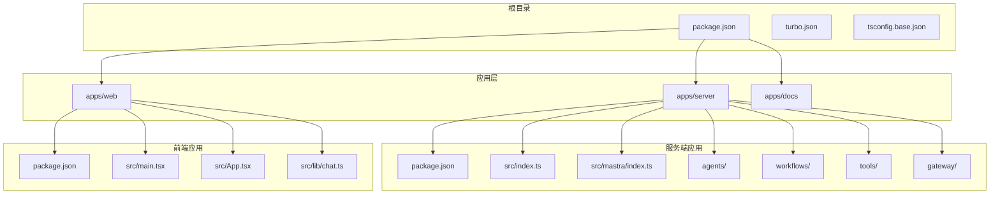
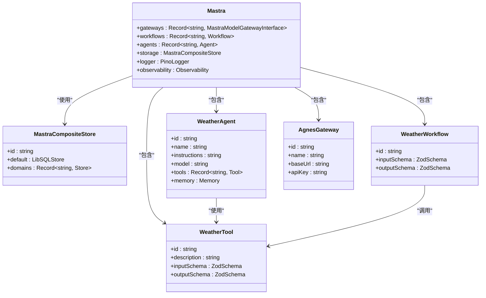
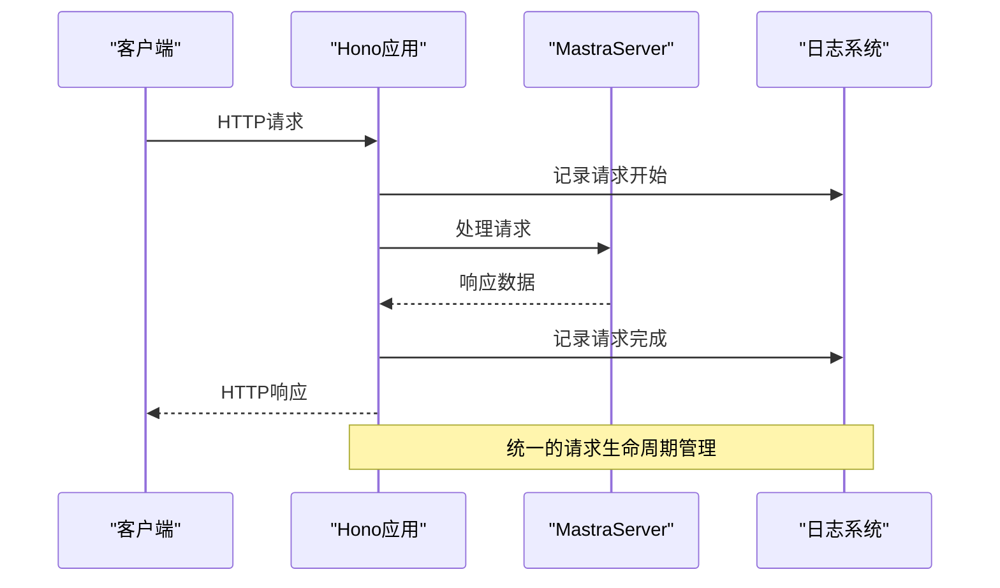
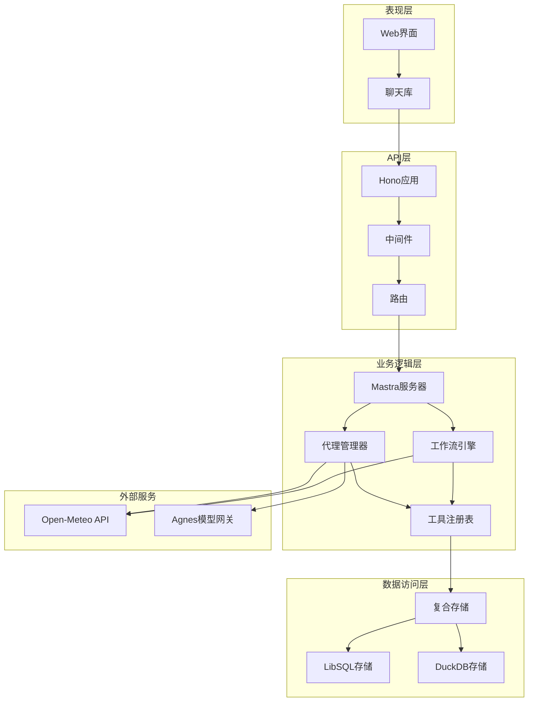
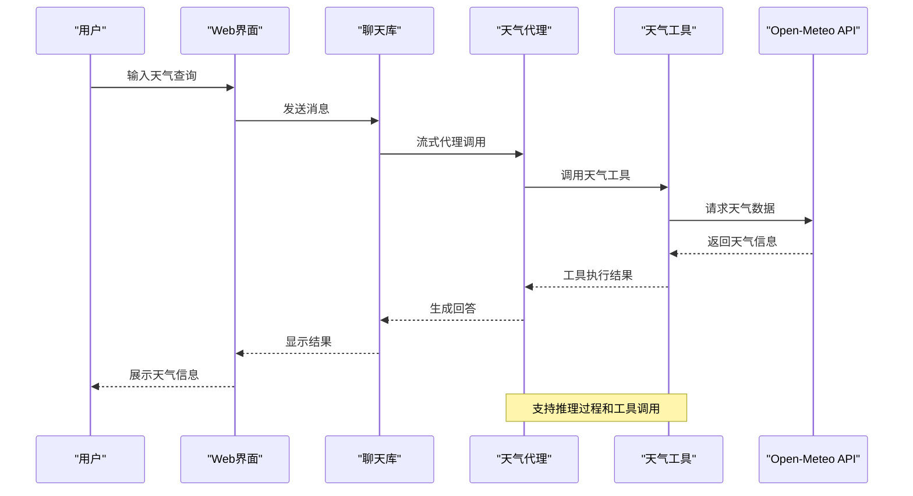
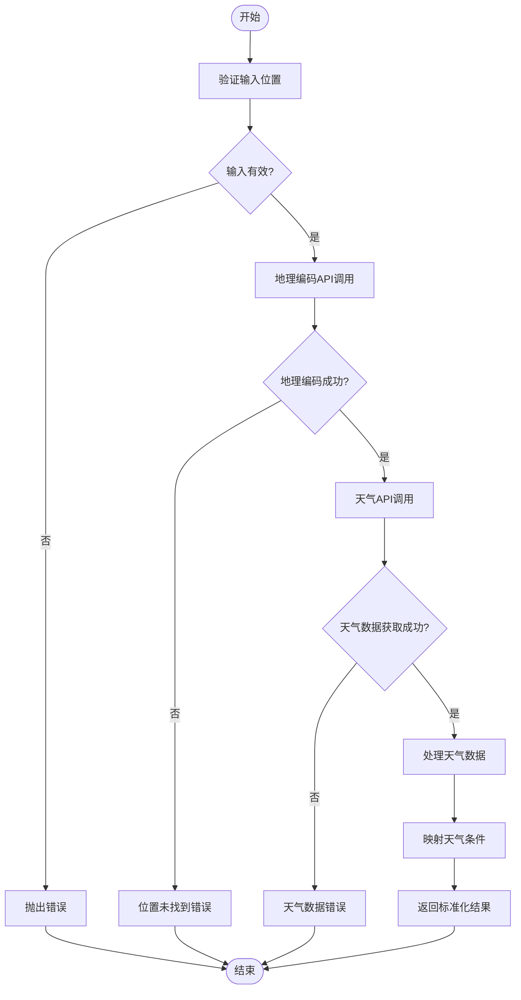
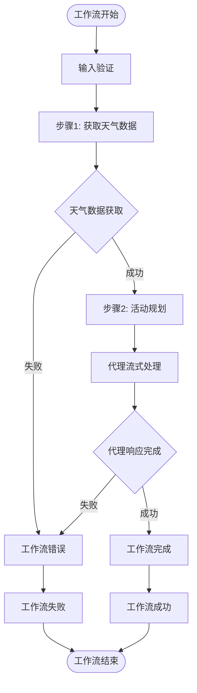
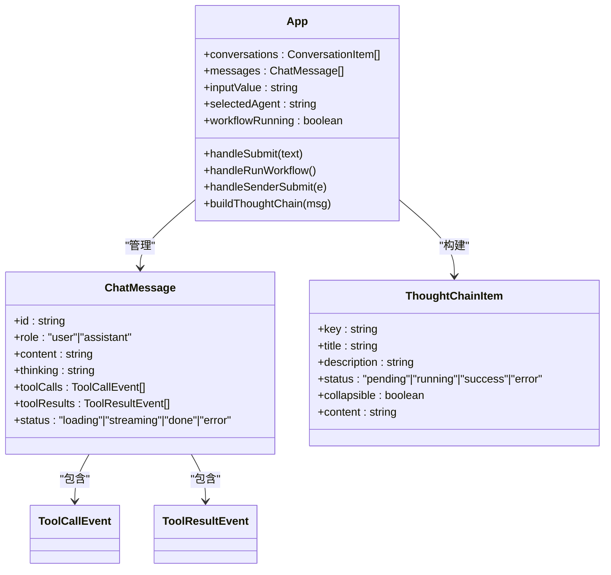
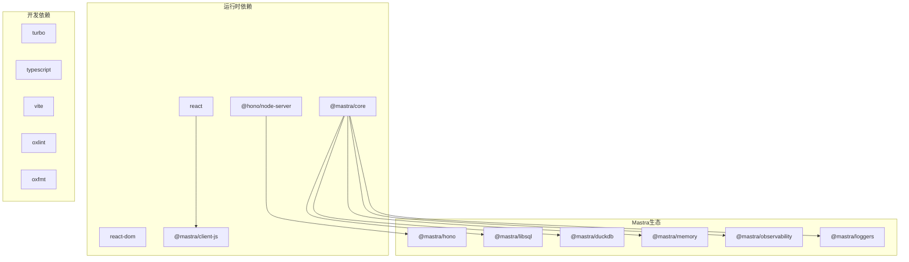

# Mastra代理系统

## 目录
1. [简介](#简介)
2. [项目结构](#项目结构)
3. [核心组件](#核心组件)
4. [架构概览](#架构概览)
5. [详细组件分析](#详细组件分析)
6. [依赖关系分析](#依赖关系分析)
7. [性能考虑](#性能考虑)
8. [故障排除指南](#故障排除指南)
9. [结论](#结论)

## 简介

Mastra代理系统是一个基于现代Web技术构建的全栈AI代理平台，采用Monorepo架构设计。该系统结合了Mastra AI框架的强大功能与Hono微服务框架的高效性，为开发者提供了一个完整的AI代理解决方案。

系统的核心特点包括：
- **全栈架构**：前端使用React + TypeScript，后端基于Hono + Mastra
- **实时流式处理**：支持AI代理的实时响应和工具调用
- **多代理管理**：支持多个AI代理的注册、发现和调度
- **工作流编排**：提供复杂任务的工作流执行能力
- **可观测性**：内置日志记录和性能监控
- **存储抽象**：支持多种存储后端的组合使用

## 项目结构

该项目采用Turborepo进行多包管理，整体结构清晰且模块化：

## 核心组件

### Mastra核心配置

系统的核心配置集中在`apps/server/src/mastra/index.ts`文件中，定义了完整的AI代理生态系统：

### 服务器入口点

主服务器通过Hono框架启动，集成了CORS支持和统一的日志记录机制：

## 架构概览

系统采用分层架构设计，确保各组件职责明确且松耦合：

## 详细组件分析

### 天气代理系统

天气代理是系统中的核心示例组件，展示了完整的AI代理工作流程：

#### 代理配置分析

天气代理具有以下关键特性：
- **指令优化**：专门针对天气查询和活动建议的提示词设计
- **工具集成**：内置天气工具，支持实时天气数据获取
- **记忆功能**：使用Memory类保持对话上下文
- **模型选择**：使用agnes/agnes-2.0-flash模型

#### 工具实现细节

天气工具提供了完整的天气数据获取能力：

### 工作流编排系统

系统实现了复杂的工作流编排能力，支持多步骤的任务执行：

#### 工作流步骤设计

工作流包含两个主要步骤：

1. **天气数据获取步骤** (`fetch-weather`)
   - 使用地理位置API获取经纬度
   - 调用天气API获取详细气象数据
   - 数据标准化和聚合

2. **活动规划步骤** (`plan-activities`)
   - 基于天气预报生成活动建议
   - 结构化输出格式化
   - 代理流式响应处理

### 前端交互界面

前端应用提供了丰富的用户交互体验，集成了多种UI组件：

#### 用户界面特性

前端应用包含以下核心功能：
- **实时聊天界面**：支持流式消息显示
- **代理选择**：动态切换不同的AI代理
- **工作流执行**：可视化的工作流操作界面
- **思考链展示**：显示AI的推理过程
- **工具调用跟踪**：可视化工具调用和结果

## 依赖关系分析

系统采用了现代化的依赖管理策略，确保开发效率和运行性能：

### 包管理策略

系统使用pnpm作为包管理器，配合Turborepo实现高效的构建缓存：

- **Monorepo管理**：统一的依赖版本控制
- **增量构建**：基于变更的智能构建策略
- **类型安全**：严格的TypeScript配置
- **代码质量**：集成的linting和格式化工具

## 性能考虑

系统在设计时充分考虑了性能优化：

### 流式处理优化
- **实时响应**：使用流式API实现实时消息传递
- **内存管理**：及时清理已完成的请求资源
- **并发控制**：限制同时进行的请求数量

### 存储性能
- **复合存储**：结合LibSQL和DuckDB的优势
- **数据缓存**：智能的数据缓存策略
- **查询优化**：针对AI场景的查询优化

### 网络优化
- **API代理**：统一的API代理配置
- **连接复用**：HTTP连接池管理
- **超时控制**：合理的超时设置

## 故障排除指南

### 常见问题诊断

#### 代理无法启动
1. **检查环境变量**：确认AGNES_API_KEY和AGNES_BASE_URL已正确设置
2. **验证网络连接**：确保能够访问外部API服务
3. **查看日志输出**：检查服务器启动日志中的错误信息

#### 工作流执行失败
1. **输入验证**：确认工作流输入参数的有效性
2. **API限流**：检查外部API的调用频率限制
3. **代理状态**：验证相关代理是否正常运行

#### 前端通信问题
1. **CORS配置**：确认服务器的CORS设置允许前端域名
2. **API路径**：验证VITE_API_BASE_URL配置正确
3. **代理配置**：检查开发环境下的API代理设置

## 结论

Mastra代理系统是一个设计精良的全栈AI代理平台，展现了现代Web开发的最佳实践。系统的主要优势包括：

### 技术优势
- **架构清晰**：分层设计确保了良好的可维护性
- **功能完整**：从基础代理到复杂工作流的全栈支持
- **性能优秀**：流式处理和智能缓存提升用户体验
- **扩展性强**：模块化设计便于功能扩展

### 应用价值
- **开发效率**：提供开箱即用的AI代理解决方案
- **学习价值**：完整的示例代码便于理解和学习
- **生产就绪**：经过验证的架构适合实际项目使用

### 发展方向
系统为进一步发展提供了良好的基础，可以在以下方面继续完善：
- 增强多模态支持
- 扩展更多预置的AI代理
- 优化大规模部署能力
- 加强安全性和权限控制