# React 适配器系统

## 目录

1. [简介](#简介)
2. [项目结构](#项目结构)
3. [核心组件](#核心组件)
4. [架构概览](#架构概览)
5. [详细组件分析](#详细组件分析)
6. [新增组件详解](#新增组件详解)
7. [AI 对话管理系统](#ai-对话管理系统)
8. [样式现代化系统](#样式现代化系统)
9. [依赖关系分析](#依赖关系分析)
10. [性能考虑](#性能考虑)
11. [故障排除指南](#故障排除指南)
12. [结论](#结论)

## 简介

React 适配器系统是 AgentKit UI 组件库的核心桥梁，负责将基于 Lit 的 Web Components 无缝转换为 React 组件。该系统采用现代化的架构设计，支持完整的类型安全、事件映射和样式系统集成。

**更新** 基于最新的应用变更，系统新增了多个专业组件支持，包括文件上传面板、分组对话列表、级联建议选择和受控思考过程扩展等功能。这些增强功能显著提升了系统的专业性和用户体验。**更新** 图标系统从 lucide-static 迁移到 lucide 包，实现树摇优化，大幅减小包体积。思考组件动画从透明度闪烁升级为渐变扫掠动画，提供更流畅的视觉体验。运动动画定义整合到 think 组件内部，实现更好的模块化和性能优化。

### 核心优势

1. **现代化样式系统**：采用 Tailwind CSS v4 全局样式，支持原子化设计和主题定制
2. **统一设计令牌**：通过 CSS 自定义属性实现跨组件的主题一致性
3. **增强动画效果**：集成 tw-animate-css 动画库，提供流畅的过渡和交互反馈
4. **暗色主题支持**：完整的暗色模式适配，支持系统级主题切换
5. **组件样式现代化**：所有核心组件采用现代化的设计语言和交互模式
6. **性能优化**：样式注入优化，避免重复样式和内存泄漏
7. **可访问性增强**：改进的焦点管理和键盘导航支持
8. **响应式设计**：全面的响应式布局支持，适配各种屏幕尺寸
9. **专业组件生态**：提供完整的专业 UI 组件解决方案
10. **框架无关性**：useXChat Hook 可在 React/Vue/Lit 或任何框架中使用
11. **按需加载支持**：可选组件支持按需导入，减少包体积
12. **事件系统优化**：改进的事件命名和映射机制，避免命名冲突
13. **流式渲染增强**：优化的定时器管理和取消机制，提升性能和稳定性
14. **图标系统现代化**：lucide 包树摇优化，仅打包所需图标，大幅减小包体积
15. **动画系统升级**：渐变扫掠动画提供更流畅的视觉体验
16. **运动动画整合**：动画定义模块化，提升代码组织和维护性

## 项目结构

该项目采用 Turborepo 驱动的 Monorepo 结构，精心组织了开发工具链和构建配置：

```mermaid
graph TB
subgraph "根目录"
RootPkg[package.json]
TSConfig[tsconfig.base.json]
Turbo[turbo.json]
end
subgraph "应用层"
WebApp[apps/web/]
WebPkg[apps/web/package.json]
end
subgraph "包层"
UIPkg[packages/ui/]
TypesPkg[packages/types/]
UtilsPkg[packages/utils/]
SDKPkg[packages/sdk/]
subgraph "UI包内部"
UIIndex[src/index.ts]
ReactAdaptor[src/adaptor/react.ts]
ReactPluginsAdaptor[src/adaptor/react-plugins.ts]
SharedDir[src/shared/]
Icons[icons.ts - lucide 包]
Motion[motion.ts - 动画定义]
Actions[actions.ts]
Sources[sources.ts]
FileCard[file-card.ts]
Notification[notification.ts]
Conversations[conversations.ts]
ThoughtChain[thought-chain.ts]
Suggestion[suggestion.ts]
CodeHighlighter[code-highlighter.ts]
Markdown[markdown.ts]
XCard[x-card.ts]
XProvider[x-provider.ts]
SenderSwitch[sender-switch.ts]
Attachments[attachments.ts]
Mermaid[mermaid.ts]
Folder[folder.ts]
Sender[sender.ts]
Bubble[bubble.ts]
Think[think.ts - 渐变扫掠动画]
subgraph "样式系统"
TailwindGlobal[styles/tailwind.global.css]
TailwindMixin[shared/tailwindMixin.ts]
DesignTokens[shared/tokens.ts]
end
end
subgraph "SDK包内部"
SDKIndex[src/index.ts]
UseXChat[use-x-chat.ts]
XRequest[x-request.ts]
end
subgraph "共享组件"
BaseElement[src/shared/base-element.ts]
CNFunc[src/shared/cn.ts]
end
RootPkg --> WebApp
RootPkg --> UIPkg
RootPkg --> TypesPkg
RootPkg --> UtilsPkg
RootPkg --> SDKPkg
WebPkg --> WebApp
UIPkg --> UIIndex
UIIndex --> ReactAdaptor
UIIndex --> ReactPluginsAdaptor
UIIndex --> Icons
UIIndex --> Motion
UIIndex --> Actions
UIIndex --> Sources
UIIndex --> FileCard
UIIndex --> Notification
UIIndex --> Conversations
UIIndex --> ThoughtChain
UIIndex --> Suggestion
UIIndex --> CodeHighlighter
UIIndex --> Markdown
UIIndex --> XCard
UIIndex --> XProvider
UIIndex --> SenderSwitch
UIIndex --> Attachments
UIIndex --> Mermaid
UIIndex --> Folder
UIIndex --> Sender
UIIndex --> Bubble
UIIndex --> Think
ReactAdaptor --> BaseElement
ReactPluginsAdaptor --> CodeHighlighter
ReactPluginsAdaptor --> Markdown
BaseElement --> TailwindMixin
TailwindMixin --> TailwindGlobal
TailwindMixin --> DesignTokens
TailwindMixin --> Motion
SDKPkg --> SDKIndex
SDKIndex --> UseXChat
SDKIndex --> XRequest
```

## 核心组件

### React 适配器核心架构

React 适配器系统的核心是将 Lit Web Components 转换为 React 组件的统一机制。每个适配器都使用 `@lit/react` 的 `createComponent` 函数来创建 React 包装器。

```mermaid
classDiagram
class ReactAdaptor {
+createComponent(config) ReactComponent
+tagName string
+elementClass LitElement
+events object
}
class ReactPluginsAdaptor {
+CodeHighlighter ReactComponent
+Markdown ReactComponent
+tagName string
+elementClass LitElement
+events object
}
class AkButton {
+connectedCallback() void
+disconnectedCallback() void
}
class AkWelcome {
+title string
+description string
+variant string
}
class AkPrompts {
+items PromptsItem[]
+columns number
+onItemClick event
}
class AkThink {
+title string
+expanded boolean
+blink boolean
+onToggle event
}
class AkBubble {
+content string
+placement string
+loading boolean
+typing boolean
+streaming boolean
+onTyping event
+onTypingComplete event
}
class AkSender {
+placeholder string
+loading boolean
+disabled boolean
+submitType string
+maxRows number
+onSubmit event
+onCancel event
+onChange event
}
class AkActions {
+items ActionsItem[]
+variant string
+onActionClick event
}
class AkSources {
+items SourceItem[]
+mode string
+onSourceClick event
}
class AkFileCard {
+name string
+size number
+status string
+progress number
+onRemove event
}
class AkNotification {
+placement string
+open() void
+close() void
}
class AkConversations {
+items ConversationItem[]
+title string
+activeKey string
+groupable boolean
+creation boolean
+onConversationClick event
}
class AkThoughtChain {
+items ThoughtChainItem[]
+collapsible boolean
+collapsed boolean
+typingSpeed number
+lineStyle string
+itemVariant string
+onToggle event
}
class AkSuggestion {
+items SuggestionItem[]
+open boolean
+filterValue string
+onSelect event
}
class AkXCard {
+items XCardItem[]
+onCardLoad event
+onCardClose event
}
class AkXProvider {
+prefixCls string
+direction string
+theme string
+connectedCallback() void
+updated() void
}
class AkSenderSwitch {
+checked boolean
+disabled boolean
+label string
+onChange event
}
class AkAttachments {
+files AttachmentFile[]
+accept string
+multiple boolean
+maxCount number
+placeholder string
+onUpload event
+onRemove event
}
class AkMermaid {
+code string
+view string
+theme string
+onRender event
}
class AkFolder {
+items FolderItem[]
+activeKey string
+treeWidth number
+onSelect event
}
ReactAdaptor --> AkButton : "包装"
ReactAdaptor --> AkWelcome : "包装"
ReactAdaptor --> AkPrompts : "包装"
ReactAdaptor --> AkThink : "包装"
ReactAdaptor --> AkBubble : "包装"
ReactAdaptor --> AkSender : "包装"
ReactAdaptor --> AkActions : "包装"
ReactAdaptor --> AkSources : "包装"
ReactAdaptor --> AkFileCard : "包装"
ReactAdaptor --> AkNotification : "包装"
ReactAdaptor --> AkConversations : "包装"
ReactAdaptor --> AkThoughtChain : "包装"
ReactAdaptor --> AkSuggestion : "包装"
ReactAdaptor --> AkXCard : "包装"
ReactAdaptor --> AkXProvider : "包装"
ReactAdaptor --> AkSenderSwitch : "包装"
ReactAdaptor --> AkAttachments : "包装"
ReactAdaptor --> AkMermaid : "包装"
ReactAdaptor --> AkFolder : "包装"
ReactPluginsAdaptor --> CodeHighlighter : "包装"
ReactPluginsAdaptor --> Markdown : "包装"
```

### 事件映射机制

适配器系统实现了智能的事件名称转换，将 React 的驼峰命名转换为 Web Components 的 kebab-case 事件格式：

| React 事件名        | Web Components 事件名 | 用途               | 组件类型               |
| ------------------- | --------------------- | ------------------ | ---------------------- |
| onItemClick         | item-click            | 快捷提示点击事件   | AkPrompts              |
| onExpand            | expand                | 思考过程展开事件   | AkThink                |
| onTyping            | typing                | 文本打字开始事件   | AkBubble               |
| onTypingComplete    | typing-complete       | 文本打字完成事件   | AkBubble               |
| onSubmit            | submit                | 消息发送提交事件   | AkSender               |
| onCancel            | sender-cancel         | 消息发送取消事件   | AkSender               |
| onChange            | change                | 输入框内容变化事件 | AkSender/SenderSwitch  |
| onActionClick       | action-click          | 动作按钮点击事件   | AkActions              |
| onSourceClick       | source-click          | 参考来源点击事件   | AkSources              |
| onRemove            | remove                | 文件移除事件       | AkFileCard/Attachments |
| onConversationClick | conversation-click    | 对话选择事件       | AkConversations        |
| onSelect            | select                | 建议项选择事件     | AkSuggestion/Folder    |
| onCardLoad          | card-load             | 卡片加载事件       | AkXCard                |
| onCardClose         | card-close            | 卡片关闭事件       | AkXCard                |
| onUpload            | upload                | 文件上传事件       | AkAttachments          |
| onCopy              | copy                  | 代码复制事件       | AkCodeHighlighter      |
| onOpenChange        | open-change           | 发送器头部展开事件 | AkSenderHeader         |
| onToggle            | toggle                | 思考过程切换事件   | AkThoughtChain         |

**更新** 发送器组件事件命名从'cancel'更新为'sender-cancel'，以避免与其他组件的取消事件产生命名冲突。这一变更确保了事件系统的唯一性和准确性。新增的 AkSenderHeader 组件使用 'open-change' 事件来处理头部面板的展开/收起状态变化。

## 架构概览

### 整体系统架构

```mermaid
graph TB
subgraph "React 应用层"
App[App.tsx]
Main[main.tsx]
end
subgraph "适配器层"
ReactAdaptor[React Adaptor]
ReactPluginsAdaptor[React Plugins Adaptor]
EventMapper[事件映射器]
TypeSystem[类型系统]
SDKLayer[SDK 层]
end
subgraph "Web Components 层"
LitComponents[Lit Components]
BaseElement[AkElement 基类]
TailwindMixin[TW Mixin]
Icons[Lucide 图标系统]
Motion[运动动画系统]
NewComponents[新增组件集合]
OptionalComponents[可选组件集合]
ContextProvider[XProvider Context]
StyleSystem[样式现代化系统]
end
subgraph "样式层"
TailwindCSS[Tailwind CSS v4]
GlobalStyles[全局样式]
DesignTokens[设计令牌]
Animation[动画系统]
DarkTheme[暗色主题]
end
subgraph "SDK 层"
UseXChat[useXChat Hook]
XRequest[XRequest 流式请求]
</subgraph>
App --> ReactAdaptor
App --> ReactPluginsAdaptor
ReactAdaptor --> LitComponents
ReactPluginsAdaptor --> OptionalComponents
ReactAdaptor --> NewComponents
ReactAdaptor --> SDKLayer
ReactAdaptor --> ContextProvider
SDKLayer --> UseXChat
SDKLayer --> XRequest
LitComponents --> BaseElement
NewComponents --> BaseElement
OptionalComponents --> BaseElement
ContextProvider --> BaseElement
BaseElement --> TailwindMixin
TailwindMixin --> TailwindCSS
TailwindMixin --> DesignTokens
TailwindMixin --> Motion
TailwindCSS --> DarkTheme
TailwindCSS --> GlobalStyles
Icons --> Motion
```

### 数据流处理

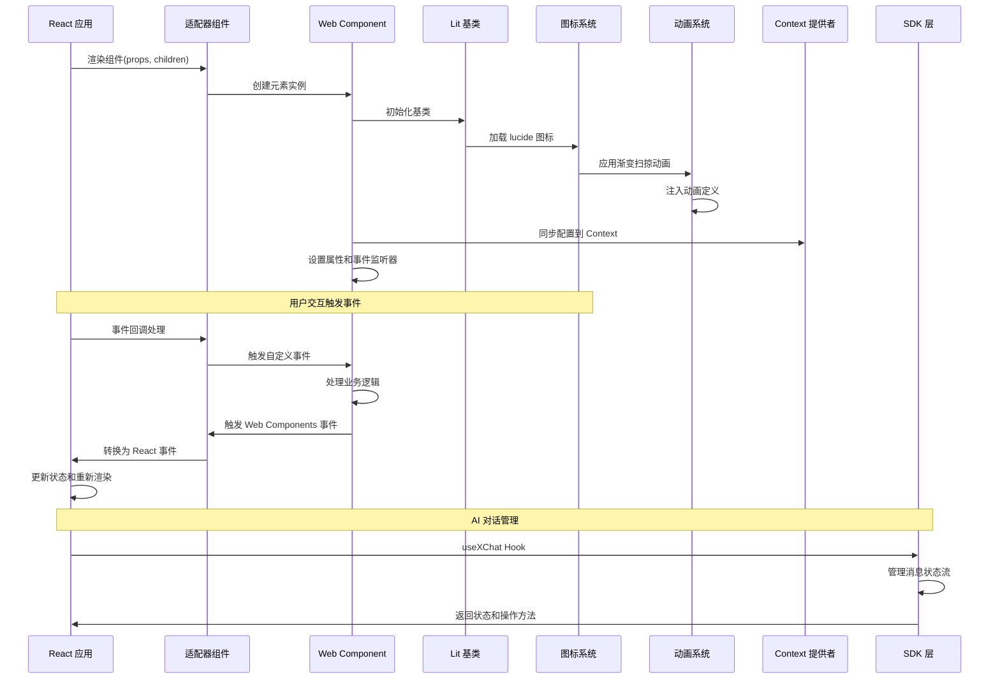

## 详细组件分析

### AkElement 基础类

AkElement 是所有 AgentKit UI 组件的基类，继承自 Tailwind 混入的 LitElement：

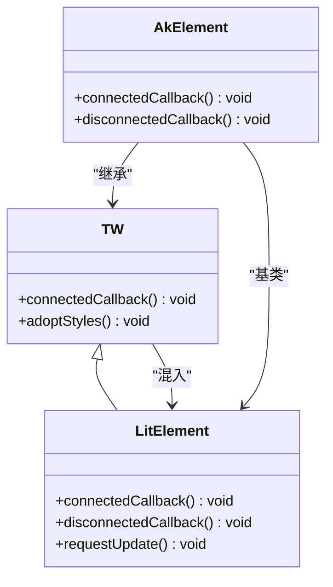

### Tailwind 样式系统

Tailwind Mixin 提供了智能的样式注入机制，确保每个组件都能正确应用 Tailwind CSS 样式：

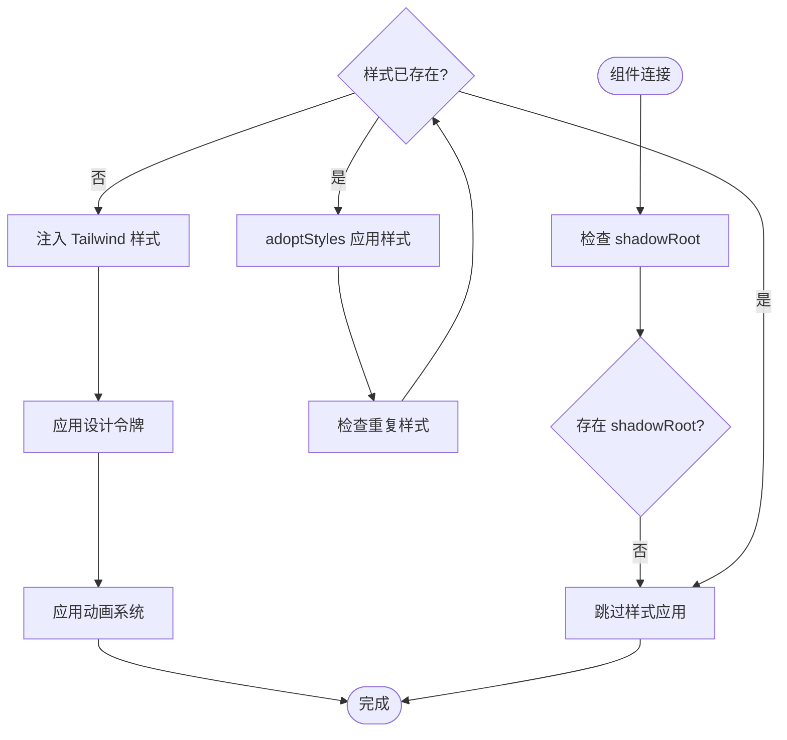

### 事件处理流程

每个适配器组件都实现了特定的事件处理逻辑，确保与 React 的事件系统兼容：

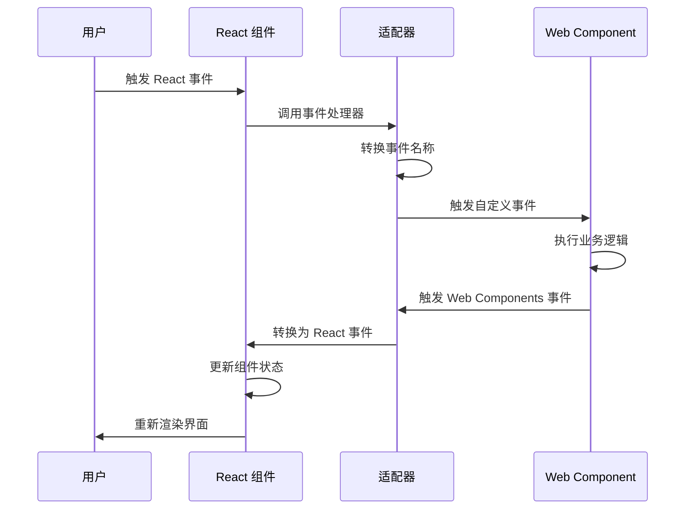

### Lucide 图标系统

**更新** 图标系统已从 lucide-static 迁移到 lucide 包，实现树摇优化：

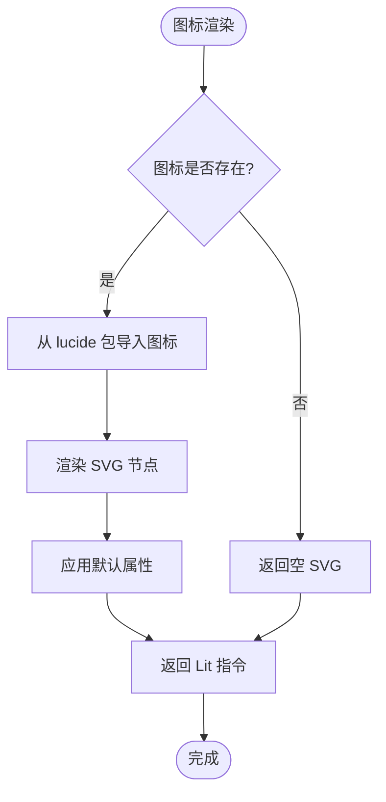

#### 树摇优化特性

- **按需导入**：仅导入实际使用的图标，实现 Tree Shaking
- **包体积优化**：从 714KB 的完整 icon-nodes.json 减少到仅 8KB 的 30 个图标
- **类型安全**：完整的 TypeScript 类型定义
- **性能提升**：减少首屏加载时间和内存占用

### 渐变扫掠动画系统

**更新** 思考组件动画从透明度闪烁升级为渐变扫掠动画：

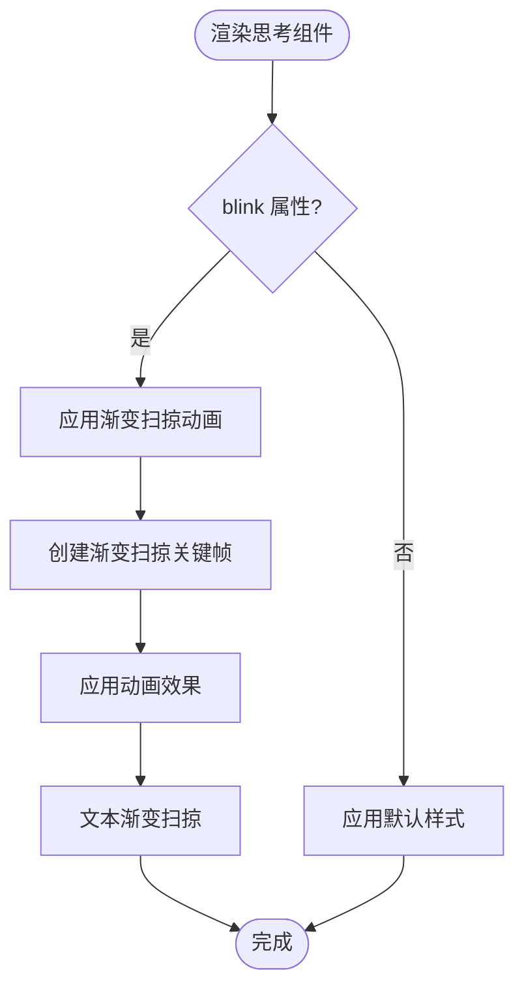

#### 渐变扫掠动画特性

- **视觉效果**：渐变高亮从左到右扫掠文本
- **性能优化**：使用 CSS 动画而非 JavaScript 动画
- **可配置性**：支持 blink 属性控制动画启停
- **流式渲染**：在流式渲染状态下提供视觉反馈

### 运动动画整合

**更新** 运动动画定义从独立文件移动到 think 组件内部：

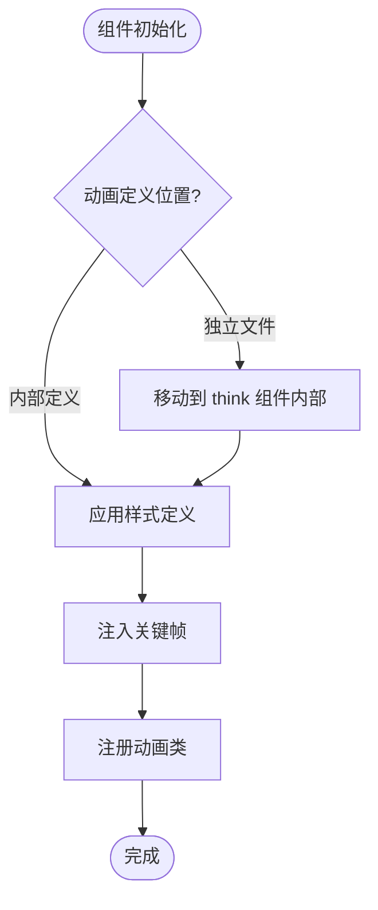

#### 模块化优势

- **代码组织**：动画定义与组件紧密耦合
- **维护性**：减少跨文件依赖
- **性能**：避免重复注入相同动画定义
- **可扩展性**：支持组件特定的动画定制

## 新增组件详解

### AkSender 组件增强

AkSender 组件新增了 SenderHeader 子组件支持，提供可折叠的文件上传面板功能：

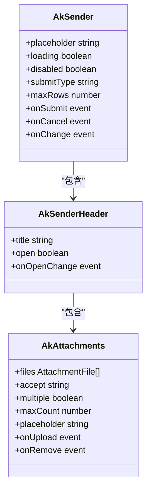

#### SenderHeader 子组件功能

- **可折叠面板**：支持标题显示和展开/收起功能
- **状态管理**：通过 open 属性控制面板可见性
- **事件处理**：使用 open-change 事件通知父组件状态变化
- **插槽支持**：作为 ak-sender 的 header 插槽使用

#### 文件上传集成

在 App.tsx 中的使用示例展示了完整的文件上传工作流：

```typescript
<Sender>
  <SenderHeader
    slot="header"
    title="上传文件"
    open={attachmentsOpen}
    onOpenChange={(e: Event) => {
      const detail = (e as CustomEvent).detail;
      setAttachmentsOpen(detail?.open ?? false);
    }}
  >
    <Attachments
      files={files}
      placeholder="拖拽文件到此处，或点击上传"
      onUpload={handleUpload}
      onRemove={handleRemoveFile}
    />
  </SenderHeader>
</Sender>
```

### AkConversations 组件增强

AkConversations 组件新增了 groupable 属性，支持分组对话列表功能：

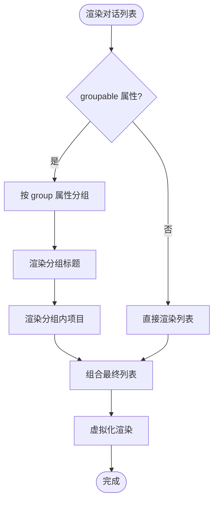

#### 分组功能实现

- **分组数据结构**：支持 ConversationItem.group 属性进行分组
- **虚拟化渲染**：使用 @lit-labs/virtualizer 优化大数据量渲染
- **扁平化处理**：将分组数据转换为 FlatItem 结构用于渲染
- **键盘导航**：支持 up/down/enter 键盘快捷键

#### 使用示例

```typescript
<Conversations
  items={convItems}
  activeKey={activeKey}
  groupable
  onConversationClick={switchConversation}
/>
```

### AkSuggestion 组件增强

AkSuggestion 组件支持子项结构，实现级联选择功能：

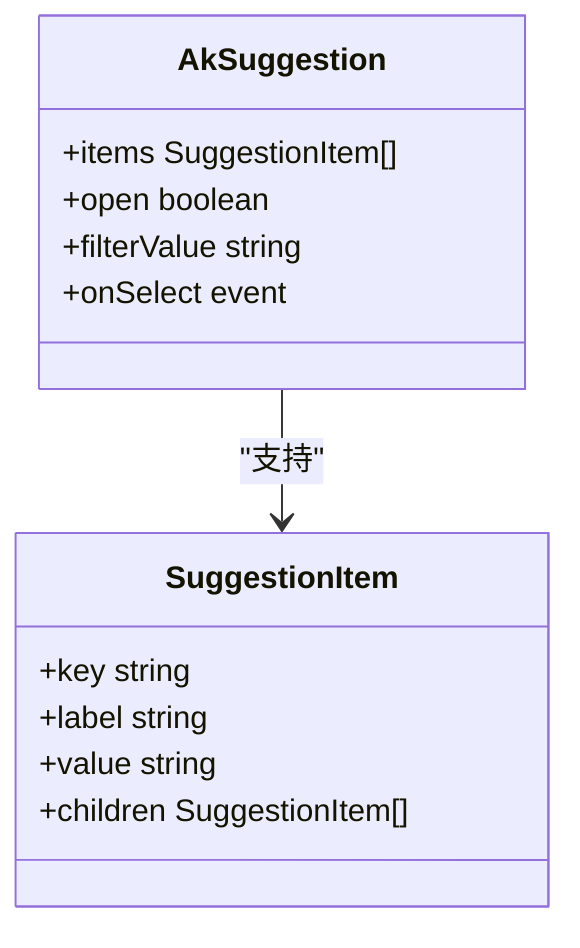

#### 级联选择功能

- **子项结构**：SuggestionItem 支持 children 属性定义子级选项
- **展开/收起**：点击有子项的建议项会展开子级菜单
- **过滤机制**：支持根据 filterValue 进行智能过滤
- **键盘导航**：支持鼠标悬停和键盘选择

#### 使用示例

```typescript
const MOCK_SUGGESTIONS: SuggestionItem[] = [
  {
    key: "knowledge",
    label: "查阅一些知识",
    value: "knowledge",
    children: [
      { key: "react", label: "关于 React", value: "react" },
      { key: "antd", label: "关于 Ant Design", value: "antd" },
    ],
  },
];
```

### AkThoughtChain 组件增强

AkThoughtChain 组件支持受控扩展状态，提供更灵活的控制方式：

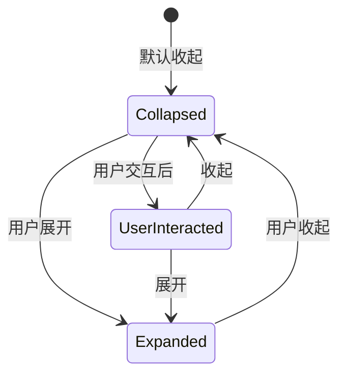

#### 受控状态管理

- **默认状态**：collapsed 属性控制组件初始展开/收起状态
- **用户交互**：\_userInteracted 状态标记用户是否已与组件交互
- **状态同步**：组件内部维护 \_internalCollapsed 状态
- **事件通知**：toggle 事件返回当前 collapsed 状态

#### 打字机效果

- **字符计时器**：每个项目的描述文本都有独立的打字计时器
- **流式渲染**：支持 typingSpeed 属性控制打字速度
- **自动清理**：组件卸载时自动清理所有计时器
- **延迟启动**：支持动画延迟，提升视觉效果

### AkXProvider - Context 提供者组件

AkXProvider 组件实现了类似 React Context 的配置传递机制，使用 @lit/context 替代传统的 CustomEvent 方式：

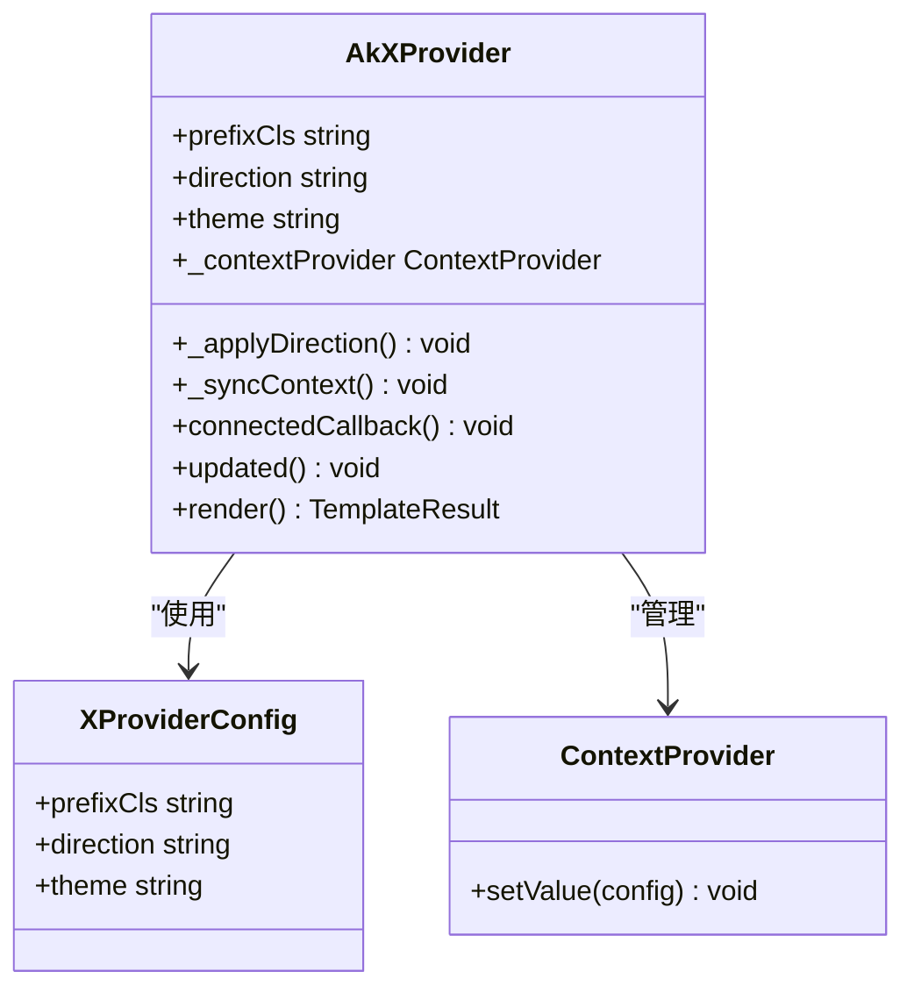

### AkSenderSwitch - 发送器切换开关

AkSenderSwitch 组件提供简单的切换按钮功能，用于与 Sender 组件配合使用：

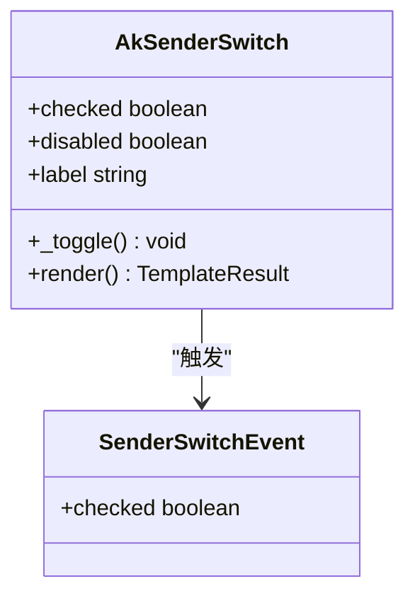

### AkAttachments - 附件上传组件

AkAttachments 组件提供文件上传功能，支持拖拽和文件选择：

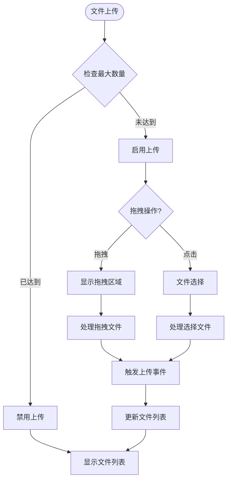

### AkMermaid - Mermaid 图表组件

AkMermaid 组件提供图表渲染功能，支持图表和代码双视图：

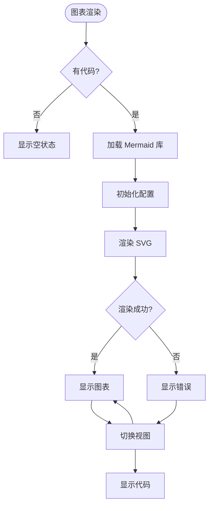

### AkFolder - 文件夹组件

AkFolder 组件提供文件夹树形结构和文件预览功能：

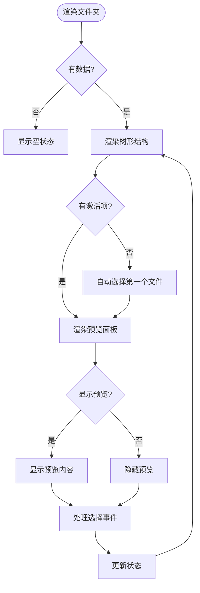

## AI 对话管理系统

### useXChat Hook - 对话状态管理

useXChat Hook 是 AgentKit SDK 的核心组件，提供框架无关的 AI 对话状态管理能力。它支持消息状态流转、流式更新和错误处理。

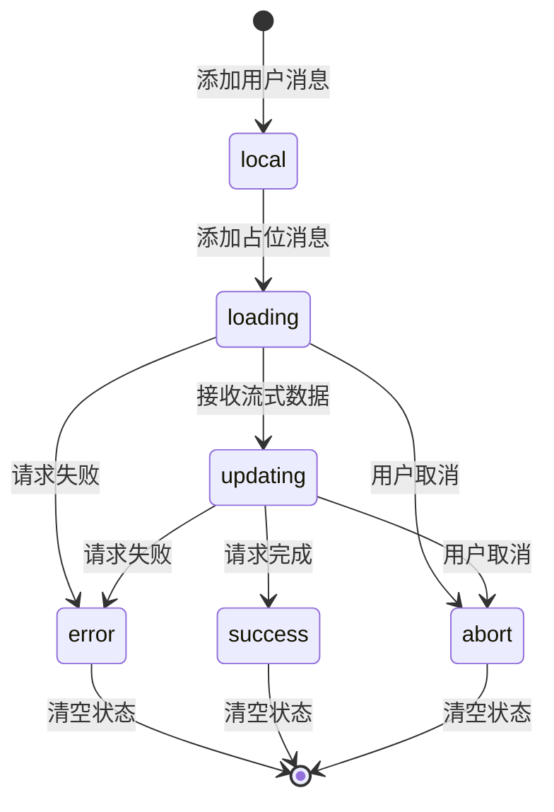

#### 核心功能

1. **消息状态管理**：支持 local → loading → updating → success/error/abort 的完整状态流转
2. **流式更新**：支持增量内容追加，实现打字机效果
3. **错误处理**：提供 requestFallback 配置，支持自定义错误消息
4. **请求控制**：支持请求取消、中止和状态查询

#### 使用示例

```typescript
// 基础用法
const chat = useXChat({
  defaultMessages: [],
  requestPlaceholder: "正在思考...",
});

// 用户发送消息
const assistantId = chat.onRequest({ prompt: "Hello" }, "Hello");

// 流式接收内容
chat.appendToMessage(assistantId, "Hi there!");
chat.appendToMessage(assistantId, " How can I help?");

// 完成请求
chat.setStatus(assistantId, "success");
```

### XRequest - 流式请求管理器

XRequest 提供了强大的流式请求管理能力，支持 SSE 和 JSON 两种模式：

```mermaid
flowchart TD
Start([发起请求]) --> CheckStream{启用流式?}
CheckStream --> |是| HandleStream[处理 SSE 流]
CheckStream --> |否| HandleJSON[处理 JSON 响应]
HandleStream --> ParseSSE[解析 SSE 数据]
ParseSSE --> ProcessChunk[处理数据块]
ProcessChunk --> Callbacks[触发回调]
HandleJSON --> ParseJSON[解析 JSON 数据]
ParseJSON --> Callbacks
Callbacks --> Success[请求成功]
Callbacks --> Error[请求失败]
Success --> End([完成])
Error --> End
```

#### 特性支持

1. **SSE 流式支持**：实时接收服务器推送的数据
2. **超时控制**：支持整体超时和流式超时
3. **请求取消**：基于 AbortController 的请求取消机制
4. **中间件支持**：请求/响应中间件和自定义解析器

### React 集成指南

要在 React 应用中使用 AI 对话管理功能，可以按照以下步骤进行集成：

1. **安装依赖**：

```bash
npm install @agentkit/sdk
```

2. **基础集成**：

```typescript
import { useXChat } from "@agentkit/sdk";

function ChatComponent() {
  const chat = useXChat({
    defaultMessages: [],
    requestPlaceholder: "正在思考...",
  });

  const handleSendMessage = (message: string) => {
    const assistantId = chat.onRequest({ prompt: message }, message);
    // 模拟流式响应
    simulateStreamingResponse(assistantId);
  };

  const simulateStreamingResponse = (id: string) => {
    const responses = ["你好！", "很高兴认识你。", "有什么我可以帮助你的吗？"];
    responses.forEach((chunk, index) => {
      setTimeout(() => {
        chat.appendToMessage(id, chunk);
        if (index === responses.length - 1) {
          chat.setStatus(id, "success");
        }
      }, (index + 1) * 500);
    });
  };

  return (
    <div>
      {chat.messages.map((msg) => (
        <div key={msg.id}>{msg.message}</div>
      ))}
      <button onClick={() => handleSendMessage("你好")}>
        发送消息
      </button>
    </div>
  );
}
```

3. **高级集成**（结合现有 UI 组件）：

```typescript
import { useXChat } from "@agentkit/sdk";
import { Bubble, Sender } from "@agentkit/ui/adaptor/react";

function EnhancedChat() {
  const chat = useXChat({
    defaultMessages: [],
    requestPlaceholder: "正在思考...",
    requestFallback: (error) => `请求失败: ${error.message}`,
  });

  const handleSend = (e: CustomEvent) => {
    const value = e.detail.value;
    if (!value) return;

    const assistantId = chat.onRequest({ prompt: value }, value);

    // 处理流式响应
    processStreamResponse(assistantId);
  };

  const processStreamResponse = (id: string) => {
    // 这里可以集成实际的流式 API
    const mockResponses = [
      "正在分析你的问题...",
      "基于我的知识库，",
      "这个问题涉及多个方面。",
      "让我为你提供详细的解答。"
    ];

    mockResponses.forEach((chunk, index) => {
      setTimeout(() => {
        chat.appendToMessage(id, chunk);
        if (index === mockResponses.length - 1) {
          chat.setStatus(id, "success");
        }
      }, (index + 1) * 1000);
    });
  };

  return (
    <div>
      {chat.messages.map((msg) => (
        <Bubble
          key={msg.id}
          content={msg.message}
          placement={msg.role === "user" ? "end" : "start"}
          loading={msg.status === "loading"}
        />
      ))}
      <Sender
        placeholder="输入消息..."
        loading={chat.isLoading}
        onSubmit={handleSend}
        onCancel={handleCancel}
      />
    </div>
  );
}
```

**更新** 发送器组件的取消事件现在使用'sender-cancel'事件名，需要相应更新事件处理逻辑。

## 样式现代化系统

### Tailwind CSS v4 全局样式系统

AgentKit UI 系统引入了全新的 Tailwind CSS v4 全局样式系统，提供现代化的设计语言和主题支持：

```mermaid
flowchart TD
Start([应用启动]) --> LoadTailwind["加载 Tailwind CSS v4"]
LoadTailwind --> ApplyTheme["应用主题配置"]
ApplyTheme --> DefineTokens["定义设计令牌"]
DefineTokens --> SetupAnimations["设置动画系统"]
SetupAnimations --> InjectStyles["注入全局样式"]
InjectStyles --> ApplyComponents["应用组件样式"]
ApplyComponents --> EnableDarkMode["启用暗色模式"]
EnableDarkMode --> Complete([完成])
```

### 设计令牌系统

系统采用 CSS 自定义属性实现统一的设计令牌，确保跨组件的主题一致性：

```mermaid
classDiagram
class DesignTokens {
--color-primary : oklch(0.216 0.006 56.043)
--color-secondary : oklch(0.97 0.001 106.424)
--color-background : oklch(1 0 0)
--color-foreground : oklch(0.147 0.004 49.25)
--radius-lg : 0.5rem
--font-size-base : 14px
}
class ComponentStyles {
+ak-bubble-content
+ak-sender
+ak-attachments
+ak-conversations
}
DesignTokens --> ComponentStyles : "提供样式变量"
```

### 动画增强系统

**更新** 集成 tw-animate-css 动画库，为组件提供流畅的过渡效果：

```mermaid
flowchart LR
UserInteraction[用户交互] --> TriggerAnimation[触发动画]
TriggerAnimation --> ApplyTransition[应用过渡效果]
ApplyTransition --> AnimateElements[动画元素]
AnimateElements --> ApplyTransform[应用变换]
ApplyTransform --> CompleteAnimation[完成动画]
```

### 暗色主题支持

完整的暗色模式适配，支持系统级主题切换：

```mermaid
flowchart TD
SystemTheme[系统主题检测] --> DarkModeEnabled{暗色模式启用?}
DarkModeEnabled --> |是| ApplyDarkTheme[应用暗色主题]
DarkModeEnabled --> |否| ApplyLightTheme[应用亮色主题]
ApplyDarkTheme --> UpdateColors[更新颜色变量]
ApplyLightTheme --> UpdateColors
UpdateColors --> RebuildStyles[重建样式]
RebuildStyles --> Complete([完成])
```

### 核心组件样式现代化

所有核心组件都经过了样式现代化改造，采用统一的设计语言：

#### AkBubble - 消息气泡组件

- **现代化外观**：采用圆角设计和阴影效果
- **动画增强**：淡入动画和打字机效果
- **状态指示**：加载状态和打字光标
- **布局优化**：支持左右对齐和头像显示

#### AkSender - 发送器组件

- **现代化输入框**：圆角边框和阴影效果
- **状态反馈**：聚焦状态和禁用状态
- **按钮设计**：圆形发送按钮和取消按钮
- **交互优化**：Enter/Shift+Enter 快捷键支持

#### AkAttachments - 附件上传组件

- **拖拽区域**：虚线边框和悬停效果
- **文件列表**：卡片式设计和进度条
- **状态指示**：上传中、成功、错误状态
- **交互反馈**：悬停和点击效果

#### AkConversations - 对话列表组件

- **列表设计**：卡片式布局和悬停效果
- **状态指示**：活动状态和禁用状态
- **图标系统**：统一的图标设计
- **滚动优化**：垂直滚动和触摸支持

## 依赖关系分析

### 包依赖图

```mermaid
graph TB
subgraph "外部依赖"
Lit[lit ^3.3.3]
LitReact["@lit/react ^1.0.8"]
React[react >=18]
Tailwind[tailwindcss ^4.3.1]
ClassVar[class-variance-authority ^0.7.1]
HighlightJS[highlight.js ^17.0.0]
Marked[marked ^18.0.5]
Endash3[lit-html ^3.3.3]
Endash4[lucide ^1.21.0]
Endash5[tw-animate-css ^1.4.0]
Endash6[tailwind-merge ^3.6.0]
Endash7[clsx ^2.1.1]
Endash8["@lit-labs/motion ^1.1.0"]
Endash9["@lit-labs/signals ^0.3.0"]
Endash10["@lit-labs/virtualizer ^2.1.1"]
Endash11["@lit/context ^1.0.0"]
Endash12[mermaid ^10.0.0]
end
subgraph "内部包"
Types["@agentkit/types"]
Utils["@agentkit/utils"]
UI["@agentkit/ui"]
SDK["@agentkit/sdk"]
WebApp["@agentkit/web"]
end
WebApp --> UI
WebApp --> Types
WebApp --> Utils
WebApp --> SDK
UI --> Lit
UI --> LitReact
UI --> React
UI --> Tailwind
UI --> ClassVar
UI --> Endash3
UI --> Endash4
UI --> Endash5
UI --> Endash6
UI --> Endash7
UI --> Endash8
UI --> Endash9
UI --> Endash10
UI --> Endash11
UI --> Endash12
SDK --> Types
```

**更新** 将 lucide-static 依赖更新为 lucide 包，实现树摇优化。新增 @lit/context 依赖用于 Context 提供者功能，新增 mermaid 依赖用于图表渲染。将 highlight.js 和 marked 从 dependencies 移至 peerDependencies，支持按需安装。新增 tw-animate-css 依赖用于动画效果。

### 版本管理策略

系统采用了严格的版本管理策略，确保依赖关系的一致性和可预测性：

| 依赖包                   | 版本范围 | 用途                | 说明                                  |
| ------------------------ | -------- | ------------------- | ------------------------------------- |
| lit                      | ^3.3.3   | Web Components 核心 | 提供响应式 Web Components 基础        |
| @lit/react               | ^1.0.8   | React 适配器        | 实现 React 与 Web Components 的桥接   |
| react                    | >=18     | React 运行时        | 主要的前端框架                        |
| tailwindcss              | ^4.3.1   | 样式框架            | 提供原子化 CSS 类                     |
| class-variance-authority | ^0.7.1   | 组件变体系统        | 支持组件样式的条件变体                |
| highlight.js             | >=11     | 代码语法高亮        | 提供多语言语法高亮支持                |
| marked                   | >=14     | Markdown 解析器     | 支持 Markdown 渲染                    |
| @lit/context             | ^1.0.0   | Context 提供者      | 支持响应式上下文传递                  |
| mermaid                  | ^10.0.0  | 图表渲染            | 支持 Mermaid 图表渲染                 |
| tw-animate-css           | ^1.4.0   | 动画库              | 提供 CSS 动画支持                     |
| lit-html                 | ^3.3.3   | HTML 模板引擎       | 提供 lit-html 模板支持                |
| lucide                   | ^1.21.0  | 图标库              | 提供 30 个精选 SVG 图标，支持树摇优化 |
| tailwind-merge           | ^3.6.0   | 样式合并            | 支持 Tailwind 类名合并                |
| clsx                     | ^2.1.1   | 类名合并            | 支持条件类名合并                      |
| @lit-labs/motion         | ^1.1.0   | 动画增强            | 提供 Lit 动画支持                     |
| @lit-labs/signals        | ^0.3.0   | 响应式信号          | 提供响应式状态管理                    |
| @lit-labs/virtualizer    | ^2.1.1   | 虚拟化              | 提供大数据量渲染优化                  |

**更新** 将 lucide-static 更新为 lucide 包，实现树摇优化，仅打包 30 个图标（约 8KB）。新增 @lit/context 和 mermaid 依赖，highlight.js 和 marked 现在作为 peerDependencies，需要在应用层面单独安装。新增 tw-animate-css 依赖用于动画效果。

## 性能考虑

### 渲染优化策略

1. **懒加载和按需导入**：React 适配器支持按需加载，只有在实际使用时才加载对应的 Web Components
2. **样式缓存机制**：Tailwind Mixin 实现了样式去重，避免重复注入相同的样式规则
3. **事件委托优化**：通过统一的事件映射机制减少事件监听器的数量
4. **虚拟滚动支持**：新增组件支持大数据量的虚拟滚动优化
5. **防抖节流机制**：输入相关组件实现防抖节流，提升用户体验
6. **流式渲染优化**：useXChat Hook 支持增量更新，避免全量重新渲染
7. **可选组件分离**：react-plugins 子包支持按需加载，减少初始包体积
8. **Context 缓存机制**：XProvider 使用 @lit/context 实现高效的上下文传递
9. **图表懒加载**：Mermaid 组件支持懒加载，避免不必要的资源消耗
10. **定时器管理优化**：改进的流式渲染定时器管理，支持精确的取消和清理
11. **样式现代化优化**：Tailwind CSS v4 提供更高效的样式生成和缓存
12. **动画性能优化**：tw-animate-css 提供硬件加速的动画效果
13. **设计令牌缓存**：CSS 自定义属性实现快速的主题切换
14. **暗色模式优化**：系统级暗色模式支持，减少运行时计算开销
15. **文件上传优化**：Attachments 组件支持文件预览和进度跟踪
16. **分组列表优化**：Conversations 组件使用虚拟化渲染提升性能
17. **级联选择优化**：Suggestion 组件支持智能过滤和展开控制
18. **思考动画优化**：渐变扫掠动画使用 CSS 动画而非 JavaScript 动画
19. **图标系统优化**：lucide 包树摇优化，仅打包所需图标
20. **运动动画整合**：动画定义模块化，减少重复注入

### 内存管理

- 组件销毁时自动清理事件监听器和样式注入
- 使用 WeakRef 和适当的垃圾回收策略避免内存泄漏
- Shadow DOM 的自动生命周期管理
- 新增组件的定时器自动清理机制
- SDK 层面的消息状态管理优化
- peerDependencies 机制避免重复安装大型库
- Context 提供者的自动清理机制
- **更新** 改进的流式渲染定时器管理，支持批量清理和内存优化
- **更新** Tailwind 样式注入的去重机制，避免重复样式注入
- **更新** 设计令牌的缓存机制，提升主题切换性能
- **更新** 文件上传组件的内存优化，避免大文件内存泄漏
- **更新** 分组对话列表的虚拟化优化，提升大数据量渲染性能
- **更新** 图标系统的内存优化，树摇减少内存占用
- **更新** 渐变扫掠动画的内存优化，使用 CSS 动画减少 JavaScript 开销

## 故障排除指南

### 常见问题及解决方案

1. **组件不显示或样式缺失**
   - 检查 Tailwind CSS 是否正确编译
   - 确认 Shadow DOM 样式注入是否成功
   - 验证 @property 规则是否正确应用
   - **更新** 检查 Tailwind CSS v4 全局样式是否正确加载

2. **事件无法正常工作**
   - 确认事件名称转换是否正确
   - 检查自定义事件是否正确触发
   - 验证 React 事件处理器绑定
   - **更新** 检查发送器组件的取消事件是否使用'sender-cancel'而非'cancel'
   - **更新** 检查 SenderHeader 组件的 open-change 事件是否正确处理

3. **新增组件功能异常**
   - 检查新增组件的依赖是否正确安装
   - 确认事件映射配置是否完整
   - 验证组件属性传递是否正确
   - 检查 Context 提供者是否正确配置
   - **更新** 检查文件上传组件的事件处理是否正确
   - **更新** 检查分组对话列表的 groupable 属性是否正确
   - **更新** 检查级联建议选择的子项结构是否正确
   - **更新** 检查受控思考过程的状态管理是否正确
   - **更新** 检查渐变扫掠动画是否正常工作

4. **AI 对话管理功能异常**
   - 检查 useXChat Hook 的初始化配置
   - 确认消息状态流转是否正确
   - 验证流式更新机制是否正常工作
   - 检查 XRequest 配置和网络连接
   - **更新** 验证流式渲染定时器是否正确清理
   - **更新** 检查受控状态的切换逻辑是否正确

5. **可选组件导入失败**
   - 确认已安装 highlight.js 和 marked
   - 检查 react-plugins 子包的正确导入路径
   - 验证 peerDependencies 的版本兼容性

6. **性能问题**
   - 检查是否有重复的样式注入
   - 确认组件是否正确卸载
   - 监控事件监听器数量
   - 检查新增组件的内存使用情况
   - 验证流式数据处理的性能
   - 确可选组件的按需加载是否生效
   - 检查 Context 提供者的性能影响
   - **更新** 监控 Tailwind 样式注入的性能影响
   - **更新** 检查设计令牌缓存的效率
   - **更新** 验证动画系统的性能表现
   - **更新** 检查文件上传组件的性能优化
   - **更新** 监控分组列表的虚拟化性能
   - **更新** 检查图标系统的性能影响
   - **更新** 验证渐变扫掠动画的性能表现

7. **Context 功能异常**
   - 确认 XProvider 是否正确包裹子组件
   - 检查 Context 配置是否正确传递
   - 验证 @lit/context 的版本兼容性
   - 确认子组件是否正确消费 Context

8. **流式渲染问题**
   - **新增** 检查定时器是否正确清理，避免内存泄漏
   - 验证流式数据的增量更新机制
   - 确认取消操作是否正确中断流式处理
   - 检查流式超时和错误处理机制
   - **更新** 验证受控状态的流式渲染性能

9. **样式现代化问题**
   - **新增** 检查 Tailwind CSS v4 是否正确编译
   - 验证设计令牌是否正确应用
   - 确认暗色模式切换是否正常
   - 检查动画效果是否流畅
   - 验证响应式设计是否正确实现
   - **更新** 检查新增组件的样式兼容性
   - **更新** 验证图标系统的样式表现

10. **文件上传问题**
    - **新增** 检查文件类型和大小限制
    - 验证拖拽事件处理是否正确
    - 确认文件预览功能是否正常
    - 检查上传进度显示是否准确

11. **分组对话问题**
    - **新增** 检查 group 属性是否正确设置
    - 验证分组标题渲染是否正确
    - 确认虚拟化渲染性能是否达标
    - 检查键盘导航功能是否正常

12. **级联选择问题**
    - **新增** 检查子项结构是否符合 SuggestionItem 接口
    - 验证展开/收起逻辑是否正确
    - 确认过滤功能是否按预期工作
    - 检查事件冒泡和处理机制

13. **受控状态问题**
    - **新增** 检查 collapsed 和 expanded 属性的同步
    - 验证用户交互对状态的影响
    - 确认计时器的自动管理机制
    - 检查状态切换的动画效果

14. **图标系统问题**
    - **新增** 检查 lucide 包是否正确安装
    - 验证图标导入是否正确
    - 确认树摇优化是否生效
    - 检查图标渲染性能

15. **渐变扫掠动画问题**
    - **新增** 检查 blink 属性是否正确传递
    - 验证 CSS 动画是否正常播放
    - 确认动画性能是否流畅
    - 检查动画与流式渲染的协调

## 结论

React 适配器系统成功地解决了 Web Components 与 React 生态系统之间的兼容性问题。通过精心设计的适配器架构和智能的事件映射机制，该系统为开发者提供了无缝的开发体验。

**更新** 新增 XProvider Context 提供者组件，支持 React Context 风格的配置传递，替代传统的 CustomEvent 方式。新增 8 个专业组件：SenderSwitch、Attachments、Mermaid、Folder 等，扩展了系统的功能边界。引入 AgentKit SDK，提供 useXChat Hook 和 XRequest 流式请求管理器，为 React 应用提供完整的 AI 对话管理能力。**更新** 图标系统从 lucide-static 迁移到 lucide 包，实现树摇优化，大幅减小包体积。思考组件动画从透明度闪烁升级为渐变扫掠动画，提供更流畅的视觉体验。运动动画定义整合到 think 组件内部，实现更好的模块化和性能优化。App 组件新增 blink 参数支持渐变扫掠动画效果，在流式渲染状态下提供视觉反馈。**更新** 发送器组件事件命名从'cancel'改为'sender-cancel'以避免命名冲突，同时增强了流式渲染的定时器管理和取消机制，提升了系统的稳定性和性能。**更新** 引入 Tailwind CSS v4 全局样式系统，提供现代化的设计语言、统一的设计令牌、暗色主题支持和动画增强，所有核心组件都经过了样式现代化改造，采用统一的设计语言和交互模式。

### 主要优势

1. **高度兼容性**：支持所有标准的 Web Components 特性
2. **性能优化**：利用 Shadow DOM 和现代浏览器特性
3. **类型安全**：完整的 TypeScript 支持和类型定义
4. **易于扩展**：模块化的架构便于添加新的组件
5. **功能丰富**：新增组件涵盖文件管理、通知、对话、思考链、建议、代码高亮、动态卡片、Context 提供者等场景
6. **AI 对话管理**：提供完整的对话状态管理和流式请求处理能力
7. **框架无关**：useXChat Hook 可在 React/Vue/Lit 或任何框架中使用
8. **按需加载**：可选组件支持按需导入，减少包体积
9. **灵活的依赖管理**：peerDependencies 机制支持应用层面的版本控制
10. **现代化架构**：支持新的组件生命周期模式和 Context 提供者架构
11. **专业组件生态**：提供完整的专业 UI 组件解决方案
12. **事件系统优化**：改进的事件命名和映射机制，避免命名冲突
13. **流式渲染增强**：优化的定时器管理和取消机制，提升性能和稳定性
14. **样式现代化**：引入 Tailwind CSS v4 全局样式系统，提供现代化的设计语言和主题支持
15. **设计令牌统一**：通过 CSS 自定义属性实现跨组件的主题一致性
16. **动画增强**：集成 tw-animate-css 动画库，提供流畅的过渡效果
17. **暗色主题支持**：完整的暗色模式适配，支持系统级主题切换
18. **组件样式现代化**：所有核心组件采用现代化的设计语言和交互模式
19. **文件上传增强**：新增 SenderHeader 和 Attachments 组件，提供完整的文件上传工作流
20. **分组对话支持**：Conversations 组件支持 groupable 属性，实现分组对话列表
21. **级联选择功能**：Suggestion 组件支持子项结构，实现智能级联选择
22. **受控状态管理**：Think 组件支持受控扩展状态，提供更灵活的控制方式
23. **图标系统现代化**：lucide 包树摇优化，仅打包所需图标，大幅减小包体积
24. **动画系统升级**：渐变扫掠动画提供更流畅的视觉体验
25. **运动动画整合**：动画定义模块化，提升代码组织和维护性

### 技术创新点

- 智能的事件名称转换机制
- 自动化的样式注入和管理
- 完整的类型定义支持
- 高效的组件封装和复用
- 增强的交互体验和用户界面
- 流式数据处理和状态管理
- 完整的错误处理和恢复机制
- 分离的可选组件架构
- 优化的依赖关系管理
- Context 提供者架构
- 专业组件生态系统
- **更新** 改进的事件命名策略，避免命名冲突
- **更新** 增强的流式渲染性能优化
- **更新** Tailwind CSS v4 全局样式系统
- **更新** 设计令牌统一化管理
- **更新** 动画系统集成和优化
- **更新** 暗色主题完整支持
- **更新** 组件样式现代化改造
- **更新** 文件上传工作流集成
- **更新** 分组对话列表支持
- **更新** 级联选择功能实现
- **更新** 受控状态管理机制
- **更新** 图标系统树摇优化
- **更新** 渐变扫掠动画实现
- **更新** 运动动画模块化整合

该系统为 Web Components 在 React 生态中的广泛应用奠定了坚实的基础，是现代前端开发的重要基础设施。新增组件和 AI 对话管理系统的加入进一步完善了整个生态系统，为开发者提供了更丰富的UI组件选择和强大的对话管理能力。react-plugins 子包的引入使得系统更加模块化和灵活，支持不同应用场景下的按需使用。XProvider Context 提供者的引入标志着系统向现代化架构迈出了重要一步，为复杂的组件间通信提供了更好的解决方案。**更新** 发送器组件事件命名的规范化和流式渲染性能的优化，进一步提升了系统的可靠性和用户体验。样式现代化系统的引入为整个 UI 组件库带来了全新的设计语言和用户体验，所有组件都经过了精心的样式优化和交互改进。**更新** Tailwind CSS v4 的引入、设计令牌的统一、动画系统的增强、暗色主题的支持、图标系统的树摇优化、渐变扫掠动画的实现和运动动画的模块化整合，共同构成了一个现代化、可定制、高性能的 UI 组件库。新增的专业组件功能（文件上传、分组对话、级联选择、受控状态）显著提升了系统的专业性和用户体验，使其能够满足更复杂的应用场景需求。
