# Tailwind CSS 样式系统

## 目录

1. [简介](#简介)
2. [项目结构](#项目结构)
3. [核心组件](#核心组件)
4. [架构概览](#架构概览)
5. [详细组件分析](#详细组件分析)
6. [设计令牌系统](#设计令牌系统)
7. [CSS-in-JS 样式系统](#css-in-js-样式系统)
8. [现代化动画系统](#现代化动画系统)
9. [输入动画重构](#输入动画重构)
10. [依赖关系分析](#依赖关系分析)
11. [性能考虑](#性能考虑)
12. [故障排除指南](#故障排除指南)
13. [结论](#结论)

## 简介

AgentKit 是一个基于 React 和 Lit Web Components 构建的现代化前端框架，专门集成了 Tailwind CSS 样式系统。该项目采用 Monorepo 架构，通过 Turborepo 进行构建管理和依赖优化。系统的核心特色包括：

- **设计令牌系统**：完整的 CSS 自定义属性主题管理，支持浅色和深色模式
- **CSS-in-JS 样式方案**：采用 styled-components 模式和现代化动画系统
- **Tailwind CSS v4 集成**：完整的原子化 CSS 框架支持
- **Lit Web Components**：高性能的 Web 组件库
- **TypeScript 类型安全**：完整的类型定义支持
- **现代化构建工具**：Vite + Turborepo 的高效开发体验
- **CVA 组件变体系统**：基于 class-variance-authority 的组件变体架构
- **全局 Tailwind 样式系统**：统一的主题管理和样式注入机制
- **现代化暗色模式支持**：增强的深色模式变体定义和颜色管理
- **响应式网格布局**：支持动态列数控制的灵活布局系统
- **智能类名合并**：基于 tailwind-merge 的冲突避免机制
- **CSS-in-JS 注入机制**：通过 Lit 的 adoptStyles API 实现样式注入
- **上下文系统**：基于 @lit/context 的响应式主题配置传递
- **流式内容动画系统**：支持打字光标动画和渐进式内容显示

该样式系统为整个应用提供了统一的设计语言和视觉一致性，通过设计令牌（Design Tokens）实现了主题定制和品牌色彩管理。最新的架构升级引入了现代化的组件变体系统、CSS-in-JS 样式方案、完整的上下文系统和先进的流式内容动画系统，提供了更好的类型安全性和代码组织结构。

## 项目结构

项目采用 Monorepo 结构，主要包含以下核心目录：

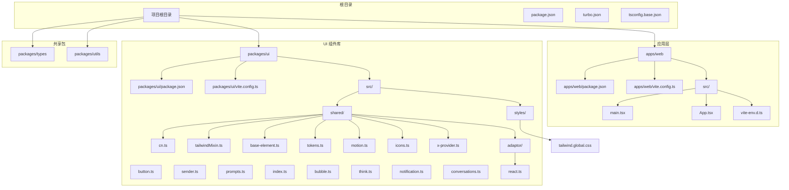

## 核心组件

### 设计令牌系统

**更新** 新增完整的 tokens.ts 设计令牌系统，提供统一的 CSS 自定义属性主题管理。

#### 设计令牌架构

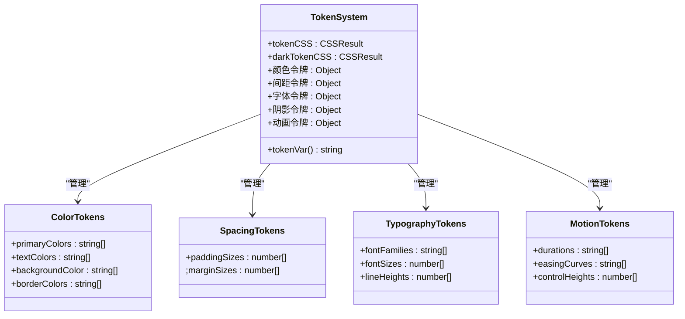

#### 深色模式支持

**更新** 完整的深色模式令牌覆盖，支持自动主题切换。

```mermaid
graph LR
subgraph "浅色模式令牌"
LightPrimary[#1677ff]
LightText[rgba(0, 0, 0, 0.88)]
LightBackground[#ffffff]
LightBorder[#d9d9d9]
LightShadow[box-shadow]
end
subgraph "深色模式令牌"
DarkPrimary[#1668dc]
DarkText[rgba(255, 255, 255, 0.85)]
DarkBackground[#141414]
DarkBorder[#424242]
DarkShadow[box-shadow]
end
subgraph "主题切换机制"
XProvider[ak-x-provider]
DarkClass[.dark 类]
HostDark[:host(.dark) 选择器]
end
LightPrimary --> XProvider
DarkPrimary --> HostDark
LightText --> DarkClass
DarkText --> XProvider
LightBackground --> HostDark
DarkBackground --> DarkClass
```

### CSS-in-JS 样式架构

**更新** 升级 CSS-in-JS 样式注入机制，通过 Tailwind Mixin 和 tokens 注入实现。

#### 样式注入系统

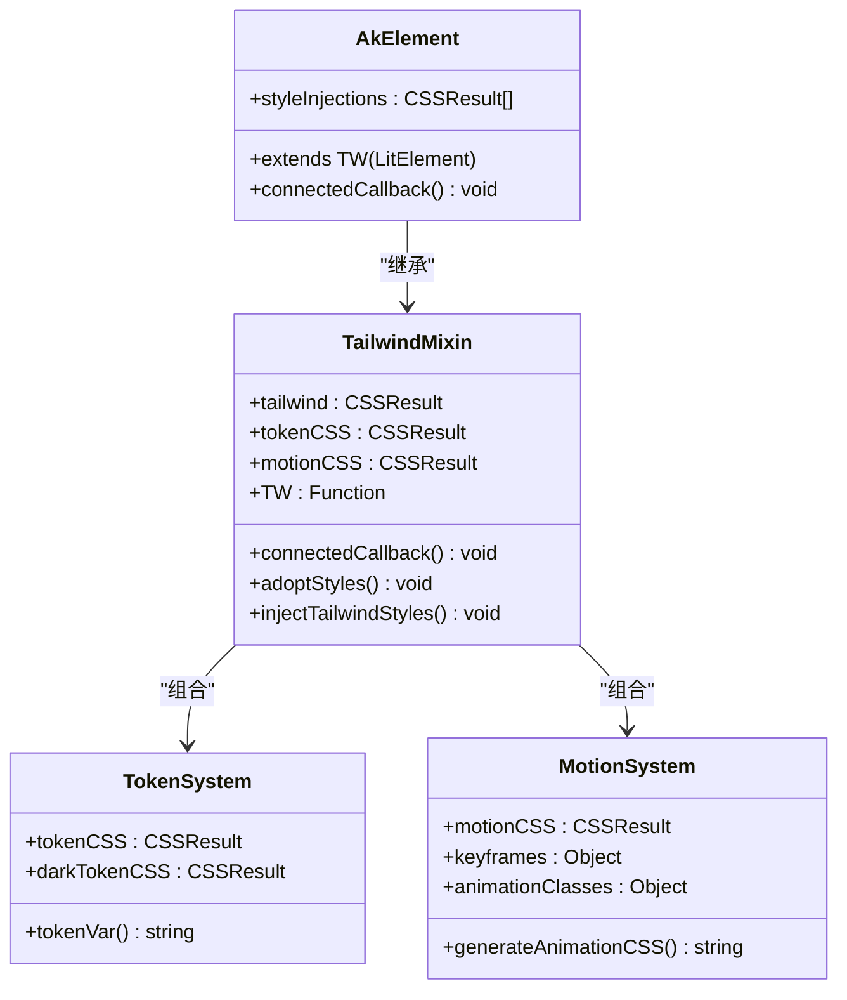

#### 全局 Tailwind 样式系统

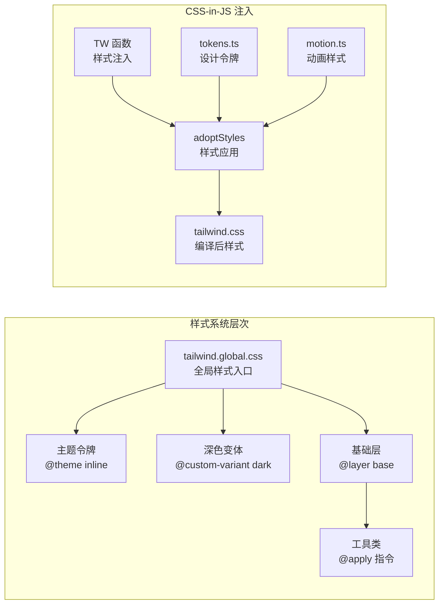

## 架构概览

### 整体架构设计

```mermaid
graph TB
subgraph "用户界面层"
ReactApp[React 应用]
WebComponents[Web Components]
AkButton[AkButton 组件]
AkSender[AkSender 组件]
AkPrompts[AkPrompts 组件]
AkBubble[AkBubble 组件]
AkThink[AkThink 组件]
AkNotification[AkNotification 组件]
AkConversations[AkConversations 组件]
AkXProvider[AkXProvider 组件]
end
subgraph "CSS-in-JS 样式层"
CSSInJS[CSS-in-JS 样式方案]
StyledComponents[styled-components 模式]
MotionSystem[现代化动画系统]
TailwindMixin[TW 混入函数]
TokenSystem[设计令牌系统]
GlobalTailwind[全局 Tailwind 样式]
ThemeSystem[主题系统]
DarkModeSystem[暗色模式系统]
AnimationClasses[动画类系统]
Keyframes[关键帧系统]
ContextSystem[上下文系统]
StreamAnimation[流式动画系统]
TypewriterCursor[打字光标动画]
StreamingContent[流式内容显示]
end
subgraph "构建工具层"
Vite[Vite 构建器]
Turborepo[Turborepo 缓存]
TypeScript[TypeScript 编译]
DTS[声明文件生成]
end
subgraph "外部依赖"
Lit[Lit Web Components]
TailwindCSS[Tailwind CSS v4]
DesignTokens[设计令牌]
AtomicClasses[原子类]
OklchColors[Oklch 颜色空间]
DynamicClasses[动态类名系统]
CSSInJSDependencies[CSS-in-JS 依赖]
ContextAPI["@lit/context"]
StreamDependencies["@lit/task"]
end
ReactApp --> WebComponents
WebComponents --> AkButton
WebComponents --> AkSender
WebComponents --> AkPrompts
WebComponents --> AkBubble
WebComponents --> AkThink
WebComponents --> AkNotification
WebComponents --> AkConversations
WebComponents --> AkXProvider
AkButton --> StyledComponents
AkSender --> CSSInJS
AkPrompts --> CSSInJS
AkBubble --> MotionSystem
AkThink --> AnimationClasses
AkNotification --> Keyframes
AkConversations --> TailwindMixin
AkXProvider --> ContextSystem
AkBubble --> StreamAnimation
AkThink --> StreamAnimation
AkSender --> StreamingContent
StreamAnimation --> TypewriterCursor
TypewriterCursor --> StreamingContent
TailwindMixin --> GlobalTailwind
GlobalTailwind --> ThemeSystem
ThemeSystem --> DarkModeSystem
DarkModeSystem --> OklchColors
AnimationClasses --> DynamicClasses
Keyframes --> CSSInJSDependencies
ContextSystem --> ContextAPI
StreamDependencies --> @lit/task
Vite --> TailwindCSS
Vite --> DTS
Turborepo --> Vite
TypeScript --> Vite
Lit --> WebComponents
TailwindCSS --> AtomicClasses
CSSInJSDependencies --> StyledComponents
ContextAPI --> WebComponents
```

### 样式系统工作流程

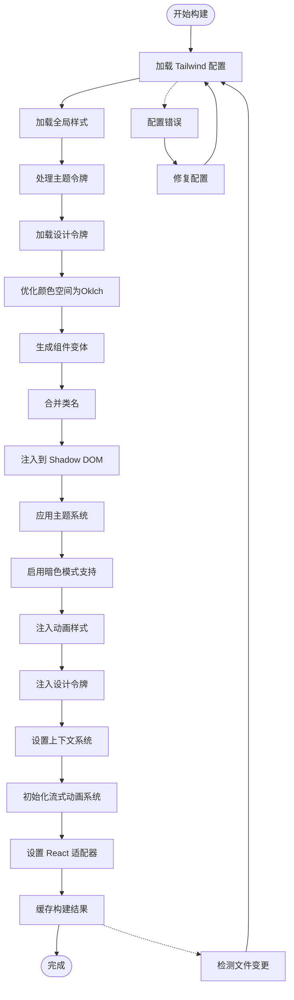

## 详细组件分析

### UI 组件库架构

#### 现代化组件导出系统

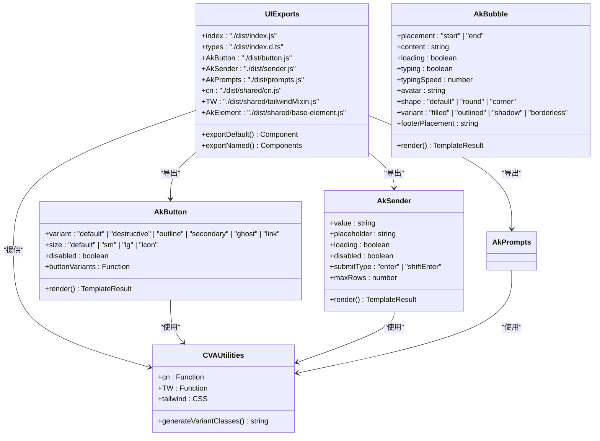

#### 样式文件组织结构

```mermaid
graph LR
subgraph "样式文件层次"
GlobalCSS[tailwind.global.css<br/>全局样式入口]
ThemeTokens["主题令牌<br/>@theme inline"]
DarkVariant["深色变体<br/>@custom-variant dark"]
BaseLayer["基础层<br/>@layer base"]
UtilityClasses["工具类<br/>@apply 指令"]
MotionCSS[motion.ts<br/>动画样式文件]
TokenCSS[tokens.ts<br/>设计令牌文件]
end
subgraph "工具函数层次"
CN[cn.ts<br/>类名合并]
TWMixin[tailwindMixin.ts<br/>样式混入]
BaseElement[base-element.ts<br/>基础元素]
CVA[button.ts<br/>组件变体]
Sender[sender.ts<br/>发送器组件]
Prompts[prompts.ts<br/>提示组件]
Bubble[bubble.ts<br/>气泡组件]
Think[think.ts<br/>思考组件]
Notification[notification.ts<br/>通知组件]
Conversations[conversations.ts<br/>会话组件]
Icons[icons.ts<br/>图标系统]
XProvider[x-provider.ts<br/>上下文提供者]
Adaptor[adaptor/<br/>React 适配器]
ReactTS[react.ts<br/>React 组件包装]
end
subgraph "编译产物"
DistJS[index.js<br/>组件导出]
DistDTS[index.d.ts<br/>类型定义]
DistCSS[index.css<br/>样式文件]
End
GlobalCSS --> ThemeTokens
GlobalCSS --> DarkVariant
GlobalCSS --> BaseLayer
BaseLayer --> UtilityClasses
MotionCSS --> DistCSS
TokenCSS --> DistCSS
CN --> DistJS
TWMixin --> DistJS
BaseElement --> DistJS
CVA --> DistJS
Sender --> DistJS
Prompts --> DistJS
Bubble --> DistJS
Think --> DistJS
Notification --> DistJS
Conversations --> DistJS
Icons --> DistJS
XProvider --> DistJS
Adaptor --> DistJS
ReactTS --> DistJS
IndexTS --> DistJS
ButtonTS --> DistJS
SenderTS --> DistJS
PromptsTS --> DistJS
BubbleTS --> DistJS
ThinkTS --> DistJS
NotificationTS --> DistJS
ConversationsTS --> DistJS
IconsTS --> DistJS
XProviderTS --> DistJS
DistJS --> DistDTS
GlobalCSS --> DistCSS
```

### 暗色模式样式系统

#### 增强的暗色模式支持

**更新** 引入了现代化的暗色模式变体定义，支持'.dark'类选择器和':host(.dark)'选择器，使用Oklch颜色空间优化颜色管理。

```mermaid
graph TB
subgraph "暗色模式变体系统"
DarkVariant["@custom-variant dark<br/>(&:is(.dark *), &:is(:host(.dark) *))]"
DarkSelector1[.dark<br/>类选择器]
DarkSelector2[:host(.dark)<br/>主机选择器]
OklchColors[Oklch 颜色空间<br/>oklch(l c h)]
ColorOptimization[颜色优化<br/>对比度和可访问性]
end
subgraph "颜色令牌系统"
LightTheme[浅色主题<br/>:root, :host]
DarkTheme[深色主题<br/>.dark, :host(.dark)]
ColorTokens[颜色令牌<br/>--_background, --_foreground]
end
DarkVariant --> DarkSelector1
DarkVariant --> DarkSelector2
DarkSelector1 --> LightTheme
DarkSelector2 --> DarkTheme
OklchColors --> ColorOptimization
ColorOptimization --> ColorTokens
```

#### Oklch 颜色空间优化

**更新** 所有颜色值现在使用Oklch颜色空间表示，提供更好的色彩均匀性和可预测性。

| 颜色类别 | 浅色主题值                | 深色主题值                 | Oklch 表示   |
| -------- | ------------------------- | -------------------------- | ------------ |
| 背景     | oklch(1 0 0)              | oklch(0.147 0.004 49.25)   | LCH 色彩空间 |
| 前景     | oklch(0.147 0.004 49.25)  | oklch(0.985 0.001 106.423) | 更佳对比度   |
| 主要     | oklch(0.216 0.006 56.043) | oklch(0.923 0.003 48.717)  | 品牌色彩     |
| 次要     | oklch(0.97 0.001 106.424) | oklch(0.268 0.007 34.298)  | 辅助色彩     |
| 边框     | oklch(0.923 0.003 48.717) | oklch(1 0 0 / 10%)         | 透明度调整   |

### 构建配置分析

#### Vite 构建配置

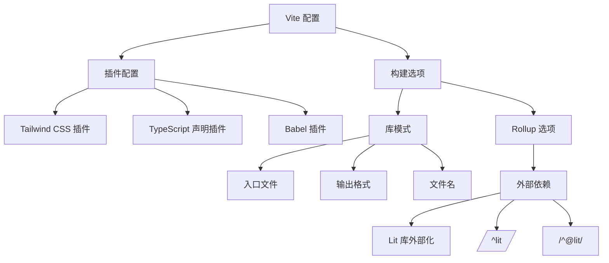

#### 类型系统配置

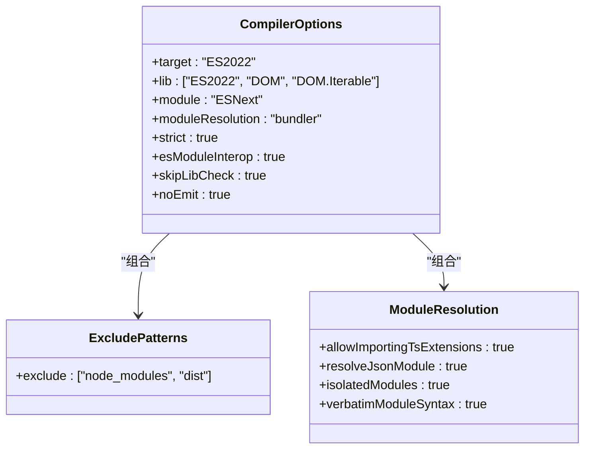

## 设计令牌系统

### 令牌定义与管理

**更新** 新增完整的 tokens.ts 设计令牌系统，提供统一的 CSS 自定义属性主题管理。

#### 颜色令牌系统

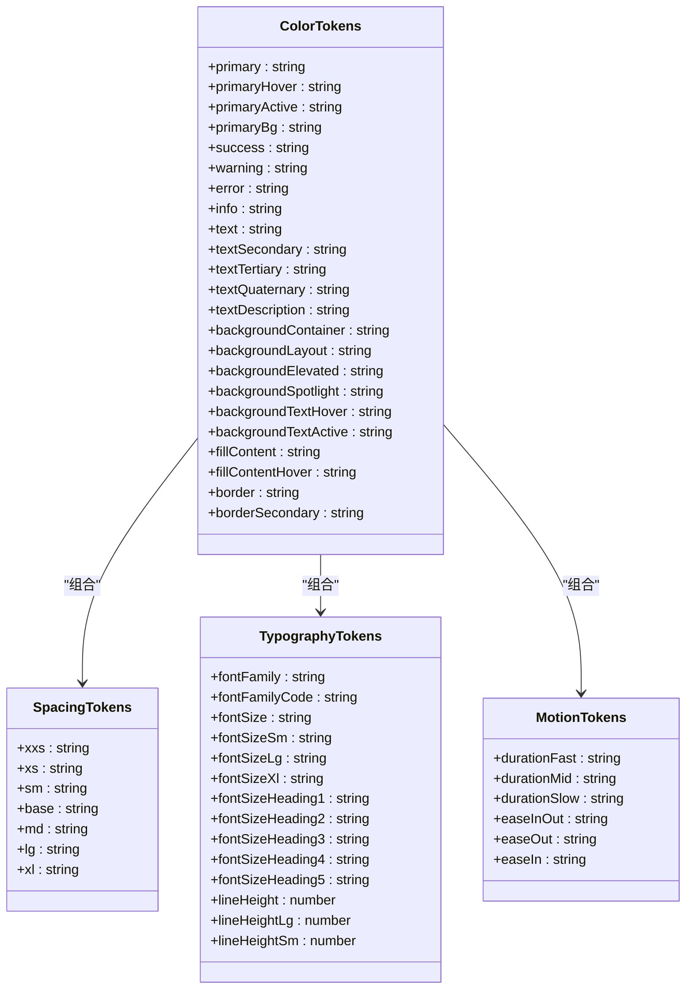

#### 深色模式令牌覆盖

**更新** 完整的深色模式令牌覆盖，支持自动主题切换。

```mermaid
graph TB
subgraph "浅色模式颜色"
LightPrimary[#1677ff]
LightText[rgba(0, 0, 0, 0.88)]
LightBackground[#ffffff]
LightBorder[#d9d9d9]
LightFill[rgba(0, 0, 0, 0.04)]
end
subgraph "深色模式颜色"
DarkPrimary[#1668dc]
DarkText[rgba(255, 255, 255, 0.85)]
DarkBackground[#141414]
DarkBorder[#424242]
DarkFill[rgba(255, 255, 255, 0.04)]
end
subgraph "令牌映射"
TokenMapping[CSS 自定义属性映射]
DarkOverride[深色模式覆盖]
ComponentSpecific[组件特定别名]
end
LightPrimary --> TokenMapping
DarkPrimary --> DarkOverride
LightText --> TokenMapping
DarkText --> DarkOverride
LightBackground --> TokenMapping
DarkBackground --> DarkOverride
LightBorder --> TokenMapping
DarkBorder --> DarkOverride
LightFill --> TokenMapping
DarkFill --> DarkOverride
TokenMapping --> ComponentSpecific
DarkOverride --> ComponentSpecific
```

#### 组件特定令牌

**更新** 为特定组件定义的令牌别名，简化组件样式使用。

| 组件类别 | 令牌名称                          | 默认值                           | 用途说明         |
| -------- | --------------------------------- | -------------------------------- | ---------------- |
| Bubble   | --ak-bubble-content-bg            | var(--ak-color-fill-content)     | 气泡内容背景色   |
| Bubble   | --ak-bubble-content-border-radius | var(--ak-border-radius-lg)       | 气泡圆角半径     |
| Sender   | --ak-sender-bg                    | var(--ak-color-bg-container)     | 发送器背景色     |
| Sender   | --ak-sender-border-radius         | var(--ak-border-radius-lg)       | 发送器圆角半径   |
| Think    | --ak-think-border-color           | var(--ak-color-border)           | 思考组件边框色   |
| Think    | --ak-think-text-color             | var(--ak-color-text-description) | 思考组件文字色   |
| Prompts  | --ak-prompts-item-bg              | var(--ak-color-bg-container)     | 提示项背景色     |
| Prompts  | --ak-prompts-item-border          | var(--ak-color-border-secondary) | 提示项边框色     |
| Prompts  | --ak-prompts-item-hover-bg        | var(--ak-color-bg-text-hover)    | 提示项悬停背景色 |

### 上下文系统集成

**更新** 新增 XProvider 上下文系统，支持响应式主题配置传递。

#### 上下文提供者架构

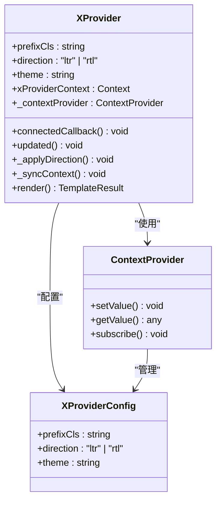

#### 上下文消费模式

**更新** 子组件通过 @consume 装饰器或 ContextConsumer controller 消费上下文。

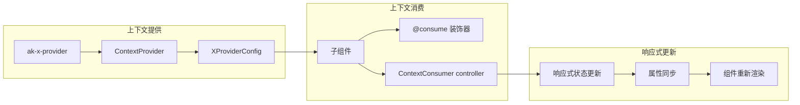

## CSS-in-JS 样式系统

### 样式注入机制

**更新** 引入了全新的 CSS-in-JS 样式方案，通过 Lit 的 adoptStyles API 实现样式注入，支持更灵活的样式管理和主题切换。

#### Tailwind Mixin 系统

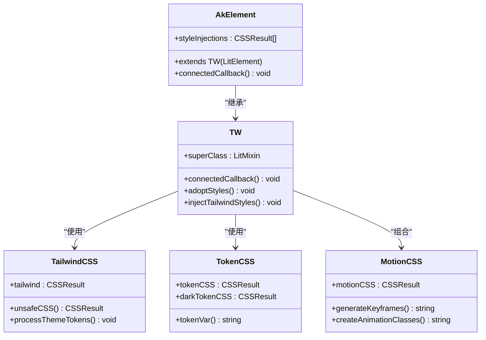

#### CSS-in-JS 样式组合

**更新** 通过 CSSResult 对象实现样式的组合和注入，支持 Tailwind CSS、设计令牌和自定义动画样式的统一管理。

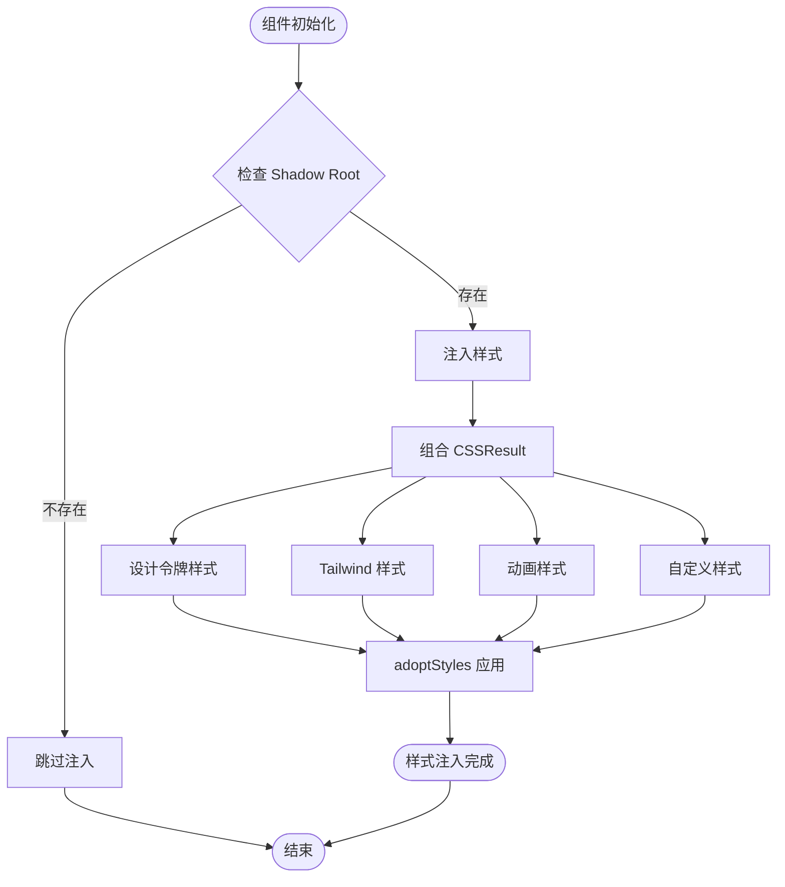

#### 动态样式管理

**更新** 支持运行时样式的动态修改和主题切换，通过 CSS 自定义属性实现主题变量的实时更新。

| 样式特性   | 实现方式            | 应用场景              |
| ---------- | ------------------- | --------------------- |
| 主题切换   | CSS 自定义属性      | 暗色模式/亮色模式切换 |
| 动画控制   | 关键帧和过渡类      | 组件进入/退出动画     |
| 响应式设计 | 媒体查询和断点      | 不同屏幕尺寸适配      |
| 交互状态   | 伪类和状态选择器    | 悬停、聚焦、激活状态  |
| 动态类名   | cn 函数和模板字符串 | 条件样式组合          |
| 上下文传递 | @lit/context        | 组件间状态共享        |

### React 类型声明集成

**更新** 新增组件的 React 类型声明支持，确保在 React 应用中的完整类型安全。

#### ak-sender React 类型声明

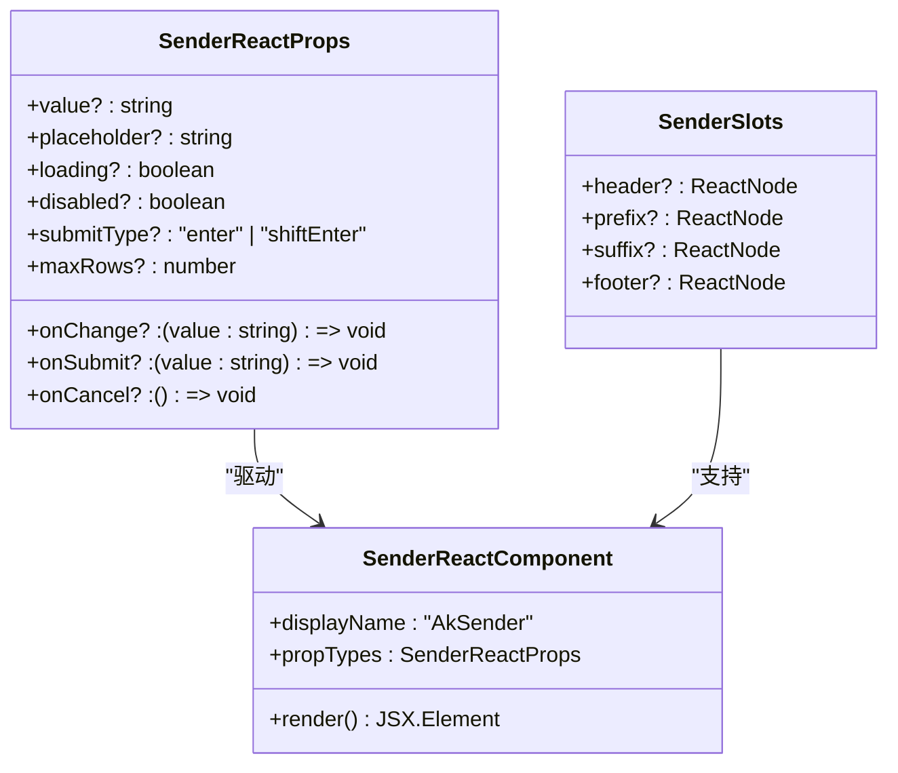

## 现代化动画系统

### 动画关键帧系统

**更新** 引入了完整的 CSS 动画关键帧系统，提供丰富的预定义动画效果和自定义动画能力。

#### 动画关键帧定义

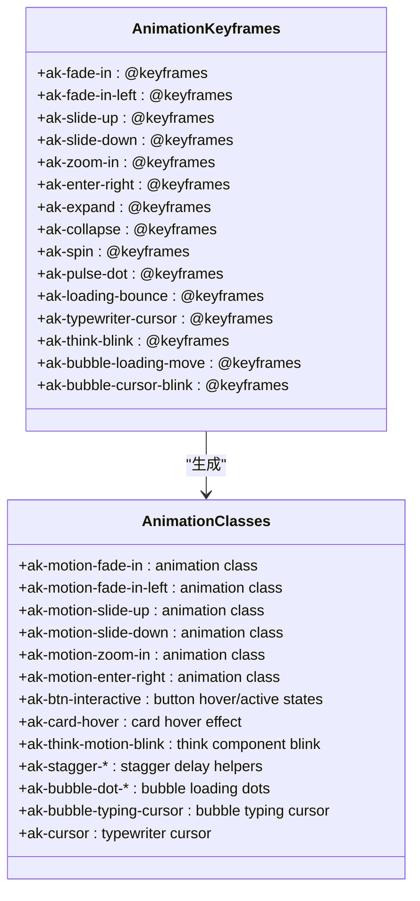

#### 动画设计令牌

**更新** 定义了统一的动画设计令牌，确保动画的一致性和可维护性。

```mermaid
graph LR
subgraph "动画设计令牌"
Fast[fast: 100ms]
Normal[normal: 200ms]
Slow[slow: 300ms]
EaseInOut[ease-in-out: cubic-bezier(0.645, 0.045, 0.355, 1)]
EaseOut[ease-out: cubic-bezier(0.215, 0.61, 0.355, 1)]
EaseIn[ease-in: cubic-bezier(0.55, 0.055, 0.675, 0.19)]
CursorBlink[typewriter-cursor: 0.8s step-end infinite]
LoadingBounce[loading-bounce: 2s linear infinite]
StaggerDelay[stagger-1..8: 50ms-400ms]
BubbleFadeIn[bubble-fade-in: 0.3s ease-out]
ThinkBlink[think-blink: 1.2s step-end infinite]
end
subgraph "动画应用"
ButtonInteractive[按钮交互: hover/active]
CardHover[卡片悬停: lift effect]
ThinkBlink[思考闪烁: blink effect]
BubbleDot[气泡加载: bounce effect]
NotificationEnter[通知进入: enter-right]
BubbleFade[Bubble Fade In: fade-in]
TypingCursor[打字光标: cursor-blink]
BubbleTypingCursor[气泡打字光标: cursor-blink]
end
Fast --> ButtonInteractive
Normal --> CardHover
Slow --> ThinkBlink
EaseInOut --> BubbleDot
EaseOut --> NotificationEnter
EaseOut --> BubbleFade
EaseInOut --> TypingCursor
EaseInOut --> BubbleTypingCursor
```

#### 组件动画集成

**更新** 各个组件集成了相应的动画效果，提供流畅的用户体验。

| 组件名称           | 动画效果               | 触发条件     | 动画时长  |
| ------------------ | ---------------------- | ------------ | --------- |
| AkButton           | ak-btn-interactive     | hover/active | 100-200ms |
| AkBubble           | ak-motion-slide-up     | 内容出现     | 200ms     |
| AkThink            | ak-think-motion-blink  | streaming    | 1.2s      |
| AkNotification     | ak-motion-enter-right  | 显示/隐藏    | 200ms     |
| AkConversations    | transition-all         | 状态变化     | 200ms     |
| LoadingDot         | ak-loading-bounce      | 加载中       | 2s        |
| Cursor             | ak-typewriter-cursor   | 打字效果     | 0.8s      |
| BubbleDot          | ak-bubble-loading-move | 气泡加载     | 2s        |
| BubbleTypingCursor | ak-bubble-cursor-blink | 气泡打字     | 0.8s      |
| BubbleFade         | ak-bubble-fade-in      | 气泡出现     | 0.3s      |

## 输入动画重构

### 打字光标动画系统

**更新** 新增改进的打字光标动画系统，支持更好的流式内容显示效果和增强的用户交互体验。

#### 打字光标关键帧定义

```mermaid
classDiagram
class TypewriterKeyframes {
+ak-typewriter-cursor : @keyframes
+ak-bubble-cursor-blink : @keyframes
+ak-think-blink : @keyframes
}
class TypewriterClasses {
+ak-cursor : .ak-cursor
+ak-bubble-typing-cursor : .ak-bubble-typing-cursor
+ak-think-motion-blink : .ak-think-motion-blink
}
class TypewriterAnimations {
+cursorBlink : 0.8s step-end infinite
+bubbleCursorBlink : 0.8s step-end infinite
+thinkBlink : 1.2s step-end infinite
}
TypewriterKeyframes --> TypewriterClasses : "生成"
TypewriterClasses --> TypewriterAnimations : "应用"
```

#### 流式内容显示机制

**更新** 实现了基于 @lit/task 的流式内容显示机制，支持渐进式内容加载和打字效果。

```mermaid
flowchart TD
Start([开始流式显示]) --> CheckTyping{检查 typing 属性}
CheckTyping --> |true| StartTask[启动打字动画任务]
CheckTyping --> |false| ShowFullContent[显示完整内容]
StartTask --> TrackContent[跟踪内容增长]
TrackContent --> WaitTimer[等待定时器]
WaitTimer --> CheckContentGrowth{检查内容增长}
CheckContentGrowth --> |增长| AdvanceChar[推进一个字符]
CheckContentGrowth --> |无增长| WaitTimer
AdvanceChar --> DispatchEvent[分发 typing 事件]
DispatchEvent --> UpdateProgress[更新进度]
UpdateProgress --> CheckComplete{检查是否完成}
CheckComplete --> |未完成| WaitTimer
CheckComplete --> |已完成| CheckStreaming{检查 streaming 属性}
CheckStreaming --> |true| WaitMore[等待更多内容]
CheckStreaming --> |false| DispatchComplete[分发 typing-complete 事件]
ShowFullContent --> End([完成])
DispatchComplete --> End
WaitMore --> TrackContent
```

#### 打字动画组件集成

**更新** 各组件集成了打字动画功能，提供一致的用户体验。

| 组件名称       | 打字动画类型 | 触发条件     | 动画时长 | 特殊功能               |
| -------------- | ------------ | ------------ | -------- | ---------------------- |
| AkBubble       | 气泡打字光标 | typing=true  | 0.8s     | 支持 streaming 模式    |
| AkThink        | 思考闪烁     | blink=true   | 1.2s     | 内容区域闪烁           |
| AkThink        | 内容打字     | content 属性 | 可配置   | 支持展开/折叠          |
| AkSender       | 输入提示     | 无           | 无       | 支持 Enter/Shift+Enter |
| AkNotification | 无           | 无           | 无       | 纯静态显示             |

### 流式内容显示优化

**更新** 改进了流式内容显示效果，支持更好的用户体验和性能优化。

#### 流式内容处理策略

```mermaid
graph TB
subgraph "流式内容处理"
StreamingInput[流式输入数据]
ChunkProcessing[分块处理]
ProgressTracking[进度跟踪]
EventDispatch[事件分发]
ContentDisplay[内容显示]
end
subgraph "性能优化"
AbortSignal[AbortSignal]
MemoryCleanup[内存清理]
TaskCancellation[任务取消]
End
StreamingInput --> ChunkProcessing
ChunkProcessing --> ProgressTracking
ProgressTracking --> EventDispatch
EventDispatch --> ContentDisplay
ContentDisplay --> MemoryCleanup
MemoryCleanup --> TaskCancellation
TaskCancellation --> End
```

#### React 适配器事件映射

**更新** 完善了 React 适配器中的事件映射，支持 typing-complete 事件。

```mermaid
classDiagram
class ReactEvents {
+typing : "typing"
+typingComplete : "typing-complete"
+expand : "expand"
+submit : "submit"
+cancel : "sender-cancel"
+change : "change"
}
class EventMapping {
+Bubble : typing, typing-complete
+Think : expand
+Sender : submit, cancel, change
}
ReactEvents --> EventMapping : "映射"
```

### 用户交互体验增强

**更新** 通过改进的动画系统和流式内容显示，增强了整体用户交互体验。

#### 交互反馈机制

```mermaid
graph LR
subgraph "用户交互"
UserInput[用户输入]
ComponentResponse[组件响应]
AnimationFeedback[动画反馈]
VisualIndicators[视觉指示器]
EndUserExperience[最终用户体验]
end
subgraph "动画系统"
TypewriterAnimation[打字光标动画]
LoadingAnimation[加载动画]
StateTransition[状态转换]
end
UserInput --> ComponentResponse
ComponentResponse --> AnimationFeedback
AnimationFeedback --> VisualIndicators
VisualIndicators --> EndUserExperience
TypewriterAnimation --> AnimationFeedback
LoadingAnimation --> AnimationFeedback
StateTransition --> AnimationFeedback
```

### 依赖关系分析

#### 依赖树结构

```mermaid
graph TB
subgraph "应用层依赖"
AppPkg[apps/web/package.json]
ReactDep[react: "catalog:"]
ReactDOMDep[react-dom: "^19.1"]
UIExport["@agentkit/ui: workspace:*"]
TypesExport["@agentkit/types: workspace:*"]
UtilsExport["@agentkit/utils: workspace:*"]
end
subgraph "UI 组件库依赖"
UIPkg[packages/ui/package.json]
LitDep[lit: "^3.3.3"]
CVADep[class-variance-authority: "^0.7.1"]
ClsxDeps[clsx: "^2.1.1"]
TailwindMerge[tailwind-merge: "^3.6.0"]
TWAnimate[tw-animate-css: "^1.4.0"]
SignalsDep["@lit-labs/signals: ^0.3.0"]
TailwindDep[tailwindcss: "^4.3.1"]
VitePlugin["@tailwindcss/vite: "^4.3.1"]
CSSInJSDeps["@lit-labs/motion: ^1.1.0"]
ContextDep["@lit/context: ^1.1.6"]
StreamDep["@lit/task: ^1.0.0"]
end
subgraph "构建工具依赖"
ViteDep[vite: "catalog:"]
TurboDep[turbo: "2.9.18"]
TypeScriptDep[typescript: "6.0.3"]
DTSPlugin[unplugin-dts: "^1.0.2"]
end
AppPkg --> ReactDep
AppPkg --> ReactDOMDep
AppPkg --> UIExport
AppPkg --> TypesExport
AppPkg --> UtilsExport
UIPkg --> LitDep
UIPkg --> CVADep
UIPkg --> ClsxDeps
UIPkg --> TailwindMerge
UIPkg --> TWAnimate
UIPkg --> SignalsDep
UIPkg --> TailwindDep
UIPkg --> VitePlugin
UIPkg --> CSSInJSDeps
UIPkg --> ContextDep
UIPkg --> StreamDep
ViteDep --> TurboDep
ViteDep --> TypeScriptDep
ViteDep --> DTSPlugin
```

### 构建任务依赖

```mermaid
graph LR
subgraph "Turborepo 任务"
BuildTask[build 任务]
DevTask[dev 任务]
LintTask[lint 任务]
FormatTask[format 任务]
TypecheckTask[typecheck 任务]
end
subgraph "任务依赖关系"
BuildTask --> DependsOn[dependsOn: ["^build"]]
DevTask --> NoCache[cache: false]
DevTask --> Persistent[persistent: true]
TypecheckTask --> TypeDepends[dependsOn: ["^build"]]
end
subgraph "输出配置"
BuildOutputs[outputs: ["dist/**"]]
end
BuildTask --> BuildOutputs
```

## 性能考虑

### 构建性能优化

1. **增量构建**：Turborepo 提供智能缓存机制，避免重复构建
2. **并行执行**：多个任务可以同时执行，提高开发效率
3. **外部化依赖**：Lit 库被标记为外部依赖，减少打包体积
4. **CSS-in-JS 注入优化**：通过 CSSStyleSheet API 实现高效的样式注入
5. **样式缓存机制**：避免重复的样式注入和计算
6. **动画性能优化**：使用 transform 和 opacity 属性实现硬件加速
7. **按需加载**：样式文件按需编译和注入
8. **CVA 变体缓存**：组件变体类名生成具有缓存机制
9. **Oklch 颜色优化**：现代化颜色空间减少颜色计算开销
10. **动态类名合并**：cn 函数使用 tailwind-merge 避免冲突类名
11. **设计令牌缓存**：CSS 自定义属性减少重复计算
12. **上下文响应式更新**：@lit/context 提供高效的组件通信
13. **流式动画优化**：@lit/task 提供高效的异步任务管理
14. **内存泄漏防护**：AbortSignal 自动清理任务和事件监听器

### 运行时性能优化

1. **CSS-in-JS 优势**：样式注入在组件连接时进行，避免全局样式污染
2. **Shadow DOM 隔离**：样式作用域隔离，避免样式冲突
3. **原子化 CSS**：Tailwind 的原子类设计减少了 CSS 文件大小
4. **Tree Shaking**：现代模块打包器自动移除未使用的代码
5. **组件复用**：Web Components 提供高效的组件复用机制
6. **类型安全**：TypeScript 在编译时发现潜在问题
7. **样式注入优化**：TW 混入函数只在连接时注入一次样式
8. **类名合并优化**：cn 函数使用 tailwind-merge 避免冲突类名
9. **暗色模式优化**：简化的选择器语法提高匹配性能
10. **动画性能优化**：使用 CSS3 transform 和 opacity 实现硬件加速
11. **事件处理优化**：防抖和节流机制减少不必要的重新渲染
12. **内存管理**：自动清理事件监听器和样式资源
13. **上下文性能**：@lit/context 提供零成本的响应式状态管理
14. **流式动画性能**：@lit/task 提供高效的异步任务调度和内存管理

## 故障排除指南

### 常见问题及解决方案

#### CSS-in-JS 样式注入问题

**问题症状**：

- 样式不生效或编译错误
- CSS-in-JS 注入失败
- 动画效果不显示
- 主题切换异常

**解决步骤**：

1. 检查 Tailwind Mixin 是否正确继承
2. 验证 CSSResult 对象的创建和注入
3. 确认 adoptStyles API 的使用正确性
4. 检查 CSS 自定义属性的定义和更新
5. 验证动画关键帧的定义和类名映射
6. 确认设计令牌的导入和使用

#### Tailwind CSS 配置问题

**问题症状**：

- 样式不生效或编译错误
- 设计令牌未正确应用
- 原子类无法识别
- 组件变体类名冲突

**解决步骤**：

1. 检查 `@tailwindcss/vite` 插件是否正确安装
2. 验证 `tailwind.global.css` 中的 `@import` 语句
3. 确认主题令牌格式正确且值有效
4. 检查构建配置中的插件顺序
5. 验证 cn 函数的类名合并逻辑
6. 确认 @theme inline 指令的使用

#### 暗色模式样式问题

**问题症状**：

- 深色模式不生效
- 颜色显示异常
- 选择器匹配失败
- Oklch 颜色不兼容

**解决步骤**：

1. 检查 `.dark` 类选择器是否正确添加到根元素
2. 验证 `:host(.dark)` 选择器在 Web Components 中的兼容性
3. 确认 Oklch 颜色空间在目标浏览器中的支持情况
4. 检查 `@custom-variant dark` 规则的语法正确性
5. 验证颜色令牌的值范围和格式
6. 确认深色模式令牌覆盖的正确应用

#### 动画系统问题

**问题症状**：

- 动画效果不显示
- 关键帧定义错误
- 动画类名不匹配
- 动画性能问题

**解决步骤**：

1. 检查 CSS 自定义属性的定义和值
2. 验证关键帧的 @keyframes 定义
3. 确认动画类名与关键帧名称对应
4. 检查动画时长和缓动函数设置
5. 验证硬件加速属性的使用
6. 确认动画令牌的正确引用

#### 设计令牌系统问题

**问题症状**：

- 令牌变量未生效
- 主题切换不正确
- 颜色值显示异常
- 令牌覆盖冲突

**解决步骤**：

1. 检查 tokenCSS 的导入和使用
2. 验证 CSS 自定义属性的定义格式
3. 确认令牌变量的正确引用方式
4. 检查深色模式令牌覆盖的优先级
5. 验证令牌映射到组件样式的方式
6. 确认令牌在不同组件间的传递

#### 上下文系统问题

**问题症状**：

- 上下文值未正确传递
- 组件无法消费上下文
- 响应式更新失效
- 性能问题

**解决步骤**：

1. 检查 XProvider 的正确使用和配置
2. 验证 @consume 装饰器的使用方式
3. 确认 ContextProvider 的初始化
4. 检查上下文值的同步机制
5. 验证组件的响应式更新
6. 确认上下文在组件树中的传播

#### 流式动画系统问题

**问题症状**：

- 打字动画不流畅
- 流式内容显示异常
- typing-complete 事件未触发
- 内存泄漏问题

**解决步骤**：

1. 检查 @lit/task 的正确使用和配置
2. 验证 AbortSignal 的正确处理
3. 确认 typing 事件的分发机制
4. 检查 streaming 属性的逻辑处理
5. 验证内存清理和任务取消
6. 确认事件映射的正确性

#### React 适配器问题

**问题症状**：

- React 组件无法正确接收事件
- 事件名称映射错误
- 类型定义不正确
- 组件渲染异常

**解决步骤**：

1. 检查 @lit/react 的正确使用
2. 验证事件映射配置
3. 确认 React 组件的类型定义
4. 检查组件包装的正确性
5. 验证事件回调的传递
6. 确认组件生命周期的处理

#### 构建失败问题

**问题症状**：

- Vite 构建过程中断
- 类型检查失败
- 依赖解析错误

**解决步骤**：

1. 运行 `pnpm bootstrap` 安装所有依赖
2. 清理 `node_modules` 和 `dist` 目录
3. 检查 `tsconfig.base.json` 中的编译选项
4. 验证 `turbo.json` 中的任务配置
5. 确认 Vite 配置中的插件顺序
6. 检查 CSS-in-JS 样式的正确导入

#### 开发服务器问题

**问题症状**：

- 热重载不工作
- 页面无法访问
- 端口占用

**解决步骤**：

1. 检查 `vite.config.ts` 中的服务器配置
2. 确认端口 3000 未被其他程序占用
3. 验证 React 插件配置
4. 重启开发服务器
5. 检查网络连接和防火墙设置

## 结论

AgentKit 的 Tailwind CSS 样式系统展现了现代前端开发的最佳实践。通过精心设计的 Monorepo 架构、完善的类型系统和高效的构建工具链，该系统为开发者提供了：

1. **设计令牌系统**：完整的 CSS 自定义属性主题管理，支持浅色和深色模式
2. **CSS-in-JS 样式方案**：采用 styled-components 模式和现代化动画系统
3. **统一的开发体验**：统一的配置和工具链
4. **可扩展的架构**：模块化的组件设计
5. **优秀的性能表现**：优化的构建和运行时性能
6. **强大的类型安全**：完整的 TypeScript 支持
7. **现代化的组件系统**：基于 CVA 的组件变体架构
8. **全局样式管理**：统一的主题和样式注入机制
9. **先进的暗色模式支持**：增强的深色模式变体定义和颜色管理
10. **智能的交互样式系统**：支持自动高度调整和动态类名合并
11. **灵活的布局系统**：响应式网格布局和动态列数控制
12. **完整的类型声明**：支持 React 应用的完整类型安全
13. **现代化的动画系统**：丰富的 CSS 动画效果和硬件加速
14. **上下文系统**：基于 @lit/context 的响应式主题配置传递
15. **先进的流式动画系统**：支持打字光标动画和渐进式内容显示

最新的架构升级引入了 CSS-in-JS 样式方案、现代化动画系统、设计令牌系统、完整的上下文系统和先进的流式动画系统，显著提升了代码的可维护性和类型安全性。通过合理的样式文件组织和主题系统设计，开发者可以轻松地维护和扩展整个样式系统。

**重要更新**：本次更新特别强化了流式动画系统，通过改进的打字光标动画、更好的流式内容显示效果和增强的用户交互体验，为用户提供了更加流畅和自然的界面交互。现代化的动画系统包括完整的关键帧定义、动画类名生成和硬件加速优化，而 React 适配器的完善确保了在 React 应用中的完整类型安全和事件支持。

该样式系统不仅满足了当前项目的需求，还为未来的功能扩展和技术演进奠定了坚实的基础。现代化的架构设计确保了系统的长期可持续发展和良好的开发体验。
