# Vite 构建系统配置

## 目录

1. [简介](#简介)
2. [项目结构](#项目结构)
3. [核心组件](#核心组件)
4. [架构概览](#架构概览)
5. [详细组件分析](#详细组件分析)
6. [依赖关系分析](#依赖关系分析)
7. [性能考虑](#性能考虑)
8. [故障排除指南](#故障排除指南)
9. [结论](#结论)

## 简介

这是一个基于 Vite 的现代化 React 应用构建系统，采用 Monorepo 架构设计。项目集成了 React 19、TypeScript 和多种开发工具，提供了完整的开发体验和高效的构建流程。

**更新** 项目现已集成OXC编译器和lightningcss转换器，显著提升了构建性能和开发体验。OXC作为高性能的JavaScript/TypeScript编译器替代传统Terser，lightningcss作为CSS转换器提供更快的样式处理能力。

**新增** UI包现已支持多入口架构，包含基础组件库入口(index.ts)、React适配器入口(adaptor/react.ts、adaptor/react-plugins.ts)、Vue适配器入口(adaptor/vue.ts)、Markdown渲染器入口(markdown.ts)和代码高亮器入口(code-highlighter.ts)，为不同框架和功能需求提供统一的组件接口。

**新增** 文档站点采用VitePress 2.0构建，集成了本地搜索功能和现代化的文档体验。Docsearch提供全文搜索能力，支持中文文档的智能检索。

**新增** UI组件库集成了ShikiJS代码高亮引擎和Iconify图标系统，提供更丰富的代码展示和图标支持。Lucide图标库提供高质量的SVG图标，支持动态主题适配。

该构建系统的核心特点包括：

- 基于 Vite 的快速开发服务器和生产构建
- React Compiler 预设优化 React 组件编译
- Turborepo 多包管理与缓存机制
- Pnpm 工作区包管理
- 完整的 TypeScript 类型检查和代码格式化
- **新增** OXC编译器替代Terser进行JavaScript压缩
- **新增** lightningcss作为CSS转换器替代默认转换器
- **新增** UI包独立构建配置，支持Lit组件和Tailwind CSS集成
- **新增** 多入口架构支持，包含基础组件库和框架适配器
- **新增** React适配器系统，将Lit组件包装为React组件
- **新增** Vue适配器占位符，预留Vue生态集成方案
- **新增** TypeScript编译步骤与Vite构建的协同工作流
- **新增** Markdown渲染器和代码高亮器的独立入口点支持
- **新增** highlight.js和marked库的外部化处理，减少bundle大小
- **新增** react-plugins入口点，提供依赖外部库的React组件包装
- **新增** Docsearch本地搜索配置，提升文档可发现性
- **新增** ShikiJS代码高亮引擎，提供更丰富的语法高亮支持
- **新增** Iconify图标系统，集成Lucide图标库

## 项目结构

项目采用 Monorepo 结构，主要包含以下模块：

```mermaid
graph TB
subgraph "根目录"
RootPkg[根 package.json]
Turbo[turbo.json]
Workspace[pnpm-workspace.yaml]
BaseTS[tsconfig.base.json]
PNPMLock[pnpm-lock.yaml]
end
subgraph "应用层"
WebApp[apps/web]
DocsApp[apps/docs]
WebPkg[apps/web/package.json]
DocsPkg[apps/docs/package.json]
ViteCfg[vite.config.ts]
VitePressCfg[apps/docs/.vitepress/config.mts]
MainTSX[src/main.tsx]
AppTSX[src/App.tsx]
IndexHTML[index.html]
WebTS[apps/web/tsconfig.json]
DocsTS[apps/docs/tsconfig.json]
end
subgraph "UI包层"
UIPkg[packages/ui/package.json]
UIViteCfg[packages/ui/vite.config.ts]
UITSCfg[packages/ui/tsconfig.json]
UIEntry[src/index.ts]
UIButton[src/button.ts]
UIWelcome[src/welcome.ts]
UIPrompts[src/prompts.ts]
UICN[src/shared/cn.ts]
UITWMix[src/shared/tailwindMixin.ts]
UIAdaptor[adaptor/]
UIReactAdaptor[src/adaptor/react.ts]
UIReactPluginsAdaptor[src/adaptor/react-plugins.ts]
UIVueAdaptor[src/adaptor/vue.ts]
UIMarkdown[src/markdown.ts]
UICodeHighlighter[src/code-highlighter.ts]
UIMermaid[src/mermaid.ts]
UIIcons[src/shared/icons.ts]
end
subgraph "工具包层"
UtilsPkg[packages/utils/package.json]
TypesPkg[packages/types/package.json]
end
RootPkg --> WebApp
RootPkg --> DocsApp
RootPkg --> UIPkg
RootPkg --> UtilsPkg
RootPkg --> TypesPkg
WebApp --> ViteCfg
WebApp --> MainTSX
WebApp --> AppTSX
WebApp --> IndexHTML
WebApp --> WebTS
DocsApp --> VitePressCfg
DocsApp --> DocsPkg
UIPkg --> UIViteCfg
UIPkg --> UITSCfg
UIPkg --> UIEntry
UIEntry --> UIButton
UIEntry --> UIWelcome
UIEntry --> UIPrompts
UIEntry --> UICN
UIEntry --> UITWMix
UIEntry --> UIAdaptor
UIEntry --> UIMarkdown
UIEntry --> UICodeHighlighter
UIEntry --> UIMermaid
UIEntry --> UIIcons
UIAdaptor --> UIReactAdaptor
UIAdaptor --> UIReactPluginsAdaptor
UIAdaptor --> UIVueAdaptor
```

## 核心组件

### Vite 配置系统

Vite 构建系统的核心配置位于应用根目录，采用了现代化的插件架构：

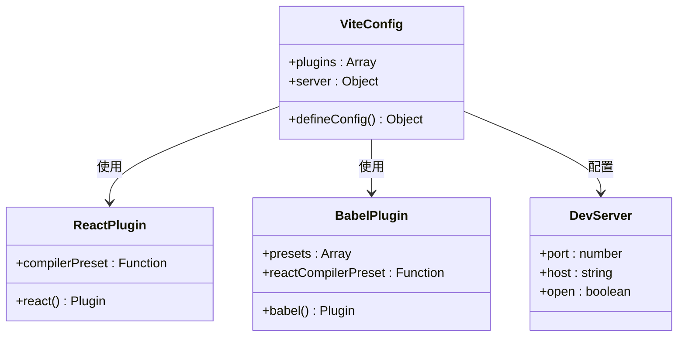

### VitePress 文档配置系统

**新增** 文档站点采用VitePress 2.0构建，集成了本地搜索功能：

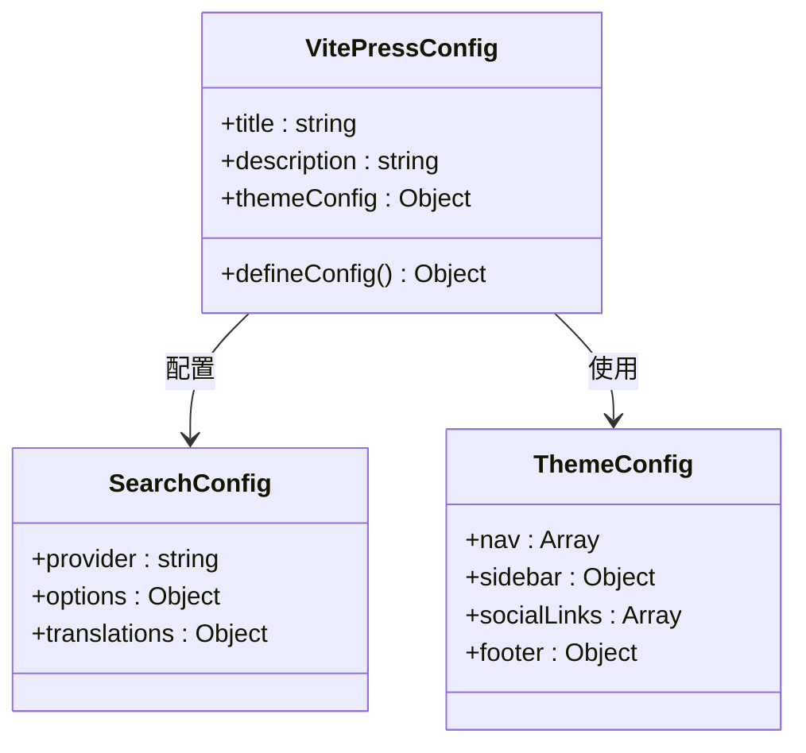

### UI包多入口构建配置

**更新** UI包采用独立的Vite配置，支持六个入口点架构，包含基础组件库、框架适配器、Markdown渲染器和代码高亮器：

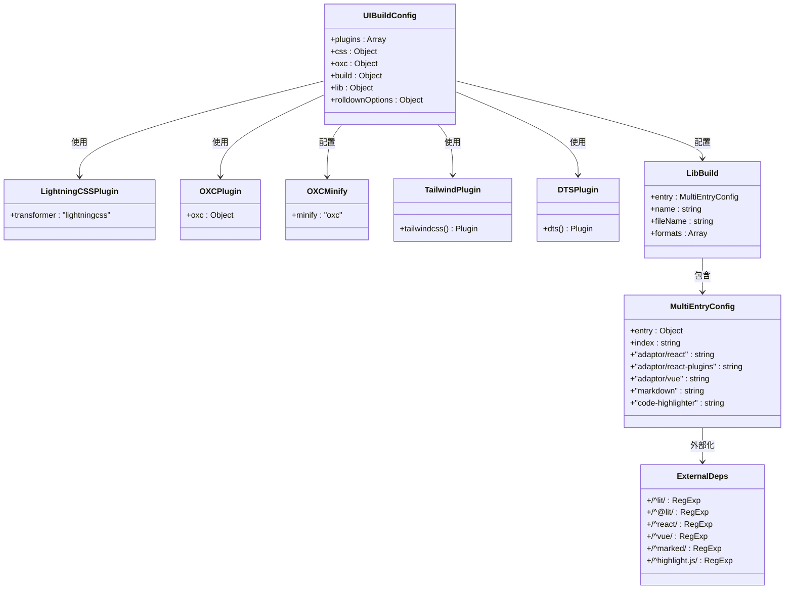

### React适配器系统

**新增** UI包提供React适配器，将Lit Web Components包装为React组件，包括新增的react-plugins入口点：

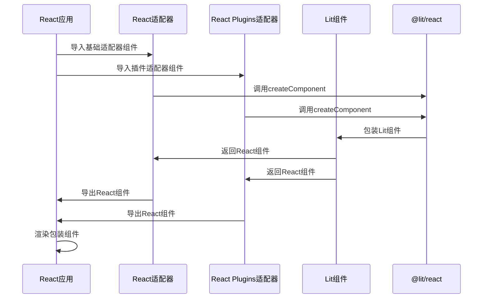

### Vue适配器占位符

**新增** UI包预留Vue适配器支持，当前为占位符实现：

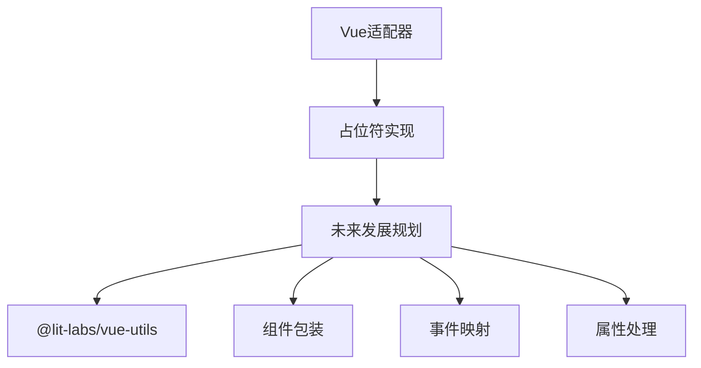

### 代码高亮器组件

**新增** UI包集成ShikiJS代码高亮引擎，提供丰富的语法高亮支持：

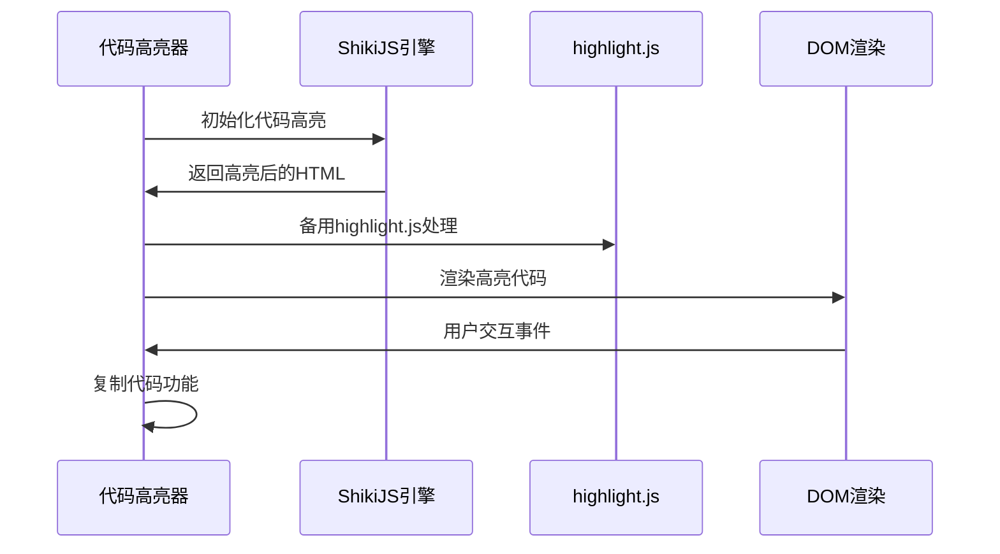

### 图标系统集成

**新增** UI包集成Iconify图标系统和Lucide图标库：

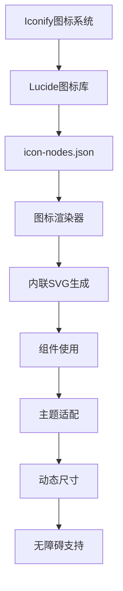

### React 应用入口

应用采用标准的 React 18+ 模式，使用严格模式包装：

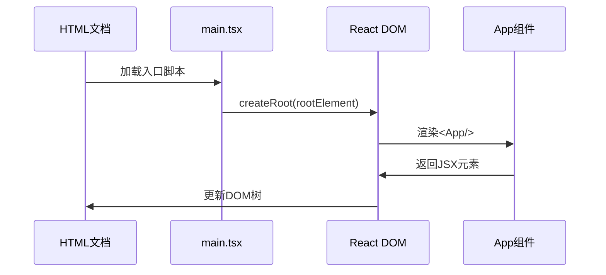

## 架构概览

整个构建系统采用分层架构设计，从底层基础设施到上层应用服务，现已集成OXC和lightningcss性能优化工具以及多入口构建架构：

```mermaid
graph TB
subgraph "基础设施层"
Node[node: >=22]
PNPM[pnpm: 10.30.2]
Catalog[包版本目录]
Esbuild[esbuild 0.27.7]
end
subgraph "构建工具层"
Vite[Vite 8.0]
Turbo[Turborepo 2.9]
TypeScript[TypeScript 6.0]
TailwindCSS[Tailwind CSS v4]
DTS[unplugin-dts]
LightningCSS[lightningcss 1.32.0]
OXC[OXC编译器 0.133.0]
MultiEntry[多入口构建]
ReactAdaptor[React适配器]
ReactPluginsAdaptor[React Plugins适配器]
VueAdaptor[Vue适配器占位符]
MarkdownRenderer[Markdown渲染器]
CodeHighlighter[代码高亮器]
Mermaid[Mermaid图表]
ExternalDeps[外部化依赖]
end
subgraph "开发工具层"
Lint[oxlint 1.70]
Format[oxfmt 0.55]
CommitLint[commitlint 21.0]
end
subgraph "应用层"
Web[Web应用]
Docs[文档站点]
UI[UI组件库]
Utils[工具库]
Types[类型定义]
end
subgraph "UI包特性"
Lit[Lit 3.3.3]
CVA[class-variance-authority]
TWMixin[Tailwind Mixin]
OXCMinify[OXC压缩]
LightningTransform[lightningcss转换]
MultiEntryBuild[多入口构建]
ReactWrapper[React组件包装]
VuePlaceholder[Vue适配器占位符]
MarkdownFeature[Markdown渲染]
CodeHighlightFeature[代码高亮]
MermaidFeature[Mermaid图表]
IconSystem[Iconify图标系统]
ExternalHandling[外部化处理]
PeerDeps[对等依赖]
OptionalDeps[可选依赖]
end
Node --> PNPM
PNPM --> Catalog
Catalog --> Esbuild
Catalog --> Vite
Catalog --> Turbo
Catalog --> TypeScript
Vite --> Web
Vite --> Docs
Vite --> UI
Turbo --> Web
Turbo --> Docs
Turbo --> UI
Lint --> Web
Format --> Web
CommitLint --> Web
Web --> UI
Web --> Utils
Web --> Types
UI --> Lit
UI --> CVA
UI --> TWMixin
UI --> OXCMinify
UI --> LightningTransform
UI --> MultiEntryBuild
UI --> ReactWrapper
UI --> VuePlaceholder
UI --> MarkdownFeature
UI --> CodeHighlightFeature
UI --> MermaidFeature
UI --> IconSystem
UI --> ExternalHandling
UI --> PeerDeps
UI --> OptionalDeps
Utils --> Types
```

## 详细组件分析

### 开发服务器配置

开发服务器提供了高性能的热重载和实时预览功能：

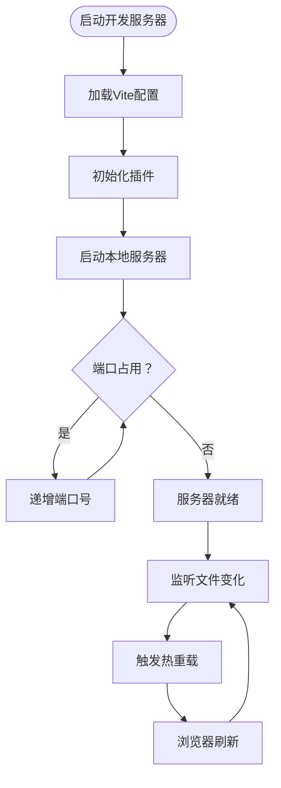

### VitePress 文档构建流程

**新增** 文档站点采用VitePress 2.0构建，支持本地搜索和现代化文档体验：

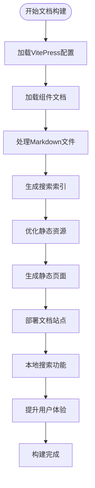

### React 编译器集成

项目集成了 React Compiler 预设，提供自动化的组件优化：

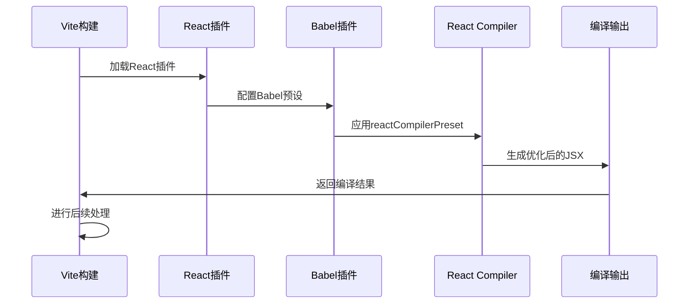

### UI包多入口构建流程

**更新** UI包采用TypeScript编译与Vite构建相结合的工作流，支持六个入口点架构和适配器系统：

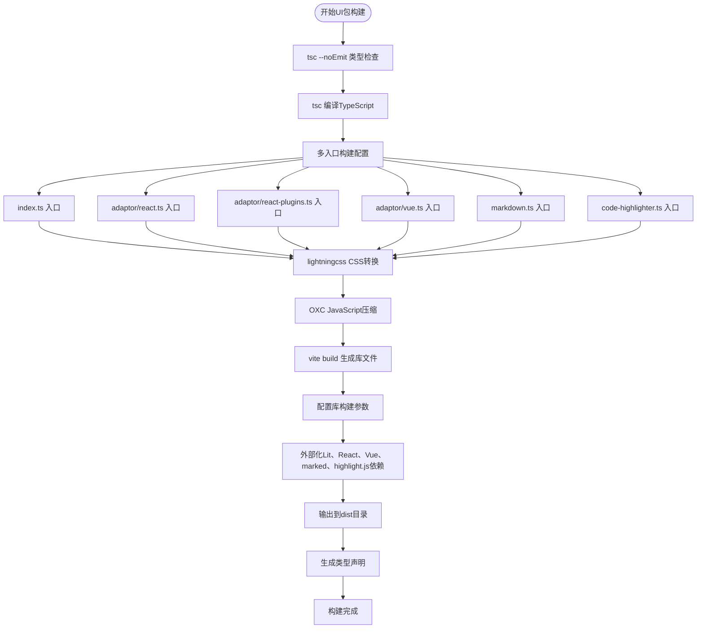

### Monorepo 包管理

多包管理通过 pnpm 工作区实现，支持版本目录和工作区链接：

```mermaid
classDiagram
class Workspace {
+packages : Array
+catalog : Object
+onlyBuiltDependencies : Array
}
class Package {
+name : string
+version : string
+type : string
+scripts : Object
+dependencies : Object
+devDependencies : Object
}
class Catalog {
+versions : Object
+resolved : Object
}
Workspace --> Package : 管理
Workspace --> Catalog : 使用
Package --> Package : workspace : *依赖
```

### TypeScript 配置体系

项目采用分层 TypeScript 配置，确保类型安全和开发体验：

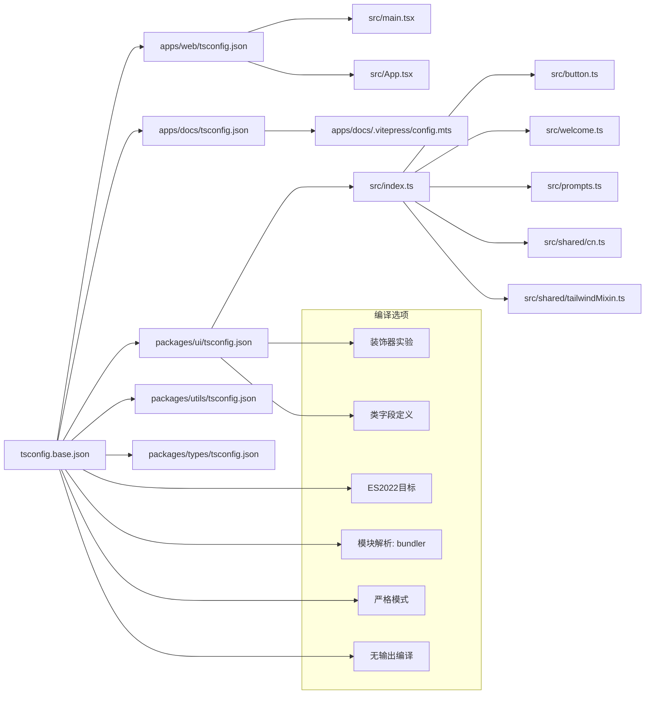

### Lit组件兼容性配置

**更新** UI包专门针对Lit组件进行了优化配置，现集成了lightningcss转换器、多入口构建和外部化依赖处理：

```mermaid
graph TB
subgraph "Lit组件配置"
LitElement[LitElement基类]
CustomElement[自定义元素装饰器]
TWDecorator[TW样式装饰器]
VariantSystem[变体系统]
SignalSystem[信号系统]
MultiEntry[多入口支持]
ReactAdaptor[React适配器]
ReactPluginsAdaptor[React Plugins适配器]
VueAdaptor[Vue适配器占位符]
MarkdownRenderer[Markdown渲染器]
CodeHighlighter[代码高亮器]
Mermaid[Mermaid图表]
IconSystem[Iconify图标系统]
ExternalDeps[外部化依赖]
PeerDeps[对等依赖]
OptionalDeps[可选依赖]
end
subgraph "构建配置"
ExternalLit[外部化Lit依赖]
ExternalReact[外部化React依赖]
ExternalVue[外部化Vue依赖]
ExternalMarked[外部化marked依赖]
ExternalHighlightJS[外部化highlight.js依赖]
RollupOptions[Rollup选项]
DTSGeneration[类型声明生成]
TailwindIntegration[Tailwind集成]
LightningCSSOpt[lightningcss优化]
OXCMinify[OXC压缩]
MultiEntryBuild[多入口构建]
ExportMap[导出映射]
```

### OXC编译器集成

**新增** 项目集成了OXC编译器作为高性能的JavaScript/TypeScript处理工具：

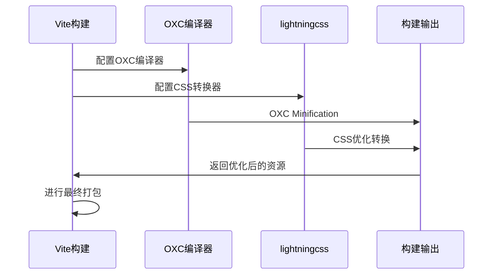

### esbuild 0.27.7 性能优化

**新增** 项目已升级到esbuild 0.27.7，带来显著的构建性能提升：

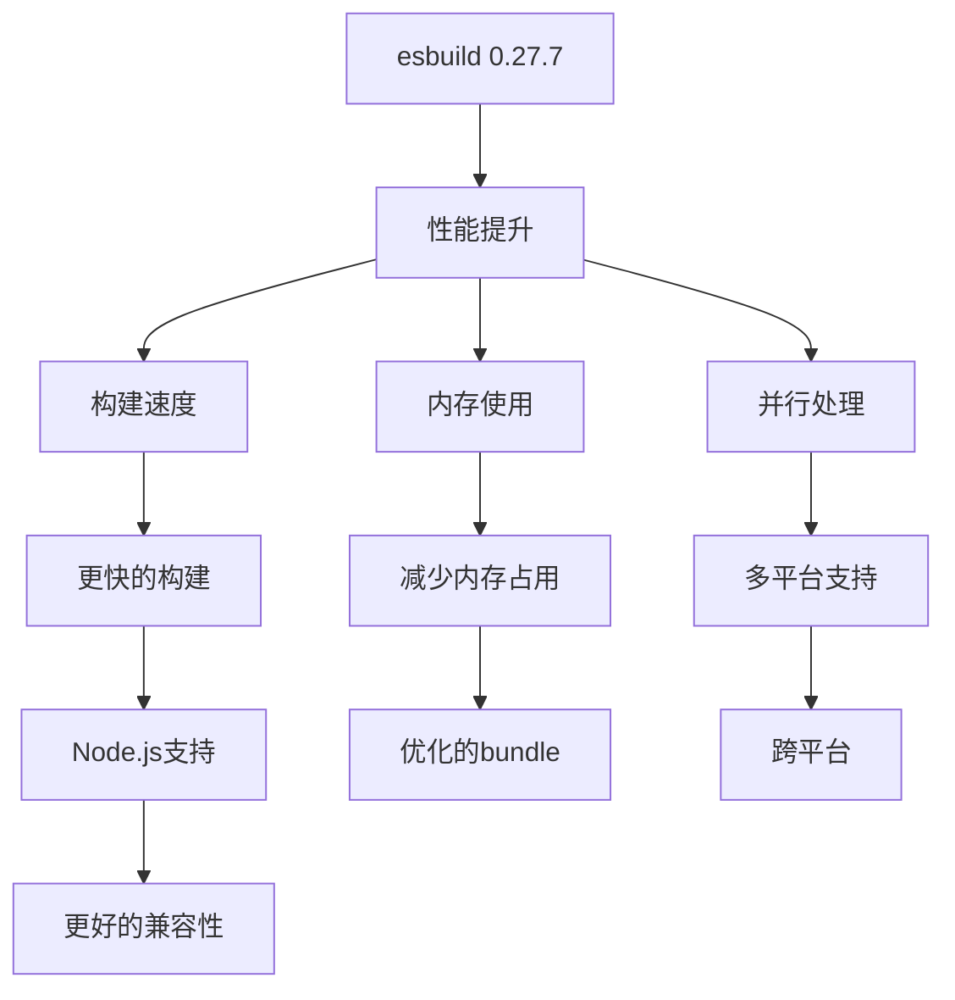

### Docsearch 本地搜索集成

**新增** 文档站点集成Docsearch本地搜索功能：

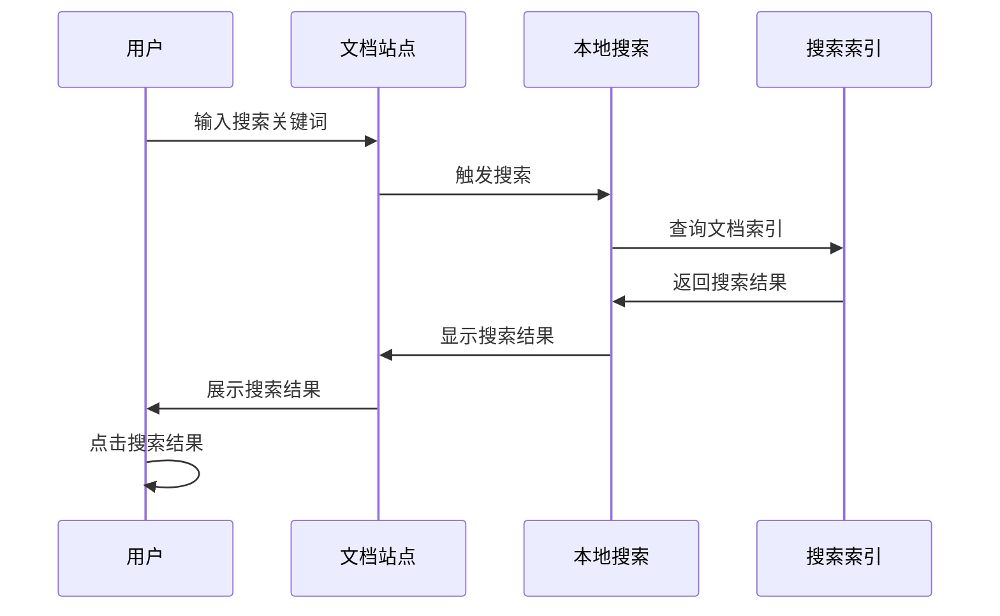

## 依赖关系分析

### 包依赖图谱

**更新** 项目中的包依赖关系形成了一个清晰的层次结构，现已集成OXC、lightningcss、多入口构建和新增的外部化依赖：

```mermaid
graph TB
subgraph "应用依赖"
Web["@agentkit/web"] --> UI["@agentkit/ui"]
Web --> Utils["@agentkit/utils"]
Web --> Types["@agentkit/types"]
Docs["@agentkit/docs"] --> UI["@agentkit/ui"]
end
subgraph "UI库依赖"
UI --> Lit["lit"]
UI --> Signals["@lit-labs/signals"]
UI --> CVA["class-variance-authority"]
UI --> TailwindMerge["tailwind-merge"]
UI --> TWAnimate["tw-animate-css"]
UI --> TailwindVite["@tailwindcss/vite"]
UI --> UnpluginDTS["unplugin-dts"]
UI --> LightningCSS["lightningcss 1.32.0"]
UI --> OXC["@oxc-project/runtime 0.133.0"]
UI --> LitReact["@lit/react 1.0.8"]
UI --> LitVue["@lit-labs/vue-utils"]
UI --> Marked["marked >= 14"]
UI --> HighlightJS["highlight.js >= 11"]
UI --> LucideStatic["lucide-static 1.21.0"]
UI --> IconifySimpleIcons["@iconify-json/simple-icons 1.2.86"]
end
subgraph "工具库依赖"
Utils --> Types
end
subgraph "运行时依赖"
Web --> React["react"]
Web --> ReactDOM["react-dom"]
Docs --> VitePress["vitepress 2.0.0-alpha.17"]
end
subgraph "开发依赖"
Web -.-> Vite["vite"]
Web -.-> ReactPlugin["@vitejs/plugin-react"]
Web -.-> Babel["@rolldown/plugin-babel"]
Web -.-> TS["typescript"]
UI -.-> Vite
UI -.-> TS
UI -.-> TailwindVite
UI -.-> UnpluginDTS
UI -.-> LightningCSS
UI -.-> OXC
UI -.-> LitReact
UI -.-> LitVue
UI -.-> Marked
UI -.-> HighlightJS
UI -.-> LucideStatic
UI -.-> IconifySimpleIcons
Docs -.-> VitePress
end
```

### 构建任务依赖

**更新** Turborepo 为构建任务建立了明确的依赖关系，现已包含OXC、lightningcss、多入口构建和新增的外部化依赖处理：

```mermaid
flowchart TD
BuildAll[全部构建] --> BuildWeb[构建web应用]
BuildAll --> BuildDocs[构建文档站点]
BuildAll --> BuildUI[构建UI库]
BuildAll --> BuildUtils[构建工具库]
BuildAll --> BuildTypes[构建类型定义]
BuildWeb --> TypeCheck[类型检查]
BuildDocs --> TypeCheck
BuildUI --> TypeCheck
BuildUI --> TSCompile[TypeScript编译]
BuildUI --> MultiEntryBuild[多入口构建]
MultiEntryBuild --> IndexEntry[index.ts入口]
MultiEntryBuild --> ReactAdaptor[adaptor/react.ts入口]
MultiEntryBuild --> ReactPluginsAdaptor[adaptor/react-plugins.ts入口]
MultiEntryBuild --> VueAdaptor[adaptor/vue.ts入口]
MultiEntryBuild --> MarkdownEntry[markdown.ts入口]
MultiEntryBuild --> CodeHighlighterEntry[code-highlighter.ts入口]
IndexEntry --> LightningCSS[lightningcss转换]
ReactAdaptor --> LightningCSS
ReactPluginsAdaptor --> LightningCSS
VueAdaptor --> LightningCSS
MarkdownEntry --> LightningCSS
CodeHighlighterEntry --> LightningCSS
LightningCSS --> OXCMinify[OXC压缩]
OXCMinify --> ViteBuild[Vite库构建]
BuildDocs --> VitePressBuild[VitePress构建]
BuildUtils --> TypeCheck
BuildTypes --> TypeCheck
BuildUI --> BuildTypes
BuildUtils --> BuildTypes
BuildWeb --> BuildUI
BuildWeb --> BuildUtils
BuildWeb --> BuildTypes
BuildDocs --> BuildUI
BuildDocs --> BuildUtils
BuildDocs --> BuildTypes
TSCompile --> MultiEntryBuild
MultiEntryBuild --> LightningCSS
LightningCSS --> OXCMinify
OXCMinify --> ViteBuild
ViteBuild --> TypeCheck
VitePressBuild --> TypeCheck
```

## 性能考虑

### 构建性能优化

**更新** 项目在多个层面实现了性能优化，现已集成OXC、lightningcss、多入口构建和外部化依赖处理：

1. **增量构建**: Turborepo 提供智能缓存和增量构建
2. **并行执行**: 多包构建任务可以并行执行
3. **按需编译**: TypeScript 仅进行类型检查，不生成输出
4. **模块解析优化**: 使用 bundler 模式提高模块解析效率
5. **外部化依赖**: UI包将Lit、React、Vue、marked、highlight.js等大型依赖外部化，减少bundle大小
6. **类型声明生成**: 自动化生成类型声明，避免重复编译
7. **OXC编译器**: 高性能的JavaScript/TypeScript处理替代传统工具
8. **lightningcss转换器**: 更快的CSS处理和优化
9. **并行处理**: OXC和lightningcss可并行处理不同类型的资源
10. **多入口优化**: 支持按需加载特定入口点，减少不必要的代码传输
11. **适配器系统**: 将通用组件与框架特定包装分离，提高复用性
12. **可选依赖**: 通过peerDependenciesMeta标记可选依赖，减少强制安装
13. **外部化处理**: 将第三方库外部化，利用用户应用的依赖缓存
14. **esbuild 0.27.7**: 新版本带来更快的构建速度和更好的性能表现
15. **本地搜索优化**: Docsearch本地搜索减少网络请求，提升文档加载速度
16. **图标系统优化**: Iconify图标系统支持按需加载，减少初始包大小

### 开发体验优化

```mermaid
flowchart LR
subgraph "开发阶段"
FastDev[快速开发服务器]
HotReload[热重载]
LivePreview[实时预览]
TypeScriptWatch[TypeScript监视]
TailwindWatch[Tailwind监视]
OXLintWatch[OXC Lint监视]
MultiEntryWatch[多入口监视]
ReactAdaptorWatch[React适配器监视]
ReactPluginsAdaptorWatch[React Plugins适配器监视]
VueAdaptorWatch[Vue适配器监视]
MarkdownWatch[Markdown监视]
CodeHighlighterWatch[代码高亮器监视]
MermaidWatch[Mermaid监视]
IconWatch[图标系统监视]
end
subgraph "构建阶段"
LightningCSSOpt[lightningcss优化]
OXCMinify[OXC压缩]
BundleOpt[代码分割]
TreeShake[摇树优化]
DTSGen[类型声明生成]
MultiEntryBuild[多入口构建]
ExportMapping[导出映射]
ExternalHandling[外部化处理]
PeerDepsHandling[对等依赖处理]
OptionalDepsHandling[可选依赖处理]
EsbuildOpt[esbuild优化]
LocalSearchOpt[本地搜索优化]
IconSystemOpt[图标系统优化]
end
subgraph "发布阶段"
AssetOpt[资源优化]
CDNSupport[CDN支持]
Analytics[性能监控]
end
FastDev --> HotReload
HotReload --> LivePreview
LivePreview --> TypeScriptWatch
TypeScriptWatch --> TailwindWatch
TailwindWatch --> OXLintWatch
OXLintWatch --> MultiEntryWatch
MultiEntryWatch --> ReactAdaptorWatch
ReactAdaptorWatch --> ReactPluginsAdaptorWatch
ReactPluginsAdaptorWatch --> VueAdaptorWatch
VueAdaptorWatch --> MarkdownWatch
MarkdownWatch --> CodeHighlighterWatch
CodeHighlighterWatch --> MermaidWatch
MermaidWatch --> IconWatch
IconWatch --> LightningCSSOpt
LightningCSSOpt --> OXCMinify
OXCMinify --> BundleOpt
BundleOpt --> TreeShake
TreeShake --> DTSGen
DTSGen --> MultiEntryBuild
MultiEntryBuild --> ExportMapping
ExportMapping --> ExternalHandling
ExternalHandling --> PeerDepsHandling
PeerDepsHandling --> OptionalDepsHandling
OptionalDepsHandling --> EsbuildOpt
EsbuildOpt --> LocalSearchOpt
LocalSearchOpt --> IconSystemOpt
IconSystemOpt --> AssetOpt
AssetOpt --> CDNSupport
CDNSupport --> Analytics
```

## 故障排除指南

### 常见问题诊断

1. **端口冲突**
   - 检查配置中的端口号是否被占用
   - 查看是否有其他 Vite 实例正在运行

2. **依赖安装问题**
   - 确认 pnpm 版本兼容性
   - 检查 workspace 配置是否正确
   - 验证 catalog 中的版本声明

3. **类型检查错误**
   - 检查 tsconfig 继承链
   - 确认模块解析配置
   - 验证严格模式下的类型定义

4. **构建失败**
   - 查看具体的错误信息
   - 检查插件配置
   - 验证文件路径和导入语句

5. **UI包构建问题**
   - **更新** 确认TypeScript编译步骤是否成功
   - **更新** 检查六个入口点配置是否正确
   - **更新** 验证Lit依赖是否正确外部化
   - **更新** 确认Tailwind CSS配置是否正确
   - **更新** 验证类型声明生成是否完成
   - **更新** 验证OXC编译器配置是否正确
   - **更新** 检查lightningcss转换器是否正常工作
   - **新增** 确认esbuild 0.27.7版本兼容性
   - **新增** 验证Docsearch本地搜索配置
   - **新增** 检查ShikiJS代码高亮引擎集成
   - **新增** 确认Iconify图标系统配置

6. **多入口构建问题**
   - **新增** 检查entry配置对象是否正确
   - **新增** 验证每个入口点的文件路径
   - **新增** 确认导出映射配置是否完整
   - **新增** 验证rollupOptions外部化规则
   - **新增** 检查六个入口点的构建配置

7. **React适配器问题**
   - **新增** 确认@lit/react依赖是否正确安装
   - **新增** 检查createComponent调用参数
   - **新增** 验证事件映射配置
   - **新增** 确认组件名称与标签名匹配
   - **新增** 验证react-plugins适配器的事件处理

8. **Vue适配器问题**
   - **新增** 确认@lit-labs/vue-utils依赖状态
   - **新增** 检查占位符实现的完整性
   - **新增** 验证Vue版本兼容性

9. **外部化依赖问题**
   - **新增** 确认highlight.js版本满足>=11要求
   - **新增** 确认marked版本满足>=14要求
   - **新增** 验证外部化正则表达式的正确性
   - **新增** 检查对等依赖的安装状态

10. **OXC相关问题**
    - **新增** 确认OXC编译器版本兼容性
    - **新增** 检查OXC配置是否正确
    - **新增** 验证OXC lint规则配置
    - **新增** 确认OXC minification设置

11. **lightningcss相关问题**
    - **新增** 检查lightningcss版本兼容性
    - **新增** 验证CSS转换配置
    - **新增** 确认lightningcss插件正确加载

12. **esbuild 0.27.7相关问题**
    - **新增** 确认esbuild版本兼容性
    - **新增** 检查esbuild配置参数
    - **新增** 验证多平台支持配置
    - **新增** 确认构建性能优化效果

13. **Docsearch本地搜索问题**
    - **新增** 确认本地搜索配置正确
    - **新增** 检查搜索索引生成
    - **新增** 验证中文搜索支持
    - **新增** 确认搜索结果排序

14. **图标系统问题**
    - **新增** 确认Iconify图标库版本
    - **新增** 检查Lucide图标配置
    - **新增** 验证图标渲染性能
    - **新增** 确认主题适配支持

## 结论

这个 Vite 构建系统展现了现代前端工程的最佳实践，通过合理的架构设计和工具选择，为开发者提供了高效、可靠的开发体验。

**核心优势**：

- **现代化技术栈**: React 19 + TypeScript + Vite 的组合提供了优秀的开发体验
- **Monorepo 架构**: 支持多包管理和共享依赖
- **自动化工具链**: 集成 Lefthook、Commitlint 等质量保证工具
- **性能优化**: 通过 Turborepo 和各种优化策略提升构建效率
- **OXC编译器**: 高性能的JavaScript/TypeScript处理替代传统工具
- **lightningcss转换器**: 更快的CSS处理和优化能力
- **OXC Lint规则**: 现代化的代码质量检查工具
- **UI包专用构建**: 支持Lit Web Components的完整构建流程
- **多入口架构**: 支持基础组件库、框架适配器、Markdown渲染器和代码高亮器的灵活部署
- **React适配器系统**: 将Lit组件无缝集成到React生态系统
- **Vue适配器预留**: 为Vue生态系统的未来集成做好准备
- **Tailwind CSS集成**: 提供现代化的样式解决方案
- **类型安全**: 完整的TypeScript类型检查和声明生成
- **外部化依赖处理**: 通过rollupOptions外部化大型依赖，减少bundle大小
- **可选依赖支持**: 通过peerDependenciesMeta标记可选依赖，提供灵活的安装选项
- **Markdown渲染功能**: 内置Markdown渲染器，支持流式渲染和自定义标签
- **代码高亮功能**: 集成highlight.js，提供丰富的语法高亮支持
- **Docsearch本地搜索**: 提升文档可发现性和用户体验
- **ShikiJS代码高亮**: 提供更丰富的语法高亮引擎支持
- **Iconify图标系统**: 集成Lucide图标库，提供高质量的SVG图标

**新增性能改进**：

- **OXC编译器**: 提供比传统Terser更快的JavaScript压缩和优化
- **lightningcss**: 提供比PostCSS更快的CSS转换和优化
- **并行处理**: OXC和lightningcss可并行处理不同类型资源
- **内存效率**: OXC相比传统工具具有更好的内存使用效率
- **多入口优化**: 支持按需加载，减少不必要的代码传输
- **适配器分离**: 将通用逻辑与框架特定包装分离，提高复用性
- **外部化处理**: 将第三方库外部化，利用用户应用的依赖缓存
- **可选依赖**: 通过peerDependenciesMeta标记可选依赖，减少强制安装
- **Markdown集成**: 内置Markdown渲染功能，无需额外依赖
- **代码高亮集成**: 内置代码高亮功能，支持多种编程语言
- **esbuild 0.27.7**: 新版本带来更快的构建速度和更好的性能表现
- **本地搜索优化**: Docsearch本地搜索减少网络请求，提升文档加载速度
- **图标系统优化**: Iconify图标系统支持按需加载，减少初始包大小

**建议改进方向**：

- 可以考虑添加更多的构建优化配置
- 增强错误处理和日志记录
- 考虑添加更多的测试工具集成
- **新增** 扩展UI包的组件库功能
- **新增** 添加更多的Lit组件示例和最佳实践
- **新增** 优化OXC和lightningcss的配置参数
- **新增** 添加性能监控和基准测试工具
- **新增** 完善Vue适配器的实现细节
- **新增** 增加多入口构建的监控和调试工具
- **新增** 优化React适配器的事件处理机制
- **新增** 扩展Markdown渲染器的功能
- **新增** 增强代码高亮器的语言支持
- **新增** 添加更多可选依赖的配置选项
- **新增** 优化Docsearch本地搜索的性能
- **新增** 完善ShikiJS代码高亮引擎的配置
- **新增** 增强Iconify图标系统的主题适配能力
