# VitePress 文档系统

## 目录

1. [简介](#简介)
2. [项目结构](#项目结构)
3. [核心组件](#核心组件)
4. [架构概览](#架构概览)
5. [详细组件分析](#详细组件分析)
6. [交互式演示系统](#交互式演示系统)
7. [自动化部署系统](#自动化部署系统)
8. [TypeScript 和 CSS 模块支持](#typescript-和-css-模块支持)
9. [依赖关系分析](#依赖关系分析)
10. [性能考虑](#性能考虑)
11. [故障排除指南](#故障排除指南)
12. [结论](#结论)

## 简介

AgentKit UI 是一个基于 Web Components 标准构建的 AI 对话界面组件库。该文档系统采用 VitePress 作为静态站点生成器，集成了 @vitepress-demo-preview 生态系统，提供了完整的交互式组件预览功能。项目专注于 AI 对话场景，提供了覆盖全场景的原子组件集合，包括消息气泡、发送框、思考过程、会话管理等，并通过 25+ 个 Vue 演示组件展示了丰富的交互示例。

**最新更新**：文档系统现已集成完整的 GitHub Actions 自动化部署工作流，支持 CI/CD 流程，同时增强了 TypeScript 和 CSS 模块的类型支持，提供了更完善的开发体验。

## 项目结构

该项目采用多包工作区结构，主要包含以下核心目录：

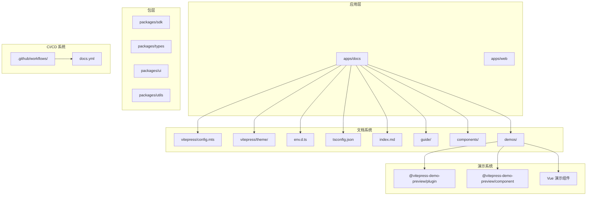

## 核心组件

### VitePress 配置系统

VitePress 配置文件定义了整个文档系统的外观和行为，现已集成了 @vitepress-demo-preview 生态系统：

- **站点配置**：标题、描述、语言设置，基础路径更新为 `/agentkit/`
- **Markdown 扩展**：集成 demo 预览插件（containerPreview 和 componentPreview）
- **Vue 配置**：自定义元素识别（isCustomElement: tag => tag.startsWith("ak-")）
- **主题配置**：导航栏、侧边栏、页脚等

**更新**：基础路径配置已更新为 `/agentkit/`，这影响了所有文档链接和资源路径的生成。

### 导航系统

文档系统包含完整的导航结构：

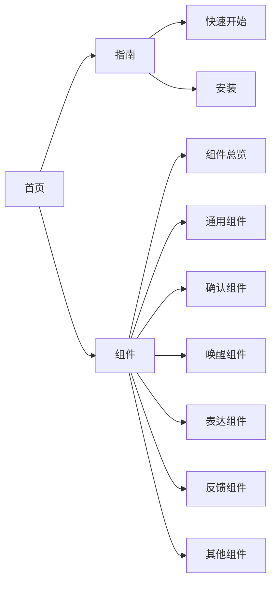

### 组件分类体系

组件按照 RICH 交互范式进行分类：

| 分类 | 组件数量 | 主要功能                       |
| ---- | -------- | ------------------------------ |
| 通用 | 3个      | 消息气泡、会话管理、系统通知   |
| 确认 | 2个      | 思考过程、思维链               |
| 唤醒 | 2个      | 欢迎信息、提示集               |
| 表达 | 3个      | 发送框、附件、快捷指令         |
| 反馈 | 6个      | 操作列表、代码高亮、文件卡片等 |
| 其他 | 3个      | 按钮、卡片、全局配置           |

## 架构概览

### 文档系统架构

```mermaid
graph TB
subgraph "前端渲染层"
Vue[Vue 模板引擎]
Components[Web Components]
DemoSystem[交互式演示系统]
Theme[主题系统]
Env[环境配置]
end
subgraph "内容管理层"
Markdown[Markdown 文件]
Frontmatter[Frontmatter 元数据]
DemoFiles[Vue 演示文件]
end
subgraph "构建层"
VitePress[VitePress 核心]
Plugins[插件系统]
DemoPlugin["@vitepress-demo-preview/plugin"]
DemoComponent["@vitepress-demo-preview/component"]
Turbo[Turbo 构建系统]
end
subgraph "输出层"
StaticHTML[静态 HTML]
Assets[静态资源]
InteractiveDemo[交互式组件预览]
BasePath[基础路径 /agentkit/]
End
Markdown --> VitePress
Frontmatter --> VitePress
DemoFiles --> DemoPlugin
DemoPlugin --> DemoComponent
DemoComponent --> InteractiveDemo
VitePress --> Vue
Vue --> Components
Components --> StaticHTML
Plugins --> DemoPlugin
VitePress --> Assets
Theme --> Env
Turbo --> VitePress
BasePath --> StaticHTML
```

### 组件交互流程

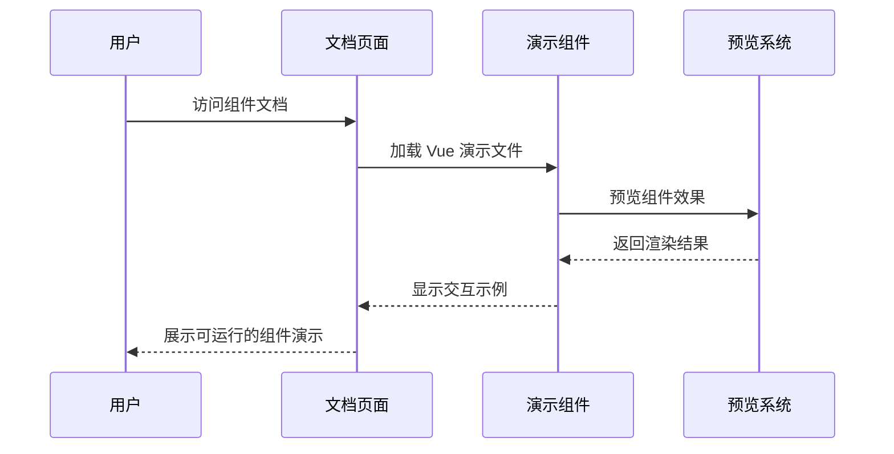

## 详细组件分析

### 消息气泡组件 (Bubble)

消息气泡是对话界面的核心组件，支持多种样式变体和交互效果：

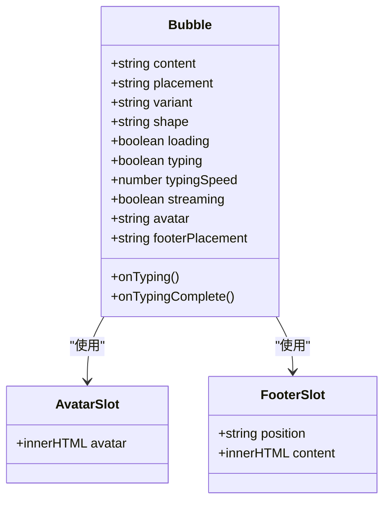

#### 核心特性

- **样式变体**：填充、描边、阴影、无边框四种样式
- **形状选项**：默认圆角、胶囊形、方角三种形状
- **动画效果**：打字机效果、加载状态指示
- **流式处理**：支持流式响应的延迟事件触发

### 发送框组件 (Sender)

发送框组件提供完整的消息输入功能：

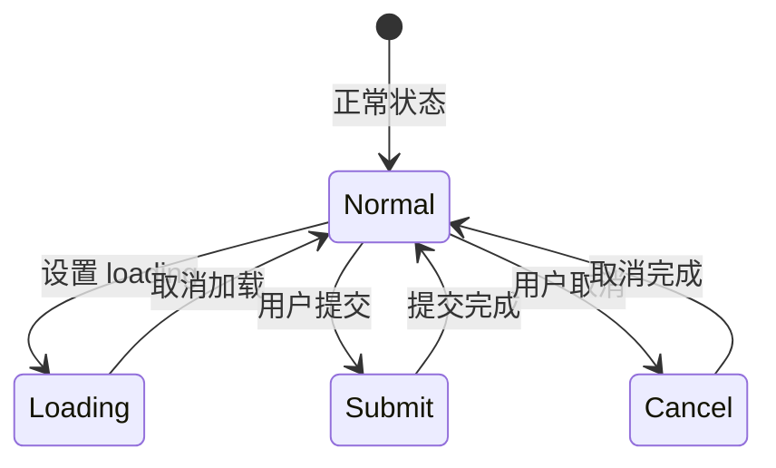

#### 功能特性

- **输入控制**：多行文本输入、自动高度调整
- **提交方式**：Enter 或 Shift+Enter 发送
- **状态管理**：加载状态、禁用状态
- **插槽系统**：前缀、后缀、头部面板插槽

### 思考过程组件 (Think)

思考过程组件用于展示 AI 的深度思考过程：

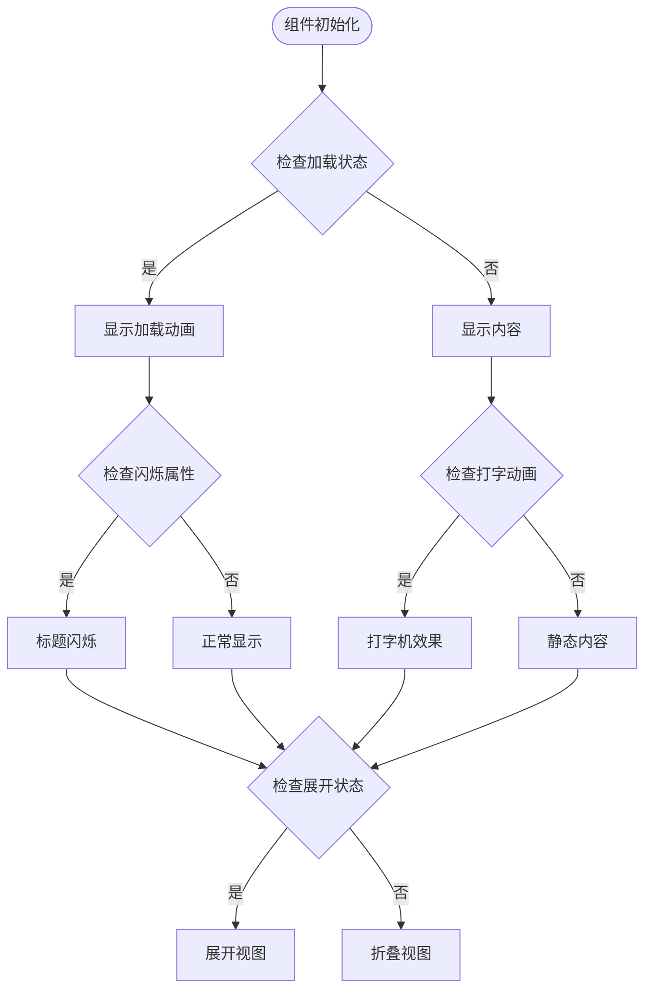

### 思维链组件 (ThoughtChain)

思维链组件展示多个推理步骤的完整流程：

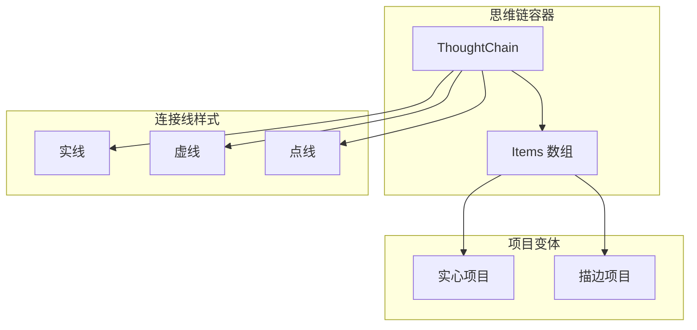

### 会话管理组件 (Conversations)

会话管理组件提供对话历史的完整管理功能：

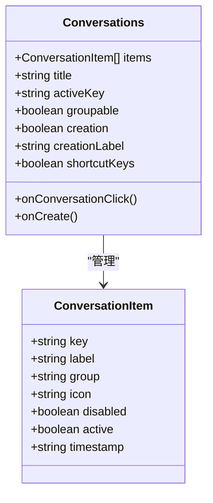

### 提示集组件 (Prompts)

提示集组件提供快速开始的对话建议：

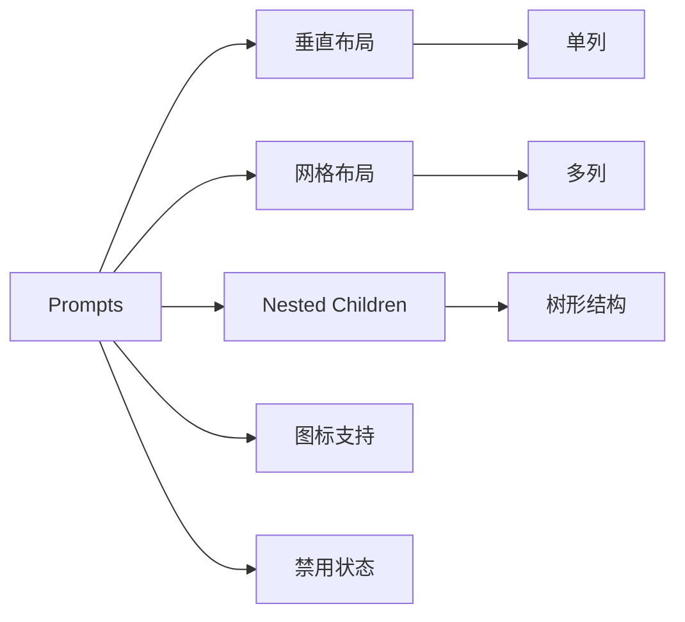

### 欢迎组件 (Welcome)

欢迎组件用于对话开始前的信息展示：

### 操作列表组件 (Actions)

操作列表组件提供消息反馈功能：

### 代码高亮组件 (CodeHighlighter)

代码高亮组件支持多种编程语言的语法高亮：

## 交互式演示系统

### @vitepress-demo-preview 生态系统集成

文档系统已成功集成 @vitepress-demo-preview 生态系统，提供强大的交互式组件预览功能：

#### 插件配置

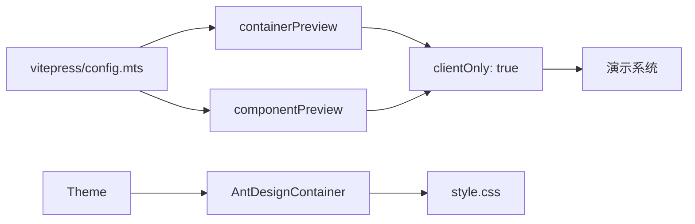

#### 自定义元素检测

VitePress 配置现已支持自定义元素检测，确保所有以 "ak-" 开头的 Web Components 正确渲染：

### Vue 演示组件库

系统包含 25+ 个精心设计的 Vue 演示组件，每个组件都展示了对应 Web Components 的实际使用方法：

#### 演示组件分类

| 分类     | 组件数量 | 示例文件                                                                      |
| -------- | -------- | ----------------------------------------------------------------------------- |
| 基础组件 | 8个      | bubble-basic.vue, button-basic.vue, actions-basic.vue, etc.                   |
| 交互组件 | 7个      | sender-basic.vue, sender-loading.vue, conversations-basic.vue, etc.           |
| 内容组件 | 6个      | code-highlighter-basic.vue, file-card-basic.vue, folder-basic.vue, etc.       |
| 特殊组件 | 4个      | think-basic.vue, thought-chain-basic.vue, promts-basic.vue, welcome-basic.vue |

#### 演示组件示例

**消息气泡演示**

```vue
<script setup>
import "@agentkit/ui";
</script>

<template>
  <div style="display: flex; flex-direction: column; gap: 16px;">
    <ak-bubble content="Hello, AgentKit!" placement="start"></ak-bubble>
    <ak-bubble content="你好！" placement="end"></ak-bubble>
  </div>
</template>
```

**发送框演示**

```vue
<script setup>
import "@agentkit/ui";
</script>

<template>
  <div style="width: 100%;">
    <ak-sender placeholder="输入消息..."></ak-sender>
  </div>
</template>
```

**思考过程演示**

```vue
<script setup>
import "@agentkit/ui";
</script>

<template>
  <ak-think
    title="思考过程"
    content="用户询问了关于 AgentKit UI 的信息，我需要介绍其核心特性和使用方式。AgentKit UI 基于 Lit + Tailwind CSS v4 构建，提供了丰富的 AI 对话组件。"
  ></ak-think>
</template>
```

**思维链演示**

```vue
<script setup>
import "@agentkit/ui";
const items = [
  {
    key: "1",
    title: "理解问题",
    description: "分析用户需求",
    status: "success",
  },
  {
    key: "2",
    title: "搜索知识",
    description: "从知识库中检索相关信息",
    status: "running",
  },
  {
    key: "3",
    title: "生成回答",
    description: "基于搜索结果组织回答",
    status: "pending",
  },
];
</script>

<template>
  <ak-thought-chain :items="items"></ak-thought-chain>
</template>
```

### 演示系统工作流程

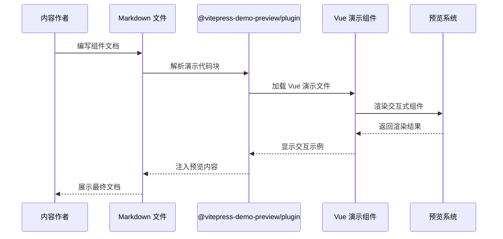

## 自动化部署系统

### GitHub Actions 部署工作流

文档系统现已集成完整的 GitHub Actions 自动化部署工作流，实现了 CI/CD 流程的完全自动化：

#### 工作流配置

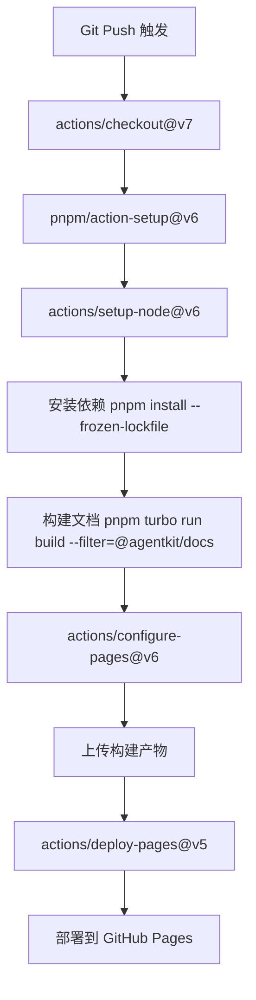

#### 部署权限配置

工作流具有精确的权限控制：

- **contents: read** - 读取仓库内容
- **pages: write** - 写入 GitHub Pages
- **id-token: write** - 写入身份令牌

#### 部署触发条件

- **分支触发**：主分支推送
- **路径过滤**：仅监控文档和包相关文件变更
- **手动触发**：支持 workflow_dispatch 手动部署

#### 构建优化

- **并发控制**：同一时间只允许一个部署任务
- **缓存机制**：Node.js 和 pnpm 缓存
- **增量构建**：使用 Turbo 构建系统

### 部署脚本和命令

文档系统提供了完整的部署脚本支持：

```bash
# 开发模式
pnpm docs:dev

# 构建文档
pnpm docs:build

# 预览构建结果
pnpm docs:preview

# 使用 Turbo 构建
pnpm turbo run build --filter=@agentkit/docs
```

## TypeScript 和 CSS 模块支持

### TypeScript 配置增强

文档系统现已集成完整的 TypeScript 支持，提供了更好的开发体验：

#### 类型配置

```mermaid
graph LR
TSConfig[tsconfig.json] --> Base[继承 tsconfig.base.json]
Base --> Include[include: ".vitepress/**/*, **/*.md"]
Include --> VitePress[VitePress 类型]
Include --> Markdown[Markdown 类型]
```

#### 环境声明

系统提供了 CSS 模块的类型声明支持：

```typescript
// CSS 模块类型声明
declare module "*.css" {
  const content: string;
  export default content;
}

declare module "*.css?inline" {
  const content: string;
  export default content;
}
```

### 主题系统增强

主题配置现已支持演示组件的完整类型支持：

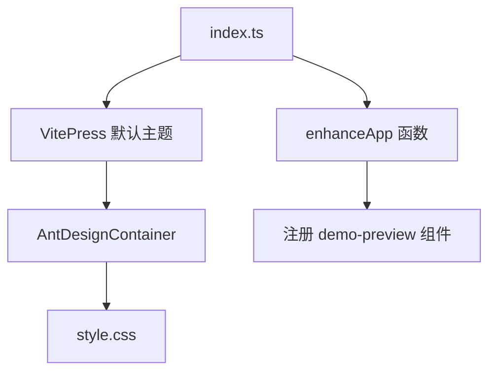

## 依赖关系分析

### 核心依赖架构

```mermaid
graph TB
subgraph "文档系统依赖"
VitePress[vitepress ^2.0.0-alpha.17]
DemoPlugin["@vitepress-demo-preview/plugin"]
DemoComponent["@vitepress-demo-preview/component"]
Turbo[turbo ^2.0.0]
End
subgraph "业务组件依赖"
AgentKitUI["@agentkit/ui workspace:*"]
End
subgraph "组件库"
Lit[lit ^3.3]
TailwindCSS[tailwindcss ^4.3]
Task["@lit/task ^1.0"]
Virtualizer["@lit-labs/virtualizer ^2.1"]
Observers["@lit-labs/observers ^2.1"]
End
subgraph "演示系统依赖"
VueDemos[Vue 演示组件]
DemoFiles[25+ 个演示文件]
End
subgraph "开发工具"
TypeScript[TypeScript ^6.0]
ESLint[ESLint]
Prettier[Prettier]
End
VitePress --> DemoPlugin
VitePress --> DemoComponent
VitePress --> Turbo
AgentKitUI --> Lit
AgentKitUI --> TailwindCSS
AgentKitUI --> Task
AgentKitUI --> Virtualizer
AgentKitUI --> Observers
DemoPlugin --> DemoFiles
DemoComponent --> VueDemos
TypeScript --> VitePress
TypeScript --> DemoPlugin
```

### 组件依赖关系

```mermaid
graph TB
subgraph "基础组件"
Bubble[Bubble]
Sender[Sender]
Welcome[Welcome]
End
subgraph "高级组件"
Conversations[Conversations]
ThoughtChain[ThoughtChain]
Prompts[Prompts]
End
subgraph "工具组件"
Actions[Actions]
CodeHighlighter[CodeHighlighter]
End
subgraph "演示组件"
BubbleDemo[Bubble 演示]
SenderDemo[Sender 演示]
ThinkDemo[Think 演示]
End
Bubble --> Lit
Sender --> Lit
Welcome --> Lit
Conversations --> Virtualizer
ThoughtChain --> Lit
Prompts --> Lit
Actions --> Lit
CodeHighlighter --> HighlightJS[highlight.js]
BubbleDemo --> Bubble
SenderDemo --> Sender
ThinkDemo --> Think
```

## 性能考虑

### 构建优化策略

1. **按需加载**：组件库支持 ES Modules 的 tree shaking
2. **插件分离**：Markdown 渲染和代码高亮作为独立插件
3. **虚拟滚动**：大量数据渲染时使用虚拟列表技术
4. **懒加载**：非关键资源采用懒加载策略
5. **客户端渲染**：演示系统使用 clientOnly 配置优化首屏加载
6. **Turbo 构建**：使用 Turborepo 实现增量构建和缓存
7. **CSS 模块**：支持 CSS 模块的按需加载和类型安全

### 运行时性能优化

1. **Web Components 标准**：避免框架绑定，减少运行时开销
2. **Shadow DOM**：样式隔离，避免全局样式污染
3. **流式渲染**：AI 对话场景专用的流式输出优化
4. **内存管理**：合理使用生命周期钩子，及时清理事件监听
5. **自定义元素检测**：通过 isCustomElement 优化渲染性能
6. **基础路径优化**：统一的基础路径配置减少资源请求

## 故障排除指南

### 常见问题解决

#### 组件不显示或显示异常

1. **检查自定义元素注册**
   - 确保 `@agentkit/ui` 已正确安装
   - 验证自定义元素前缀 `ak-`

2. **样式问题排查**
   - 检查 Tailwind CSS 配置
   - 确认 Shadow DOM 样式注入

#### Demo 预览功能异常

1. **插件配置检查**
   - 验证 `@vitepress-demo-preview/plugin` 安装
   - 检查客户端渲染配置（clientOnly: true）

2. **构建问题**
   - 清理 node_modules 和缓存
   - 重新安装依赖

3. **演示文件问题**
   - 确保演示文件位于正确的路径
   - 验证 Vue 演示文件的导入语句

#### 搜索功能问题

1. **本地搜索配置**
   - 检查搜索提供程序配置
   - 验证中文搜索支持

#### 自定义元素检测问题

1. **检查 isCustomElement 配置**
   - 确保所有组件标签都以 "ak-" 开头
   - 验证 Vue 模板中的标签命名

#### 基础路径问题

1. **检查基础路径配置**
   - 确认 `base: "/agentkit/"` 配置正确
   - 验证 GitHub Pages 的基础路径设置

#### TypeScript 类型错误

1. **检查类型配置**
   - 验证 tsconfig.json 继承关系
   - 确认 CSS 模块类型声明正确

#### 部署问题

1. **检查 GitHub Actions 权限**
   - 验证工作流权限配置
   - 确认部署 token 有效

2. **构建缓存问题**
   - 清理 GitHub Actions 缓存
   - 重新运行部署工作流

## 结论

VitePress 文档系统为 AgentKit UI 组件库提供了完整的文档解决方案。通过精心设计的组件分类体系、丰富的交互示例和完善的 API 文档，开发者可以快速理解和使用各个组件。

**主要更新亮点**：

1. **全新的自动化部署系统**：集成 GitHub Actions 工作流，实现 CI/CD 流程自动化
2. **增强的开发体验**：实时预览、交互式示例、类型安全的演示环境
3. **现代化的配置架构**：支持客户端渲染和自定义元素检测
4. **完整的组件覆盖**：从基础消息气泡到复杂的思维链组件
5. **TypeScript 和 CSS 模块支持**：提供类型安全和模块化的开发体验
6. **优化的基础路径配置**：统一的 `/agentkit/` 路径配置

**系统的主要优势**：

1. **完整的组件覆盖**：从基础消息气泡到复杂的思维链组件
2. **优秀的开发体验**：实时预览、交互式示例、类型安全
3. **灵活的配置选项**：支持多种样式变体和交互模式
4. **性能优化**：按需加载、虚拟滚动、流式渲染
5. **现代化的演示系统**：基于 Vue 的交互式组件预览
6. **自动化部署**：完整的 CI/CD 流程，确保文档的持续更新
7. **类型安全**：完整的 TypeScript 和 CSS 模块支持

该文档系统不仅是一个技术文档平台，更是 AgentKit UI 组件库设计理念和技术实现的完美展示。通过 @vitepress-demo-preview 生态系统的集成、GitHub Actions 自动化部署工作流以及增强的 TypeScript 支持，开发者可以获得更加直观、高效和可靠的组件学习体验。

**未来发展方向**：

- 进一步优化构建性能和部署效率
- 增强文档搜索和导航功能
- 扩展交互式演示组件的覆盖范围
- 完善 TypeScript 类型定义的完整性
- 优化移动端和响应式设计体验
