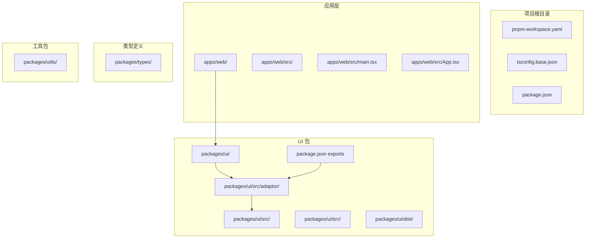
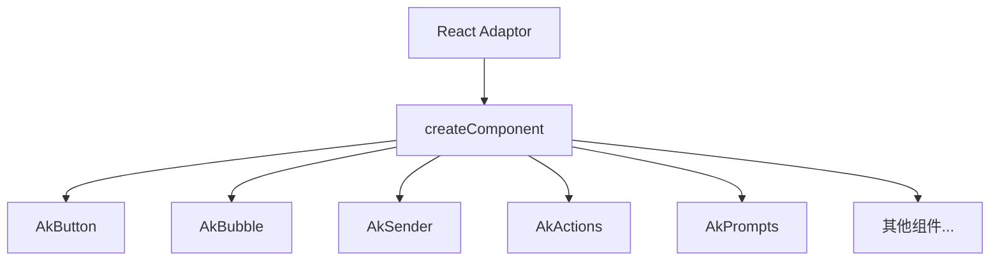
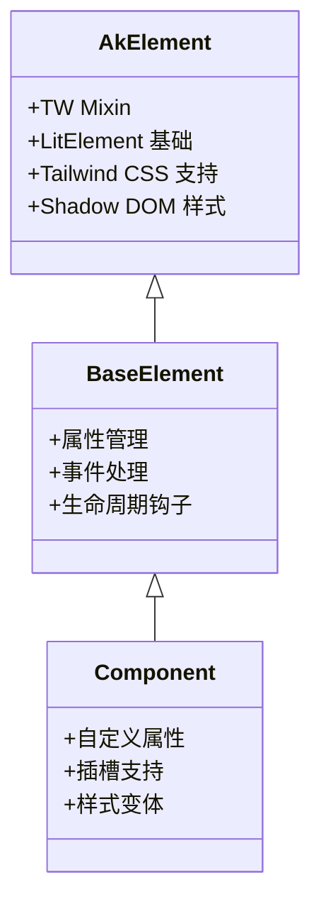
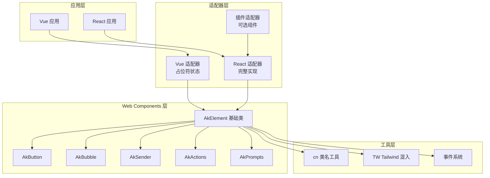
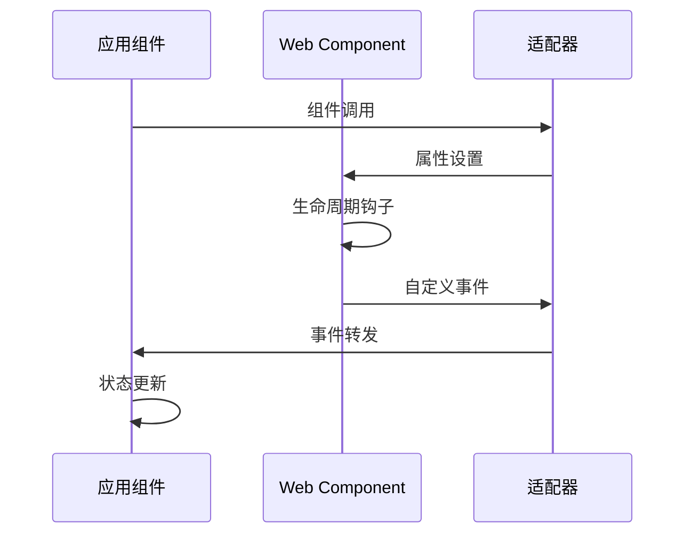
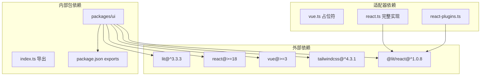
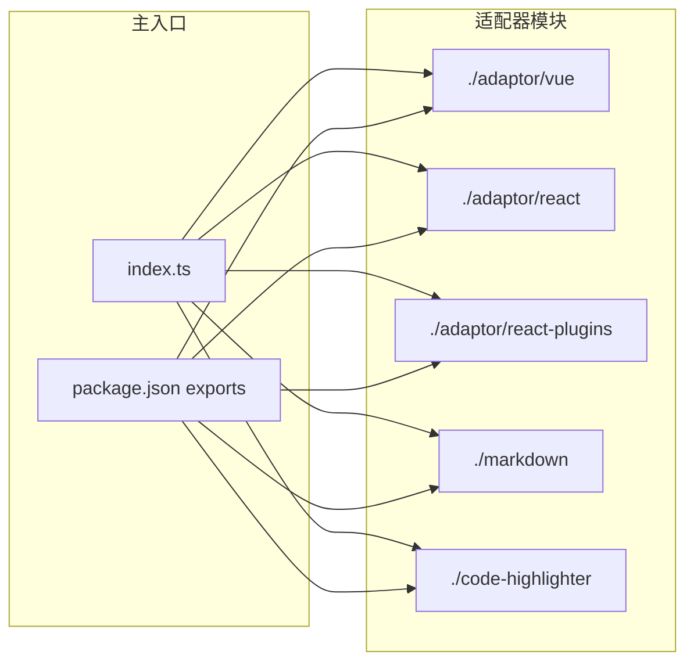

# Vue 适配器系统

## 目录

1. [简介](#简介)
2. [项目结构](#项目结构)
3. [核心组件](#核心组件)
4. [架构概览](#架构概览)
5. [详细组件分析](#详细组件分析)
6. [依赖关系分析](#依赖关系分析)
7. [性能考虑](#性能考虑)
8. [故障排除指南](#故障排除指南)
9. [结论](#结论)

## 简介

Vue 适配器系统经过重大架构演进，现已从简单的占位符实现发展为基于Web Components的现代化适配器系统。该系统采用统一的组件接口，通过不同的适配器层支持Vue.js和React等前端框架。

**更新后架构特点**：

- 基于Lit Web Components的统一组件库
- 支持多框架适配器（Vue、React）
- 标准化的组件通信模式
- 增强的生命周期管理
- 插件化组件扩展支持

## 项目结构

项目采用多包工作区结构，现已支持Vue和React双框架适配：



## 核心组件

### Vue 适配器现状

Vue适配器目前仍处于占位符状态，但已明确发展方向：

```typescript
/**
 * @agentkit/ui Vue Adaptor
 * TODO: Wrap Lit Web Components as Vue components using @lit-labs/vue-utils
 */

// Placeholder - Vue adaptor coming soon
export {};
```

**目标实现**：基于@lit-labs/vue-utils将现有的Lit Web Components转换为Vue组件。

### React 适配器完整实现

React适配器现已完全实现，采用@lit/react库进行组件包装：



### Web Components 核心架构

所有组件均基于统一的AkElement基础类：



## 架构概览

Vue适配器系统采用分层架构设计，现已支持多框架适配：



### 组件通信模式

新架构采用标准Web Components事件模型：



## 详细组件分析

### Web Components 基础架构

所有组件均继承自AkElement，提供统一的基础功能：

#### AkElement 基础类

- 继承LitElement提供响应式能力
- 集成TW混入支持Tailwind CSS
- 自动管理Shadow DOM样式

#### 组件通信机制

- 使用CustomEvent标准API
- 支持bubbles和composed属性
- 提供类型安全的事件处理

### Vue 适配器演进路径

**当前状态**：占位符实现，计划基于@lit-labs/vue-utils

**预期实现模式**：

```typescript
// 计划中的Vue适配器实现
import { defineCustomElement } from "vue";
import { AkButton } from "@/button";

export const VueButton = defineCustomElement(AkButton);
```

**待实现特性**：

- Vue 3 Composition API 集成
- 响应式属性绑定
- 插槽和事件处理
- 类型定义支持

### React 适配器完整实现

React适配器采用@lit/react库，提供完整的组件包装：

#### 核心实现模式

```typescript
import { createComponent } from "@lit/react";
import { AkButton } from "@/button";

export const Button = createComponent({
  tagName: "ak-button",
  elementClass: AkButton,
  react: React,
  events: {
    // 事件映射
  },
});
```

#### 支持的组件列表

- 基础组件：Button, Bubble, Sender, Actions, Prompts
- 专业组件：Conversations, ThoughtChain, XCard
- 插件组件：CodeHighlighter, Markdown

### 插件组件系统

新增插件组件支持，依赖外部库但保持可选性：

#### CodeHighlighter 插件

- 依赖highlight.js
- 支持代码复制功能
- 可选安装

#### Markdown 插件

- 依赖marked库
- 支持Markdown渲染
- 可选安装

## 依赖关系分析

### 当前依赖结构



### 模块导出结构



## 性能考虑

### 组件渲染优化

**现有优化措施**：

- LitElement响应式渲染
- Shadow DOM样式隔离
- 虚拟化支持（@lit-labs/virtualizer）
- 运动效果优化（@lit-labs/motion）

**Vue适配器性能考虑**：

- 基于Web Components的原生性能
- 减少框架间转换开销
- 支持原生浏览器特性

### 内存管理

**标准内存管理**：

- 自动清理事件监听器
- 组件卸载时的资源释放
- 避免内存泄漏的最佳实践

### 网络性能

**构建优化**：

- 按需加载组件
- 代码分割支持
- CDN友好的模块结构

## 故障排除指南

### Vue适配器相关问题

**当前问题**：

- Vue适配器仍为占位符实现
- 缺少具体的Vue集成示例

**解决方案**：

- 参考React适配器实现模式
- 使用@lit-labs/vue-utils进行组件包装
- 实现Vue特定的事件处理

### React适配器常见问题

**组件无法渲染**：

1. 确认@lit/react依赖正确安装
2. 检查createComponent配置
3. 验证Web Components标签名

**事件处理问题**：

1. 确认事件名称映射正确
2. 检查事件对象的detail属性
3. 验证bubbles和composed标志

### Web Components通用问题

**样式问题**：

1. 检查Shadow DOM样式隔离
2. 确认Tailwind CSS配置
3. 验证CSS变量使用

**生命周期问题**：

1. 确认connectedCallback正确实现
2. 检查disconnectedCallback清理
3. 验证updated钩子的属性变更检测

## 结论

Vue适配器系统已完成从占位符到现代化Web Components架构的重要演进。虽然Vue适配器仍处于开发阶段，但其基于标准Web Components的设计为未来的完整实现奠定了坚实基础。

**主要成就**：

1. **统一组件库**：基于Lit的Web Components提供一致的组件体验
2. **多框架支持**：React适配器已完全实现，Vue适配器正在开发中
3. **标准化通信**：采用Web标准事件模型确保跨框架兼容性
4. **插件化扩展**：支持可选的第三方库集成
5. **性能优化**：充分利用Web Components的原生性能优势

**未来发展方向**：

- 完成Vue适配器的@lit-labs/vue-utils集成
- 扩展更多Web Components生态工具
- 优化TypeScript类型定义
- 增强开发工具链支持

该系统为构建现代、高性能的AI交互界面提供了强大的基础设施，支持多种前端框架的统一开发体验。
