# ThoughtChain 思维链组件

## 目录

1. [简介](#简介)
2. [项目结构](#项目结构)
3. [核心组件](#核心组件)
4. [架构概览](#架构概览)
5. [详细组件分析](#详细组件分析)
6. [与Mastra代理系统的集成](#与mastra代理系统的集成)
7. [AI代理推理过程可视化](#ai代理推理过程可视化)
8. [依赖关系分析](#依赖关系分析)
9. [性能考虑](#性能考虑)
10. [故障排除指南](#故障排除指南)
11. [结论](#结论)

## 简介

ThoughtChain 是 AgentKit UI 库中的一个核心组件，专门用于展示 AI 推理步骤和中间过程的思维链。该组件实现了对 antd-x ThoughtChain 的 1:1 对标，提供了完整的思维链可视化功能，包括状态管理、动画效果、可折叠内容等特性。

**更新** 该组件现已深度集成Mastra代理系统，能够实时可视化AI代理的推理过程，包括工具调用、步骤执行和状态转换，为调试和追踪复杂Agent系统的调用链提供了强大的可视化工具。

该组件采用现代 Web Components 技术构建，基于 Lit 框架开发，支持多种状态显示、打字机动画、连接线样式控制等功能，是调试和追踪复杂 Agent 系统调用链的理想选择。

## 项目结构

AgentKit 项目采用多包架构，ThoughtChain 组件位于 UI 包中，具有清晰的模块化组织：

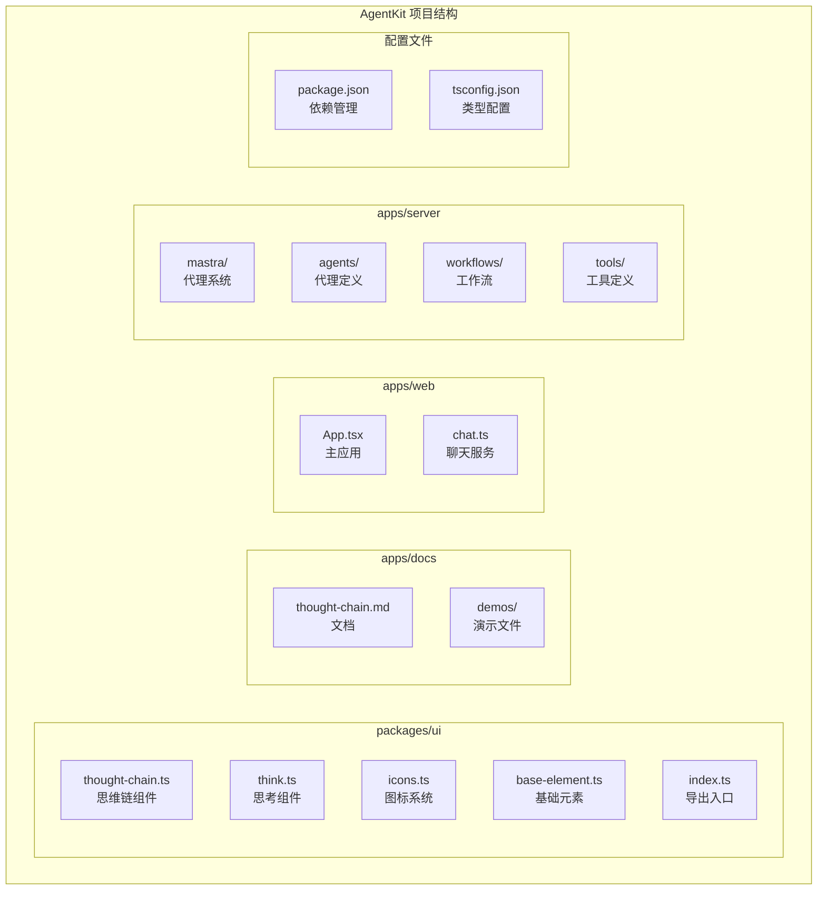

## 核心组件

### ThoughtChain 组件架构

ThoughtChain 组件是整个思维链系统的核心，负责渲染和管理所有思维链节点。它实现了完整的 antd-x ThoughtChain 功能集，包括状态管理、动画效果和交互控制。

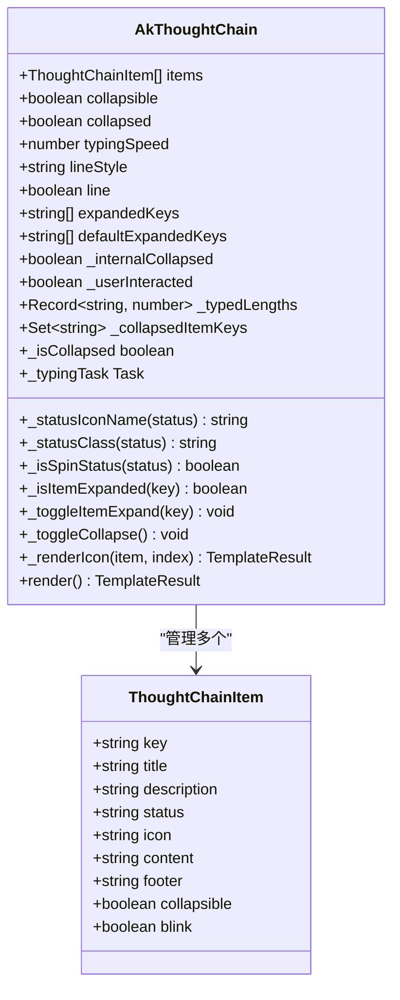

### 主要属性和方法

组件提供了丰富的配置选项来满足不同的使用场景：

| 属性名              | 类型                        | 默认值  | 描述                    |
| ------------------- | --------------------------- | ------- | ----------------------- |
| items               | ThoughtChainItem[]          | []      | 思维链节点数据数组      |
| collapsible         | boolean                     | false   | 是否启用全局折叠功能    |
| collapsed           | boolean                     | false   | 默认折叠状态            |
| typingSpeed         | number                      | 20      | 打字动画速度（ms/字符） |
| lineStyle           | "solid"\|"dashed"\|"dotted" | "solid" | 连接线样式              |
| line                | boolean                     | true    | 是否显示连接线          |
| expandedKeys        | string[] \| null            | null    | 受控展开的节点键数组    |
| defaultExpandedKeys | string[]                    | []      | 默认展开的节点键数组    |

## 架构概览

### 组件层次结构

ThoughtChain 组件采用了清晰的层次化设计，每个思维链节点都包含完整的状态信息和可选内容区域：

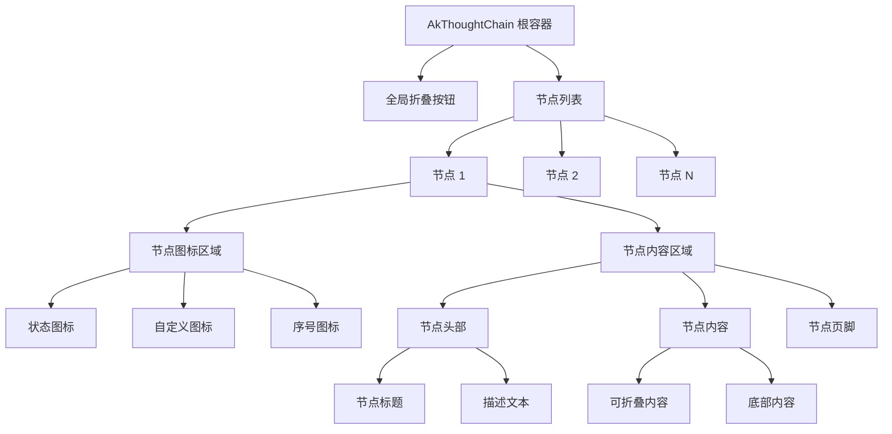

### 状态管理系统

组件实现了完整的状态管理机制，支持多种状态的可视化展示：

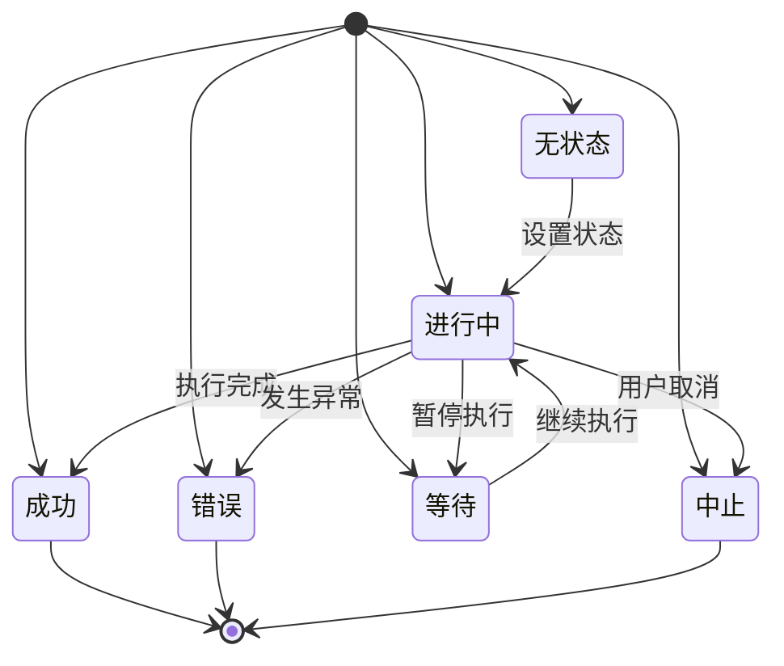

## 详细组件分析

### 打字机动画系统

ThoughtChain 实现了智能的打字机动画效果，支持实时文本流式显示：

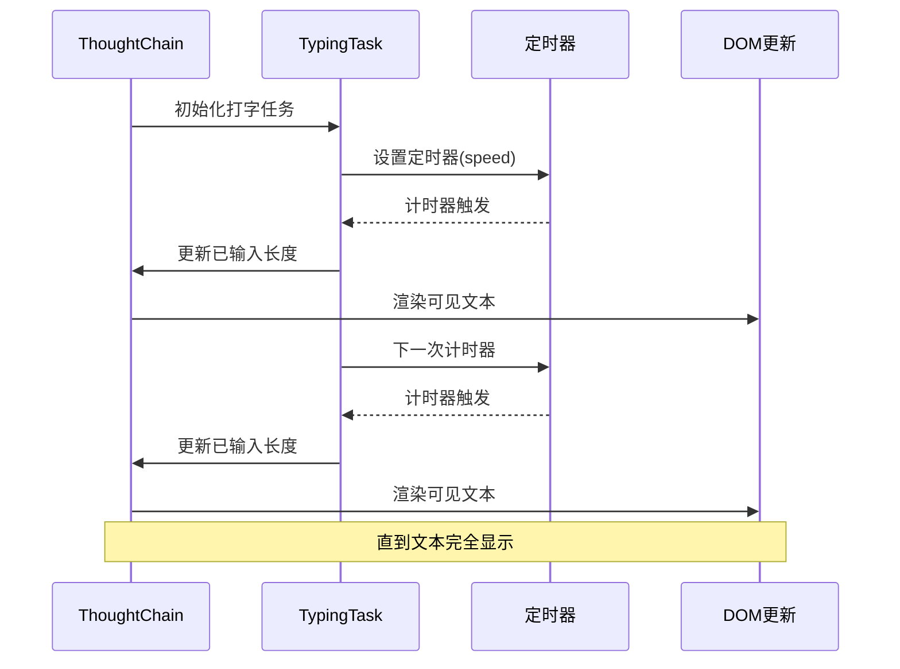

### 折叠展开机制

组件支持全局和逐项的折叠展开功能，提供了流畅的用户体验：

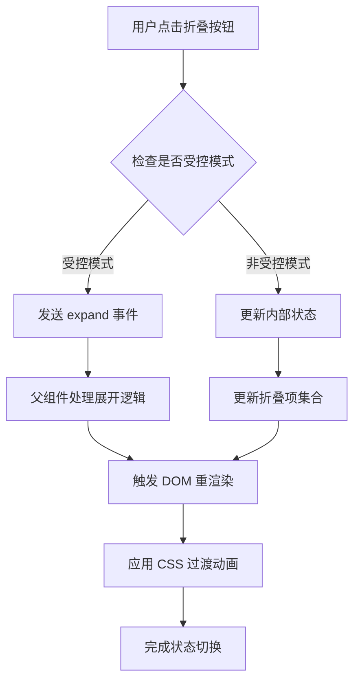

### 图标系统集成

ThoughtChain 与统一的图标系统深度集成，支持状态图标、自定义图标和序号图标：

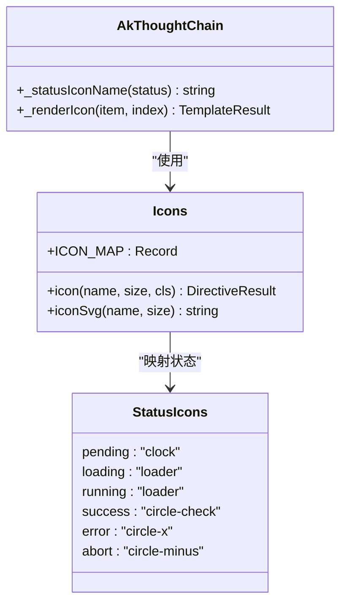

## 与Mastra代理系统的集成

### Mastra代理系统概述

AgentKit 项目深度集成了 Mastra 代理系统，提供了完整的 AI 代理开发和运行时环境：

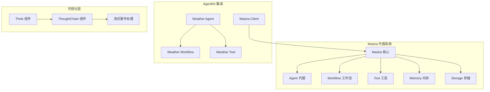

### 代理模型网关集成

系统通过 Agnes 网关提供对本地大模型的访问：

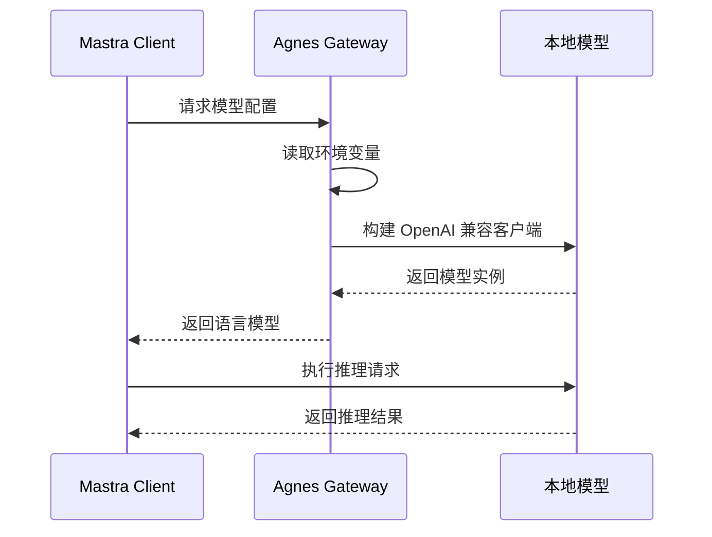

### 工具调用事件流

Mastra 系统提供了完整的流式事件处理机制，支持实时可视化代理的推理过程：

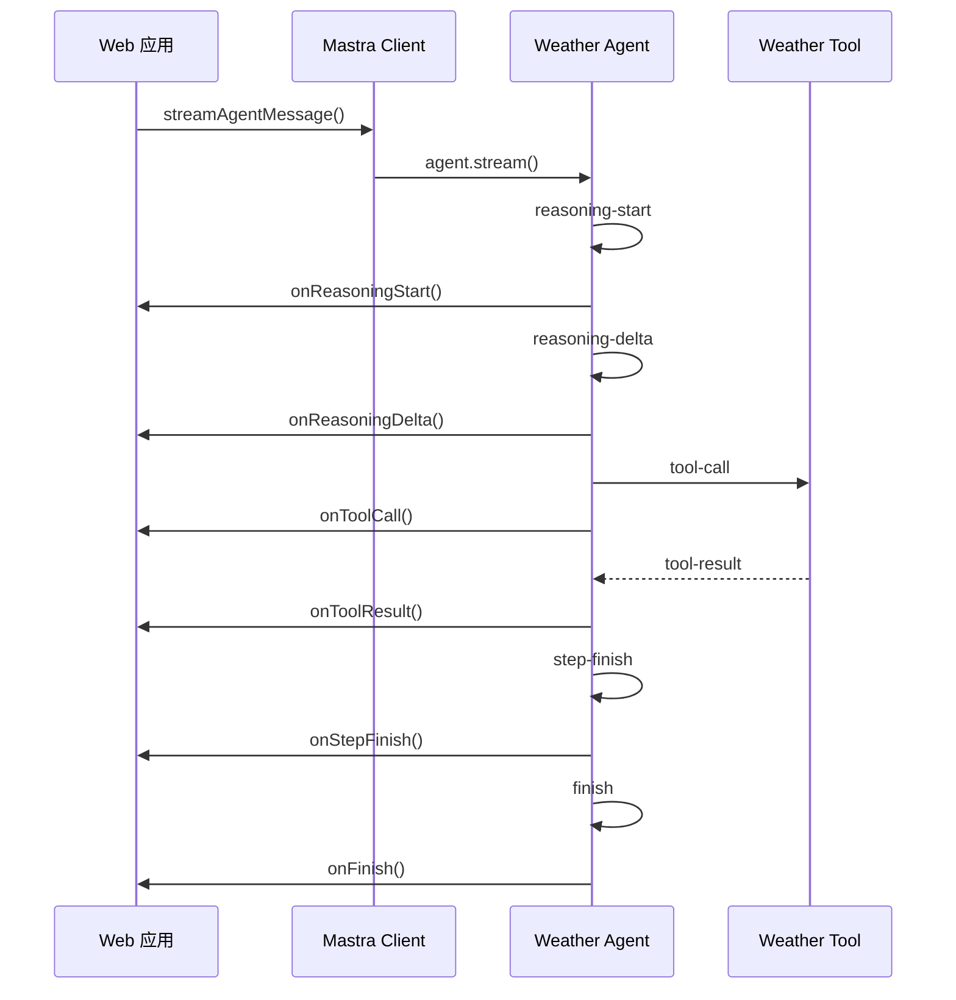

## AI代理推理过程可视化

### 思维链构建机制

系统实现了完整的思维链构建机制，将 Mastra 代理的流式事件转换为可视化的思维链：

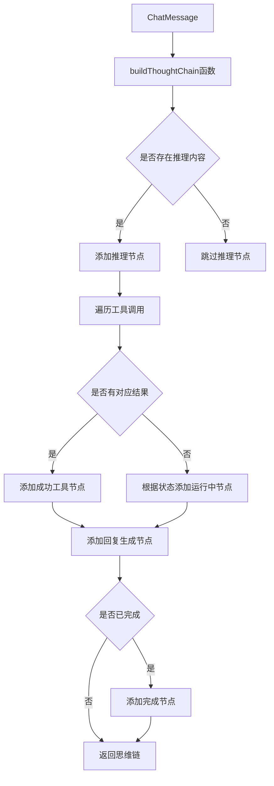

### 实际应用示例

在天气代理的实际应用中，思维链展示了完整的推理过程：

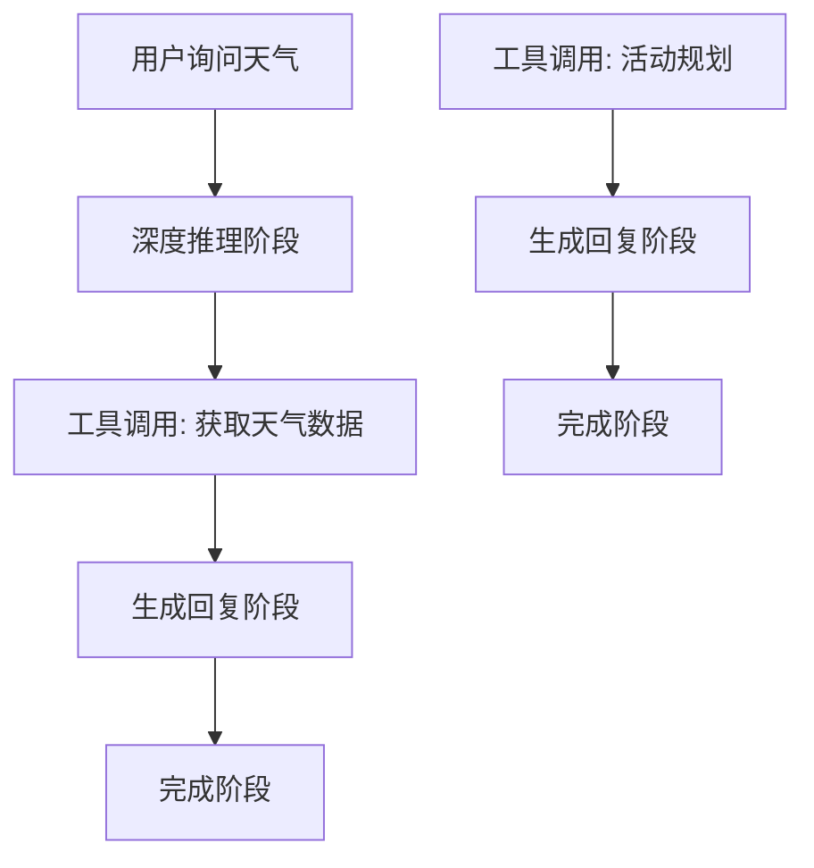

### 工作流编排可视化

Mastra 工作流提供了多步骤的编排能力，思维链可以同时展示工具调用和步骤执行：

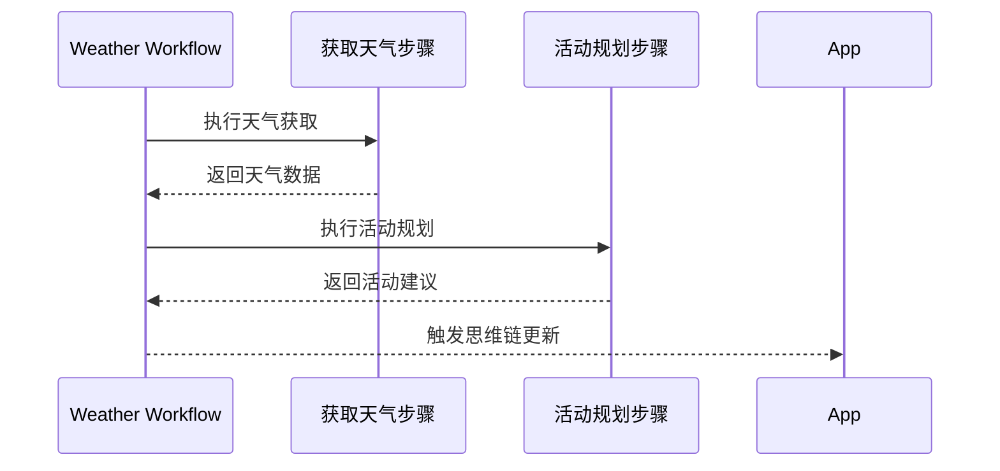

## 依赖关系分析

### 外部依赖

ThoughtChain 组件依赖于多个现代化的前端技术栈：

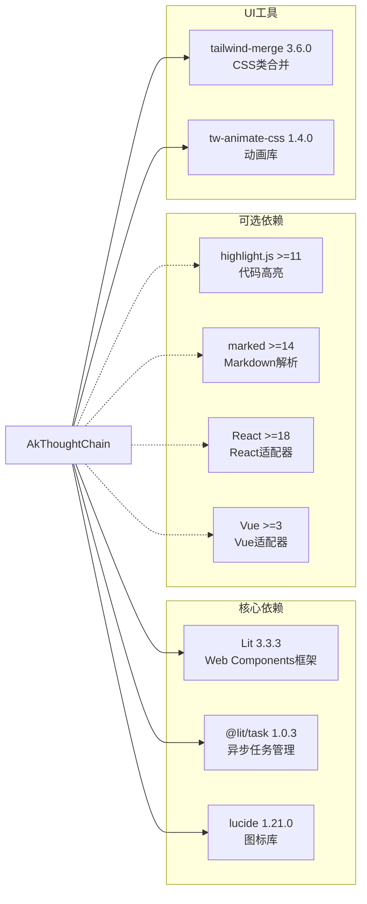

### 内部模块依赖

组件之间的依赖关系清晰明确，遵循单一职责原则：

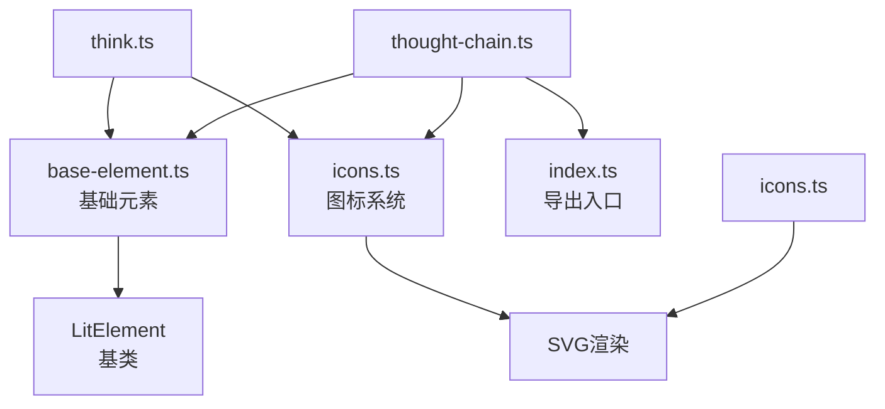

## 性能考虑

### 渲染优化策略

ThoughtChain 采用了多项性能优化措施来确保流畅的用户体验：

1. **虚拟滚动支持**: 通过 @lit-labs/virtualizer 实现大数据量的高效渲染
2. **懒加载机制**: 图标和内容按需加载，减少初始渲染负担
3. **动画优化**: 使用 CSS 动画而非 JavaScript 动画，提升性能表现
4. **内存管理**: 合理的事件监听器管理和资源清理

### 打字机动画性能

打字机动画采用了高效的异步处理机制：

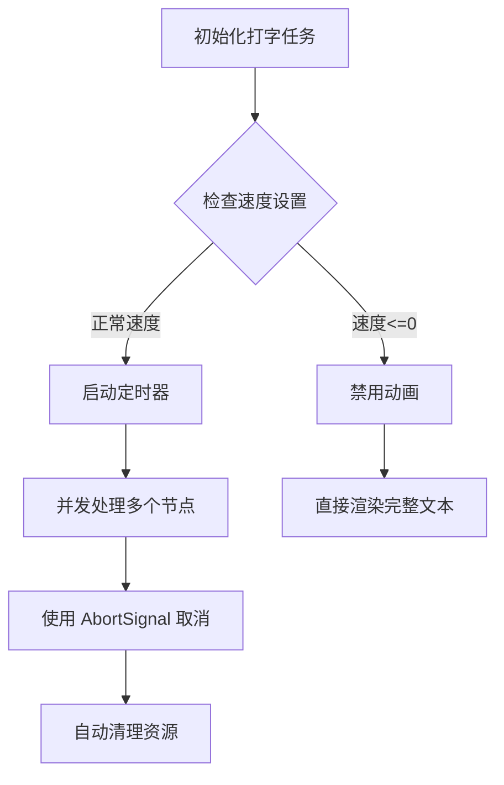

## 故障排除指南

### 常见问题及解决方案

| 问题类型     | 症状                 | 解决方案                           |
| ------------ | -------------------- | ---------------------------------- |
| 图标不显示   | 显示为空白或错误     | 检查图标名称是否在 ICON_MAP 中定义 |
| 动画异常     | 打字机动画卡顿或停止 | 验证 typingSpeed 设置是否合理      |
| 折叠功能失效 | 点击无反应           | 确认 collapsible 属性设置正确      |
| 状态显示错误 | 图标颜色不正确       | 检查 status 值是否符合枚举定义     |
| 思维链不更新 | 代理事件未触发       | 检查 Mastra 客户端连接和事件处理   |

### 调试技巧

1. **开发者工具**: 使用浏览器开发者工具检查组件属性和状态
2. **日志输出**: 在关键方法中添加 console.log 进行调试
3. **简化测试**: 创建最小化的示例来隔离问题
4. **版本兼容**: 确保使用的 Lit 和相关依赖版本兼容

## 结论

ThoughtChain 思维链组件是一个功能完整、性能优异的 Web Components 实现。它成功地将复杂的思维链可视化需求转化为简洁易用的组件接口，为 AI 应用的调试和展示提供了强大的工具。

**更新** 通过与 Mastra 代理系统的深度集成，该组件现在能够实时可视化 AI 代理的完整推理过程，包括工具调用、步骤执行和状态转换，为构建复杂的 AI 应用提供了重要的基础设施支持。

该组件的主要优势包括：

1. **完整的功能实现**: 几乎完全对标 antd-x ThoughtChain 的功能特性
2. **优秀的性能表现**: 采用现代前端技术栈，优化了渲染和动画性能
3. **灵活的配置选项**: 提供丰富的属性和事件接口，适应各种使用场景
4. **良好的扩展性**: 基于标准的 Web Components 规范，易于集成到各种框架中
5. **AI代理集成**: 深度集成 Mastra 代理系统，支持实时推理过程可视化
6. **工作流编排**: 支持多步骤工作流的可视化展示
7. **流式事件处理**: 完整支持 Mastra 的流式事件处理机制

通过合理的架构设计和实现细节，ThoughtChain 为开发者提供了一个可靠、易用的思维链可视化解决方案，是构建复杂 AI 应用的重要基础设施组件。
