# Web Components 集成指南

## 目录

1. [简介](#简介)
2. [项目结构](#项目结构)
3. [适配器系统](#适配器系统)
4. [核心组件](#核心组件)
5. [AI 组件库](#ai-组件库)
6. [专业UI组件](#专业ui组件)
7. [架构概览](#架构概览)
8. [详细组件分析](#详细组件分析)
9. [依赖关系分析](#依赖关系分析)
10. [性能考虑](#性能考虑)
11. [故障排除指南](#故障排除指南)
12. [结论](#结论)

## 简介

AgentKit 是一个基于现代前端技术栈构建的 Web Components 集成解决方案。该项目采用 Monorepo 架构，结合了 React、Lit Web Components、TailwindCSS 和 Vite 开发工具链，为开发者提供了一个完整的前端组件生态系统。

**更新** 项目现已引入基于@lit/task的Task系统，为所有AI组件提供统一的异步任务管理机制。Task系统替代了原有的手动定时器管理，提供了更好的内存管理和自动清理机制。

**更新** Task系统的核心优势包括：

- **自动清理**：通过AbortSignal自动清理定时器和异步任务
- **内存安全**：防止内存泄漏和资源泄漏
- **状态管理**：提供更好的异步状态管理和错误处理
- **性能优化**：通过防抖和批处理优化渲染性能
- **生命周期管理**：自动处理组件卸载时的任务清理

**更新** 适配器系统现在采用模块化设计，分为：

- **基础适配器**：提供16个核心组件，无需额外依赖
- **插件适配器**：提供2个高级组件，需要安装可选依赖

**新增** 项目现在包含28个UI组件，涵盖了从基础交互到专业AI应用的完整组件生态。新增的专业组件包括 Markdown 渲染器、动态卡片组件、文件夹树组件、思维链组件等，为构建复杂的AI应用界面提供了强大的组件支持。

**新增** App.tsx演示界面展示了完整的组件集成示例，包含了流式渲染、代码高亮、思维链展示、Markdown渲染、动态卡片等新功能的实际应用场景。

**新增** 新增八个专业组件：

- **Folder 组件**：文件夹树形结构，支持文件预览和选择
- **SenderSwitch 组件**：发送器开关，用于控制发送器状态
- **XProvider 组件**：上下文提供者，支持React Context风格的配置传递
- **Attachments 组件**：附件上传组件，支持拖拽上传和文件管理
- **Mermaid 组件**：图表渲染组件，支持Mermaid语法的图表生成
- **Think 组件**：增强的思考过程组件，支持流式渲染和打字机动画
- **Markdown 组件**：纯Markdown渲染器，移除think标签处理
- **XCard 组件**：动态卡片组件，支持异步加载和状态管理

**新增** 完整的聊天应用架构：

- **流式渲染**：支持AI回复的逐字显示效果
- **思维链展示**：通过Think组件展示AI的思考过程
- **多组件协作**：从基础组件到专业组件的完整应用架构
- **状态管理**：完整的聊天状态管理和事件处理机制

本项目的核心特色包括：

- **分层适配器系统**：通过 @agentkit/ui/adaptor/react 和 @agentkit/ui/adaptor/react-plugins 提供模块化的组件接口
- **Web Components 标准化**：使用 Lit 框架构建符合 Web Components 规范的可复用组件
- **AI 组件专用**：新增 16 个专门用于 AI 应用的组件，涵盖聊天界面、提示词、思考过程、代码展示、Markdown渲染等功能
- **专业UI组件**：新增12个专业UI组件，支持文件管理、通知、源码展示、动态卡片、图表渲染等高级功能
- **流式渲染**：新增 Think 和 Bubble 组件的流式渲染功能
- **代码高亮**：新增 CodeHighlighter 组件，支持多种编程语言的语法高亮
- **动画系统**：新增 motion 动画系统，提供丰富的CSS动画效果
- **图标系统**：新增 Lucide 图标库，提供1400+精美SVG图标
- **上下文提供者系统**：新增XProvider组件，支持React Context风格的配置传递
- **现代化样式方案**：支持Tailwind CSS v4和暗色主题，提供CSS-in-JS样式的组件
- **TypeScript 强类型支持**：完整的类型定义系统确保开发时的类型安全
- **现代化构建工具**：基于 Vite 的快速开发体验和优化的生产构建
- **模块化设计**：清晰的包结构分离关注点，便于维护和扩展
- **Task系统重构**：所有AI组件已迁移到基于@lit/task的Task系统实现

## 项目结构

项目采用 Turborepo + PNPM Workspace 的 Monorepo 架构，实现了高效的多包管理和构建优化。

```mermaid
graph TB
subgraph "根目录"
RootPkg[package.json]
Turbo[turbo.json]
Workspace[pnpm-workspace.yaml]
end
subgraph "应用层"
WebApp[apps/web/]
WebPkg[apps/web/package.json]
WebSrc[apps/web/src/]
MainTSX[apps/web/src/main.tsx]
AppTSX[apps/web/src/App.tsx]
ViteCfg[apps/web/vite.config.ts]
end
subgraph "包层"
UIPkg[packages/ui/]
UtilsPkg[packages/utils/]
TypesPkg[packages/types/]
UIBuild[packages/ui/package.json]
UIButton[packages/ui/src/button.ts]
UIExport[packages/ui/src/index.ts]
UIAdaptor[packages/ui/src/adaptor/]
UIReactAdaptor[packages/ui/src/adaptor/react.ts]
UIReactPluginsAdaptor[packages/ui/src/adaptor/react-plugins.ts]
UIVueAdaptor[packages/ui/src/adaptor/vue.ts]
UICN[packages/ui/src/shared/cn.ts]
UITW[packages/ui/src/shared/tailwindMixin.ts]
UIMotion[packages/ui/src/shared/motion.ts]
UIBase[packages/ui/src/shared/base-element.ts]
UIIcons[packages/ui/src/shared/icons.ts]
UIStyles[packages/ui/src/styles/]
UITailwindGlobal[packages/ui/src/styles/tailwind.global.css]
UIBubble[packages/ui/src/bubble.ts]
UIWelcome[packages/ui/src/welcome.ts]
UIPrompts[packages/ui/src/prompts.ts]
UIThink[packages/ui/src/think.ts]
UISender[packages/ui/src/sender.ts]
UIActions[packages/ui/src/actions.ts]
UICodeHighlighter[packages/ui/src/code-highlighter.ts]
UIConversations[packages/ui/src/conversations.ts]
UIFileCard[packages/ui/src/file-card.ts]
UINotification[packages/ui/src/notification.ts]
UISources[packages/ui/src/sources.ts]
UISuggestion[packages/ui/src/suggestion.ts]
UIGhoughtChain[packages/ui/src/thought-chain.ts]
UIMarkdown[packages/ui/src/markdown.ts]
UIXCard[packages/ui/src/x-card.ts]
UIFolder[packages/ui/src/folder.ts]
UISenderSwitch[packages/ui/src/sender-switch.ts]
UIXProvider[packages/ui/src/x-provider.ts]
UIAttachments[packages/ui/src/attachments.ts]
UIMermaid[packages/ui/src/mermaid.ts]
UtilsBuild[packages/utils/package.json]
UtilsIndex[packages/utils/src/index.ts]
TypesBuild[packages/types/package.json]
TypesIndex[packages/types/src/index.ts]
end
RootPkg --> WebApp
RootPkg --> UIPkg
RootPkg --> UtilsPkg
RootPkg --> TypesPkg
WebPkg --> WebSrc
WebSrc --> MainTSX
WebSrc --> AppTSX
WebSrc --> ViteCfg
UIPkg --> UIButton
UIPkg --> UIExport
UIPkg --> UIAdaptor
UIAdaptor --> UIReactAdaptor
UIAdaptor --> UIReactPluginsAdaptor
UIAdaptor --> UIVueAdaptor
UIPkg --> UICN
UIPkg --> UITW
UIPkg --> UIMotion
UIPkg --> UIBase
UIPkg --> UIIcons
UIPkg --> UIStyles
UIStyles --> UITailwindGlobal
UIPkg --> UIBubble
UIPkg --> UIWelcome
UIPkg --> UIPrompts
UIPkg --> UIThink
UIPkg --> UISender
UIPkg --> UIActions
UIPkg --> UICodeHighlighter
UIPkg --> UIConversations
UIPkg --> UIFileCard
UIPkg --> UINotification
UIPkg --> UISources
UIPkg --> UISuggestion
UIPkg --> UIGhoughtChain
UIPkg --> UIMarkdown
UIPkg --> UIXCard
UIPkg --> UIFolder
UIPkg --> UISenderSwitch
UIPkg --> UIXProvider
UIPkg --> UIAttachments
UIPkg --> UIMermaid
UtilsPkg --> UtilsIndex
TypesPkg --> TypesIndex
```

## 适配器系统

### 适配器架构概述

AgentKit 适配器系统为不同前端框架提供统一的组件接口，当前主要支持 React 框架，Vue 适配器正在开发中。系统现在采用分层设计，将组件分为基础功能和可选插件。

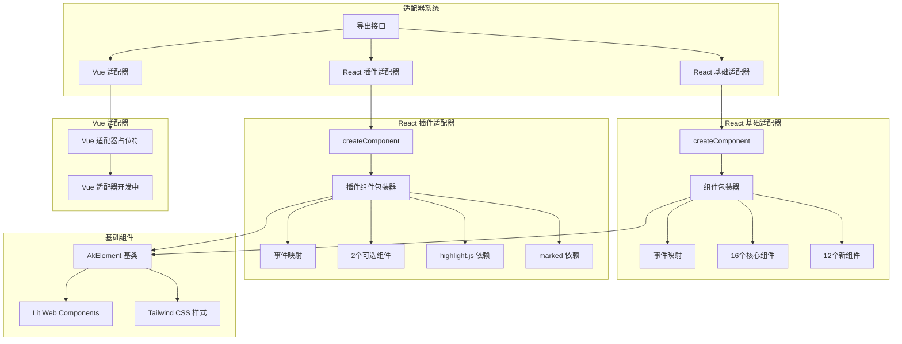

### React 基础适配器组件映射

React 基础适配器提供了 16 个核心组件的 React 包装版本，每个组件都保留了原始 Web Components 的功能和样式。

| 原始组件         | React 组件    | 导入路径                   | 事件映射                                                       |
| ---------------- | ------------- | -------------------------- | -------------------------------------------------------------- |
| ak-button        | Button        | @agentkit/ui/adaptor/react | 无事件                                                         |
| ak-welcome       | Welcome       | @agentkit/ui/adaptor/react | 无事件                                                         |
| ak-prompts       | Prompts       | @agentkit/ui/adaptor/react | onItemClick → item-click                                       |
| ak-think         | Think         | @agentkit/ui/adaptor/react | onExpand → expand                                              |
| ak-bubble        | Bubble        | @agentkit/ui/adaptor/react | onTyping → typing, onTypingComplete → typing-complete          |
| ak-sender        | Sender        | @agentkit/ui/adaptor/react | onSubmit → submit, onCancel → sender-cancel, onChange → change |
| ak-actions       | Actions       | @agentkit/ui/adaptor/react | onActionClick → action-click                                   |
| ak-conversations | Conversations | @agentkit/ui/adaptor/react | onConversationClick → conversation-click                       |
| ak-file-card     | FileCard      | @agentkit/ui/adaptor/react | onRemove → remove                                              |
| ak-notification  | Notification  | @agentkit/ui/adaptor/react | 无事件                                                         |
| ak-sources       | Sources       | @agentkit/ui/adaptor/react | onSourceClick → source-click                                   |
| ak-suggestion    | Suggestion    | @agentkit/ui/adaptor/react | onSelect → select                                              |
| ak-thought-chain | ThoughtChain  | @agentkit/ui/adaptor/react | onToggle → toggle                                              |
| ak-x-card        | XCard         | @agentkit/ui/adaptor/react | onCardLoad → card-load, onCardClose → card-close               |
| ak-sender-switch | SenderSwitch  | @agentkit/ui/adaptor/react | onChange → change                                              |
| ak-x-provider    | XProvider     | @agentkit/ui/adaptor/react | 无事件                                                         |
| ak-attachments   | Attachments   | @agentkit/ui/adaptor/react | onUpload → upload, onRemove → remove                           |
| ak-mermaid       | Mermaid       | @agentkit/ui/adaptor/react | 无事件                                                         |
| ak-folder        | Folder        | @agentkit/ui/adaptor/react | onSelect → select                                              |

### React 插件适配器组件映射

React 插件适配器提供了 2 个高级组件的 React 包装版本，这些组件依赖于外部库，因此作为可选组件提供。

**更新** 插件适配器需要单独安装依赖：

```bash
# 安装可选依赖
npm install highlight.js marked
# 或
yarn add highlight.js marked
# 或
pnpm add highlight.js marked
```

| 原始组件            | React 组件      | 导入路径                           | 事件映射      | 依赖要求     |
| ------------------- | --------------- | ---------------------------------- | ------------- | ------------ |
| ak-code-highlighter | CodeHighlighter | @agentkit/ui/adaptor/react-plugins | onCopy → copy | highlight.js |
| ak-markdown         | Markdown        | @agentkit/ui/adaptor/react-plugins | 无事件        | marked       |

### 事件处理机制

React 适配器通过 @lit/react 的 createComponent 函数实现事件映射，将 Web Components 的自定义事件转换为 React 的标准事件处理模式。

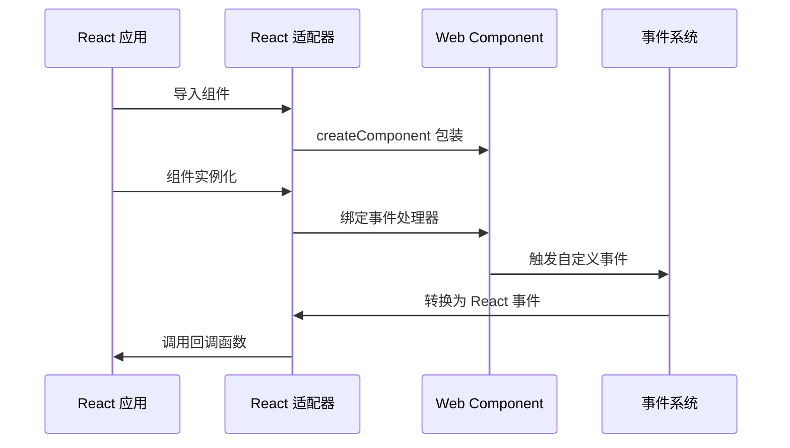

## 核心组件

### Web Components 库 (@agentkit/ui)

UI 包是整个项目的核心，提供了基于 Lit 框架构建的 Web Components 组件库。目前包含28个组件，展示了完整的组件开发模式。

```mermaid
classDiagram
class AkButton {
+variant : ButtonVariant
+size : ButtonSize
+disabled : boolean
+render() TemplateResult
+static styles CSSResult
}
class AkWelcome {
+variant : WelcomeVariant
+title : string
+description : string
+render() TemplateResult
}
class AkPrompts {
+items : PromptsItem[]
+title : string
+columns : Columns
+render() TemplateResult
}
class AkThink {
+title : string
+expanded : boolean
+defaultExpanded : boolean
+loading : boolean
+blink : boolean
+content : string
+typingSpeed : number
+render() TemplateResult
}
class AkBubble {
+placement : Placement
+content : string
+loading : boolean
+typing : boolean
+typingSpeed : number
+streaming : boolean
+avatar : string
+shape : Shape
+variant : Variant
+footerPlacement : FooterPlacement
+render() TemplateResult
}
class AkSender {
+value : string
+placeholder : string
+loading : boolean
+disabled : boolean
+submitType : SubmitType
+maxRows : number
+_internalValue : string
+_focused : boolean
+render() TemplateResult
}
class AkActions {
+items : ActionItem[]
+render() TemplateResult
}
class AkCodeHighlighter {
+code : string
+language : string
+showLineNumbers : boolean
+render() TemplateResult
}
class AkConversations {
+conversations : Conversation[]
+selectedId : string
+render() TemplateResult
}
class AkFileCard {
+file : FileInfo
+editable : boolean
+deletable : boolean
+render() TemplateResult
}
class AkNotification {
+type : NotificationType
+message : string
+duration : number
+render() TemplateResult
}
class AkSources {
+sources : SourceItem[]
+title : string
+render() TemplateResult
}
class AkSuggestion {
+suggestion : string
+render() TemplateResult
}
class AkThoughtChain {
+steps : ThoughtStep[]
+currentStep : number
+typingSpeed : number
+collapsible : boolean
+collapsed : boolean
+render() TemplateResult
}
class AkMarkdown {
+content : string
+streamStatus : StreamStatus
+render() TemplateResult
}
class AkXCard {
+items : XCardItem[]
+maxConcurrent : number
+retryCount : number
+timeout : number
+columns : Columns
+render() TemplateResult
}
class AkFolder {
+items : FolderItem[]
+activeKey : string
+treeWidth : number
+preview : boolean
+render() TemplateResult
}
class AkSenderSwitch {
+checked : boolean
+disabled : boolean
+label : string
+render() TemplateResult
}
class AkXProvider {
+prefixCls : string
+direction : "ltr"|"rtl"
+theme : string
+render() TemplateResult
}
class AkAttachments {
+files : AttachmentFile[]
+accept : string
+multiple : boolean
+maxCount : number
+placeholder : string
+render() TemplateResult
}
class AkMermaid {
+code : string
+view : "image"|"code"
+theme : "default"|"dark"|"forest"|"neutral"
+render() TemplateResult
}
class ButtonVariant {
<<enumeration>>
primary
secondary
ghost
}
class WelcomeVariant {
<<enumeration>>
filled
borderless
}
class Columns {
<<enumeration>>
"1"
"2"
"3"
"4"
}
class Placement {
<<enumeration>>
start
end
}
class SubmitType {
<<enumeration>>
enter
shiftEnter
}
class StreamStatus {
<<enumeration>>
loading
done
}
class FolderItem {
+key : string
+name : string
+type : "file"|"folder"
+children? : FolderItem[]
+content? : string
+ext? : string
}
class AttachmentFile {
+name : string
+size : number
+type? : string
+status? : "pending"|"uploading"|"done"|"error"
+progress? : number
+thumb? : string
}
class XCardItem {
+key : string
+title : string
+content : string
+type : XCardType
+loading : boolean
+closable : boolean
+size : XCardSize
+disabled : boolean
+extra : string
+icon : string
}
class XCardType {
<<enumeration>>
default
info
success
warning
error
}
class XCardSize {
<<enumeration>>
small
middle
large
}
class LitElement {
<<framework>>
+render()
+requestUpdate()
}
AkButton --|> LitElement : "继承"
AkWelcome --|> LitElement : "继承"
AkPrompts --|> LitElement : "继承"
AkThink --|> LitElement : "继承"
AkBubble --|> LitElement : "继承"
AkSender --|> LitElement : "继承"
AkActions --|> LitElement : "继承"
AkCodeHighlighter --|> LitElement : "继承"
AkConversations --|> LitElement : "继承"
AkFileCard --|> LitElement : "继承"
AkNotification --|> LitElement : "继承"
AkSources --|> LitElement : "继承"
AkSuggestion --|> LitElement : "继承"
AkThoughtChain --|> LitElement : "继承"
AkMarkdown --|> LitElement : "继承"
AkXCard --|> LitElement : "继承"
AkFolder --|> LitElement : "继承"
AkSenderSwitch --|> LitElement : "继承"
AkXProvider --|> LitElement : "继承"
AkAttachments --|> LitElement : "继承"
AkMermaid --|> LitElement : "继承"
```

### 工具函数库 (@agentkit/utils)

工具包提供了开发中常用的实用函数，确保类型安全和代码质量。

## AI 组件库

### 组件概览

AgentKit AI 组件库包含 16 个核心 Web Components 组件，专为构建 AI 应用界面而设计。所有组件都基于 AkElement 基类，统一继承 Tailwind CSS 样式系统。

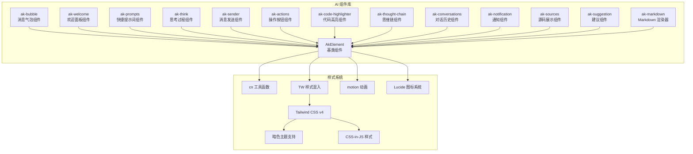

### 组件功能特性

#### ak-bubble - 消息气泡组件

- **消息展示**：支持用户和 AI 的消息气泡显示
- **加载动画**：内置打字机效果和加载指示器
- **头像支持**：可自定义头像或使用插槽
- **位置控制**：支持左右对齐布局
- **打字机动画**：新增 typing 属性和 typingSpeed 控制逐字显示效果
- **流式渲染**：支持 streaming 属性实现流式内容显示
- **Task系统**：使用@lit/task实现打字机动画的自动清理和内存管理

#### ak-welcome - 欢迎面板组件

- **标题描述**：支持标题和描述文本
- **变体样式**：填充和无边框两种样式
- **图标插槽**：支持自定义图标内容
- **响应式布局**：适应不同屏幕尺寸

#### ak-prompts - 快捷提示词组件

- **网格布局**：支持 1-4 列的网格排列
- **交互事件**：提供点击事件回调
- **禁用状态**：支持单个项目禁用
- **图标支持**：可选的图标显示

#### ak-think - 思考过程组件

- **折叠展开**：支持内容的折叠和展开
- **加载状态**：内置加载指示器
- **切换事件**：提供展开状态变更事件
- **箭头动画**：展开时的箭头旋转动画
- **打字机动画**：支持内容的逐字显示效果
- **流式渲染**：支持 think 标签的流式渲染
- **Task系统**：使用@lit/task实现打字机动画的自动清理和内存管理

#### ak-sender - 消息发送组件

- **多行文本**：支持自动高度调整
- **提交控制**：支持 Enter 和 Shift+Enter 提交
- **加载状态**：发送时的加载和取消功能
- **插槽系统**：支持 header、prefix、suffix、footer 插槽
- **焦点状态管理**：新增内部聚焦状态管理
- **持久可见**：发送器状态持久可见，不随输入变化而消失
- **新增** **SenderHeader 子组件**：支持可折叠的附件面板
- **新增** **Attachments 子组件**：支持文件上传和管理

#### ak-actions - 操作按钮组件

- **批量操作**：支持多个操作按钮的组合
- **状态管理**：支持加载和禁用状态
- **事件处理**：提供点击事件回调
- **样式变体**：支持多种视觉样式

#### ak-code-highlighter - 代码高亮组件

- **多语言支持**：支持多种编程语言的语法高亮
- **主题切换**：内置多种代码主题
- **复制功能**：支持一键复制代码
- **行号显示**：可选的行号显示功能
- **动画效果**：使用 motion 动画系统提供平滑过渡
- **Task系统**：使用@lit/task实现复制状态的自动重置和内存管理

#### ak-thought-chain - 思维链组件

- **步骤展示**：展示完整的思考过程链
- **当前步骤**：高亮显示当前思考步骤
- **点击导航**：支持步骤间的点击跳转
- **进度指示**：显示整体思考进度
- **打字机动画**：支持步骤描述的逐字显示效果
- **折叠功能**：支持思维链的折叠和展开
- **Task系统**：使用@lit/task实现所有步骤描述的并行打字机动画和自动清理

#### ak-markdown - Markdown 渲染器

- **纯Markdown渲染**：移除think标签处理和打字光标功能
- **流式渲染**：支持内容逐字到达时的平滑显示
- **代码高亮**：集成 highlight.js 代码高亮功能
- **安全考虑**：HTML 输出未经过 sanitize，需谨慎使用
- **样式系统**：内置完整的 Markdown 样式表
- **Task系统**：使用@lit/task实现异步解析和渲染，包含50ms防抖优化

#### ak-x-card - 动态卡片组件

- **异步加载**：支持自定义加载器异步加载内容
- **自动重试**：指数退避机制的自动重试功能
- **状态管理**：支持加载中、错误、成功等多种状态
- **卡片类型**：支持 default/info/success/warning/error 五种类型
- **可关闭卡片**：支持卡片的关闭和隐藏
- **响应式布局**：支持 1-4 列的网格布局
- **图标支持**：支持 Lucide 图标库的精美图标

## 专业UI组件

### 组件概览

AgentKit 专业UI组件库包含 12 个高级组件，为构建复杂应用界面提供专业支持。

```mermaid
graph TB
subgraph "专业UI组件库"
AkFolder[ak-folder<br/>文件夹树组件]
AkSenderSwitch[ak-sender-switch<br/>发送器开关组件]
AkXProvider[ak-x-provider<br/>上下文提供者组件]
AkAttachments[ak-attachments<br/>附件上传组件]
AkMermaid[ak-mermaid<br/>图表渲染组件]
AkConversations[ak-conversations<br/>对话历史组件]
AkFileCard[ak-file-card<br/>文件卡片组件]
AkNotification[ak-notification<br/>通知组件]
AkSources[ak-sources<br/>源码展示组件]
AkSuggestion[ak-suggestion<br/>建议组件]
AkActions[ak-actions<br/>操作按钮组件]
AkCodeHighlighter[ak-code-highlighter<br/>代码高亮组件]
AkThoughtChain[ak-thought-chain<br/>思维链组件]
AkMarkdown[ak-markdown<br/>Markdown 渲染器]
AkXCard[ak-x-card<br/>动态卡片组件]
end
subgraph "数据模型"
Conversation[Conversation 数据模型]
FileInfo[FileInfo 数据模型]
SourceItem[SourceItem 数据模型]
ActionItem[ActionItem 数据模型]
ThoughtStep[ThoughtStep 数据模型]
XCardItem[XCardItem 数据模型]
FolderItem[FolderItem 数据模型]
AttachmentFile[AttachmentFile 数据模型]
end
AkConversations --> Conversation
AkFileCard --> FileInfo
AkSources --> SourceItem
AkActions --> ActionItem
AkThoughtChain --> ThoughtStep
AkMarkdown --> XCardItem
AkXCard --> XCardItem
AkFolder --> FolderItem
AkAttachments --> AttachmentFile
```

### 组件功能特性

#### ak-folder - 文件夹树组件

- **树形结构**：支持递归文件夹结构的展开和折叠
- **文件预览**：右侧预览面板显示选中文件的内容
- **图标系统**：基于文件扩展名的智能图标选择
- **选择事件**：提供文件选择的自定义事件
- **自动选择**：首次加载时自动选择第一个文件

#### ak-sender-switch - 发送器开关组件

- **开关状态**：支持 checked 和 unchecked 两种状态
- **禁用功能**：支持组件的禁用状态
- **标签显示**：可选的标签文本显示
- **状态切换**：点击时自动切换开关状态
- **事件处理**：提供 change 事件回调

#### ak-x-provider - 上下文提供者组件

- **配置传递**：通过 @lit/context 提供配置给子组件
- **前缀类名**：支持 CSS 类名前缀配置
- **布局方向**：支持 ltr 和 rtl 布局方向
- **主题配置**：支持主题名称配置
- **响应式更新**：属性变化时自动同步到上下文

#### ak-attachments - 附件上传组件

- **拖拽上传**：支持拖拽文件到指定区域
- **文件列表**：显示已选择的文件列表
- **上传状态**：支持 pending、uploading、done、error 状态
- **进度显示**：显示文件上传进度百分比
- **移除功能**：支持从列表中移除文件
- **新增** **文件状态管理**：支持多种文件状态的跟踪和显示

#### ak-mermaid - 图表渲染组件

- **图表渲染**：支持 Mermaid 语法的图表渲染
- **双视图模式**：支持图表视图和代码视图切换
- **主题支持**：支持 default、dark、forest、neutral 主题
- **下载功能**：支持将图表保存为 SVG 文件
- **懒加载**：延迟加载 mermaid 库以提高性能
- **Task系统**：使用@lit/task实现异步渲染和自动清理

#### ak-conversations - 对话历史组件

- **历史记录**：展示用户的对话历史列表
- **选择功能**：支持对话的选中和切换
- **状态指示**：显示对话的最新状态和时间
- **搜索过滤**：支持对话的搜索和筛选
- **新增** **分组显示**：支持 groupable 属性实现可折叠的对话分组
- **新增** **虚拟化渲染**：使用 @lit-labs/virtualizer 实现大数据量的高效渲染

#### ak-file-card - 文件卡片组件

- **文件信息**：显示文件的基本元信息
- **编辑功能**：支持文件内容的编辑模式
- **删除保护**：提供删除确认和保护机制
- **状态反馈**：显示文件操作的状态和结果

#### ak-notification - 通知组件

- **消息类型**：支持多种通知类型的显示
- **自动消失**：可配置的通知自动关闭时间
- **手动关闭**：支持用户手动关闭通知
- **堆叠管理**：支持多个通知的堆叠显示

#### ak-sources - 源码展示组件

- **源码列表**：展示引用的源码片段
- **点击交互**：支持源码项的点击查看详情
- **标题分类**：支持源码的分类和标题显示
- **滚动查看**：支持长源码的滚动浏览

#### ak-suggestion - 建议组件

- **建议内容**：展示AI生成的建议内容
- **接受拒绝**：支持用户对建议的接受或拒绝
- **交互反馈**：提供接受和拒绝的视觉反馈
- **状态同步**：与AI模型的状态保持同步

#### ak-markdown - Markdown 渲染器

- **纯Markdown渲染**：移除think标签处理和打字光标功能
- **流式渲染**：支持内容逐字到达时的平滑显示
- **代码高亮**：集成 highlight.js 代码高亮功能
- **安全考虑**：HTML 输出未经过 sanitize，需谨慎使用
- **样式系统**：内置完整的 Markdown 样式表
- **新增** **异步解析任务**：使用@lit/task实现异步解析和渲染
- **新增** **防抖机制**：在流式状态下使用50ms防抖优化渲染性能

#### ak-x-card - 动态卡片组件

- **异步加载**：支持自定义加载器异步加载内容
- **自动重试**：指数退避机制的自动重试功能
- **状态管理**：支持加载中、错误、成功等多种状态
- **卡片类型**：支持 default/info/success/warning/error 五种类型
- **可关闭卡片**：支持卡片的关闭和隐藏
- **响应式布局**：支持 1-4 列的网格布局
- **图标支持**：支持 Lucide 图标库的精美图标

## 架构概览

项目的整体架构采用了分层设计，从底层的 Web Components 到中间层的适配器系统，再到上层的应用集成，形成了完整的组件生态体系。

```mermaid
graph TB
subgraph "用户界面层"
ReactApp[React 应用]
AdaptorComponents[适配器组件]
AIComponents[AI 组件库]
ProfessionalComponents[专业UI组件]
DemoApp[App.tsx 演示界面]
ChatArchitecture[聊天应用架构]
end
subgraph "适配器层"
ReactAdaptor[React 基础适配器]
ReactPluginsAdaptor[React 插件适配器]
VueAdaptor[Vue Adaptor]
AdaptorExport[导出接口]
end
subgraph "组件层"
AkButton[AkButton 组件]
AkBubble[AkBubble 组件]
AkWelcome[AkWelcome 组件]
AkPrompts[AkPrompts 组件]
AkThink[AkThink 组件]
AkSender[AkSender 组件]
AkActions[AkActions 组件]
AkCodeHighlighter[AkCodeHighlighter 组件]
AkConversations[AkConversations 组件]
AkFileCard[AkFileCard 组件]
AkNotification[AkNotification 组件]
AkSources[AkSources 组件]
AkSuggestion[AkSuggestion 组件]
AkThoughtChain[AkThoughtChain 组件]
AkMarkdown[AkMarkdown 组件]
AkXCard[AkXCard 组件]
AkFolder[AkFolder 组件]
AkSenderSwitch[AkSenderSwitch 组件]
AkXProvider[AkXProvider 组件]
AkAttachments[AkAttachments 组件]
AkMermaid[AkMermaid 组件]
Styles[样式系统]
Motion[动画系统]
Icons[图标系统]
TailwindGlobal[Tailwind Global 样式]
ContextProvider[上下文提供者]
end
subgraph "工具层"
Utils[工具函数]
Types[类型定义]
BaseElement[AkElement 基类]
TailwindMixin[TW 样式混入]
CNUtil[cn 工具函数]
MotionUtil[motion 动画工具]
IconsUtil[图标工具]
SDK[useXChat SDK]
End
subgraph "基础设施"
Lit[Lit 框架]
Tailwind[TailwindCSS v4]
Vite[Vite 构建工具]
ClassVariants[class-variance-authority]
CreateComponent["@lit/react createComponent"]
Marked[marked Markdown 解析器]
Lucide[lucide-static 图标库]
HighlightJS[highlight.js 代码高亮]
MotionLib["@lit-labs/motion 动画库"]
Virtualizer["@lit-labs/virtualizer"]
Signals["@lit-labs/signals"]
Context["@lit/context"]
Task["@lit/task 异步任务系统"]
End
ReactApp --> AdaptorComponents
AdaptorComponents --> AIComponents
AdaptorComponents --> ProfessionalComponents
AIComponents --> AkBubble
AIComponents --> AkWelcome
AIComponents --> AkPrompts
AIComponents --> AkThink
AIComponents --> AkSender
AIComponents --> AkActions
AIComponents --> AkCodeHighlighter
AIComponents --> AkThoughtChain
AIComponents --> AkMarkdown
ProfessionalComponents --> AkFolder
ProfessionalComponents --> AkSenderSwitch
ProfessionalComponents --> AkXProvider
ProfessionalComponents --> AkAttachments
ProfessionalComponents --> AkMermaid
ProfessionalComponents --> AkConversations
ProfessionalComponents --> AkFileCard
ProfessionalComponents --> AkNotification
ProfessionalComponents --> AkSources
ProfessionalComponents --> AkSuggestion
ProfessionalComponents --> AkXCard
AdaptorComponents --> ReactAdaptor
AdaptorComponents --> ReactPluginsAdaptor
AdaptorComponents --> VueAdaptor
ReactAdaptor --> CreateComponent
CreateComponent --> AkButton
CreateComponent --> AkBubble
CreateComponent --> AkWelcome
CreateComponent --> AkPrompts
CreateComponent --> AkThink
CreateComponent --> AkSender
CreateComponent --> AkActions
CreateComponent --> AkCodeHighlighter
CreateComponent --> AkConversations
CreateComponent --> AkFileCard
CreateComponent --> AkNotification
CreateComponent --> AkSources
CreateComponent --> AkSuggestion
CreateComponent --> AkThoughtChain
CreateComponent --> AkMarkdown
CreateComponent --> AkXCard
CreateComponent --> AkFolder
CreateComponent --> AkSenderSwitch
CreateComponent --> AkXProvider
CreateComponent --> AkAttachments
CreateComponent --> AkMermaid
ReactPluginsAdaptor --> CreateComponent
CreateComponent --> AkCodeHighlighter
CreateComponent --> AkMarkdown
AkBubble --> Lit
AkWelcome --> Lit
AkPrompts --> Lit
AkThink --> Lit
AkSender --> Lit
AkActions --> Lit
AkCodeHighlighter --> Lit
AkConversations --> Lit
AkFileCard --> Lit
AkNotification --> Lit
AkSources --> Lit
AkSuggestion --> Lit
AkThoughtChain --> Lit
AkMarkdown --> Lit
AkXCard --> Lit
AkFolder --> Lit
AkSenderSwitch --> Lit
AkXProvider --> Lit
AkAttachments --> Lit
AkMermaid --> Lit
AkBubble --> Styles
AkWelcome --> Styles
AkPrompts --> Styles
AkThink --> Styles
AkSender --> Styles
AkActions --> Styles
AkCodeHighlighter --> Styles
AkConversations --> Styles
AkFileCard --> Styles
AkNotification --> Styles
AkSources --> Styles
AkSuggestion --> Styles
AkThoughtChain --> Styles
AkMarkdown --> Styles
AkXCard --> Styles
AkFolder --> Styles
AkSenderSwitch --> Styles
AkXProvider --> Styles
AkAttachments --> Styles
AkMermaid --> Styles
Styles --> Tailwind
Styles --> TailwindMixin
Styles --> CNUtil
Styles --> TailwindGlobal
Motion --> MotionUtil
Motion --> MotionLib
Icons --> IconsUtil
Icons --> Lucide
BaseElement --> Lit
BaseElement --> TailwindMixin
BaseElement --> Motion
BaseElement --> Icons
ContextProvider --> Context
ContextProvider --> XProviderConfig
ReactApp --> DemoApp
DemoApp --> ChatArchitecture
ChatArchitecture --> SDK
SDK --> useXChat
DemoApp --> Utils
Utils --> Types
Utils --> CryptoAPI[crypto.randomUUID()]
Vite --> ReactApp
Vite --> Lit
Vite --> ClassVariants
Marked --> AkMarkdown
HighlightJS --> AkCodeHighlighter
Lucide --> IconsUtil
```

## 详细组件分析

### React 适配器组件详解

React 适配器通过 @lit/react 的 createComponent 函数，为每个 Web Components 提供 React 组件包装。

#### 组件包装机制

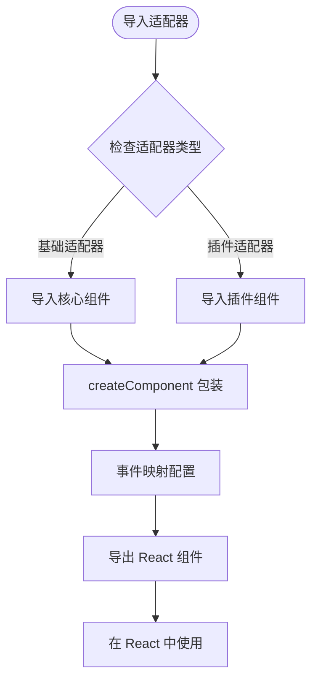

#### 事件映射系统

React 适配器实现了精确的事件映射，将 Web Components 的自定义事件转换为 React 的标准事件处理模式。

| Web Components 事件 | React 事件属性      | 事件参数                                      | 使用场景                   |
| ------------------- | ------------------- | --------------------------------------------- | -------------------------- |
| item-click          | onItemClick         | { item: PromptsItem }                         | 提示词点击事件             |
| expand              | onExpand            | { expanded: boolean }                         | 思考过程展开/收起          |
| typing              | onTyping            | { content: string }                           | 打字机开始事件             |
| typing-complete     | onTypingComplete    | { content: string }                           | 打字机完成事件             |
| submit              | onSubmit            | { value: string }                             | 消息发送提交               |
| sender-cancel       | onCancel            | 无                                            | 取消发送操作               |
| change              | onChange            | { value: string }                             | 输入值变更                 |
| action-click        | onActionClick       | { action: ActionItem }                        | 操作按钮点击               |
| conversation-click  | onConversationClick | { id: string }                                | 对话选择事件               |
| remove              | onRemove            | { file: FileInfo }                            | 文件移除事件               |
| source-click        | onSourceClick       | { source: SourceItem }                        | 源码点击事件               |
| select              | onSelect            | { value: string }                             | 建议选择事件               |
| copy                | onCopy              | { code: string }                              | 代码复制事件               |
| card-load           | onCardLoad          | { key: string }                               | 卡片加载事件               |
| card-close          | onCardClose         | { key: string }                               | 卡片关闭事件               |
| upload              | onUpload            | { files: AttachmentFile[], rawFiles: File[] } | 文件上传事件               |
| remove              | onRemove            | { index: number, file: AttachmentFile }       | 文件移除事件               |
| change              | onChange            | { checked: boolean }                          | 开关状态变更               |
| select              | onSelect            | { key: string, item: FolderItem }             | 文件选择事件               |
| open-change         | onOpenChange        | { open: boolean }                             | SenderHeader 展开/收起事件 |

### 插件适配器详细分析

**更新** 插件适配器提供了两个高级组件，这些组件依赖于外部库，因此作为可选组件提供。

#### CodeHighlighter 组件

CodeHighlighter 组件提供了专业的代码语法高亮功能，支持多种编程语言。

##### 依赖要求

```typescript
// 需要单独安装
import hljs from "highlight.js";
```

##### 语言支持

| 语言名称   | 代码标识     | 特性               |
| ---------- | ------------ | ------------------ |
| JavaScript | "javascript" | 支持 ES6+ 语法     |
| TypeScript | "typescript" | 支持类型注解       |
| Python     | "python"     | 支持缩进和注释     |
| Java       | "java"       | 支持面向对象语法   |
| C++        | "cpp"        | 支持模板和命名空间 |
| HTML       | "html"       | 支持标签和属性     |
| CSS        | "css"        | 支持选择器和属性   |
| JSON       | "json"       | 支持数据格式验证   |

##### 主题系统

| 主题名称 | 适用场景 | 特色               |
| -------- | -------- | ------------------ |
| light    | 日间模式 | 浅色背景，深色文字 |
| dark     | 夜间模式 | 深色背景，浅色文字 |
| ocean    | 海洋主题 | 蓝色调配色方案     |
| forest   | 森林主题 | 绿色调配色方案     |

##### 动画效果

**更新** CodeHighlighter 组件集成了 motion 动画系统：

- **缩放动画**：使用 ak-motion-zoom-in 实现平滑的缩放效果
- **头部交互**：按钮悬停和点击的动画反馈
- **复制状态**：复制成功时的颜色变化动画

##### Task系统实现

**更新** CodeHighlighter 组件使用@lit/task实现复制状态的自动重置：

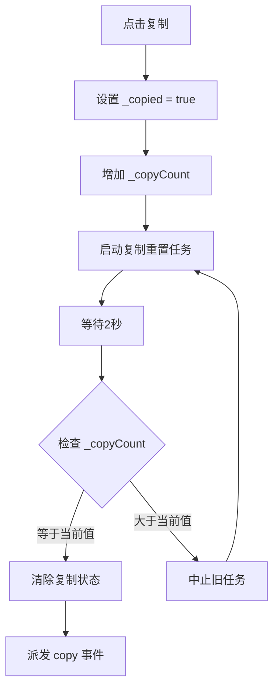

#### Markdown 组件

**更新** Markdown 组件是一个功能强大的纯Markdown渲染器，移除了think标签处理和打字光标功能。

##### 依赖要求

```typescript
// 需要单独安装
import { marked } from "marked";
```

##### 核心特性

- **纯Markdown渲染**：移除think标签处理和打字光标功能
- **流式渲染**：支持内容逐字到达时的平滑显示
- **代码高亮**：集成 highlight.js 代码高亮功能
- **安全考虑**：HTML 输出未经过 sanitize，需谨慎使用
- **异步解析**：使用@lit/task实现异步解析和渲染
- **防抖优化**：在流式状态下使用50ms防抖优化渲染性能

##### Markdown 解析配置

组件使用 marked 库进行 Markdown 解析，配置如下：

````typescript
marked.setOptions({
  breaks: true,    // 支持硬换行
  gfm: true,       // 支持 GitHub Flavored Markdown
});

##### 自定义渲染器

组件实现了自定义渲染器来增强 HTML 输出：

- **代码块**：转换为 ak-code-block 组件
- **链接**：添加外链样式和安全属性
- **图片**：添加响应式样式
- **表格**：包装为可滚动容器

##### 流式渲染机制

**更新** 组件支持流式渲染，通过以下属性控制：

| 属性名 | 类型 | 默认值 | 描述 |
|--------|------|--------|------|
| content | string | "" | Markdown 内容 |
| streamStatus | "loading" | "done" | 流式状态 |

##### 内置样式系统

**更新** 组件包含完整的 Markdown 样式表，支持：

- **标题层级**：h1-h6 样式
- **段落间距**：合理的行高和间距
- **链接样式**：悬停效果和边框
- **代码样式**：内联代码和代码块
- **引用样式**：块级引用
- **列表样式**：有序和无序列表
- **表格样式**：响应式表格
- **水平线**：分隔线
- **图片样式**：响应式图片

##### 异步解析任务

**更新** 组件使用@lit/task实现异步解析和渲染：

```mermaid
flowchart TD
ParseTask[解析任务] --> CheckArgs{检查参数变化}
CheckArgs --> |content或streamStatus变化| StartTask[启动异步任务]
CheckArgs --> |无变化| Wait[等待下次更新]
StartTask --> CheckStatus{检查 streamStatus}
CheckStatus --> |loading| Debounce50ms[50ms防抖]
CheckStatus --> |done| Immediate[立即解析]
Debounce50ms --> ParseContent[解析 Markdown 内容]
Immediate --> ParseContent
ParseContent --> Success[解析成功]
ParseContent --> Error[解析失败]
Success --> RenderHTML[渲染 HTML]
Error --> Fallback[回退到纯文本]
RenderHTML --> Complete[渲染完成]
Fallback --> Complete
Complete --> Wait
````

### AI 组件详细分析

#### AkBubble - 消息气泡组件

AkBubble 是 AI 组件库中最核心的消息展示组件，提供了丰富的消息呈现能力。

```mermaid
stateDiagram-v2
[*] --> 初始化
initialized --> 渲染气泡
渲染气泡 --> 检查加载状态
CheckLoading{检查加载状态}
CheckLoading --> |加载中| 显示加载动画
CheckLoading --> |正常内容| 显示内容
CheckLoading --> |空内容| 显示插槽
显示加载动画 --> 渲染完成
显示内容 --> 渲染完成
显示插槽 --> 渲染完成
渲染完成 --> 检查头像
CheckAvatar{检查头像}
CheckAvatar --> |有头像| 显示头像
CheckAvatar --> |无头像| 显示插槽头像
显示头像 --> 完成
显示插槽头像 --> 完成
完成 --> [*]
```

##### 核心属性系统

| 属性名          | 类型                                               | 默认值    | 描述                   |
| --------------- | -------------------------------------------------- | --------- | ---------------------- |
| placement       | "start" \| "end"                                   | "start"   | 气泡位置（开始/结束）  |
| content         | string                                             | ""        | 消息内容               |
| loading         | boolean                                            | false     | 加载状态               |
| typing          | boolean                                            | false     | 打字机状态             |
| typingSpeed     | number                                             | 25        | 每字符显示速度（毫秒） |
| streaming       | boolean                                            | false     | 流式渲染状态           |
| avatar          | string                                             | ""        | 头像 URL               |
| shape           | "default" \| "round" \| "corner"                   | "default" | 气泡形状               |
| variant         | "filled" \| "outlined" \| "shadow" \| "borderless" | "filled"  | 气泡样式变体           |
| footerPlacement | FooterPlacement                                    | ""        | 页脚位置               |

##### 打字机动画系统

**更新** AkBubble 组件现在使用@lit/task实现打字机动画效果：

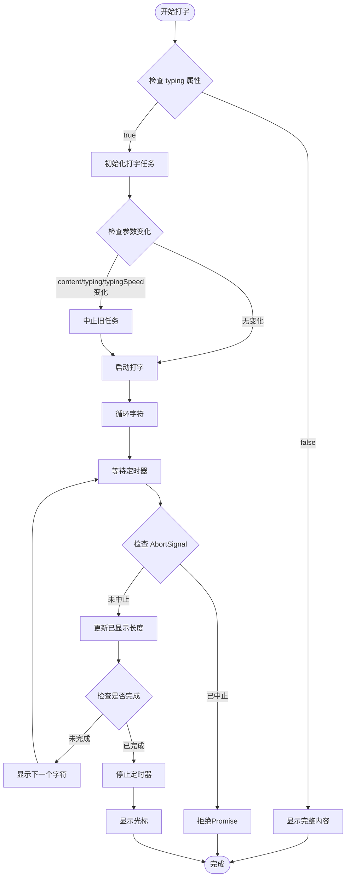

##### 样式变体系统

组件使用 class-variance-authority 实现灵活的样式变体：

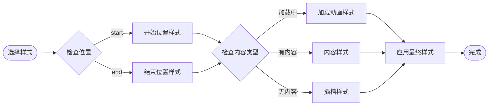

#### AkWelcome - 欢迎面板组件

AkWelcome 提供了简洁的欢迎信息展示功能，支持多种样式变体。

##### 样式变体系统

| 变体名称   | 样式类                          | 特性               |
| ---------- | ------------------------------- | ------------------ |
| filled     | "rounded-lg bg-muted px-4 py-3" | 填充背景，圆角边框 |
| borderless | ""                              | 无边框样式         |

##### 渲染结构

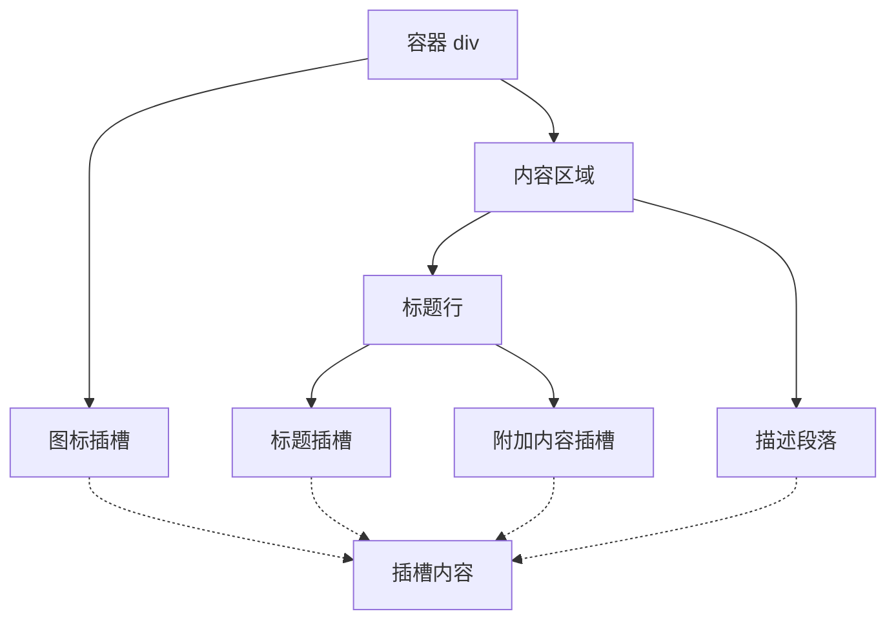

#### AkPrompts - 快捷提示词组件

AkPrompts 提供了网格化的快捷提示词功能，支持响应式布局和交互事件。

##### 数据结构

```typescript
interface PromptsItem {
  key: string; // 唯一键标识
  label: string; // 显示标签
  description?: string; // 描述文本
  icon?: string; // 图标 URL
  disabled?: boolean; // 是否禁用
}
```

##### 布局系统

组件支持 1-4 列的网格布局，通过 CSS Grid 实现响应式排列：

| 列数 | CSS 类        | 特性     |
| ---- | ------------- | -------- |
| 1    | "grid-cols-1" | 单列布局 |
| 2    | "grid-cols-2" | 双列布局 |
| 3    | "grid-cols-3" | 三列布局 |
| 4    | "grid-cols-4" | 四列布局 |

#### AkThink - 思考过程组件

AkThink 提供了可折叠的思考过程展示功能，支持加载状态和交互控制。

##### 状态管理

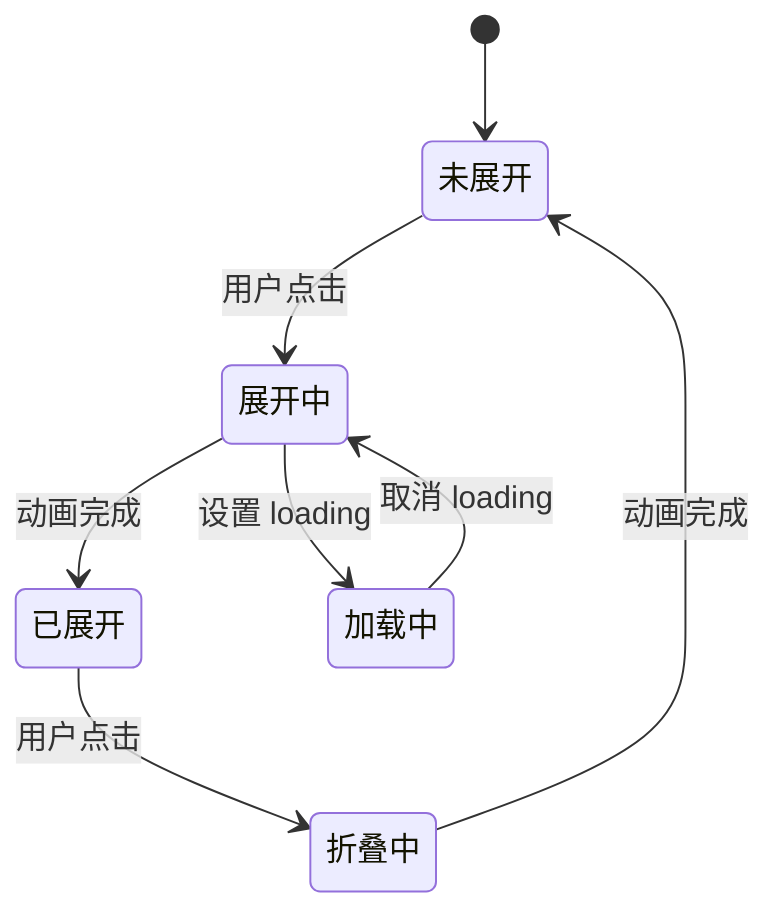

##### 交互事件

组件会派发以下自定义事件：

| 事件名     | 详情                  | 用途             |
| ---------- | --------------------- | ---------------- |
| expand     | { expanded: boolean } | 展开状态变更通知 |
| item-click | { item: PromptsItem } | 提示词点击事件   |

##### 打字机动画系统

**更新** AkThink 组件使用@lit/task实现打字机动画效果：

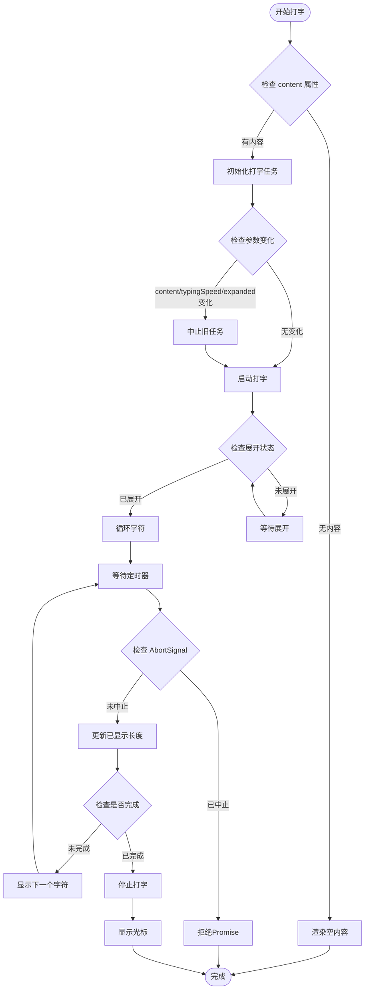

#### AkSender - 消息发送组件

**更新** AkSender 是 AI 组件库中最复杂的组件，提供了完整的消息输入和发送功能，现已实现持久可见的发送器状态管理。

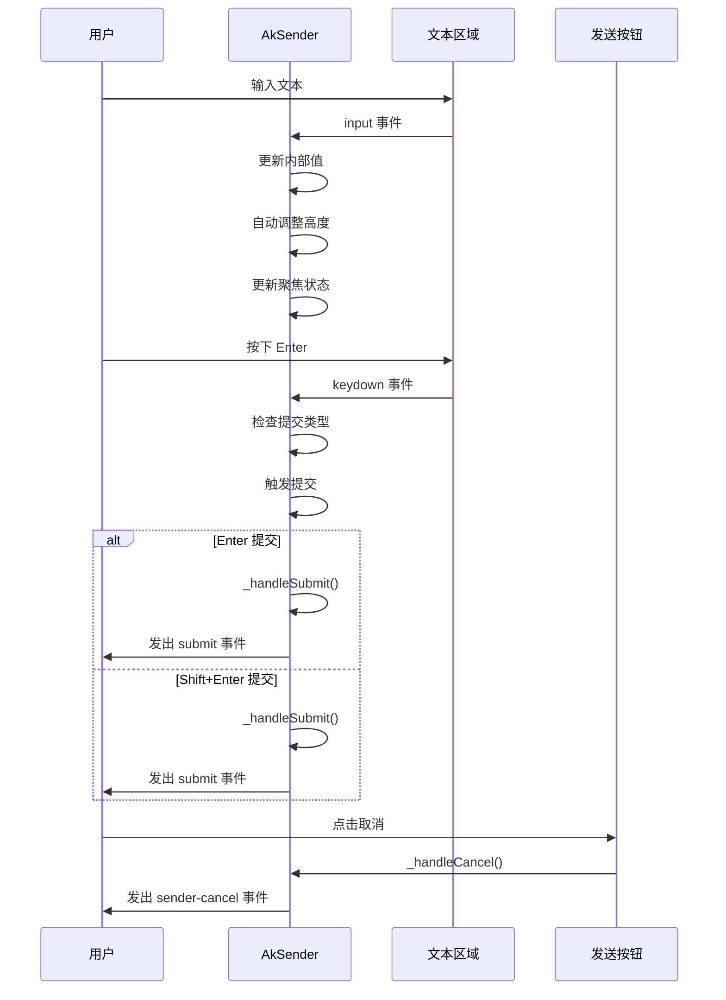

##### 核心属性系统

| 属性名          | 类型                    | 默认值        | 描述             |
| --------------- | ----------------------- | ------------- | ---------------- |
| value           | string                  | ""            | 输入框值         |
| placeholder     | string                  | "输入消息..." | 占位符文本       |
| loading         | boolean                 | false         | 加载状态         |
| disabled        | boolean                 | false         | 禁用状态         |
| submitType      | "enter" \| "shiftEnter" | "enter"       | 提交方式         |
| maxRows         | number                  | 8             | 最大行数         |
| \_internalValue | string                  | ""            | 内部值（私有）   |
| \_focused       | boolean                 | false         | 聚焦状态（私有） |

##### 内部状态管理

**更新** 组件现在包含两个重要的内部状态：

- `_internalValue`：用于存储用户输入但尚未提交的值
- `_focused`：用于跟踪输入框的聚焦状态

##### 焦点状态样式

**更新** 组件实现了持久可见的焦点状态样式：

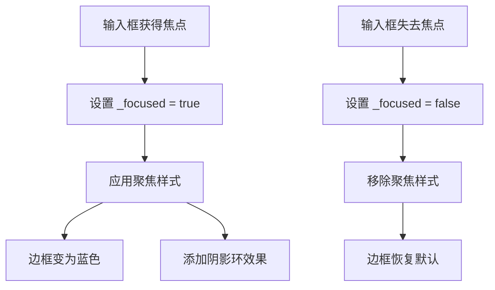

##### 键盘事件处理

组件支持灵活的键盘提交控制：

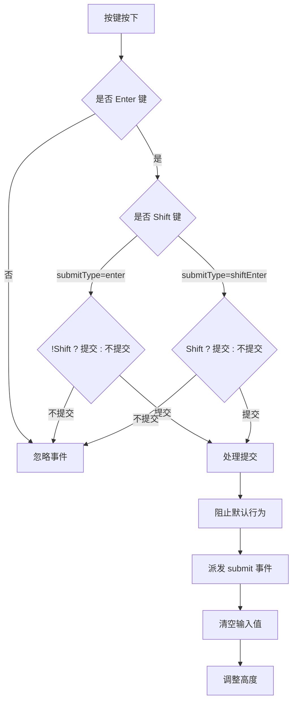

##### SenderHeader 子组件

**新增** Sender 组件现在支持 SenderHeader 子组件，提供可折叠的附件面板功能：

- **标题显示**：支持自定义标题文本
- **展开状态**：支持 open 属性控制展开/收起
- **状态切换**：通过 onOpenChange 事件通知父组件状态变化
- **插槽系统**：支持在 header 插槽中放置附件面板

##### Attachments 子组件

**新增** SenderHeader 支持 Attachments 子组件，提供完整的文件上传功能：

- **拖拽上传**：支持拖拽文件到指定区域
- **文件列表**：显示已选择的文件列表
- **上传状态**：支持 pending、uploading、done、error 状态
- **进度显示**：显示文件上传进度百分比
- **移除功能**：支持从列表中移除文件

### 专业组件详细分析

#### AkFolder - 文件夹树组件

AkFolder 组件提供了文件夹树形结构，支持文件预览和选择功能。

##### 数据结构

```typescript
interface FolderItem {
  key: string; // 唯一键标识
  name: string; // 文件名或文件夹名
  type: "file" | "folder"; // 类型：文件或文件夹
  children?: FolderItem[]; // 子项数组
  content?: string; // 文件内容或预览数据
  ext?: string; // 文件扩展名用于图标选择
}
```

##### 树形渲染系统

组件使用递归方式渲染树形结构：

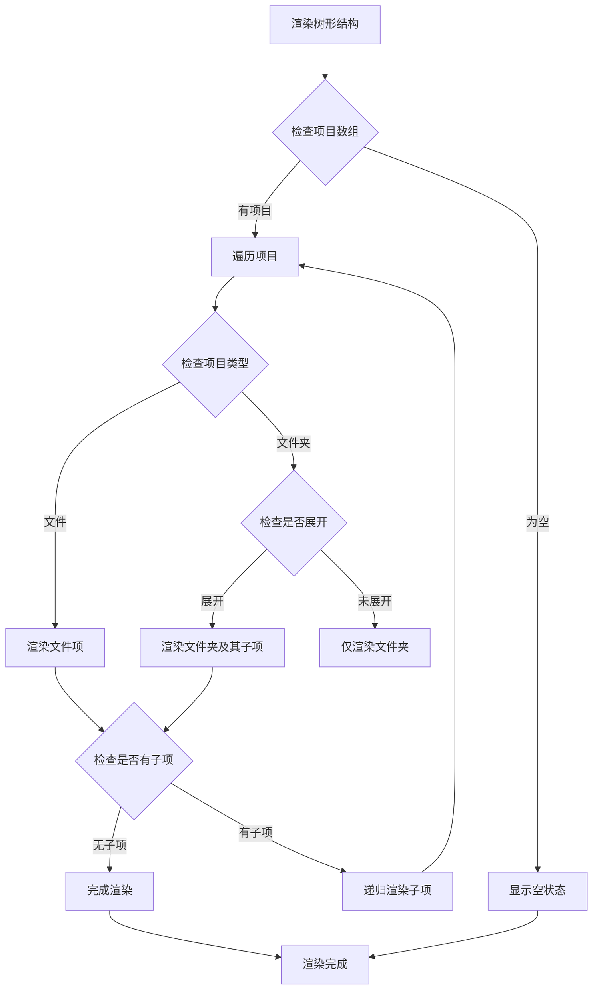

##### 图标系统

组件支持基于文件扩展名的智能图标选择：

| 扩展名                         | 图标名称  | 类型     |
| ------------------------------ | --------- | -------- |
| ts/tsx/js/jsx/html/css/py/json | file-code | 代码文件 |
| md                             | file-text | 文本文件 |
| txt                            | file-text | 纯文本   |
| png/jpg/svg                    | image     | 图片文件 |

##### 选择和预览机制

**更新** 组件支持文件选择和预览功能：

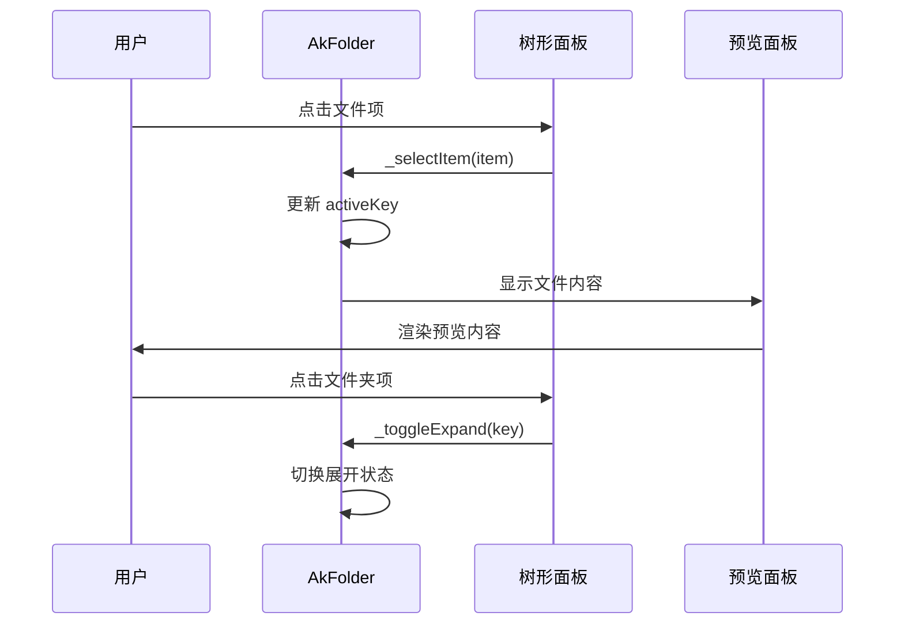

#### AkSenderSwitch - 发送器开关组件

AkSenderSwitch 组件提供了简单的开关控件，用于控制发送器的状态。

##### 状态管理

组件支持三种状态：未选中、选中、禁用状态。

##### 样式系统

组件使用 cn 工具函数实现动态样式：

```mermaid
flowchart LR
Start([渲染开关]) --> CheckDisabled{检查 disabled 属性}
CheckDisabled --> |true| DisabledStyles[应用禁用样式]
CheckDisabled --> |false| CheckChecked{检查 checked 属性}
CheckChecked --> |true| CheckedStyles[应用选中样式]
CheckChecked --> |false| UncheckedStyles[应用未选中样式]
DisabledStyles --> Render[渲染最终样式]
CheckedStyles --> Render
UncheckedStyles --> Render
Render --> End([完成])
```

#### AkXProvider - 上下文提供者组件

**更新** AkXProvider 组件实现了类似 React Context 的上下文提供者功能。

##### 上下文系统

组件使用 @lit/context 实现响应式上下文传递：

```mermaid
flowchart TD
Start([创建 XProvider]) --> InitContext[初始化 ContextProvider]
InitContext --> SetPrefixCls[设置 prefixCls 属性]
SetPrefixCls --> SetDirection[设置 direction 属性]
SetDirection --> SetTheme[设置 theme 属性]
SetTheme --> SyncContext[同步上下文值]
SyncContext --> ApplyDirection[应用布局方向]
ApplyDirection --> RenderChildren[渲染子元素]
RenderChildren --> ConsumeContext[子组件消费上下文]
ConsumeContext --> UpdateOnChange[属性变化时自动更新]
```

##### 配置类型

组件支持以下配置选项：

| 配置项    | 类型           | 默认值 | 描述         |
| --------- | -------------- | ------ | ------------ |
| prefixCls | string         | "ant"  | CSS 类名前缀 |
| direction | "ltr" \| "rtl" | "ltr"  | 布局方向     |
| theme     | string         | ""     | 主题名称     |

##### 使用示例

```typescript
// Provider
<AkXProvider prefixCls="ant" direction="ltr" theme="light">
  <ak-bubble content="Hello" />
</AkXProvider>

// Consumer
import { consume } from "@lit/context";
import { xProviderContext } from "@agentkit/ui";

class MyComponent extends LitElement {
  @consume({ context: xProviderContext })
  providerConfig?: XProviderConfig;
}
```

#### AkAttachments - 附件上传组件

AkAttachments 组件提供了文件上传功能，支持拖拽上传和文件管理。

##### 文件状态系统

组件支持四种文件状态：

```mermaid
stateDiagram-v2
[*] --> pending
pending --> uploading : 开始上传
uploading --> done : 上传成功
uploading --> error : 上传失败
done --> [*]
error --> [*]
```

##### 事件处理

组件会派发以下自定义事件：

| 事件名 | 详情                                          | 用途         |
| ------ | --------------------------------------------- | ------------ |
| upload | { files: AttachmentFile[], rawFiles: File[] } | 文件上传事件 |
| remove | { index: number, file: AttachmentFile }       | 文件移除事件 |

##### 拖拽处理

**更新** 组件支持完整的拖拽上传功能：

```mermaid
sequenceDiagram
participant User as 用户
participant Attachments as AkAttachments
participant DropZone as 拖拽区域
User->>DropZone : 拖拽文件进入
DropZone->>Attachments : _handleDragOver
Attachments->>Attachments : 设置 _dragOver = true
User->>DropZone : 拖拽文件离开
DropZone->>Attachments : _handleDragLeave
Attachments->>Attachments : 设置 _dragOver = false
User->>DropZone : 放下文件
DropZone->>Attachments : _handleDrop
Attachments->>Attachments : 处理文件列表
Attachments->>User : 发出 upload 事件
```

##### 文件状态管理

**新增** 组件支持多种文件状态的跟踪和显示：

- **pending**：文件已选择但未开始上传
- **uploading**：文件正在上传中，显示进度百分比
- **done**：文件上传成功
- **error**：文件上传失败，显示错误状态

#### AkMermaid - 图表渲染组件

**更新** AkMermaid 组件提供了图表渲染功能，支持 Mermaid 语法的图表生成。

##### 图表渲染流程

**更新** 组件使用@lit/task实现异步渲染和自动清理：

```mermaid
flowchart TD
Start([组件挂载]) --> CheckCode{检查 code 属性}
CheckCode --> |有代码| StartTask[启动渲染任务]
CheckCode --> |无代码| WaitCode[等待代码输入]
StartTask --> CheckArgs{检查参数变化}
CheckArgs --> |code或theme变化| AbortOldTask[中止旧任务]
CheckArgs --> |无变化| RenderDiagram[渲染图表]
AbortOldTask --> StartTask
RenderDiagram --> Success[渲染成功]
RenderDiagram --> Error[渲染失败]
Success --> DisplayImage[显示图表]
Error --> DisplayError[显示错误信息]
DisplayImage --> ToggleView[切换视图]
DisplayError --> WaitCode
ToggleView --> CheckView{检查视图类型}
CheckView --> |image| DownloadSVG[下载 SVG]
CheckView --> |code| DisplayCode[显示代码]
DownloadSVG --> End([完成])
DisplayCode --> End
WaitCode --> CheckCode
```

##### 主题支持

组件支持四种主题：

| 主题名称 | 适用场景 | 特色               |
| -------- | -------- | ------------------ |
| default  | 默认主题 | 白色背景，黑色线条 |
| dark     | 暗色主题 | 黑色背景，白色线条 |
| forest   | 森林主题 | 绿色调配色方案     |
| neutral  | 中性主题 | 灰色调配色方案     |

##### 视图切换

**更新** 组件支持图表视图和代码视图的切换：

- **图表视图**：显示渲染后的 SVG 图表
- **代码视图**：显示原始的 Mermaid 代码
- **下载功能**：支持将图表保存为 SVG 文件

#### AkActions - 操作按钮组件

AkActions 组件提供了批量操作按钮的功能，支持多种操作状态和交互。

##### 数据结构

```typescript
interface ActionItem {
  key: string; // 唯一键标识
  label: string; // 按钮标签
  type: ActionType; // 按钮类型
  icon?: string; // 图标 URL
  disabled?: boolean; // 是否禁用
  loading?: boolean; // 是否加载中
}
```

##### 按钮类型系统

| 类型名称  | 样式类                             | 特性         |
| --------- | ---------------------------------- | ------------ |
| primary   | "bg-blue-600 hover:bg-blue-700"    | 主要操作按钮 |
| secondary | "bg-gray-600 hover:bg-gray-700"    | 次要操作按钮 |
| danger    | "bg-red-600 hover:bg-red-700"      | 危险操作按钮 |
| ghost     | "bg-transparent hover:bg-gray-100" | 幽灵按钮样式 |

##### 事件处理

组件会派发 action-click 事件，包含被点击操作的信息。

#### AkCodeHighlighter - 代码高亮组件

AkCodeHighlighter 组件提供了专业的代码语法高亮功能，支持多种编程语言。

##### 语言支持

| 语言名称   | 代码标识     | 特性               |
| ---------- | ------------ | ------------------ |
| JavaScript | "javascript" | 支持 ES6+ 语法     |
| TypeScript | "typescript" | 支持类型注解       |
| Python     | "python"     | 支持缩进和注释     |
| Java       | "java"       | 支持面向对象语法   |
| C++        | "cpp"        | 支持模板和命名空间 |
| HTML       | "html"       | 支持标签和属性     |
| CSS        | "css"        | 支持选择器和属性   |
| JSON       | "json"       | 支持数据格式验证   |

##### 主题系统

| 主题名称 | 适用场景 | 特色               |
| -------- | -------- | ------------------ |
| light    | 日间模式 | 浅色背景，深色文字 |
| dark     | 夜间模式 | 深色背景，浅色文字 |
| ocean    | 海洋主题 | 蓝色调配色方案     |
| forest   | 森林主题 | 绿色调配色方案     |

##### 动画效果

**更新** AkCodeHighlighter 组件集成了 motion 动画系统：

- **缩放动画**：使用 ak-motion-zoom-in 实现平滑的缩放效果
- **头部交互**：按钮悬停和点击的动画反馈
- **复制状态**：复制成功时的颜色变化动画

##### Task系统实现

**更新** AkCodeHighlighter 组件使用@lit/task实现复制状态的自动重置：

```mermaid
flowchart TD
CopyClick[点击复制] --> SetCopied[设置 _copied = true]
SetCopied --> IncrementCount[增加 _copyCount]
IncrementCount --> StartTask[启动复制重置任务]
StartTask --> Wait2Seconds[等待2秒]
Wait2Seconds --> CheckSignal{检查 AbortSignal }
CheckSignal --> |未中止| ClearCopied[清除复制状态]
CheckSignal --> |已中止| RejectPromise[拒绝Promise]
ClearCopied --> DispatchEvent[派发 copy 事件]
RejectPromise --> End([完成])
```

#### AkConversations - 对话历史组件

AkConversations 组件管理用户的对话历史记录，提供选择和导航功能。

##### 数据模型

```typescript
interface ConversationItem {
  key: string; // 对话唯一标识
  label: string; // 对话标题
  timestamp?: string; // 时间戳
  active?: boolean; // 是否选中
  icon?: string; // 图标名称
  disabled?: boolean; // 是否禁用
  group?: string; // 分组标签（用于 groupable 模式）
}
```

##### 功能特性

- **历史记录**：展示用户的对话历史列表
- **选择功能**：支持对话的选中和切换
- **状态指示**：显示对话的最新状态和时间
- **搜索过滤**：支持对话的搜索和筛选
- **批量操作**：支持对话的批量选择和操作
- **新增** **分组显示**：支持 groupable 属性实现可折叠的对话分组
- **新增** **虚拟化渲染**：使用 @lit-labs/virtualizer 实现大数据量的高效渲染

##### 分组显示机制

**新增** 组件支持分组显示功能：

```mermaid
flowchart TD
GroupItems[分组对话项] --> CheckGroupable{检查 groupable 属性}
CheckGroupable --> |true| GroupByProperty[按 group 属性分组]
CheckGroupable --> |false| RenderAsList[直接渲染为列表]
GroupByProperty --> CreateHeaders[为每个分组创建标题]
CreateHeaders --> RenderItems[渲染分组内的对话项]
RenderItems --> CombineOutput[合并输出到扁平化列表]
CombineOutput --> Virtualize[使用 lit-virtualizer 虚拟化渲染]
```

##### 虚拟化渲染

**新增** 组件使用 @lit-labs/virtualizer 实现高效的大数据量渲染：

- **性能优化**：只渲染可视区域内的项目
- **内存管理**：自动管理滚动时的内存使用
- **滚动同步**：与容器滚动保持同步
- **响应式更新**：当数据变化时自动重新计算

#### AkFileCard - 文件卡片组件

AkFileCard 组件展示文件的基本信息，并提供编辑和删除功能。

##### 文件信息模型

```typescript
interface FileInfo {
  id: string; // 文件唯一标识
  name: string; // 文件名
  size: number; // 文件大小（字节）
  type: string; // 文件类型
  modified: Date; // 修改时间
  content?: string; // 文件内容（可选）
}
```

##### 功能特性

- **文件信息**：显示文件的基本元信息
- **编辑功能**：支持文件内容的编辑模式
- **删除保护**：提供删除确认和保护机制
- **状态反馈**：显示文件操作的状态和结果
- **预览支持**：支持常见文件类型的预览

#### AkNotification - 通知组件

AkNotification 组件提供系统通知功能，支持多种通知类型和交互。

##### 通知类型

| 类型名称 | 样式类                            | 用途         |
| -------- | --------------------------------- | ------------ |
| success  | "bg-green-100 border-green-400"   | 成功消息通知 |
| error    | "bg-red-100 border-red-400"       | 错误消息通知 |
| warning  | "bg-yellow-100 border-yellow-400" | 警告消息通知 |
| info     | "bg-blue-100 border-blue-400"     | 信息消息通知 |

##### 行为特性

- **自动消失**：可配置的通知自动关闭时间
- **手动关闭**：支持用户手动关闭通知
- **堆叠管理**：支持多个通知的堆叠显示
- **静音模式**：支持通知的静音和恢复

#### AkSources - 源码展示组件

AkSources 组件展示引用的源码片段，支持点击查看详情。

##### 源码项模型

```typescript
interface SourceItem {
  id: string; // 源码项唯一标识
  title: string; // 源码标题
  url: string; // 源码链接
  snippet: string; // 源码片段
  language: string; // 编程语言
  relevance: number; // 相关性评分
}
```

##### 功能特性

- **源码列表**：展示引用的源码片段
- **点击交互**：支持源码项的点击查看详情
- **标题分类**：支持源码的分类和标题显示
- **滚动查看**：支持长源码的滚动浏览
- **复制功能**：支持一键复制源码

#### AkSuggestion - 建议组件

AkSuggestion 组件展示AI生成的建议内容，并提供接受或拒绝功能。

##### 功能特性

- **建议内容**：展示AI生成的建议内容
- **接受拒绝**：支持用户对建议的接受或拒绝
- **交互反馈**：提供接受和拒绝的视觉反馈
- **状态同步**：与AI模型的状态保持同步
- **上下文关联**：支持与当前对话上下文的关联

#### AkThoughtChain - 思维链组件

AkThoughtChain 组件展示完整的思考过程链，支持步骤间的导航。

##### 思维步骤模型

```typescript
interface ThoughtChainItem {
  key: string; // 步骤唯一标识
  title: string; // 步骤标题
  description?: string; // 步骤描述
  status?: "pending" | "running" | "success" | "error"; // 步骤状态
  icon?: string; // 自定义图标
  content?: string; // 额外内容插槽数据
  footer?: string; // 页脚插槽数据
}
```

##### 步骤类型

| 类型名称 | 样式类                               | 特性       |
| -------- | ------------------------------------ | ---------- |
| pending  | "bg-muted text-muted-foreground"     | 待处理步骤 |
| running  | "bg-primary/10 text-primary"         | 进行中步骤 |
| success  | "bg-green-500/10 text-green-600"     | 成功步骤   |
| error    | "bg-destructive/10 text-destructive" | 错误步骤   |

##### 功能特性

- **步骤展示**：展示完整的思考过程链
- **当前步骤**：高亮显示当前思考步骤
- **点击导航**：支持步骤间的点击跳转
- **进度指示**：显示整体思考进度
- **状态跟踪**：跟踪每个步骤的完成状态
- **打字机动画**：支持步骤描述的逐字显示效果
- **折叠功能**：支持思维链的折叠和展开

##### 打字机动画系统

**更新** AkThoughtChain 组件使用@lit/task实现所有步骤描述的并行打字机动画：

```mermaid
flowchart TD
Start([开始打字]) --> CheckArgs{检查参数变化}
CheckArgs --> |items/speed/collapsed变化| AbortOldTask[中止旧任务]
CheckArgs --> |无变化| StartAllTyping[启动所有步骤打字]
AbortOldTask --> StartAllTyping
StartAllTyping --> FilterDescs[过滤有描述的步骤]
FilterDescs --> ParallelTasks[并行处理所有步骤]
ParallelTasks --> LoopChars[循环字符]
LoopChars --> WaitDelay[等待定时器]
WaitDelay --> CheckSignal{检查 AbortSignal }
CheckSignal --> |未中止| UpdateLength[更新已显示长度]
CheckSignal --> |已中止| RejectPromise[拒绝Promise]
UpdateLength --> CheckComplete{检查是否完成}
CheckComplete --> |未完成| NextChar[显示下一个字符]
NextChar --> WaitDelay
CheckComplete --> |已完成| UpdateRecord[更新状态记录]
UpdateRecord --> CheckAllComplete{检查所有步骤完成}
CheckAllComplete --> |未完成| ParallelTasks
CheckAllComplete --> |已完成| StopAllTyping[停止所有打字]
StopAllTyping --> End([完成])
RejectPromise --> End
```

#### AkMarkdown - Markdown 渲染器

**更新** AkMarkdown 组件是一个功能强大的纯Markdown渲染器，移除了think标签处理和打字光标功能。

##### 核心特性

- **纯Markdown渲染**：移除think标签处理和打字光标功能
- **流式渲染**：支持内容逐字到达时的平滑显示
- **代码高亮**：集成 highlight.js 代码高亮功能
- **安全考虑**：HTML 输出未经过 sanitize，需谨慎使用
- **异步解析**：使用@lit/task实现异步解析和渲染
- **防抖优化**：在流式状态下使用50ms防抖优化渲染性能

##### Markdown 解析配置

组件使用 marked 库进行 Markdown 解析，配置如下：

```typescript
marked.setOptions({
  breaks: true, // 支持硬换行
  gfm: true, // 支持 GitHub Flavored Markdown
});
```

##### 自定义渲染器

组件实现了自定义渲染器来增强 HTML 输出：

- **代码块**：转换为 ak-code-block 组件
- **链接**：添加外链样式和安全属性
- **图片**：添加响应式样式
- **表格**：包装为可滚动容器

##### 流式渲染机制

**更新** 组件支持流式渲染，通过以下属性控制：

| 属性名       | 类型      | 默认值 | 描述          |
| ------------ | --------- | ------ | ------------- |
| content      | string    | ""     | Markdown 内容 |
| streamStatus | "loading" | "done" | 流式状态      |

##### 内置样式系统

**更新** 组件包含完整的 Markdown 样式表，支持：

- **标题层级**：h1-h6 样式
- **段落间距**：合理的行高和间距
- **链接样式**：悬停效果和边框
- **代码样式**：内联代码和代码块
- **引用样式**：块级引用
- **列表样式**：有序和无序列表
- **表格样式**：响应式表格
- **水平线**：分隔线
- **图片样式**：响应式图片

##### 异步解析任务

**更新** 组件使用@lit/task实现异步解析和渲染：

```mermaid
flowchart TD
ParseTask[解析任务] --> CheckArgs{检查参数变化}
CheckArgs --> |content或streamStatus变化| StartTask[启动异步任务]
CheckArgs --> |无变化| Wait[等待下次更新]
StartTask --> CheckStatus{检查 streamStatus }
CheckStatus --> |loading| Debounce50ms[50ms防抖]
CheckStatus --> |done| Immediate[立即解析]
Debounce50ms --> ParseContent[解析 Markdown 内容]
Immediate --> ParseContent
ParseContent --> Success[解析成功]
ParseContent --> Error[解析失败]
Success --> RenderHTML[渲染 HTML]
Error --> Fallback[回退到纯文本]
RenderHTML --> Complete[渲染完成]
Fallback --> Complete
Complete --> Wait
```

#### AkXCard - 动态卡片组件

**更新** AkXCard 组件是一个功能丰富的动态卡片组件，支持异步加载和多种状态管理。

##### 核心特性

- **异步加载**：支持自定义加载器异步加载内容
- **自动重试**：指数退避机制的自动重试功能
- **状态管理**：支持加载中、错误、成功等多种状态
- **卡片类型**：支持 default/info/success/warning/error 五种类型
- **可关闭卡片**：支持卡片的关闭和隐藏
- **响应式布局**：支持 1-4 列的网格布局
- **图标支持**：支持 Lucide 图标库的精美图标

##### 数据模型

```typescript
interface XCardItem {
  key: string; // 唯一键标识
  title: string; // 卡片标题
  content?: string; // 卡片内容
  type?: "default" | "info" | "success" | "warning" | "error"; // 卡片类型
  loading?: boolean; // 是否加载中
  closable?: boolean; // 是否可关闭
  size?: "small" | "middle" | "large"; // 卡片尺寸
  disabled?: boolean; // 是否禁用
  extra?: string; // 附加内容
  icon?: string; // Lucide 图标名称
}
```

##### 卡片类型系统

| 类型名称 | 样式类                                   | 特性         |
| -------- | ---------------------------------------- | ------------ |
| default  | "border-border"                          | 默认卡片样式 |
| info     | "border-blue-200 bg-blue-50/30"          | 信息卡片样式 |
| success  | "border-green-200 bg-green-50/30"        | 成功卡片样式 |
| warning  | "border-amber-200 bg-amber-50/30"        | 警告卡片样式 |
| error    | "border-destructive/50 bg-destructive/5" | 错误卡片样式 |

##### 尺寸系统

| 尺寸名称 | 样式类        | 特性         |
| -------- | ------------- | ------------ |
| small    | "p-2 text-xs" | 小尺寸卡片   |
| middle   | "p-3 text-sm" | 中等尺寸卡片 |
| large    | "p-4 text-sm" | 大尺寸卡片   |

##### 状态管理

**更新** 组件使用内部状态管理系统：

```typescript
interface CardState {
  key: string; // 卡片键
  content?: string; // 卡片内容
  loading: boolean; // 加载状态
  error?: string; // 错误信息
  retryCount: number; // 重试次数
  closed: boolean; // 关闭状态
}
```

##### 事件系统

**更新** 组件派发以下自定义事件：

- **card-close**：卡片关闭事件
- **card-load**：卡片加载事件

##### 外部 API

**更新** 组件提供以下外部 API 方法：

- **setCardContent(key, content)**：设置卡片内容
- **setCardError(key, error)**：设置卡片错误

##### 加载机制

**更新** 组件支持异步加载和自动重试：

```mermaid
flowchart TD
Start([开始加载]) --> CheckState{检查卡片状态}
CheckState --> |loading=false| SetLoading[设置加载状态]
CheckState --> |loading=true| Wait[等待中]
SetLoading --> DispatchLoad[派发 card-load 事件]
DispatchLoad --> Wait
Wait --> CheckRetry{检查重试次数}
CheckRetry --> |retryCount < maxRetry| Retry[重试加载]
CheckRetry --> |retryCount >= maxRetry| SetError[设置错误状态]
Retry --> SetLoading
SetError --> ShowError[显示错误界面]
```

##### 响应式布局

**更新** 组件支持响应式网格布局：

```typescript
const gridCols: Record<string, string> = {
  "1": "grid-cols-1",
  "2": "grid-cols-2",
  "3": "grid-cols-3",
  "4": "grid-cols-4",
};
```

### React 集成模式

应用程序展示了如何在 React 中使用适配器系统提供的组件，体现了现代前端框架的互操作性。

```mermaid
sequenceDiagram
participant React as React 应用
participant BaseAdaptor as 基础适配器
participant PluginsAdaptor as 插件适配器
participant Components as React 组件
participant WebComponents as Web Components
React->>BaseAdaptor : 导入 @agentkit/ui/adaptor/react
BaseAdaptor->>WebComponents : createComponent 包装
BaseAdaptor->>Components : 导出 React 组件
React->>PluginsAdaptor : 导入 @agentkit/ui/adaptor/react-plugins
PluginsAdaptor->>WebComponents : createComponent 包装
PluginsAdaptor->>Components : 导出 React 组件
React->>Components : 使用组件
Components->>WebComponents : 创建 Web Components 实例
WebComponents->>WebComponents : 初始化属性
WebComponents->>WebComponents : 渲染组件
React->>WebComponents : 绑定事件监听器
WebComponents-->>React : 组件就绪
```

### App.tsx 演示界面分析

**更新** App.tsx 演示界面展示了完整的组件集成示例，包含了所有新功能的实际应用场景，包括插件适配器的使用。

#### 聊天应用架构

**更新** 演示界面展示了完整的聊天应用架构：

```mermaid
graph TB
subgraph "聊天应用架构"
Sidebar[侧边栏 - Conversations]
MainContent[主内容区域]
Welcome[Welcome 组件]
Thinking[Think 组件]
Prompts[Prompts 组件]
ChatArea[聊天区域]
Bubble[Bubble 组件]
Actions[Actions 组件]
Sender[Sender 组件]
Suggestion[Suggestion 组件]
Sources[Sources 组件]
FileCard[FileCard 组件]
Button[Button 组件]
Notification[Notification 组件]
Markdown[Markdown 组件]
CodeHighlighter[CodeHighlighter 组件]
XCard[XCard 组件]
Folder[Folder 组件]
SenderSwitch[SenderSwitch 组件]
XProvider[XProvider 组件]
Attachments[Attachments 组件]
Mermaid[Mermaid 组件]
end
Sidebar --> MainContent
MainContent --> Welcome
MainContent --> Thinking
MainContent --> Prompts
MainContent --> ChatArea
ChatArea --> Bubble
ChatArea --> Actions
ChatArea --> Sender
ChatArea --> Suggestion
MainContent --> Sources
MainContent --> FileCard
MainContent --> Button
MainContent --> Notification
MainContent --> Markdown
MainContent --> CodeHighlighter
MainContent --> XCard
MainContent --> Folder
MainContent --> SenderSwitch
MainContent --> XProvider
MainContent --> Attachments
MainContent --> Mermaid
```

#### 组件集成架构

**更新** 演示界面展示了基础适配器提供的16个核心组件和新增的12个专业组件：

- **基础组件**：Welcome、Think、Prompts、Bubble、Sender、Actions、Sources、FileCard、Notification、Conversations、ThoughtChain、Suggestion、Button、XCard
- **专业组件**：Folder、SenderSwitch、XProvider、Attachments、Mermaid
- **插件组件**：CodeHighlighter、Markdown（需要单独导入）

#### 插件组件演示

**更新** 演示界面展示了插件适配器的使用方法：

```typescript
// 基础组件导入
import {
  Welcome,
  Think,
  Prompts,
  Bubble,
  Sender,
  Actions,
  Sources,
  FileCard,
  Notification,
  Conversations,
  ThoughtChain,
  Suggestion,
  Button,
  XCard,
} from "@agentkit/ui/adaptor/react";

// 专业组件导入
import {
  Folder,
  SenderSwitch,
  XProvider,
  Attachments,
  Mermaid,
} from "@agentkit/ui/adaptor/react";

// 插件组件导入（需要单独安装依赖）
import { CodeHighlighter, Markdown } from "@agentkit/ui/adaptor/react-plugins";
```

#### 流式渲染演示

**更新** 演示界面展示了完整的流式渲染效果：

```mermaid
sequenceDiagram
participant User as 用户
participant App as App.tsx
participant SDK as useXChat SDK
participant Think as Think 组件
participant Bubble as Bubble 组件
User->>App : 发送消息
App->>SDK : 创建聊天状态
SDK->>Think : 开始思考过程
Think->>App : 更新思考内容
App->>Bubble : 显示流式内容
App->>SDK : 完成思考
SDK->>App : 返回响应
App->>Bubble : 显示最终内容
```

#### 事件系统优化

**更新** 演示界面展示了优化的事件系统：

```mermaid
flowchart TD
UserInput[用户输入] --> StreamingIntervals[流式渲染定时器数组]
StreamingIntervals --> ThinkPhase[思考阶段]
StreamingIntervals --> ResponsePhase[响应阶段]
ThinkPhase --> UpdateMessages[更新消息状态]
ResponsePhase --> UpdateMessages
UpdateMessages --> Cleanup[清理定时器]
Cleanup --> ClearArray[清空定时器数组]
```

#### Markdown 渲染演示

**更新** 演示界面展示了 Markdown 组件的完整功能：

- **纯Markdown渲染**：移除think标签处理和打字光标功能
- **流式渲染**：支持内容逐字到达时的平滑显示
- **代码高亮**：集成 highlight.js 代码高亮功能
- **安全考虑**：HTML 输出未经过 sanitize，需谨慎使用
- **异步解析**：使用@lit/task实现异步解析和渲染

#### 专业组件演示

**更新** 演示界面展示了12个专业组件的功能：

- **Folder 组件**：文件夹树形结构和文件预览
- **SenderSwitch 组件**：发送器状态控制
- **XProvider 组件**：上下文配置传递
- **Attachments 组件**：文件上传和管理
- **Mermaid 组件**：图表渲染和下载

#### XProvider 上下文演示

**更新** 演示界面展示了 XProvider 组件的使用：

```typescript
<AkXProvider prefixCls="ant" direction="ltr" theme="light">
  <ak-bubble content="Hello" />
</AkXProvider>
```

#### 附件上传演示

**更新** 演示界面展示了 Attachments 组件的功能：

- **拖拽上传**：支持拖拽文件到指定区域
- **文件列表**：显示已选择的文件列表
- **状态管理**：支持上传状态跟踪
- **进度显示**：显示文件上传进度

#### Mermaid 图表演示

**更新** 演示界面展示了 Mermaid 组件的功能：

- **图表渲染**：支持 Mermaid 语法的图表生成
- **双视图模式**：支持图表视图和代码视图切换
- **主题支持**：支持多种图表主题
- **下载功能**：支持将图表保存为 SVG 文件

#### Sender 组件增强演示

**更新** 演示界面展示了 Sender 组件的新功能：

- **SenderHeader 子组件**：支持可折叠的附件面板
- **Attachments 子组件**：支持文件上传和管理
- **插槽系统**：支持 header、prefix、suffix、footer 插槽
- **持久可见**：发送器状态持久可见，不随输入变化而消失

#### Conversations 组件增强演示

**更新** 演示界面展示了 Conversations 组件的新功能：

- **分组显示**：支持 groupable 属性实现可折叠的对话分组
- **虚拟化渲染**：使用 @lit-labs/virtualizer 实现大数据量的高效渲染
- **图标支持**：支持自定义图标显示
- **活动状态**：支持当前选中对话的视觉指示

#### Markdown 组件异步解析演示

**更新** 演示界面展示了 Markdown 组件的异步解析功能：

```mermaid
flowchart TD
AsyncTask[异步解析任务] --> CheckStreamStatus{检查流式状态}
CheckStreamStatus --> |loading| Debounce50ms[50ms防抖]
CheckStreamStatus --> |done| ImmediateParse[立即解析]
Debounce50ms --> ParseContent[解析 Markdown 内容]
ImmediateParse --> ParseContent
ParseContent --> UpdateDOM[更新 DOM]
UpdateDOM --> AnimateIn[淡入动画]
AnimateIn --> Ready[渲染完成]
```

#### Task系统集成演示

**更新** 演示界面展示了Task系统的集成效果：

```mermaid
flowchart TD
TaskSystem[Task系统] --> AutoCleanup[自动清理定时器]
TaskSystem --> MemorySafety[内存安全]
TaskSystem --> StateManagement[状态管理]
TaskSystem --> PerformanceOptimization[性能优化]
AutoCleanup --> PreventMemoryLeak[防止内存泄漏]
MemorySafety --> PreventResourceLeak[防止资源泄漏]
StateManagement --> BetterAsyncHandling[更好的异步处理]
PerformanceOptimization --> DebounceOptimization[防抖优化]
PreventMemoryLeak --> ImprovedUserExperience[改善用户体验]
PreventResourceLeak --> BetterAppStability[更好的应用稳定性]
BetterAsyncHandling --> ReducedBugs[减少bug]
DebounceOptimization --> SmoothRendering[平滑渲染]
```

#### 流式渲染优化

**更新** 演示界面展示了流式渲染的优化：

```mermaid
flowchart TD
StreamingIntervals[流式渲染定时器数组] --> StoreIntervals[存储定时器ID]
StoreIntervals --> ClearIntervals[清理定时器]
ClearIntervals --> AbortStreaming[中止流式渲染]
AbortStreaming --> ClearArray[清空数组]
```

## 依赖关系分析

项目采用工作区（Workspace）管理模式，实现了高效的包管理和服务共享。

```mermaid
graph TB
subgraph "外部依赖"
React[react: ^19.1]
Lit[lit: ^3.3.3]
Tailwind[tailwindcss: ^4.3.1]
TypeScript[typescript: ^6.0.3]
ClassVariants[class-variance-authority: ^1.0.0]
CreateComponent["@lit/react: ^1.0.8"]
Motion[motion: ^10.0.0]
HighlightJS[highlight.js: ^11.11.1]
Marked[marked: ^18.0.5]
Lucide[lucide-static: ^1.21.0]
MotionLib["@lit-labs/motion: ^1.1.0"]
Virtualizer["@lit-labs/virtualizer: ^2.1.1"]
Signals["@lit-labs/signals: ^0.3.0"]
Context["@lit/context: ^0.1.1"]
Task["@lit/task: ^1.0.3"]
End
subgraph "内部包依赖"
TypesDep["@agentkit/types"]
UtilsDep["@agentkit/utils"]
UIDep["@agentkit/ui"]
WebDep["@agentkit/web"]
SDKDep["@agentkit/sdk"]
End
subgraph "构建工具"
Vite[vite: ^8.0]
Babel[babel: ^7.0]
Turbo[turbo: ^2.9.18]
End
WebDep --> UIDep
WebDep --> UtilsDep
WebDep --> TypesDep
WebDep --> SDKDep
UtilsDep --> TypesDep
UIDep --> Lit
UIDep --> Tailwind
UIDep --> ClassVariants
UIDep --> CreateComponent
UIDep --> Motion
UIDep --> HighlightJS
UIDep --> Marked
UIDep --> Lucide
UIDep --> MotionLib
UIDep --> Virtualizer
UIDep --> Signals
UIDep --> Context
UIDep --> Task
SDKDep --> Lit
SDKDep --> Context
WebDep --> React
WebDep --> Vite
WebDep --> Babel
WebDep --> Turbo
```

## 性能考虑

### 构建优化策略

项目采用了多种性能优化技术：

1. **增量构建**：Turborepo 提供智能缓存和并行构建
2. **按需加载**：Vite 支持模块热替换和代码分割
3. **Tree Shaking**：现代打包工具自动移除未使用的代码
4. **压缩优化**：生产环境自动进行代码压缩和优化

### 运行时性能

适配器系统的性能优势体现在：

- **零运行时开销**：@lit/react 提供高效的组件包装
- **事件优化**：精确的事件映射减少不必要的事件处理
- **样式缓存**：Tailwind CSS 类名的智能缓存机制
- **组件复用**：Web Components 的原生复用能力

**更新** Task系统的性能优势：

- **自动清理**：通过AbortSignal自动清理定时器和异步任务
- **内存安全**：防止内存泄漏和资源泄漏
- **状态管理**：提供更好的异步状态管理和错误处理
- **性能优化**：通过防抖和批处理优化渲染性能
- **生命周期管理**：自动处理组件卸载时的任务清理

**更新** 插件适配器的性能优化：

- **按需加载**：插件组件只有在需要时才加载
- **依赖分离**：基础组件和插件组件的依赖完全分离
- **懒加载支持**：插件组件支持动态导入
- **事件委托**：批量事件处理减少内存占用
- **样式缓存**：Tailwind CSS 类名的智能缓存机制
- **动画优化**：motion 库提供流畅的动画性能
- **Markdown 渲染优化**：移除think标签处理和打字光标功能
- **XCard 异步加载优化**：并发请求限制和自动重试机制
- **@lit/task 异步解析**：使用异步任务优化渲染性能
- **防抖机制**：在流式状态下使用50ms防抖优化渲染性能

**更新** 新增组件的性能考虑：

- **AkFolder 组件**：使用虚拟化技术优化大量文件的渲染
- **AkXProvider 组件**：使用 @lit/context 提供高效的上下文传递
- **AkAttachments 组件**：使用防抖机制优化文件上传状态更新
- **AkMermaid 组件**：使用懒加载和缓存机制优化图表渲染
- **AkThink 组件**：使用@lit/task优化打字机动画的内存管理
- **AkSenderSwitch 组件**：使用 CSS 过渡动画而非 JavaScript 动画
- **AkSender 组件**：优化内部状态管理，实现持久可见的发送器状态
- **AkConversations 组件**：使用 @lit-labs/virtualizer 实现大数据量高效渲染
- **AkMarkdown 组件**：使用@lit/task实现异步解析和防抖优化
- **AkCodeHighlighter 组件**：使用@lit/task实现复制状态的自动重置
- **AkThoughtChain 组件**：使用@lit/task实现所有步骤描述的并行打字机动画
- **App.tsx 演示界面**：使用 React hooks 优化状态更新和事件处理

**更新** App.tsx 演示界面的性能考虑：

- **状态管理优化**：使用 React hooks 优化状态更新
- **事件处理优化**：使用 useCallback 避免不必要的重渲染
- **条件渲染**：根据状态动态渲染组件
- **动画性能**：使用 CSS 动画而非 JavaScript 动画
- **Markdown 渲染优化**：移除think标签处理和打字光标功能
- **插件组件懒加载**：只在需要时导入插件组件
- **聊天状态管理**：使用 useXChat SDK 优化聊天状态更新
- **流式渲染优化**：使用定时器数组管理多个流式渲染任务
- **定时器清理**：优化定时器的创建和销毁机制
- **Sender 组件优化**：新增 SenderHeader 和 Attachments 子组件的性能优化
- **Conversations 组件优化**：新增 groupable 属性和虚拟化渲染的性能优化
- **Markdown 组件优化**：新增@lit/task异步解析和防抖机制的性能优化
- **Task系统集成**：所有AI组件使用@lit/task实现自动清理和内存管理

**更新** Task系统集成的性能优势：

- **自动清理机制**：通过AbortSignal自动清理定时器和异步任务
- **内存泄漏防护**：防止定时器泄漏和资源泄漏
- **状态管理改进**：Task系统提供更好的异步状态管理和错误处理
- **性能优化**：通过防抖和批处理优化渲染性能
- **生命周期管理**：自动处理组件卸载时的任务清理
- **并行处理**：AkThoughtChain组件使用Promise.allSettled实现并行打字机动画
- **防抖优化**：AkMarkdown组件使用50ms防抖优化流式渲染性能
- **复制状态管理**：AkCodeHighlighter组件使用Task系统实现复制状态的自动重置

## 故障排除指南

### 常见问题及解决方案

#### 组件样式不生效

**问题描述**：Web Components 样式在某些环境下不显示

**可能原因**：

1. 样式作用域问题
2. CSS 变量未正确设置
3. 浏览器兼容性问题
4. **新增** Tailwind CSS v4 样式未正确加载

**解决步骤**：

1. 检查组件是否正确注册
2. 验证 CSS 变量定义
3. 确认浏览器支持情况
4. **新增** 检查 tailwind.global.css 是否正确导入

#### 适配器组件导入失败

**问题描述**：无法从 @agentkit/ui/adaptor/react 或 @agentkit/ui/adaptor/react-plugins 正确导入组件

**排查方法**：

1. 检查包版本是否正确
2. 验证导出路径配置
3. 确认 @lit/react 依赖安装
4. **新增** 检查插件组件的可选依赖是否安装

#### 事件处理异常

**问题描述**：适配器组件的事件无法正确触发

**解决步骤**：

1. 检查事件映射配置
2. 验证事件参数传递
3. 确认 React 事件处理语法
4. **新增** 检查新组件的事件映射是否正确

#### 与 React 冲突

**问题描述**：在 React 应用中使用适配器组件出现问题

**解决方案**：

1. 确保正确的命名约定（驼峰命名）
2. 检查事件处理机制
3. 验证生命周期管理
4. **新增** 检查新组件的生命周期管理

**更新** Task系统相关问题：

#### Task系统初始化失败

**问题描述**：@lit/task 任务无法正确初始化

**排查步骤**：

1. 检查 @lit/task 依赖是否正确安装
2. 验证 Task 构造函数参数
3. 确认组件的 connectedCallback 生命周期
4. **新增** 检查 Task 的 args 函数返回值

#### 打字机动画异常

**问题描述**：AkBubble、AkThink、AkThoughtChain 组件的打字机动画异常

**排查步骤**：

1. 检查 typing 属性设置
2. 验证 typingSpeed 属性
3. 确认 AbortSignal 是否正确处理
4. **新增** 检查 Task 的自动清理机制

#### 复制状态重置异常

**问题描述**：AkCodeHighlighter 组件的复制状态无法自动重置

**解决方法**：

1. 检查 \_copyCount 状态管理
2. 验证 Task 的 AbortSignal 处理
3. 确认 2秒延时是否正确执行
4. **新增** 检查 Task 的自动清理机制

#### 图表渲染异常

**问题描述**：AkMermaid 组件的图表渲染功能异常

**解决方法**：

1. 检查 mermaid 库是否正确加载
2. 验证 code 和 theme 属性
3. 确认 Task 的自动清理机制
4. **新增** 检查异步渲染任务的状态管理

#### Markdown 渲染异常

**问题描述**：AkMarkdown 组件的异步解析功能异常

**解决方法**：

1. 检查 @lit/task 依赖是否正确安装
2. 验证 content 和 streamStatus 属性
3. 确认 Task 的防抖机制
4. **新增** 检查 initialValue 的使用

#### 思维链动画异常

**问题描述**：AkThoughtChain 组件的并行打字机动画异常

**解决方法**：

1. 检查 items 数组数据格式
2. 验证 typingSpeed 属性
3. 确认 Task 的并行处理机制
4. **新增** 检查 Promise.allSettled 的使用

**更新** 插件适配器相关问题：

#### 插件组件导入失败

**问题描述**：无法从 @agentkit/ui/adaptor/react-plugins 导入组件

**排查步骤**：

1. 检查插件组件的可选依赖是否安装
2. 验证 highlight.js 和 marked 依赖
3. 确认插件组件的导入路径
4. **新增** 检查插件组件的事件映射配置

#### CodeHighlighter 组件渲染异常

**问题描述**：ak-code-highlighter 组件无法正确渲染代码

**排查步骤**：

1. 检查 highlight.js 依赖是否正确安装
2. 验证代码内容格式
3. 确认语言属性设置
4. **新增** 检查代码复制功能

#### Markdown 组件渲染异常

**问题描述**：ak-markdown 组件无法正确渲染 Markdown

**排查步骤**：

1. 检查 marked 依赖是否正确安装
2. 验证 content 属性是否正确设置
3. 验证 streamStatus 属性
4. **新增** 检查异步解析任务是否正常工作

#### XCard 组件加载失败

**问题描述**：ak-x-card 组件的异步加载功能异常

**解决方法**：

1. 检查 items 数组数据格式
2. 验证自定义加载器实现
3. 确认重试机制配置
4. **新增** 检查并发请求限制

**更新** 新增组件相关问题：

#### AkFolder 组件渲染异常

**问题描述**：ak-folder 组件无法正确渲染文件夹树

**排查步骤**：

1. 检查 FolderItem 数据格式
2. 验证 activeKey 属性
3. 确认文件预览功能
4. **新增** 检查图标系统

#### AkXProvider 组件配置无效

**问题描述**：ak-x-provider 组件的配置无法传递给子组件

**解决方法**：

1. 检查 XProviderConfig 数据格式
2. 验证 @consume 装饰器使用
3. 确认上下文同步机制
4. **新增** 检查属性变化监听

#### AkAttachments 组件上传失败

**问题描述**：ak-attachments 组件的文件上传功能异常

**解决方法**：

1. 检查文件类型过滤
2. 验证拖拽事件处理
3. 确认文件状态管理
4. **新增** 检查最大文件数量限制

#### AkMermaid 组件渲染失败

**问题描述**：ak-mermaid 组件无法正确渲染图表

**解决方法**：

1. 检查 mermaid 库是否正确加载
2. 验证 Mermaid 语法格式
3. 确认主题配置
4. **新增** 检查图表下载功能

#### AkSenderSwitch 组件状态异常

**问题描述**：ak-sender-switch 组件无法正确切换状态

**解决方法**：

1. 检查 disabled 属性设置
2. 验证 checked 属性
3. 确认 change 事件处理
4. **新增** 检查样式状态映射

#### AkSender 组件焦点状态异常

**问题描述**：ak-sender 组件的焦点状态管理异常

**解决方法**：

1. 检查 \_focused 状态管理
2. 验证样式类绑定
3. 确认事件处理逻辑
4. **新增** 检查持久可见的发送器状态

#### AkSenderHeader 组件异常

**问题描述**：ak-sender-header 组件无法正确展开/收起

**解决方法**：

1. 检查 open 属性设置
2. 验证 title 属性
3. 确认 open-change 事件处理
4. **新增** 检查动画效果

#### AkConversations 组件分组异常

**问题描述**：ak-conversations 组件的分组功能异常

**解决方法**：

1. 检查 ConversationItem 的 group 属性
2. 验证 groupable 属性设置
3. 确认虚拟化渲染配置
4. **新增** 检查分组标题显示

#### AkMarkdown 组件异步解析异常

**问题描述**：ak-markdown 组件的异步解析功能异常

**解决方法**：

1. 检查 @lit/task 依赖是否正确安装
2. 验证 content 和 streamStatus 属性
3. 确认异步任务配置
4. **新增** 检查防抖机制

#### Chat Architecture 相关问题

**问题描述**：聊天应用架构中的组件无法正常工作

**解决方法**：

1. 检查 useXChat SDK 的使用
2. 验证流式渲染机制
3. 确认 think 标签处理
4. **新增** 检查聊天状态管理

#### App.tsx 演示界面问题

**问题描述**：演示界面中的组件无法正常工作

**解决方法**：

1. 检查组件导入路径
2. 验证组件属性配置
3. 确认事件处理函数
4. **新增** 检查新组件的集成
5. **新增** 验证 React hooks 使用
6. **新增** 检查组件状态管理
7. **新增** 检查流式渲染优化
8. **新增** 检查 Sender 组件的新功能
9. **新增** 检查 Conversations 组件的新功能
10. **新增** 检查 Markdown 组件的新功能
11. **新增** 检查 Task系统的集成效果

## 结论

AgentKit 项目成功展示了现代 Web Components 在大型前端项目中的应用模式，特别是新增的基于@lit/task的Task系统重构为所有AI组件提供了统一的异步任务管理机制。Task系统替代了原有的手动定时器管理，提供了更好的内存管理和自动清理机制。

**主要成就**：

- **Task系统重构**：AkBubble、AkThink、AkThoughtChain、AkCodeHighlighter、AkMermaid组件已完全迁移到基于@lit/task的Task系统实现
- **自动清理机制**：替代原有的手动定时器管理，提供更好的内存管理和自动清理机制
- **分层适配器系统**：通过 @agentkit/ui/adaptor/react 和 @agentkit/ui/adaptor/react-plugins 提供模块化的组件接口
- **完整的 AI 组件生态**：16个核心组件覆盖 AI 应用的典型场景
- **专业UI组件库**：新增12个专业组件，支持文件管理、通知、源码展示、动态卡片、图表渲染等高级功能
- **流式渲染系统**：新增 Think 和 Bubble 组件的流式渲染功能
- **代码高亮功能**：新增 CodeHighlighter 组件，支持多种编程语言的语法高亮
- **动态卡片系统**：新增 XCard 组件，支持异步加载和状态管理
- **动画系统**：新增 motion 动画系统，提供丰富的CSS动画效果
- **图标系统**：新增 Lucide 图标库，提供1400+精美SVG图标
- **上下文提供者系统**：新增 XProvider 组件，支持React Context风格的配置传递
- **现代化样式方案**：支持Tailwind CSS v4和暗色主题，提供CSS-in-JS样式的组件
- **标准化的组件接口**：遵循 Web Components 规范，具有良好的跨框架兼容性
- **强类型支持**：完整的 TypeScript 类型定义确保开发时的类型安全
- **现代化工具链**：基于 Vite 和 Turborepo 的高效开发体验
- **模块化设计**：清晰的包结构便于维护和扩展
- **完整的聊天应用架构**：支持流式渲染和思维链展示的完整应用示例

**Task系统优势**：

- **自动清理**：通过AbortSignal自动清理定时器和异步任务
- **内存安全**：防止内存泄漏和资源泄漏
- **状态管理**：提供更好的异步状态管理和错误处理
- **性能优化**：通过防抖和批处理优化渲染性能
- **生命周期管理**：自动处理组件卸载时的任务清理
- **并行处理**：支持多个异步任务的并行执行和管理
- **防抖优化**：在流式渲染中提供50ms防抖优化
- **复制状态管理**：自动重置复制状态，防止状态污染

**适配器系统优势**：

- **零运行时开销**：@lit/react 提供高效的组件包装
- **事件映射**：精确的事件转换确保 React 生态兼容性
- **类型安全**：完整的 TypeScript 类型定义
- **向后兼容**：保持原有 Web Components 的功能和样式
- **模块化架构**：基础组件和插件组件的分离设计

**基础适配器优势**：

- **独立部署**：无需额外依赖即可使用
- **轻量级**：适合大多数应用场景
- **稳定可靠**：经过充分测试的核心功能
- **向后兼容**：保持原有 API 的稳定性

**插件适配器优势**：

- **功能丰富**：提供高级功能的组件
- **按需加载**：只有在需要时才加载
- **依赖分离**：避免不必要的依赖
- **可扩展性**：易于添加新的插件组件

**AI 组件库优势**：

- **专门化设计**：针对 AI 应用场景优化的组件架构
- **统一基类**：所有组件继承 AkElement，保证一致的开发体验
- **灵活样式系统**：基于 Tailwind CSS v4 的可定制样式方案
- **事件驱动**：完善的事件系统支持组件间通信
- **响应式布局**：适配不同设备和屏幕尺寸
- **动画增强**：集成 motion 动画系统提供流畅的用户体验
- **流式渲染**：支持AI对话中的实时内容展示
- **Task系统集成**：所有组件使用Task系统实现自动清理和内存管理

**专业UI组件库优势**：

- **功能完整性**：覆盖文件管理、通知、源码展示、动态卡片、图表渲染等专业需求
- **数据模型支持**：完整的 TypeScript 数据模型定义
- **交互丰富性**：支持复杂的用户交互和状态管理
- **性能优化**：针对大数据量场景的性能优化
- **可扩展性**：模块化的架构便于功能扩展
- **动画集成**：所有组件都支持 motion 动画系统
- **图标支持**：集成 Lucide 图标库提供精美图标
- **上下文集成**：支持 XProvider 上下文提供者系统

**新增功能优势**：

- **App.tsx 演示界面**：提供完整的组件集成示例和最佳实践
- **纯Markdown渲染器**：移除think标签处理和打字光标功能，专注于纯Markdown渲染
- **流式渲染优化**：改进interval管理机制，使用数组存储多个定时器ID
- **发送器组件重构**：实现持久可见的发送器状态管理，改进内部加载状态处理
- **动态卡片组件**：提供异步加载和状态管理功能
- **打字机动画**：增强用户交互体验，模拟真实的AI回复过程
- **代码高亮**：为开发者提供专业的代码展示功能
- **思维链组件**：直观展示AI的思考过程，提高透明度
- **动画系统**：统一的动画规范，提升整体视觉效果
- **图标系统**：丰富的图标库，提升界面美观度
- **文件夹树组件**：提供文件管理的完整解决方案
- **发送器开关组件**：简化用户界面的控制元素
- **上下文提供者组件**：实现React Context风格的配置传递
- **附件上传组件**：提供完整的文件上传和管理功能
- **图表渲染组件**：支持Mermaid语法的图表生成和下载
- **聊天应用架构**：完整的AI应用集成示例
- **SenderHeader 子组件**：支持可折叠的附件面板
- **Attachments 子组件**：支持文件上传和管理
- **Conversations 组件分组**：支持可折叠的对话分组显示
- **@lit/task 异步解析**：使用异步任务优化渲染性能
- **虚拟化渲染**：使用 @lit-labs/virtualizer 实现大数据量高效渲染
- **Task系统集成**：所有AI组件使用@lit/task实现自动清理和内存管理

**未来发展方向**：

- **Vue 适配器**：继续开发 @agentkit/ui/adaptor/vue 组件包装
- **组件功能扩展**：添加更多 AI 相关的专用组件
- **主题系统完善**：实现更丰富的主题定制能力
- **国际化支持**：添加多语言支持
- **无障碍访问**：提升组件的无障碍访问能力
- **性能优化**：进一步优化大型应用的渲染性能
- **动画系统增强**：利用 motion 库提供更丰富的动画效果
- **App.tsx 功能扩展**：添加更多实际应用场景的演示
- **Markdown 功能增强**：支持更多 Markdown 扩展语法
- **XCard 功能完善**：添加更多状态管理和交互功能
- **新组件集成**：持续集成新的专业组件
- **聊天架构优化**：优化流式渲染和状态管理机制
- **上下文系统扩展**：增强 XProvider 的配置能力
- **文件管理增强**：改进 AkFolder 组件的功能和性能
- **发送器组件优化**：进一步优化 AkSender 组件的状态管理
- **Conversations 组件增强**：优化分组显示和虚拟化渲染性能
- **Markdown 组件优化**：优化 @lit/task 异步解析和防抖机制
- **Task系统扩展**：进一步优化Task系统的性能和功能

通过合理的架构设计、完善的类型系统和优化的构建流程，AgentKit 为开发者提供了一个可扩展、高性能的 AI 组件解决方案，为未来的 AI 应用开发奠定了坚实的基础。Task系统的引入不仅提升了组件的性能和可靠性，还为开发者提供了更加简洁和可靠的异步任务管理方式。
