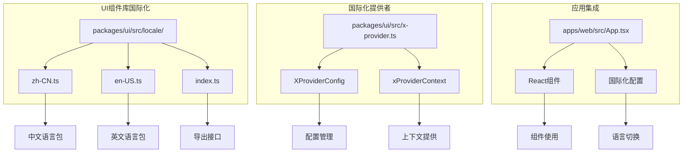
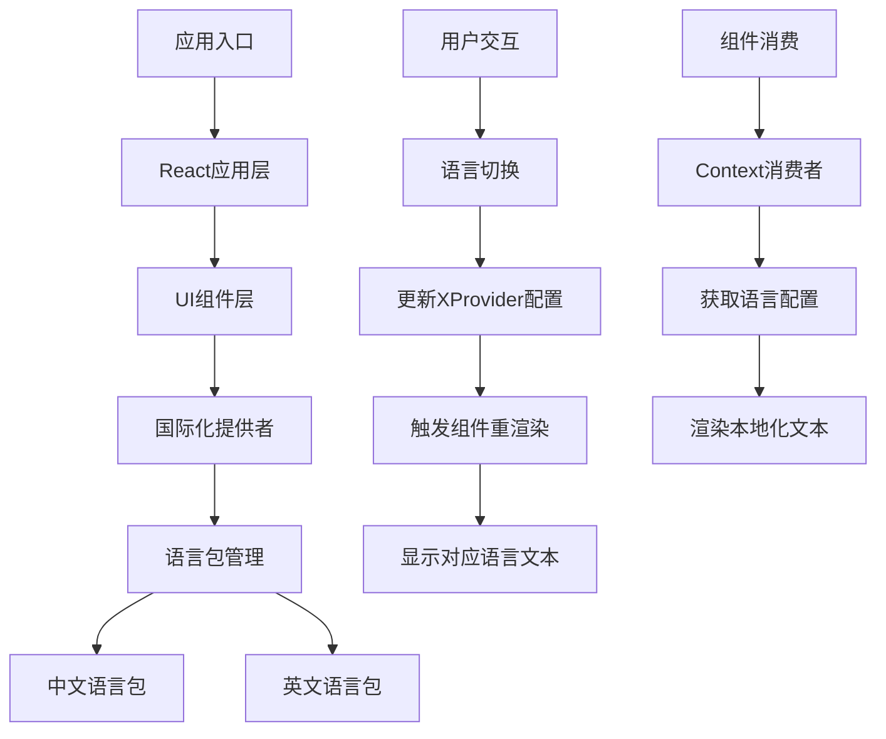
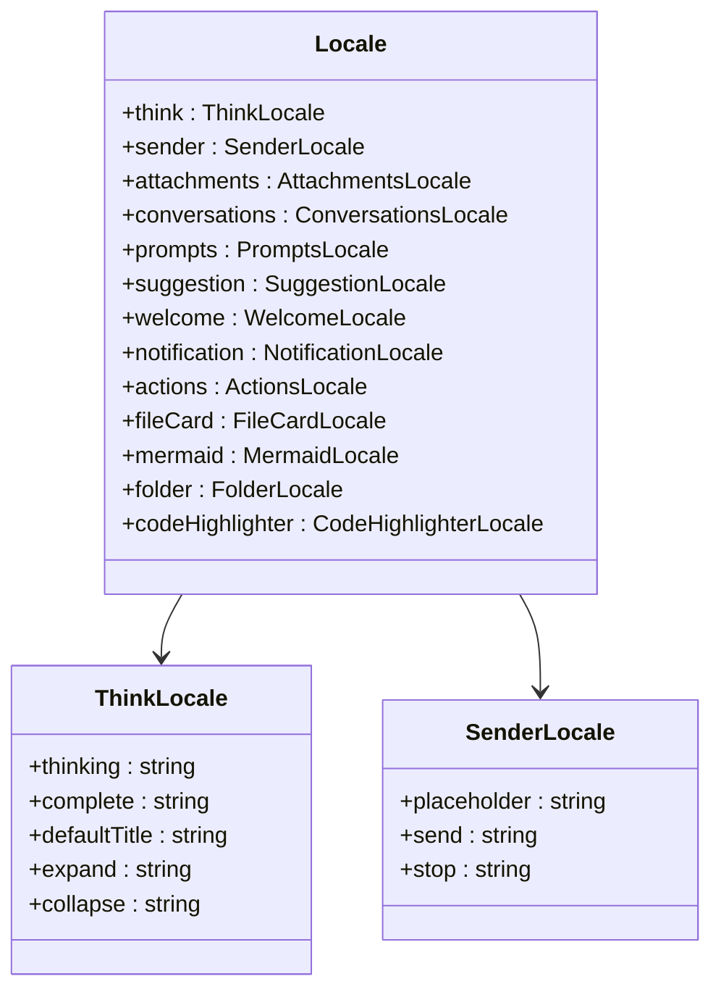
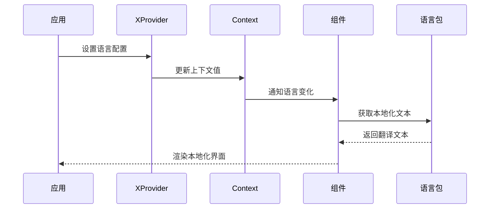
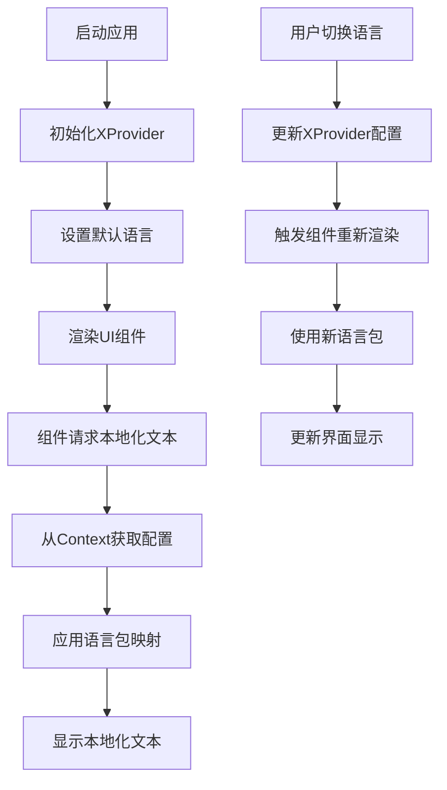
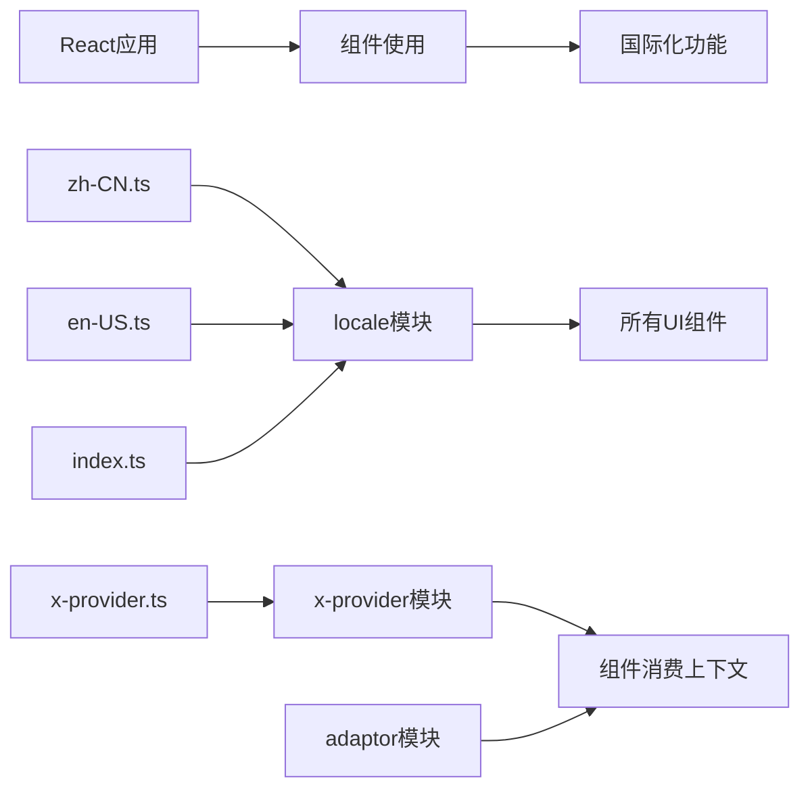

# 国际化支持

## 目录
1. [简介](#简介)
2. [项目结构](#项目结构)
3. [核心组件](#核心组件)
4. [架构概览](#架构概览)
5. [详细组件分析](#详细组件分析)
6. [依赖关系分析](#依赖关系分析)
7. [性能考虑](#性能考虑)
8. [故障排除指南](#故障排除指南)
9. [结论](#结论)

## 简介

AgentKit UI 组件库提供了完整的国际化(i18n)支持系统，采用现代化的多语言解决方案。该系统基于 React 和 Lit Web Components 构建，支持中英文双语环境，为全球用户提供本地化的用户体验。

国际化系统的核心特点包括：
- 基于 antd-x 国际化体系的完整实现
- 支持中英文语言包的动态切换
- 组件级别的本地化文本管理
- 响应式的语言环境感知机制

## 项目结构

国际化功能主要分布在以下目录结构中：

## 核心组件

### 语言包管理系统

国际化系统的核心是语言包管理模块，提供了完整的中英文语言支持：

#### 中文语言包 (zh-CN)
- **覆盖范围**: 思考过程、发送器、附件、对话列表等所有组件
- **文本数量**: 100+ 个本地化字符串
- **特色功能**: 支持深度思考状态、对话历史管理、文件上传等功能

#### 英文语言包 (en-US)
- **覆盖范围**: 与中文包对应的英文翻译
- **一致性**: 保持与中文包相同的键值结构
- **专业术语**: 提供专业的英文界面文本

### XProvider 国际化提供者

XProvider 是国际化系统的核心组件，负责在整个应用中传播语言配置：

#### 主要功能
- **上下文提供**: 通过 Lit 的 Context API 提供语言配置
- **响应式更新**: 自动响应语言变化并更新所有子组件
- **配置管理**: 管理 prefixCls、direction、theme 等全局配置

#### 配置选项
- **prefixCls**: CSS类名前缀，默认为 "ant"
- **direction**: 布局方向，支持 "ltr" 和 "rtl"
- **theme**: 主题名称，支持多种主题变体

## 架构概览

国际化系统的整体架构采用分层设计，确保了良好的可扩展性和维护性：

## 详细组件分析

### 语言包结构分析

每个语言包都遵循统一的结构模式，确保了跨语言的一致性：

### 国际化提供者工作流程

### 应用集成示例

在实际应用中，国际化系统通过以下方式集成：

## 依赖关系分析

国际化系统与其他组件的依赖关系如下：

### 外部依赖

- **@lit/context**: 提供响应式上下文管理
- **Lit Web Components**: 基础组件框架
- **React**: 应用层集成框架

## 性能考虑

国际化系统在设计时充分考虑了性能优化：

### 文本缓存机制
- 语言包在首次加载后会被缓存
- 避免重复的字符串查找操作
- 减少内存占用和计算开销

### 按需加载
- 语言包可以按需加载，减少初始包大小
- 支持动态语言切换而无需重新加载整个应用

### 组件优化
- 仅在语言变化时重新渲染受影响的组件
- 使用高效的上下文更新机制

## 故障排除指南

### 常见问题及解决方案

#### 语言包未生效
1. **检查XProvider配置**: 确保XProvider正确设置语言参数
2. **验证组件集成**: 确认组件正确消费Context
3. **检查语言包导入**: 确保语言包文件正确导入

#### 文本显示异常
1. **键值匹配**: 确保使用的键值在目标语言包中存在
2. **占位符处理**: 检查是否有未替换的占位符
3. **编码问题**: 确保文本编码正确

#### 性能问题
1. **缓存检查**: 确认语言包缓存正常工作
2. **组件重渲染**: 检查不必要的组件重渲染
3. **内存泄漏**: 监控Context订阅的生命周期

## 结论

AgentKit UI 的国际化系统提供了一个完整、高效且易于扩展的多语言解决方案。通过精心设计的语言包管理和响应式上下文提供机制，系统能够为不同地区的用户提供优质的本地化体验。

### 主要优势
- **完整的语言支持**: 中英文双语覆盖所有核心功能
- **灵活的配置管理**: 支持动态语言切换和主题定制
- **高性能实现**: 优化的缓存机制和按需加载
- **易于扩展**: 清晰的架构设计便于添加新语言

### 未来发展方向
- 支持更多语言包
- 增强RTL语言支持
- 优化动态加载性能
- 扩展主题定制能力

该国际化系统为构建全球化应用奠定了坚实的基础，为用户提供了无缝的多语言体验。