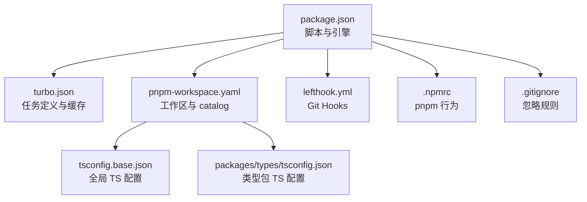
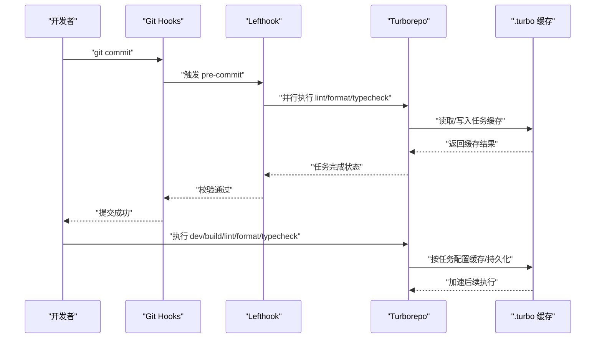
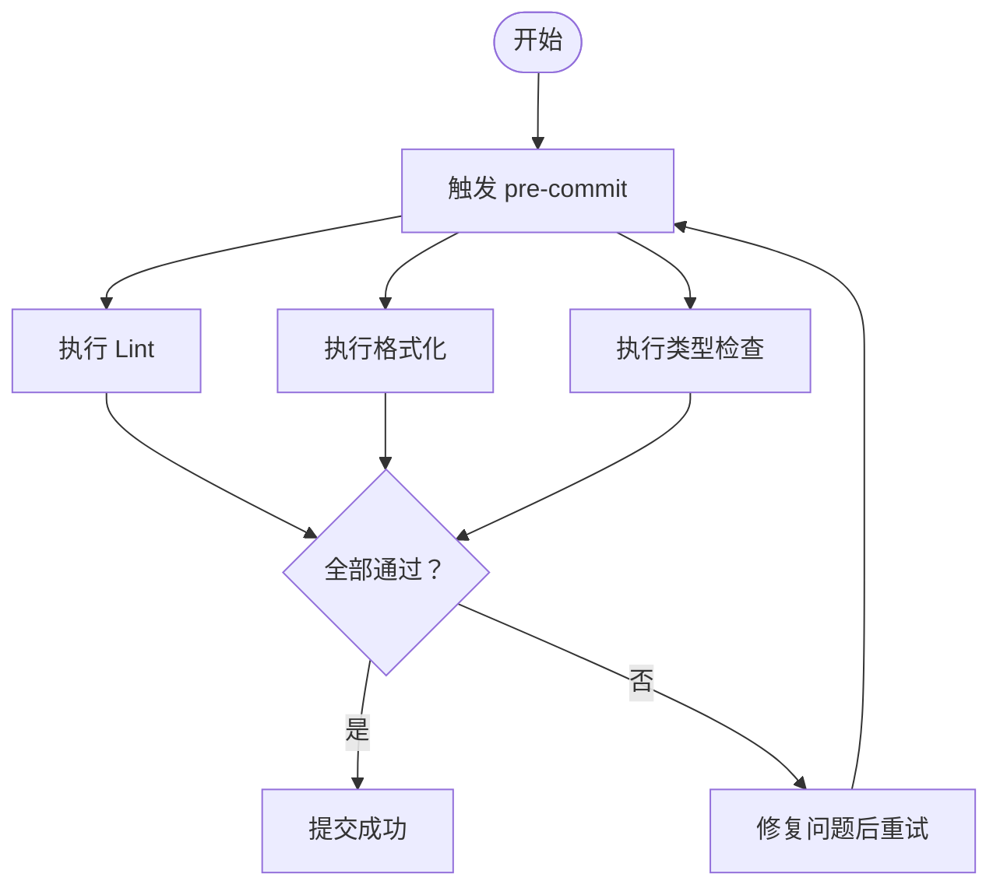
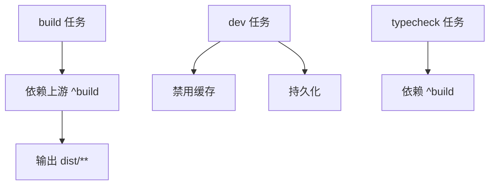
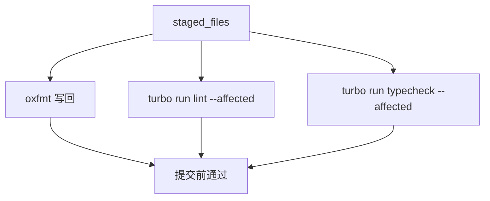
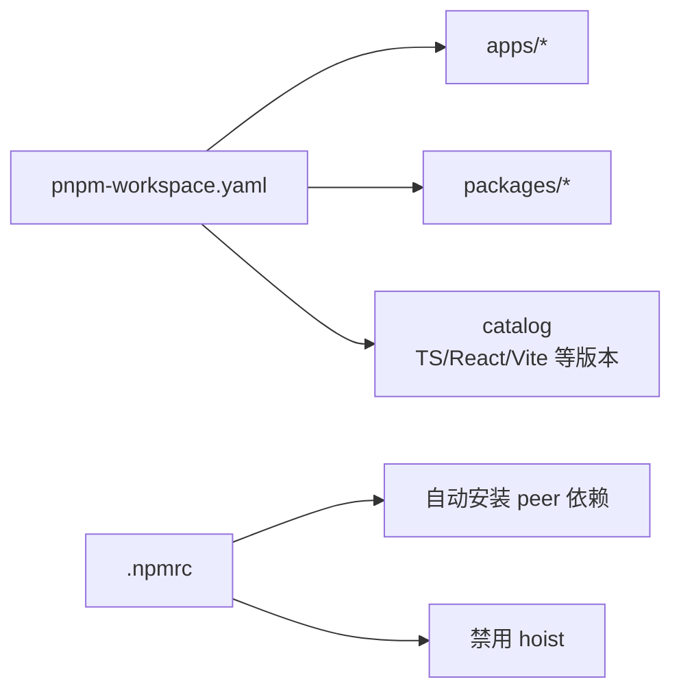
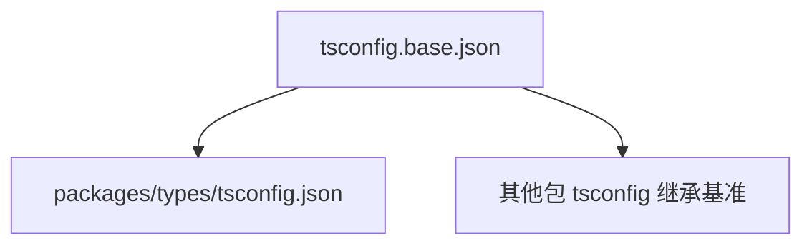
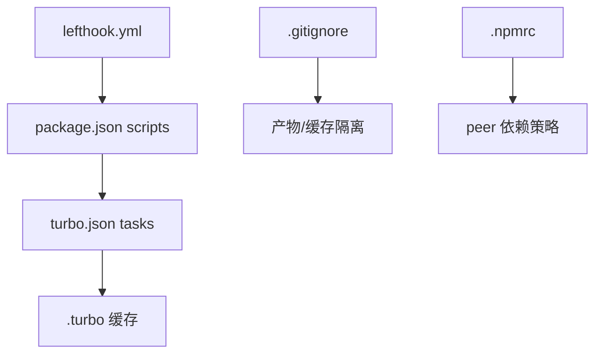

# 最佳实践

## 目录
1. [引言](#引言)
2. [项目结构](#项目结构)
3. [核心组件](#核心组件)
4. [架构总览](#架构总览)
5. [详细组件分析](#详细组件分析)
6. [依赖关系分析](#依赖关系分析)
7. [性能考虑](#性能考虑)
8. [故障排除指南](#故障排除指南)
9. [结论](#结论)
10. [附录](#附录)

## 引言
本指南面向在 AgentKit 项目中进行开发与协作的团队，围绕开发工作流、性能优化、问题诊断与团队配置标准化给出可落地的最佳实践。AgentKit 基于 pnpm monorepo、Turborepo 和 Lefthook 等工具，形成统一的脚本命令、缓存与流水线校验机制。通过遵循本文建议，可以显著提升开发效率、减少构建与运行时开销，并降低因环境差异导致的问题。

## 项目结构
AgentKit 采用 pnpm 工作区组织多包（apps 与 packages），结合 Turborepo 进行任务编排与缓存，Lefthook 在本地 Git Hooks 中执行格式化、类型检查与静态检查，.gitignore 统一屏蔽各类产物与缓存目录，.npmrc 控制 peer 依赖行为，TypeScript 通过工作区与基础 tsconfig 统一约束。



## 核心组件
- 脚本与引擎：通过统一的 npm scripts 将开发、构建、类型检查、格式化与 Lint 交由 Turborepo 执行，确保跨包一致性与缓存命中。
- 工作区与 catalog：集中声明 TypeScript、React、Vite 等生态版本，避免各包版本漂移。
- Git Hooks：在 pre-commit 并行执行 Lint、格式化与类型检查，保障提交质量。
- 缓存与持久化：Turborepo 任务缓存与 .turbo 目录配合，dev 任务持久化以提升热启动体验。
- 忽略与隔离：.gitignore 屏蔽产物与缓存；.npmrc 关闭 hoist 并允许自动安装 peer，强化依赖隔离。

## 架构总览
下图展示从开发者提交到构建/开发任务执行的关键路径，以及与缓存、格式化与类型检查的交互。



## 详细组件分析

### 开发工作流与提交规范
- 提交前校验：pre-commit 并行执行 Lint、格式化与类型检查，减少 CI 失败概率。
- 提交信息：预留 commit-msg 校验入口，便于接入 commitlint 规范。
- 分支管理：建议采用功能分支开发，合并前确保本地 pre-commit 通过且无未提交变更。
- 版本发布：建议使用语义化版本与变更日志，结合标签推送与自动化发布流程（可在 CI 中实现）。



### 构建与开发任务
- 构建链路：build 任务依赖上游包的 build 输出，输出目录 dist，利于增量构建与缓存。
- 开发模式：dev 任务禁用缓存并持久化，适合本地热更新；生产构建建议启用缓存以提升重复构建速度。
- 类型检查：typecheck 显式依赖 build，确保类型检查基于已产出的产物或最新源码。



### 代码格式化与静态检查
- 格式化：使用 oxfmt 写回 staged 文件，保证风格一致。
- 静态检查：oxlint 规则集中配置，忽略 dist、node_modules 与非 TS 文件，聚焦源码质量。
- Lint：通过 Turborepo 在 affected 包上执行，减少不必要的全量扫描。



### Monorepo 依赖与版本管理
- 工作区：apps 与 packages 下的包由 pnpm 管理，catalog 统一版本，降低升级成本。
- Peer 依赖：.npmrc 设置自动安装缺失的 peer，避免因版本不匹配导致的运行时问题。
- 严格隔离：关闭 hoist，减少意外共享导致的兼容性问题。



### TypeScript 配置与共享
- 基础配置：tsconfig.base.json 作为全局基准，统一编译选项与路径映射。
- 类型包：packages/types/tsconfig.json 可继承基础配置，确保类型包与其他包的一致性。



### Button 组件变体系统最佳实践

**更新** Button 组件变体系统已从 'primary' 默认变体更新为 'default'，新增了完整的变体和尺寸系统

AgentKit 的 Button 组件现提供完整的变体系统，支持多种视觉样式和尺寸选项：

#### 变体选项
- **default**：主按钮样式，使用 primary 颜色主题
- **destructive**：破坏性操作按钮，用于危险操作
- **outline**：描边按钮，背景透明，有边框
- **secondary**：次要按钮，使用 secondary 颜色主题
- **ghost**：幽灵按钮，悬停时显示背景
- **link**：链接按钮，显示为文本链接样式

#### 尺寸选项
- **default**：标准尺寸 (高度 36px，内边距适中)
- **sm**：小尺寸 (高度 32px，紧凑布局)
- **lg**：大尺寸 (高度 40px，适合主要操作)
- **icon**：图标按钮 (正方形，仅显示图标)

#### 使用示例
```typescript
// 默认变体（现在是 'default'）
<ak-button variant="default">默认按钮</ak-button>

// 其他变体
<ak-button variant="destructive">删除按钮</ak-button>
<ak-button variant="outline">描边按钮</ak-button>
<ak-button variant="secondary">次要按钮</ak-button>
<ak-button variant="ghost">幽灵按钮</ak-button>
<ak-button variant="link">链接按钮</ak-button>

// 不同尺寸
<ak-button size="sm">小按钮</ak-button>
<ak-button size="lg">大按钮</ak-button>
<ak-button size="icon">图标按钮</ak-button>
```

#### 类型安全
Button 组件提供完整的 TypeScript 支持，所有变体和尺寸选项都经过类型检查：

```typescript
// React JSX 类型定义
interface IntrinsicElements {
  "ak-button": React.DetailedHTMLProps<
    React.HTMLAttributes<AkButton> & {
      variant?: "default" | "destructive" | "outline" | "secondary" | "ghost" | "link";
      size?: "default" | "sm" | "lg" | "icon";
      disabled?: boolean;
    },
    AkButton
  >;
}
```

#### 设计原则
- **一致性**：所有变体保持统一的圆角、过渡动画和焦点状态
- **可访问性**：确保足够的对比度和键盘导航支持
- **响应式**：尺寸选项适应不同屏幕尺寸
- **语义化**：变体选择应反映按钮操作的重要性和危险级别

## 依赖关系分析
- 脚本到任务：package.json 的 scripts 通过 npm lifecycle 调用 Turborepo，实现跨包任务编排。
- 任务到缓存：turbo.json 定义任务依赖与输出，.turbo 目录承载缓存，提升重复执行速度。
- 工具链耦合：Lefthook 与 Turborepo 协同，pre-commit 仅对受影响包执行检查，缩短反馈周期。
- 忽略与隔离：.gitignore 屏蔽产物与缓存；.npmrc 控制依赖安装策略，避免版本漂移与 hoist 带来的副作用。



## 性能考虑
- 构建速度
  - 启用 Turborepo 任务缓存：合理设置 dependsOn 与 outputs，最大化复用缓存。
  - 避免不必要的全量扫描：pre-commit 使用 --affected 仅对变更包执行检查。
  - 按需清理缓存：当依赖或配置发生重大变更时，清理 .turbo 以重建缓存。
- 缓存策略
  - dev 任务持久化：在本地开发阶段提升热启动体验；生产构建可开启缓存以加速重复构建。
  - 产物目录明确：build 任务输出 dist/**，便于缓存命中与增量构建。
- 资源管理
  - 严格隔离依赖：禁用 hoist，减少隐式共享带来的内存与解析压力。
  - 控制 peer 依赖：允许自动安装缺失 peer，避免因版本不匹配导致的二次安装与冲突。
  - 清理无关产物：利用 .gitignore 屏蔽 node_modules、.next、.svelte-kit、.vite 等目录，降低磁盘占用与扫描时间。

## 故障排除指南
- 构建失败
  - 检查任务依赖链：确认 dependsOn 是否正确，尤其是 build 与 typecheck 的顺序。
  - 查看缓存状态：清理 .turbo 后重试，确认缓存是否被污染。
  - 排查上游包：若依赖上游包的 build 输出，先确保上游包构建成功。
- 依赖冲突
  - 检查 peer 依赖：确认是否满足自动安装缺失 peer 的条件。
  - 关闭 hoist：避免因 hoist 导致的版本解析异常。
  - 清理锁与缓存：删除 pnpm-lock.yaml 与 .pnpm-store 后重新安装。
- 配置错误
  - Lefthook 未生效：确认 Git Hooks 已安装且 pre-commit 正常触发。
  - Lint/格式化未覆盖：检查 glob 与受影响包过滤参数。
  - TypeScript 报错：核对 tsconfig 继承关系与基准配置。
- Button 组件问题
  - 变体无效：确认使用的变体名称在允许列表中
  - 尺寸不生效：检查 size 属性值是否正确
  - 类型错误：确保 TypeScript 项目正确导入组件类型

## 结论
通过统一的脚本、严格的 monorepo 配置与本地 Git Hooks 校验，AgentKit 能够在保证质量的同时显著提升开发效率。建议团队在现有基础上完善 CI 发布流程、引入 commitlint 与变更日志自动化，并持续优化缓存策略与依赖隔离，以获得更稳定的交付体验。Button 组件变体系统的更新为开发者提供了更多样化的 UI 选择，建议在实际项目中根据设计系统和用户体验需求合理选择合适的变体和尺寸。

## 附录
- 团队协作建议
  - 统一编辑器与插件：确保团队成员使用相同的格式化与 Lint 规则。
  - 分支命名与 PR 规范：约定清晰的分支命名与 PR 描述模板，便于自动化与审计。
  - 配置共享：将 .oxlintrc.json、tsconfig.base.json 等纳入版本控制，避免本地差异化。
  - 环境一致性：固定 Node 与 pnpm 版本，减少环境差异导致的问题。
  - 组件使用规范：建立 Button 组件变体使用的团队规范，确保设计一致性。