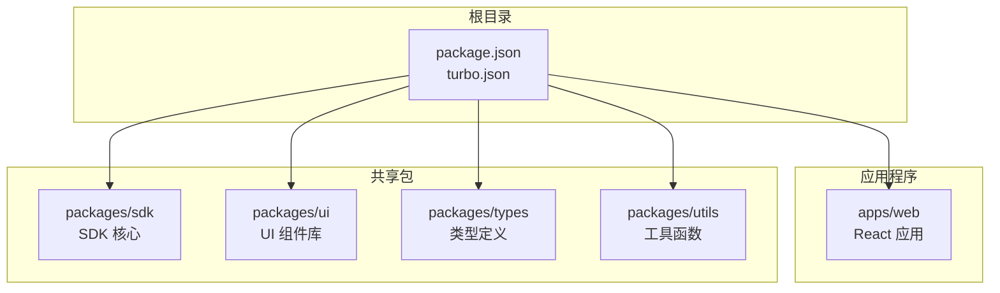
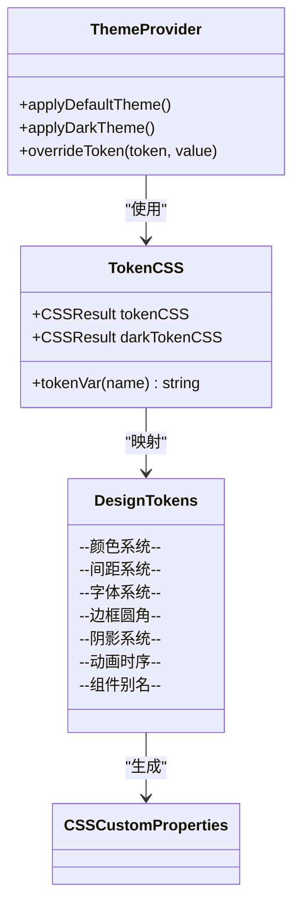
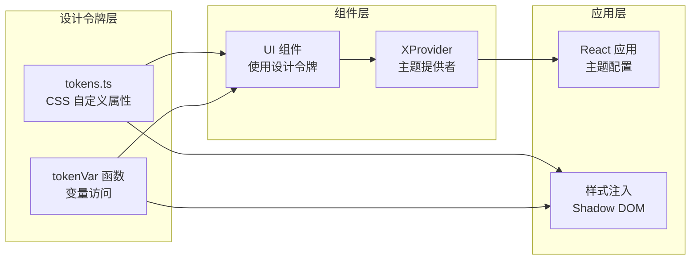
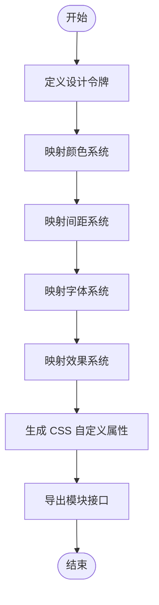
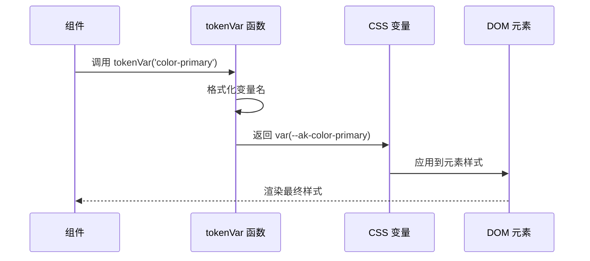
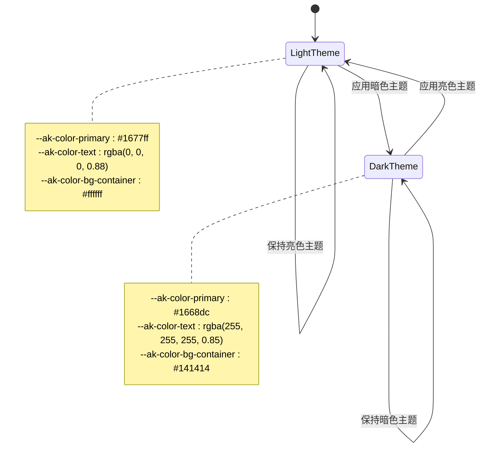
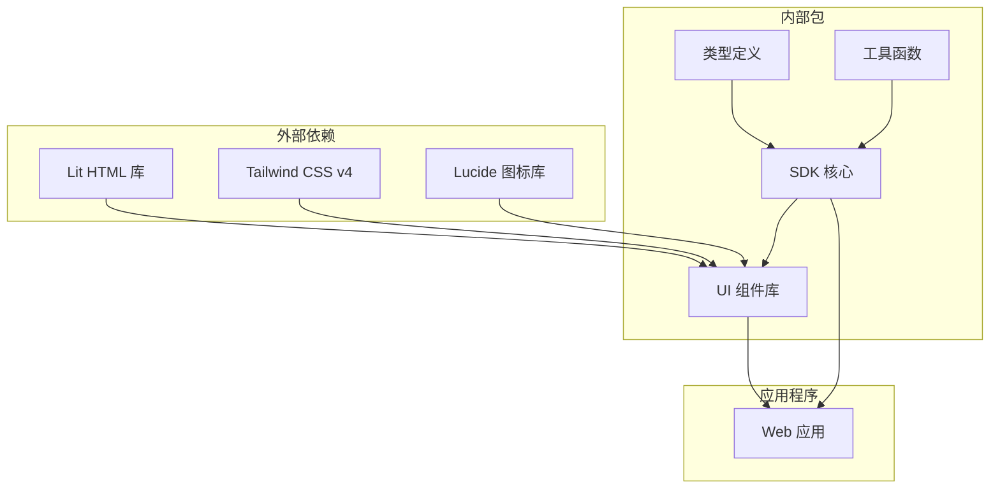
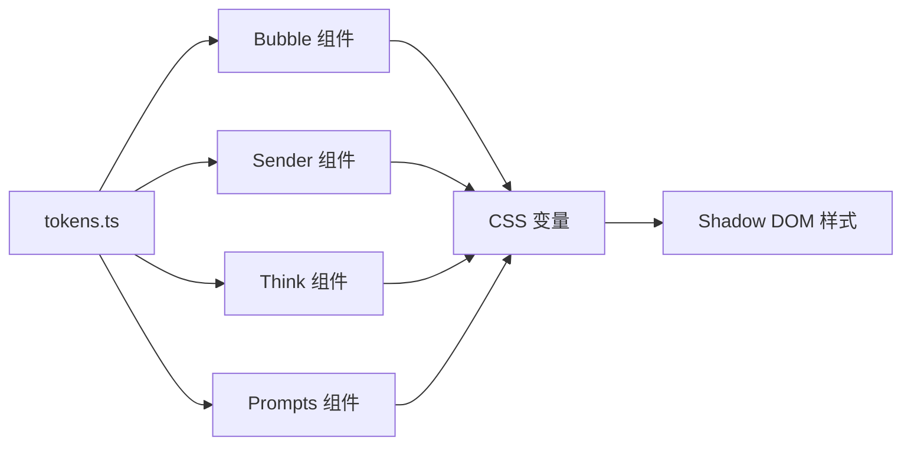

# 设计令牌系统

## 目录
1. [简介](#简介)
2. [项目结构](#项目结构)
3. [核心组件](#核心组件)
4. [架构概览](#架构概览)
5. [详细组件分析](#详细组件分析)
6. [依赖关系分析](#依赖关系分析)
7. [性能考虑](#性能考虑)
8. [故障排除指南](#故障排除指南)
9. [结论](#结论)

## 简介

AgentKit 是一个现代化的 AI 对话组件库，专注于提供流畅的用户体验和高度可定制的设计系统。该项目采用 Monorepo 架构，包含多个精心设计的包，每个包都有明确的职责分工。

设计令牌系统是 AgentKit 的核心组成部分之一，它提供了一套完整的 CSS 自定义属性体系，用于统一管理组件库的颜色、间距、字体等视觉设计元素。该系统不仅支持默认主题，还提供了暗色主题支持，确保在不同环境下都能保持一致的视觉体验。

## 项目结构

AgentKit 采用 Turborepo 作为工作区管理工具，实现了高效的构建和开发流程。项目结构清晰地分离了不同的功能领域：

## 核心组件

### 设计令牌系统架构

设计令牌系统基于 CSS 自定义属性实现，提供了一个完整的主题管理解决方案：

### 主题系统特性

设计令牌系统包含以下核心特性：

1. **颜色系统**：主色调、状态色、文本色、背景色的完整映射
2. **间距系统**：从极小到极大的完整间距体系
3. **字体系统**：系统字体和代码字体的配置
4. **边框圆角**：从微小到超大圆角的渐进式设计
5. **阴影系统**：多层次的阴影效果
6. **动画时序**：流畅的过渡动画配置
7. **组件别名**：特定组件的样式别名

## 架构概览

AgentKit 的设计令牌系统在整个架构中扮演着关键角色，它不仅为 UI 组件提供样式基础，还为整个应用的主题一致性提供了保障。

## 详细组件分析

### 设计令牌实现

设计令牌系统通过 CSS 自定义属性实现，为每个设计元素提供标准化的命名规范：

### 令牌变量访问机制

系统提供了简洁的 API 来访问和使用设计令牌：

### 主题切换机制

系统支持动态主题切换，特别是暗色主题的支持：

## 依赖关系分析

### 包依赖关系

### 组件间交互

设计令牌系统与各组件的交互关系：

## 性能考虑

### 样式优化策略

设计令牌系统采用了多项性能优化措施：

1. **CSS 自定义属性缓存**：避免重复计算和查询
2. **Shadow DOM 隔离**：防止样式冲突，提高渲染性能
3. **按需加载**：组件只加载必要的样式
4. **主题预编译**：减少运行时样式计算

### 内存管理

系统通过以下方式管理内存使用：

- 使用静态 CSS 结果对象避免重复创建
- 合理的变量命名规范减少内存碎片
- 及时清理事件监听器和定时器

## 故障排除指南

### 常见问题及解决方案

1. **样式不生效**
   - 检查 CSS 变量是否正确注入到 Shadow DOM
   - 确认 XProvider 是否正确配置主题

2. **主题切换异常**
   - 验证暗色主题 CSS 是否正确应用
   - 检查主题切换逻辑的执行顺序

3. **性能问题**
   - 监控 CSS 变量的使用频率
   - 优化样式计算和重排操作

## 结论

AgentKit 的设计令牌系统通过标准化的 CSS 自定义属性实现了高度一致和可维护的样式管理。该系统不仅提供了丰富的设计元素映射，还支持动态主题切换和组件级别的样式定制。

系统的关键优势包括：

- **一致性**：统一的设计语言和视觉标准
- **可扩展性**：灵活的主题定制和组件样式覆盖
- **性能优化**：高效的样式计算和渲染机制
- **开发友好**：直观的 API 和完善的类型支持

通过合理利用设计令牌系统，开发者可以快速构建出既美观又功能强大的 AI 对话界面，同时保持代码的可维护性和可扩展性。