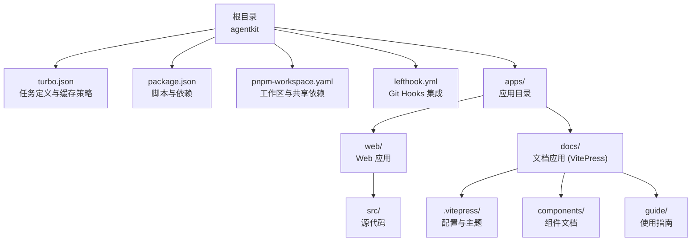
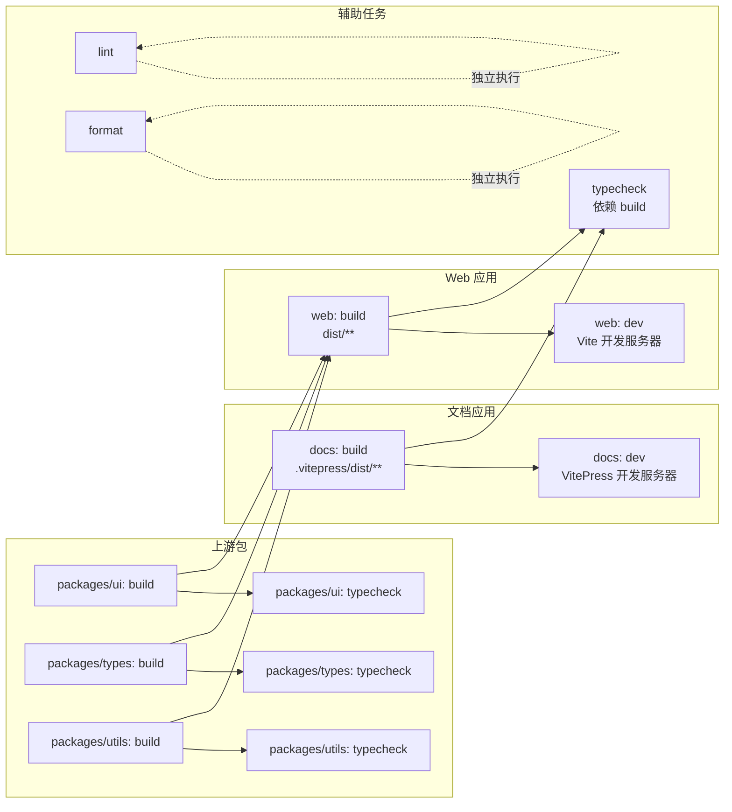
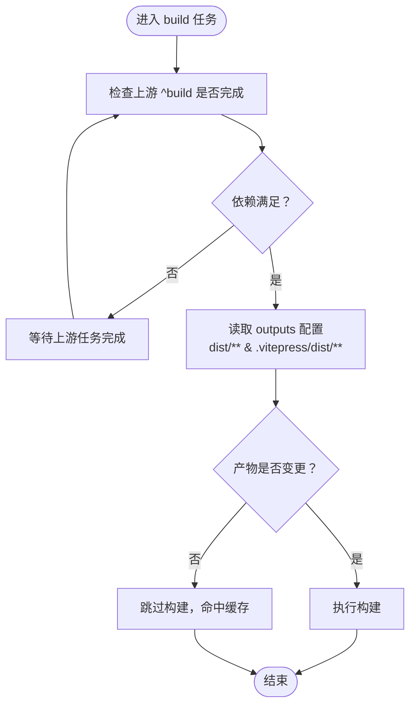
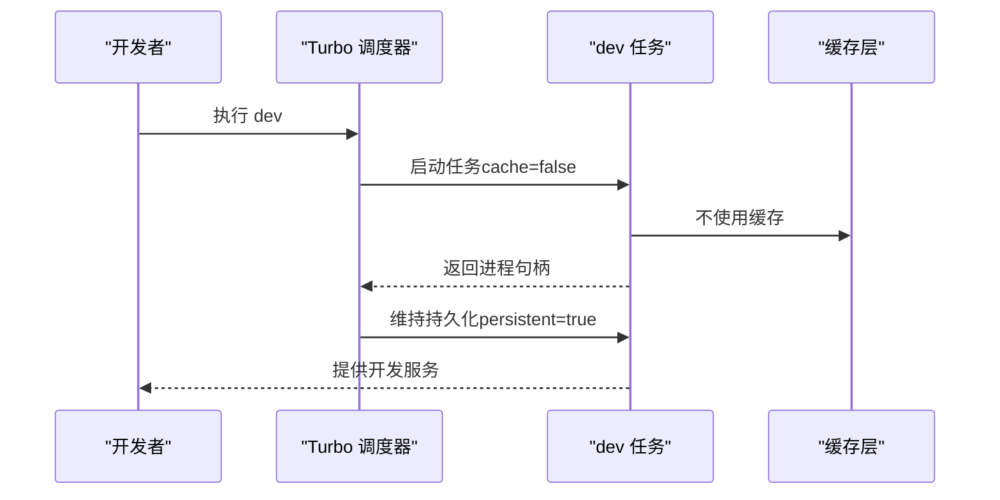
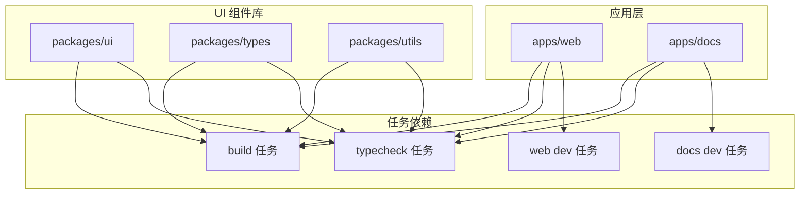

# Turbo 构建配置

## 目录
1. [简介](#简介)
2. [项目结构](#项目结构)
3. [核心组件](#核心组件)
4. [架构总览](#架构总览)
5. [详细组件分析](#详细组件分析)
6. [依赖关系分析](#依赖关系分析)
7. [性能与缓存策略](#性能与缓存策略)
8. [故障排查指南](#故障排查指南)
9. [结论](#结论)
10. [附录：配置示例与最佳实践](#附录配置示例与最佳实践)

## 简介
本文件面向使用 Turbo 的团队与个人开发者，围绕构建系统中的任务定义与执行进行深入解析。重点覆盖以下主题：
- 任务定义系统：build、dev、lint、format、typecheck 的配置要点
- 依赖关系 dependsOn 如何驱动增量构建与缓存优化
- 输出配置 outputs 对缓存命中率的影响机制
- 缓存控制 cache 与持久化任务 persistent 的使用场景
- 任务依赖图示与实际配置示例，帮助快速理解 Turbo 工作原理与最佳实践
- **新增**：文档应用（VitePress）的构建配置与集成方案

## 项目结构
该仓库采用 Turborepo + PNPM Workspace 的多包工作区结构，通过统一的任务编排与缓存策略提升开发效率与构建稳定性。新增的 docs 应用作为 VitePress 文档站点，与 web 应用共同构成完整的前端解决方案。

## 核心组件
本节从任务维度梳理各任务的配置要点与行为特征，帮助读者快速定位配置项并理解其影响范围。

- **build 任务**
  - 依赖上游包的同名任务（^build）
  - 声明输出目录 dist/** 和 .vitepress/dist/**
  - 影响：确保跨包构建顺序与缓存命中；下游任务可基于产物进行增量判断

- **dev 任务**
  - 关闭缓存（cache: false）
  - 启用持久化（persistent: true）
  - 影响：本地开发服务不被缓存，但会作为长期运行进程保持，适合热重载与实时反馈

- **lint 任务**
  - 无额外配置
  - 影响：默认按工作区规则执行静态检查，可与其他任务并行或串行组合

- **format 任务**
  - 无额外配置
  - 影响：格式化工具在 Git Hooks 中直接调用，无需缓存

- **typecheck 任务**
  - 依赖上游包的 build 任务（^build）
  - 影响：类型检查前必须保证产物可用，避免重复编译与误报

## 架构总览
下图展示了任务在工作区内的依赖关系与执行顺序，体现 Turbo 如何利用 dependsOn 与 outputs 实现增量构建与缓存优化。新增的 docs 应用通过 VitePress 构建文档站点，与 UI 组件库形成完整的生态体系。

## 详细组件分析

### build 任务
- **依赖关系 dependsOn**
  - 使用通配符 ^build 表示"依赖上游包的同名任务"
  - 作用：在多包工作区中，确保当前包的构建在上游包构建完成后才开始，避免读取未生成的产物

- **输出配置 outputs**
  - 使用通配符 dist/** 表示构建产物目录
  - **新增**：.vitepress/dist/** 支持 VitePress 文档站点的构建输出
  - 作用：Turbo 将根据该路径集合判断任务是否需要重新执行；若产物未变更则命中缓存

### dev 任务
- **缓存控制 cache**
  - 设置为 false，表示开发态不使用缓存
  - 作用：每次启动都重新执行，确保开发服务器始终反映最新代码

- **持久化 persistent**
  - 设置为 true，表示该任务作为长期运行进程
  - 作用：Turbo 会在后台维持该进程，支持热重载与持续监听

### 文档应用（docs）构建配置
- **构建脚本**
  - dev: vitepress dev
  - build: vitepress build  
  - preview: vitepress preview

- **依赖关系**
  - 依赖 @agentkit/ui 组件库
  - 作为独立的应用包进行构建

- **配置特点**
  - 使用 VitePress 2.0+ 进行文档站点构建
  - 集成丰富的组件文档与使用指南
  - 支持本地开发服务器与生产构建

### lint 任务
- **配置状态**
  - 无额外配置项，默认按工作区规则执行

- **典型用途**
  - 在 CI 或本地提交前进行静态检查，通常与 format 并行或串行组合

### format 任务
- **配置状态**
  - 无额外配置项，默认由格式化工具处理

- **集成方式**
  - 在 Git Hooks 中直接调用，无需缓存，提高执行效率

### typecheck 任务
- **依赖关系 dependsOn**
  - 依赖 ^build，确保类型检查前产物已生成

- **适用场景**
  - 在大型工作区中，先构建再进行类型检查，避免因产物缺失导致的误报

## 依赖关系分析
本节聚焦 dependsOn 的工作机制与对缓存的影响，结合工作区包层级展示典型依赖链路。新增的 docs 应用通过 @agentkit/ui 组件库与 web 应用形成完整的组件生态。

## 性能与缓存策略
- **依赖驱动的增量构建**
  - 通过 dependsOn 精确声明上游依赖，避免无关任务重复执行
  - 与 outputs 配合，仅当产物变化时触发重建
  - **新增**：docs 应用的 .vitepress/dist/** 输出目录纳入缓存判断

- **缓存禁用与持久化**
  - dev 任务关闭缓存并启用持久化，保障开发体验
  - 其他任务保持默认缓存策略，最大化复用历史结果

- **工具链协同**
  - format 与 lint 在 Git Hooks 中直接执行，减少中间层开销
  - typecheck 依赖 build，降低类型检查成本

## 故障排查指南
- **问题**：typecheck 报错但构建成功
  - 排查：确认上游包是否已产出 dist/** 和 .vitepress/dist/**，且 typecheck 的 dependsOn 配置正确
  - 参考：typecheck 依赖 ^build

- **问题**：dev 任务频繁重启或状态异常
  - 排查：确认 dev 的 cache=false 与 persistent=true 配置一致
  - 参考：dev 任务配置

- **问题**：构建缓存未命中
  - 排查：核对 outputs 配置是否覆盖了真实产物目录，特别是 docs 应用的 .vitepress/dist/**
  - 参考：build 任务 outputs

- **问题**：Git Hooks 中 format/lint 未生效
  - 排查：确认 lefthook.yml 中命令与脚本名称一致

- **问题**：docs 应用构建失败
  - 排查：确认 @agentkit/ui 依赖已正确安装，检查 VitePress 配置文件
  - 参考：apps/docs/package.json, apps/docs/.vitepress/config.mts

## 结论
本配置以最小化显式配置实现了高效的多包构建体系：通过精确的 dependsOn 与 outputs，构建过程具备良好的增量能力；通过 dev 的缓存禁用与持久化，兼顾开发体验；配合 Git Hooks 的 format/lint，形成从本地到 CI 的完整质量闭环。

**新增的 docs 应用**进一步完善了整个构建生态，通过 VitePress 实现了完整的文档站点构建流程，与 UI 组件库形成紧密的依赖关系。建议在新增任务时遵循"先依赖后产物"的原则，并根据任务特性选择合适的缓存策略。

## 附录：配置示例与最佳实践
- **通用任务模板**
  - 依赖上游构建：在新任务中添加 dependsOn: ["^build"]
  - 声明产物目录：在 outputs 中包含实际输出路径，如 dist/** 或 .vitepress/dist/**

- **开发任务最佳实践**
  - dev：cache: false, persistent: true
  - 若需临时禁用缓存，可在命令行传参覆盖

- **类型检查最佳实践**
  - 优先依赖构建产物，避免重复编译
  - 在大型工作区中，尽量将 typecheck 放在构建之后

- **文档应用集成**
  - 使用 VitePress 2.0+ 进行文档站点构建
  - 通过 @agentkit/ui 依赖集成组件库
  - 配置 .vitepress/config.mts 进行主题与导航设置

- **Git Hooks 集成**
  - pre-commit 中使用 --affected 与 --filter 限制检查范围
  - format 与 lint 分离，便于并行执行与失败隔离

- [lefthook.yml:7-15](https://github.com/weishaodaren/agentkit/blob/main/lefthook.yml#L7-L15)