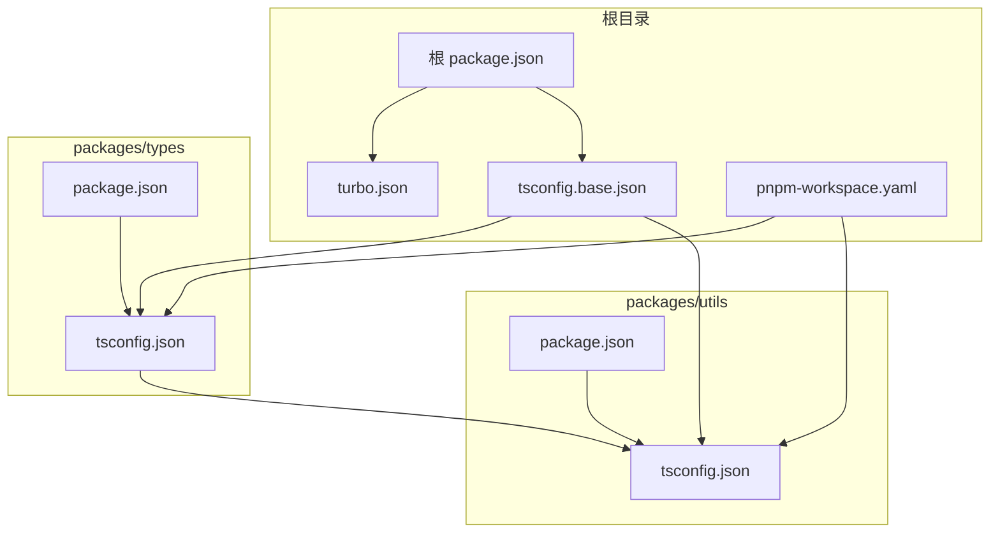
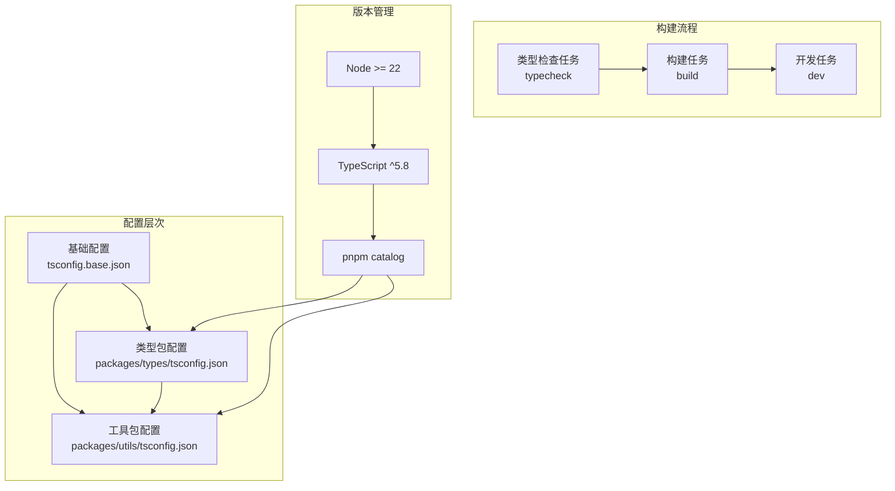
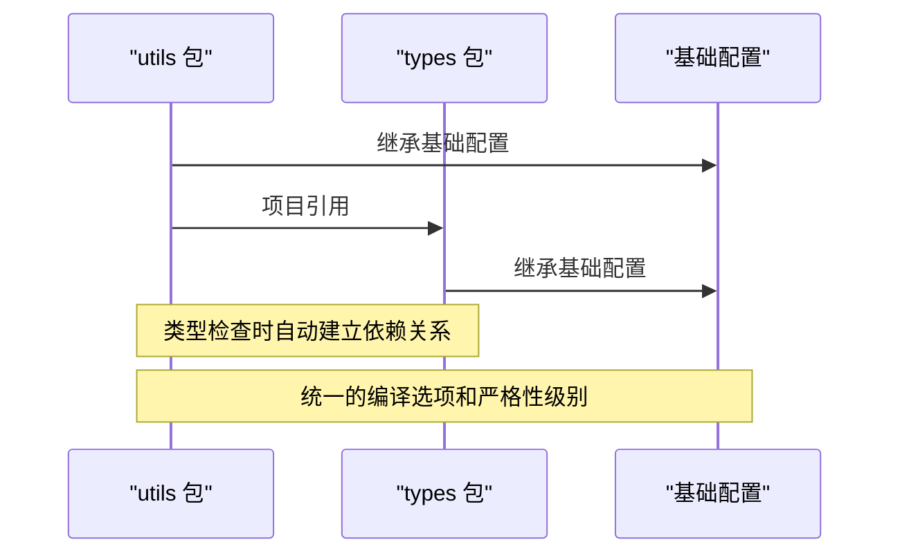
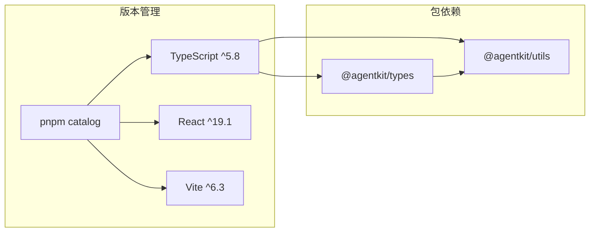

# TypeScript 基础配置

## 目录
1. [简介](#简介)
2. [项目结构](#项目结构)
3. [核心组件](#核心组件)
4. [架构概览](#架构概览)
5. [详细组件分析](#详细组件分析)
6. [依赖关系分析](#依赖关系分析)
7. [性能考虑](#性能考虑)
8. [故障排除指南](#故障排除指南)
9. [结论](#结论)

## 简介

本文件为 TypeScript 基础配置的全面技术文档，重点阐述编译选项的设置与作用，包括严格性级别、模块解析策略和输出配置。同时说明基础配置文件如何为整个 Monorepo 提供统一的类型检查标准，以及 TypeScript 版本要求和兼容性考虑。文档还提供了常见配置场景的示例和最佳实践建议，帮助开发者理解和维护 TypeScript 配置。

## 项目结构

该项目采用 Turborepo + PNPM Workspace 的 Monorepo 架构，TypeScript 基础配置通过共享的基础配置文件集中管理，各子包通过继承方式应用统一规则。

## 核心组件

### 基础配置文件 (tsconfig.base.json)

基础配置文件定义了整个 Monorepo 的统一 TypeScript 编译规则，包含以下关键配置：

**编译选项详解：**
- **目标环境**: ES2022 目标，支持现代 JavaScript 特性
- **模块系统**: ESNext 模块，配合 bundler 解析器使用
- **严格性级别**: 启用严格模式，确保类型安全
- **输出控制**: 禁止 emit（noEmit），仅用于类型检查
- **模块解析**: 使用 bundler 模式，支持现代打包工具
- **声明文件**: 启用 declaration、declarationMap 和 sourceMap
- **复合项目**: 支持增量编译和项目引用

### 包级配置文件

#### packages/types 配置
- 继承基础配置
- 设置 rootDir 为 src
- 作为类型包，不生成输出文件
- 通过 exports 字段暴露类型定义

#### packages/utils 配置  
- 继承基础配置
- 设置 rootDir 为 src
- 通过 references 指定对 types 包的项目引用
- 依赖 @agentkit/types 类型包

## 架构概览

TypeScript 配置架构采用分层设计，确保类型检查的一致性和可维护性。

## 详细组件分析

### 编译选项深度解析

#### 严格性级别配置
基础配置启用了全面的严格性检查，包括：
- 启用严格模式 (`strict: true`)
- 强制一致的文件名大小写检查 (`forceConsistentCasingInFileNames: true`)
- 跳过库文件检查 (`skipLibCheck: true`) 以提升性能
- ES 模块互操作 (`esModuleInterop: true`)

#### 模块解析策略
- 使用 `bundler` 模式解析模块，适配现代打包工具
- 允许导入 .ts 扩展名文件 (`allowImportingTsExtensions: true`)
- 支持 JSON 模块解析 (`resolveJsonModule: true`)

#### 输出配置
- 禁止 emit 输出 (`noEmit: true`)，仅用于类型检查
- 启用声明文件生成 (`declaration: true`)
- 生成源码映射 (`sourceMap: true`)
- 启用复合项目支持 (`composite: true`)

### 项目引用机制

### 构建流程集成

#### Turborepo 任务配置
- `build`: 依赖上游包构建，输出到 dist 目录
- `dev`: 开发模式，启用持久化和缓存
- `typecheck`: 类型检查任务，依赖构建流程

#### 包级脚本配置
- types 包: 使用 tsc --noEmit 进行类型检查
- utils 包: 同样使用 tsc --noEmit 进行类型检查
- 通过 oxlint 和 oxfmt 进行代码质量保证

## 依赖关系分析

### 版本管理策略

### 兼容性要求

- **Node.js**: 要求 >= 22，确保使用现代运行时特性
- **TypeScript**: ^5.8，利用最新语言特性和性能改进
- **包管理**: pnpm@10.30.2，提供高效的依赖管理和工作区支持

## 性能考虑

### 增量编译优化
- 启用复合项目 (`composite: true`) 支持增量编译
- 使用项目引用减少重复类型检查
- 禁止 emit 输出避免不必要的文件写入

### 内存和缓存策略
- 跳过库文件检查 (`skipLibCheck: true`) 减少内存占用
- Turborepo 缓存机制提升构建性能
- 开发模式下禁用缓存确保实时反馈

## 故障排除指南

### 常见问题诊断

#### 类型检查失败
- 检查是否正确继承基础配置
- 验证项目引用路径的有效性
- 确认严格性选项未被意外覆盖

#### 模块解析错误
- 确认使用 bundler 模式解析器
- 检查 allowImportingTsExtensions 配置
- 验证模块解析路径的正确性

#### 版本兼容性问题
- 升级到 Node.js >= 22
- 确保 TypeScript 版本符合 ^5.8 要求
- 检查 pnpm 版本兼容性

## 结论

该 TypeScript 基础配置方案通过分层设计实现了 Monorepo 中的统一类型检查标准。基础配置文件集中管理编译选项，子包通过继承方式应用统一规则，结合项目引用机制实现类型检查的依赖管理。配合 Turborepo 的构建流程和 pnpm 的版本管理，形成了高效、可维护的 TypeScript 开发环境。

关键优势包括：
- 统一的严格性级别和编译选项
- 支持增量编译和项目引用
- 与现代打包工具的良好兼容性
- 清晰的版本管理和依赖约束

建议在新项目中采用类似的分层配置策略，并根据具体需求调整严格性级别和模块解析策略。