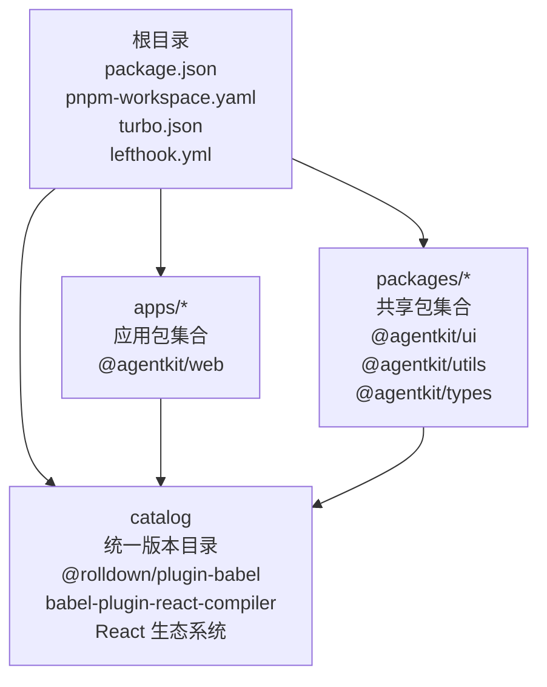
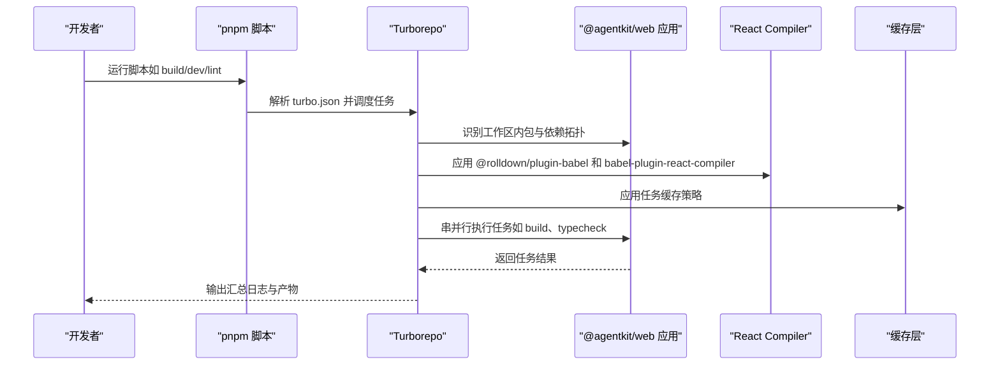
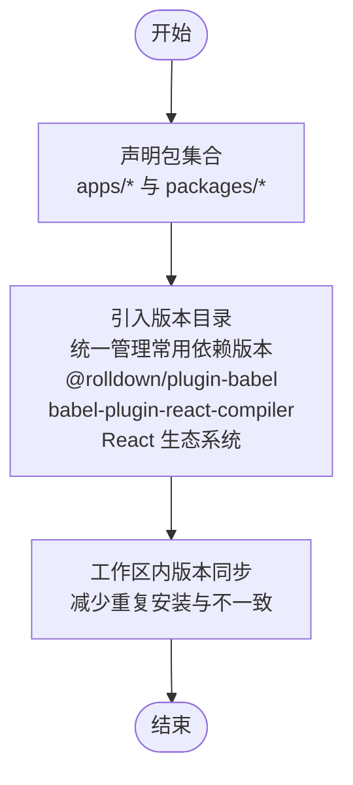
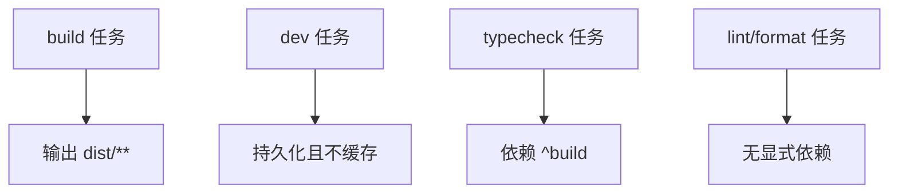
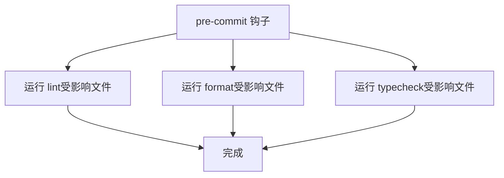
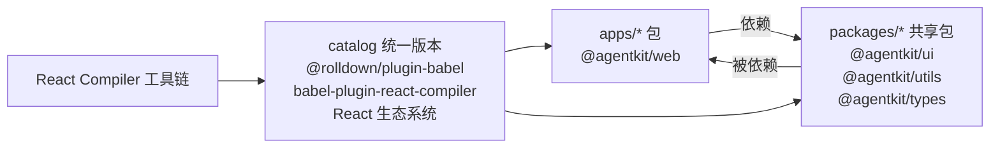

# pnpm 工作区配置

## 目录
1. [简介](#简介)
2. [项目结构](#项目结构)
3. [核心组件](#核心组件)
4. [架构总览](#架构总览)
5. [详细组件分析](#详细组件分析)
6. [依赖关系与版本管理](#依赖关系与版本管理)
7. [性能考量](#性能考量)
8. [故障排除指南](#故障排除指南)
9. [结论](#结论)

## 简介
本指南面向希望在 Monorepo 中使用 pnpm 工作区进行高效依赖管理与版本统一的团队。本文基于仓库中的实际配置，系统讲解工作区的概念、包位置组织（apps/* 与 packages/*）、版本目录（catalog）的作用、以及如何结合 Turborepo 实现构建、开发、格式化与类型检查等任务的流水线式执行。特别关注新增的 @rolldown/plugin-babel 和 babel-plugin-react-compiler 版本管理机制，展示现代 React 开发工具链的集成方式。同时提供常见问题的排查思路与最佳实践建议。

## 项目结构
当前仓库采用简洁而清晰的 Monorepo 结构：
- 根目录包含工作区配置文件、包管理器声明与脚本入口
- 工作区通过 pnpm-workspace.yaml 声明包集合
- 通过 catalog 统一管理常用依赖版本，包括 React 生态系统的关键包
- 使用 Turbo 管理跨包的任务编排
- Git Hook 通过 lefthook 集成代码质量流程

## 核心组件
- 包管理器与引擎声明：根 package.json 指定使用的包管理器版本与 Node.js 最低版本要求，确保团队环境一致性。
- 工作区定义：pnpm-workspace.yaml 声明工作区内所有包的匹配模式，并通过 catalog 提供统一版本目录，现已包含 @rolldown/plugin-babel 和 babel-plugin-react-compiler 等现代 React 开发工具。
- 任务编排：turbo.json 定义构建、开发、格式化、类型检查等任务的依赖关系与缓存策略。
- 质量门禁：lefthook.yml 在提交前自动运行 lint、format、typecheck 等任务，保证变更质量。

## 架构总览
下图展示了从开发者命令到具体任务执行的整体流程，体现 pnpm 工作区与 Turborepo 的协同关系，以及新增的 React Compiler 工具链集成。

## 详细组件分析

### pnpm 工作区配置（pnpm-workspace.yaml）
- 包集合声明：通过匹配模式将 apps/* 与 packages/* 下的所有包纳入工作区，便于统一安装、链接与版本管理。
- 版本目录（catalog）：集中声明常用依赖版本，现已包含 @rolldown/plugin-babel、babel-plugin-react-compiler、@types/react、@vitejs/plugin-react、react、typescript、vite 等现代 React 开发工具链的核心包，避免各包重复维护相同版本号，降低版本漂移风险，提升一致性与可维护性。

### Turborepo 任务编排（turbo.json）
- 任务定义：build、dev、lint、format、typecheck 等任务在 tasks 字段中声明。
- 依赖关系：通过 dependsOn 指定任务间的顺序依赖（例如 typecheck 依赖上游构建），确保下游任务在上游产物就绪后执行。
- 缓存策略：dev 任务设置为持久且不缓存，适合本地开发；build 任务设置输出目录，便于缓存命中与增量构建。

### Git Hooks 与质量门禁（lefthook.yml）
- 提交前钩子：在 pre-commit 阶段并行执行 lint、format、typecheck，提高代码质量与一致性。
- 影响范围过滤：通过 --affected 与 --filter 参数仅对受影响文件运行任务，提升效率。

### 包位置组织与命名约定
- apps/*：存放应用级包（如前端应用、服务端应用等）。这些包通常作为最终产物的入口，依赖 packages/* 中的共享库。@agentkit/web 应用已集成 @rolldown/plugin-babel 和 babel-plugin-react-compiler，用于现代化的 React 编译和优化。
- packages/*：存放可复用的共享包（如工具库、UI 组件库、SDK 等）。这些包被多个应用或其它共享包依赖。@agentkit/ui 和 @agentkit/utils 包通过 catalog 引用统一的 React 生态系统版本。
- 建议：保持包名语义化、避免循环依赖；在包内提供明确的导出入口与类型声明，便于 Turborepo 与 pnpm 正确解析依赖。

### React Compiler 工具链集成
- @rolldown/plugin-babel：作为现代化的 Babel 插件，与 @vitejs/plugin-react 协同工作，提供高性能的 React 编译支持。
- babel-plugin-react-compiler：React 官方推荐的编译器插件，通过 pnpm catalog 统一版本管理，确保与 React 生态系统的兼容性。
- 版本同步机制：所有相关包都通过 catalog 引用统一版本，避免版本不匹配导致的构建问题。

## 依赖关系与版本管理
- 工作区内依赖：apps/* 与 packages/* 内部的包可通过名称直接相互依赖，pnpm 会自动解析并建立链接，避免重复安装。
- 版本目录（catalog）：通过统一版本目录管理常用依赖，包括 @rolldown/plugin-babel、babel-plugin-react-compiler、@types/react、@vitejs/plugin-react、react、typescript、vite 等现代 React 开发工具链的核心包，减少各包版本分散带来的维护成本与冲突风险。
- 任务驱动的版本同步：借助 Turborepo 的拓扑排序与缓存，当上游包发生变更时，下游包的构建与校验能按需触发，确保版本与产物的一致性。
- React Compiler 集成：通过 catalog 统一管理 React Compiler 相关依赖，确保 @rolldown/plugin-babel 与 babel-plugin-react-compiler 的版本兼容性。

## 性能考量
- 任务缓存：合理利用 Turborepo 的缓存策略，避免重复执行已成功任务；对需要实时性的开发任务（如 dev）关闭缓存以保证体验。
- 影响范围执行：在 CI 或本地提交阶段，仅对受影响文件运行 lint、format、typecheck，显著缩短反馈周期。
- 依赖去重与链接：pnpm 的工作区模式会自动去重与链接，减少磁盘占用与安装时间。
- React Compiler 优化：通过 @rolldown/plugin-babel 和 babel-plugin-react-compiler 的集成，提升构建性能和运行时性能。

## 故障排除指南
- Node 版本不满足要求
  - 现象：安装或运行脚本报错，提示 Node 版本过低。
  - 排查：确认根 package.json 中 engines.node 是否满足当前环境。
  - 处理：升级 Node 版本至满足要求的范围。

- 包未被识别为工作区成员
  - 现象：新增包后 pnpm 无法识别其为工作区成员，导致依赖解析异常。
  - 排查：确认包路径是否符合 pnpm-workspace.yaml 中的匹配规则（apps/* 与 packages/*）。
  - 处理：将新包放置于 apps/* 或 packages/* 下，或更新工作区配置使其包含新路径。

- 任务依赖链错误
  - 现象：typecheck 或其它任务失败，提示上游产物缺失。
  - 排查：检查 turbo.json 中 dependsOn 的配置是否正确，确认上游任务是否已成功执行。
  - 处理：先执行上游任务（如 build），再执行下游任务（如 typecheck）。

- 提交前质量门禁失败
  - 现象：git commit 被阻断，提示 lint/format/typecheck 失败。
  - 排查：查看 lefthook.yml 的执行日志，定位失败任务与受影响文件。
  - 处理：修复代码风格、类型错误或逻辑问题，必要时调整任务参数或过滤规则。

- React Compiler 版本冲突
  - 现象：构建时出现 React Compiler 相关错误或性能问题。
  - 排查：检查 pnpm-lock.yaml 中 @rolldown/plugin-babel 和 babel-plugin-react-compiler 的版本是否匹配，确认 @vitejs/plugin-react 的版本兼容性。
  - 处理：运行 `pnpm install` 更新锁文件，确保所有 React Compiler 相关依赖版本一致。

## 结论
本仓库通过 pnpm 工作区与 Turborepo 的组合，实现了 Monorepo 场景下的高效依赖管理与版本统一。特别通过新增的 @rolldown/plugin-babel 和 babel-plugin-react-compiler 版本管理，集成了现代 React 开发工具链，提升了构建性能和开发体验。配合 catalog 的版本目录与 lefthook 的质量门禁，能够有效降低维护成本、提升协作效率与代码质量。建议在实际落地时遵循包位置组织规范、合理设计任务依赖链，并持续优化缓存与影响范围执行策略。对于 React Compiler 相关的依赖，应定期检查版本兼容性，确保开发工具链的稳定运行。