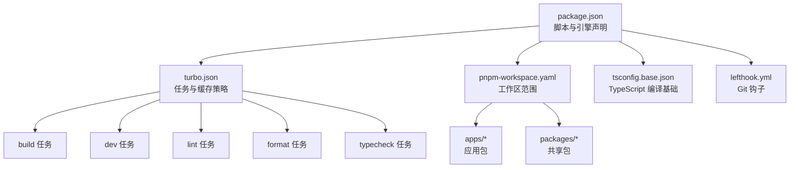
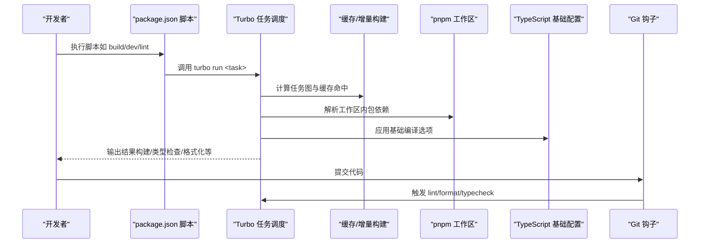
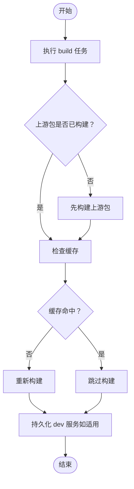
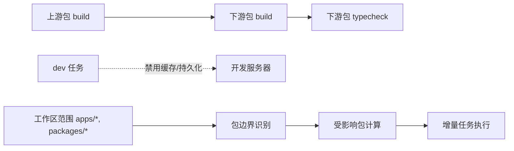

# 配置详解

## 目录
1. [简介](#简介)
2. [项目结构](#项目结构)
3. [核心组件](#核心组件)
4. [架构总览](#架构总览)
5. [详细组件分析](#详细组件分析)
6. [依赖关系与增量构建](#依赖关系与增量构建)
7. [TypeScript 基础配置](#typescript-基础配置)
8. [pnpm 工作区配置](#pnpm-工作区配置)
9. [性能优化与最佳实践](#性能优化与最佳实践)
10. [故障排查指南](#故障排查指南)
11. [结论](#结论)

## 简介
本指南围绕 AgentKit 的核心配置文件展开，系统讲解 Turbo 构建系统的任务定义与缓存策略、依赖关系管理与增量构建机制；同时深入解析 TypeScript 基础配置（编译选项、严格性级别、模块解析策略）与 pnpm 工作区的组织方式，并提供配置修改的最佳实践与性能优化建议。目标是帮助不同技术背景的读者快速理解并高效使用该配置体系。

## 项目结构
AgentKit 的配置采用“最小而完整”的设计：通过顶层的包管理与脚本入口，结合工作区与构建工具，形成统一的开发与构建体验。当前仓库包含以下关键配置文件：
- 包管理与脚本入口：package.json
- Turbo 构建系统：turbo.json
- pnpm 工作区：pnpm-workspace.yaml
- TypeScript 基础配置：tsconfig.base.json
- Git 钩子：lefthook.yml

## 核心组件
本节聚焦于各配置文件的核心职责与交互关系：
- package.json：定义项目名称、私有化标记、脚本命令、开发依赖、包管理器版本与 Node 引擎要求。
- turbo.json：定义构建任务（build、dev、lint、format、typecheck），声明任务间依赖与缓存行为。
- pnpm-workspace.yaml：声明工作区包集合，控制多包协作与依赖提升范围。
- tsconfig.base.json：集中定义 TypeScript 编译选项，作为各子项目的继承基线。
- lefthook.yml：在本地提交前执行 lint/format/typecheck，加速问题发现。

## 架构总览
从配置到执行的端到端流程如下：
- 开发者通过 npm/yarn/pnpm 调用 package.json 中的脚本。
- 脚本转发至 Turbo，按任务定义与依赖关系执行。
- Turbo 利用缓存与增量构建策略，仅对变更或上游受影响的包进行重建。
- pnpm 工作区负责跨包依赖解析与去重，确保一致的依赖树。
- TypeScript 基础配置为所有项目提供统一的编译与类型检查规则。
- Git 钩子在本地提交前自动触发相关任务，保证代码质量。

## 详细组件分析

### Turbo 构建系统配置
- 任务定义与依赖
  - build：依赖上游包的 build（通过 dependsOn 指定），输出目录 dist/**，便于缓存与增量判断。
  - dev：禁用缓存（cache:false），启用持久化（persistent:true），适合开发服务器常驻。
  - lint、format、typecheck：无显式 dependsOn，按需独立运行。
- 缓存与增量构建
  - Turbo 基于任务图与输出目录进行缓存判定。当输入未变且上游任务未变更时，可直接复用缓存。
  - 对于开发场景，禁用缓存可避免旧状态干扰，持久化确保长时运行的服务稳定。
- 任务图与执行顺序
  - 通过 dependsOn("^build") 将下游任务与上游构建结果关联，实现自顶向下的增量更新。

### pnpm 工作区配置
- 工作区范围
  - packages 字段包含 apps/* 与 packages/*，表示工作区由“应用包”和“共享包”两部分组成。
- 依赖解析与去重
  - pnpm 在根目录统一管理依赖，跨包共享依赖，减少重复安装与磁盘占用。
  - 工作区内的包可通过相对路径相互引用，简化版本同步与发布流程。
- 与 Turbo 的协同
  - Turbo 会根据工作区范围识别包边界，仅对受影响的包执行任务，避免无关包的重复构建。

### TypeScript 基础配置
- 编译目标与模块系统
  - 目标与库：ES2022 与 DOM/DOM.Iterable，适配现代浏览器与 Node 环境。
  - 模块与解析：ESNext 与 bundler 解析策略，利于打包工具链与 ESM 生态。
- 严格性与类型安全
  - strict:true 提升整体类型约束；skipLibCheck:true 减少第三方库的类型检查开销。
  - isolatedModules:true 与 verbatimModuleSyntax:true 保障单文件编译与严格的模块语法。
- 输出与调试信息
  - noEmit:true 表示不生成 JS 文件，通常配合打包器或类型检查工具使用。
  - declaration/declarationMap/sourceMap/composite:true 生成声明文件与映射，便于 IDE 与二次消费。
- 其他实用选项
  - resolveJsonModule:true 支持 JSON 模块导入；forceConsistentCasingInFileNames:true 避免大小写差异导致的问题。

### Git 钩子与本地质量门禁
- pre-commit 阶段
  - lint：针对变更的 TS 文件执行 lint。
  - format：对变更的 TS/JSON/CSS 文件执行格式化。
  - typecheck：对变更的 TS 文件执行类型检查。
- 并行执行
  - parallel:true 提升本地校验效率，缩短等待时间。
- 影响范围
  - affected 与 filter 参数确保只对受影响的包或文件执行任务，降低开销。

## 依赖关系与增量构建
- 任务依赖链
  - 通过 dependsOn("^build") 将下游任务与上游构建结果绑定，形成自上而下的增量更新路径。
- 缓存与输出目录
  - outputs:["dist/**"] 明确构建产物位置，Turbo 基于此判断缓存有效性。
- 开发模式的特殊处理
  - dev 任务 cache:false 与 persistent:true，避免缓存污染并保持服务稳定性。
- 工作区影响面
  - Turbo 结合 pnpm 工作区范围，仅对受影响的包执行任务，显著减少全量构建。

## TypeScript 基础配置
- 编译选项要点
  - target/module/moduleResolution：面向现代环境与打包生态。
  - strict/noEmit：强调类型严格与“仅做类型检查”的定位。
  - skipLibCheck/isolatedModules/verbatimModuleSyntax：兼顾性能与兼容性。
  - declaration/declarationMap/sourceMap/composite：支持二次分发与调试。
- 与项目脚本的配合
  - package.json 中的 typecheck 脚本通过 Turbo 调用，复用 tsconfig.base.json 的统一规则。
- 项目内扩展
  - 各子项目可在继承基础上添加特定配置，但应尽量保持与 base 的一致性以降低心智负担。

## pnpm 工作区配置
- 范围声明
  - apps/* 与 packages/* 两类包集合，分别用于应用与共享包。
- 依赖管理优势
  - 统一的依赖树、去重与锁定文件，减少版本漂移风险。
  - 工作区内包的版本同步与发布更简单。
- 与 Turbo 的协作
  - Turbo 依据工作区范围识别包边界，结合任务依赖链实现精准增量。

## 性能优化与最佳实践
- Turbo 侧
  - 明确 outputs 目录，确保缓存命中率；对频繁变更的任务谨慎开启缓存。
  - 使用 persistent:true 于需要常驻的开发任务，避免反复重启带来的冷启动成本。
  - 通过 dependsOn("^build") 将类型检查与构建解耦，减少不必要的重复。
- TypeScript 侧
  - 保持 strict:true 与 skipLibCheck:true 的组合，兼顾严格性与性能。
  - 在 monorepo 场景中，优先使用 composite/declarationMap/sourceMap，提升二次分发与调试体验。
- pnpm 侧
  - 合理拆分 apps 与 packages，避免过度耦合导致的影响面扩大。
  - 使用 engines 与 packageManager 版本约束，统一团队环境。
- Git 钩子侧
  - pre-commit 并行执行 lint/format/typecheck，缩短反馈周期。
  - 使用 affected/filter 限制影响范围，避免对无关文件的重复校验。

[本节为通用指导，无需列出具体文件来源]

## 故障排查指南
- Turbo 任务未命中缓存
  - 检查 outputs 是否正确、输入文件是否被忽略、是否误用 cache:false。
  - 参考：[turbo.json:6](https://github.com/weishaodaren/agentkit/blob/main/turbo.json#L6)、[turbo.json:9-11](https://github.com/weishaodaren/agentkit/blob/main/turbo.json#L9-L11)
- 开发任务频繁重启
  - 确认 dev 任务的 persistent:true 设置是否生效，避免外部中断导致的进程退出。
  - 参考：[turbo.json:10](https://github.com/weishaodaren/agentkit/blob/main/turbo.json#L10)
- 类型检查异常或缓慢
  - 检查 tsconfig.base.json 的 strict 与 skipLibCheck 设置，确认 noEmit 与 declarationMap 的需求。
  - 参考：[tsconfig.base.json:9](https://github.com/weishaodaren/agentkit/blob/main/tsconfig.base.json#L9)、[tsconfig.base.json:11](https://github.com/weishaodaren/agentkit/blob/main/tsconfig.base.json#L11)、[tsconfig.base.json:16](https://github.com/weishaodaren/agentkit/blob/main/tsconfig.base.json#L16)
- 工作区内包引用失败
  - 确认 pnpm-workspace.yaml 的范围是否覆盖相关包，检查包名与版本是否一致。
  - 参考：[pnpm-workspace.yaml:1-4](https://github.com/weishaodaren/agentkit/blob/main/pnpm-workspace.yaml#L1-L4)
- 本地钩子未执行或影响范围过大
  - 检查 lefthook.yml 的 glob 与 affected/filter 配置，确保只对变更文件执行。
  - 参考：[lefthook.yml:4-15](https://github.com/weishaodaren/agentkit/blob/main/lefthook.yml#L4-L15)

## 结论
AgentKit 的配置体系以“简洁、可维护、高性能”为目标：Turbo 提供高效的增量构建与缓存策略，pnpm 工作区确保多包协作的一致性，tsconfig.base.json 统一类型安全与输出策略，lefthook.yml 将质量门禁前置到本地。遵循本文的最佳实践与排障建议，可在大型 monorepo 中获得稳定、可预测且高效的开发体验。