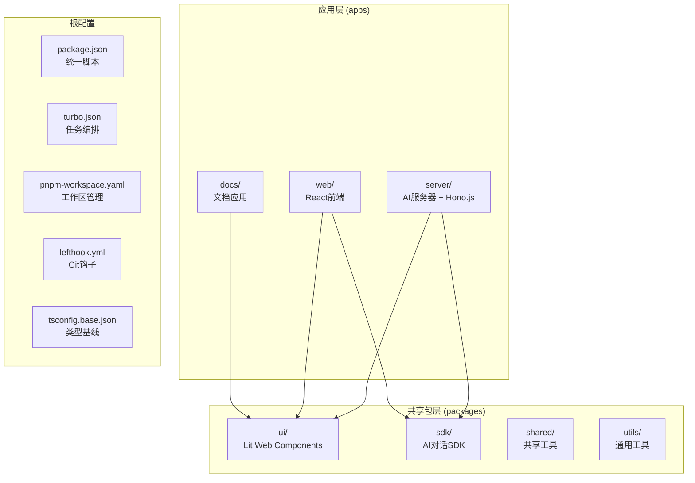
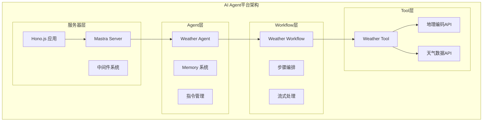
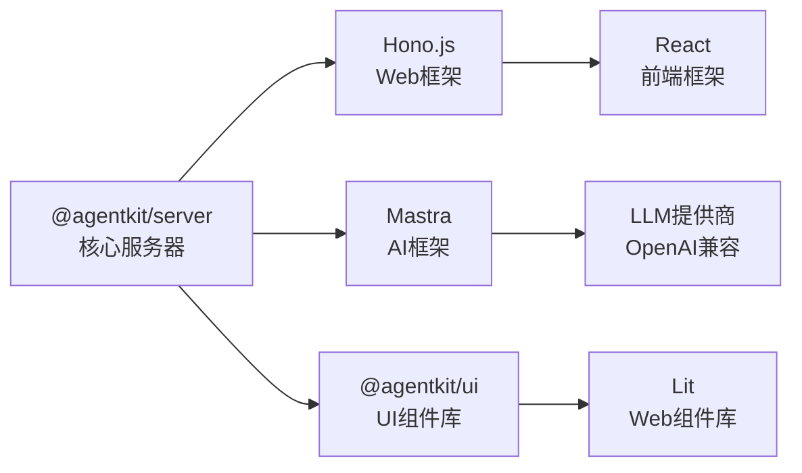

# 项目概述

## 目录
1. [引言](#引言)
2. [项目架构](#项目架构)
3. [核心组件](#核心组件)
4. [AI Agent平台架构](#ai-agent平台架构)
5. [详细组件分析](#详细组件分析)
6. [依赖关系分析](#依赖关系分析)
7. [性能考虑](#性能考虑)
8. [故障排除指南](#故障排除指南)
9. [结论](#结论)
10. [附录](#附录)

## 引言
AgentKit现已演进为一个完整的AI Agent平台，从最初简单的UI组件库发展为集成了Mastra AI框架、Hono.js服务器和真实天气代理系统的现代化全栈解决方案。该项目采用Monorepo架构，通过统一的工具链配置简化AI Agent开发流程，提供从前端界面到后端服务的完整技术栈。

项目核心价值在于为AI Agent开发提供开箱即用的基础设施，包括智能代理、LLM网关、可观测性监控、数据存储等关键组件，显著降低AI应用开发的复杂性和成本。

## 项目架构
AgentKit采用现代化的Monorepo架构，将AI Agent平台的各个组件有机整合：

- **apps/**：应用层，包含Web前端、AI服务器和文档应用
- **packages/**：共享包层，提供UI组件库、SDK和工具库
- **根配置**：统一的构建、类型检查和代码质量控制



## 核心组件
AgentKit平台的核心组件围绕AI Agent生态系统构建：

### AI Agent基础设施
- **Mastra AI框架**：提供Agent、Workflow、Tool等核心抽象
- **LLM网关**：统一管理多种大语言模型提供商
- **可观测性**：内置日志记录、性能监控和敏感数据过滤
- **存储系统**：支持LibSQL和DuckDB的复合存储架构

### Web应用技术栈
- **Hono.js**：轻量级Web框架，支持中间件和路由
- **React**：现代化前端框架，支持TypeScript
- **Lit Web Components**：高性能Web组件库
- **Tailwind CSS**：实用优先的CSS框架

### 开发工具链
- **Turborepo**：加速构建和任务编排
- **TypeScript**：强类型JavaScript超集
- **Oxlint**：高性能ESLint替代品
- **Lefthook**：Git钩子管理器

## AI Agent平台架构
AgentKit的AI Agent平台采用分层架构设计，每层都有明确的职责和边界：

### 服务器层 (Server Layer)
负责AI Agent的运行时管理和业务逻辑处理，基于Hono.js构建RESTful API服务。

### Agent层 (Agent Layer)
实现具体的AI代理功能，如天气查询代理，具备记忆、推理和工具调用能力。

### Workflow层 (Workflow Layer)
编排复杂的AI任务流程，将多个步骤组合成完整的业务流程。

### Tool层 (Tool Layer)
封装外部API和服务，提供标准化的数据获取和处理能力。



### 真实天气代理系统
AgentKit的核心功能是提供准确的实时天气信息服务，通过以下组件协同工作：

#### Weather Agent（天气代理）
- **职责**：作为用户与天气数据的智能中介
- **能力**：自然语言对话、多语言支持、个性化建议
- **指令**：提供准确的天气信息和活动规划建议

#### Weather Tool（天气工具）
- **地理编码**：将城市名称转换为经纬度坐标
- **天气数据获取**：调用Open-Meteo API获取实时天气
- **数据处理**：标准化天气数据格式

#### Weather Workflow（天气工作流）
- **数据获取**：执行地理编码和天气API调用
- **数据分析**：计算温度范围、降水概率等指标
- **活动建议**：基于天气条件提供活动规划

## 详细组件分析

### Mastra AI框架集成
Mastra框架提供了Agent、Workflow、Tool等核心抽象，为AI Agent开发提供统一的开发模型。

#### Agent配置
```typescript
export const weatherAgent = new Agent({
  id: "weather-agent",
  name: "Weather Agent",
  instructions: `You are a helpful weather assistant...`,
  model: "agnes/agnes/agnes-2.0-flash",
  tools: { weatherTool },
  memory: new Memory(),
});
```

#### 存储架构
```typescript
export const mastra = new Mastra({
  storage: new MastraCompositeStore({
    id: "composite-storage",
    default: new LibSQLStore({
      id: "mastra-storage",
      url: "file:./mastra.db",
    }),
    domains: {
      observability: await new DuckDBStore().getStore("observability"),
    },
  }),
});
```

### Hono.js服务器架构
基于Hono.js构建的轻量级Web服务器，提供高效的HTTP服务能力和灵活的中间件系统。

#### 服务器初始化
```typescript
const app = new Hono<{ 
  Bindings: HonoBindings; 
  Variables: HonoVariables 
}>();

const server = new MastraServer({ app, mastra });
await server.init();
```

#### 中间件系统
- **CORS配置**：支持跨域资源共享
- **请求日志**：详细的请求响应跟踪
- **性能监控**：自动记录请求耗时和状态码

### LLM网关集成
通过Agnes网关统一管理大语言模型提供商，支持多种AI服务的无缝切换。

#### 网关配置
```typescript
export const agnesGateway: MastraModelGatewayInterface = {
  id: "agnes",
  name: "Agnes Gateway",
  async fetchProviders() {
    return {
      agnes: {
        name: "Agnes",
        models: ["agnes/agnes-2.0-flash"],
        apiKeyEnvVar: "AGNES_API_KEY",
        gateway: "agnes",
        url: baseUrl,
      },
    };
  },
};
```

### Web前端架构
React前端应用提供现代化的用户界面，集成AI Agent功能和实时聊天体验。

#### 技术栈
- **React 19**：最新版本的React框架
- **Vite**：快速的构建工具和开发服务器
- **TypeScript**：类型安全的JavaScript开发
- **@agentkit/ui**：自研Web组件库

#### 依赖关系
```json
{
  "@agentkit/ui": "workspace:*",
  "@agentkit/utils": "workspace:*",
  "@mastra/client-js": "^1.27.0",
  "react": "catalog:",
  "react-dom": "^19.1"
}
```

## 依赖关系分析
AgentKit平台的依赖关系呈现层次化特征，从底层基础设施到上层应用逐层依赖：

### 核心依赖层次
- **基础设施层**：Node.js运行时、pnpm包管理器
- **框架层**：Hono.js、React、Lit
- **AI层**：Mastra框架、LLM提供商
- **应用层**：业务逻辑和用户界面

### 开发依赖管理


## 性能考虑
AI Agent平台在性能方面采用了多项优化策略：

### 构建性能优化
- **增量构建**：利用Turborepo的缓存机制，避免重复构建
- **并行执行**：多包并行构建，提升整体构建速度
- **依赖分析**：智能依赖追踪，只重建受影响的包

### 运行时性能优化
- **内存管理**：Agent内存系统优化，支持长期对话记忆
- **API调用优化**：天气数据缓存和批量请求
- **前端性能**：React 19的新特性利用，虚拟DOM优化

### 数据存储优化
- **复合存储**：LibSQL提供结构化数据存储，DuckDB处理分析数据
- **连接池**：数据库连接池管理，减少连接开销
- **索引优化**：针对AI查询模式的索引设计

## 故障排除指南
AI Agent平台可能遇到的常见问题及解决方案：

### 服务器启动问题
- **症状**：服务器无法启动或端口占用
- **处理**：检查端口占用情况，确认环境变量配置
- **相关文件**：[apps/server/src/index.ts](https://github.com/weishaodaren/agentkit/blob/main/apps/server/src/index.ts)

### AI Agent配置问题
- **症状**：Agent无法加载或模型调用失败
- **处理**：验证LLM网关配置和API密钥设置
- **相关文件**：[apps/server/src/mastra/gateway/agnes.ts](https://github.com/weishaodaren/agentkit/blob/main/apps/server/src/mastra/gateway/agnes.ts)

### 数据库连接问题
- **症状**：存储系统初始化失败
- **处理**：检查数据库文件权限和连接字符串
- **相关文件**：[apps/server/src/mastra/index.ts](https://github.com/weishaodaren/agentkit/blob/main/apps/server/src/mastra/index.ts)

### 前端集成问题
- **症状**：UI组件无法正常显示或交互失效
- **处理**：确认组件库版本兼容性和依赖安装
- **相关文件**：[apps/web/package.json](https://github.com/weishaodaren/agentkit/blob/main/apps/web/package.json)

## 结论
AgentKit从UI组件库成功转型为完整的AI Agent平台，展现了现代全栈开发的最佳实践。通过集成Mastra AI框架、Hono.js服务器和实时天气代理系统，项目为AI应用开发提供了从基础设施到业务逻辑的完整解决方案。

该平台的核心优势在于：
- **统一的Monorepo架构**：简化多包协作和依赖管理
- **AI原生设计**：从架构层面支持智能代理和LLM集成
- **现代化技术栈**：采用最新的前端和后端技术
- **完善的开发工具链**：提供从开发到发布的全流程支持

对于需要快速构建AI应用的团队，AgentKit提供了一个高度可扩展、易于维护的基础设施平台。

## 附录
- **许可证**：MIT许可证，允许自由使用、复制、修改与分发
- **开源协议**：完全开源，社区驱动开发
- **版本兼容性**：Node.js 22+，pnpm 10+
- **部署支持**：支持本地开发、容器化部署和云平台部署

- [package.json:63-67](https://github.com/weishaodaren/agentkit/blob/main/package.json#L63-L67)